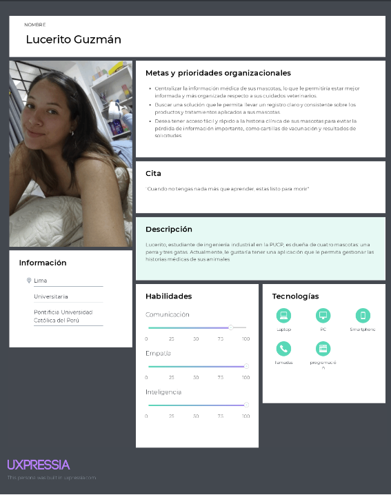
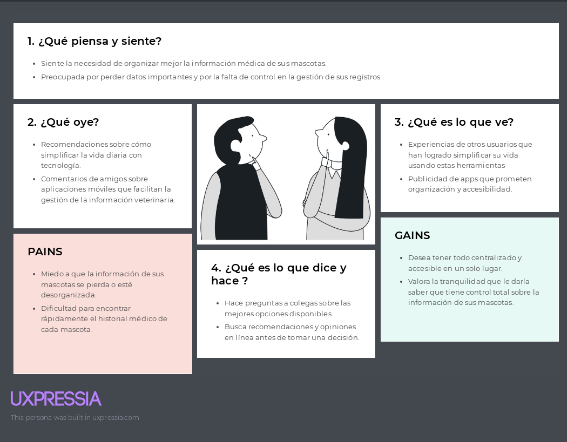
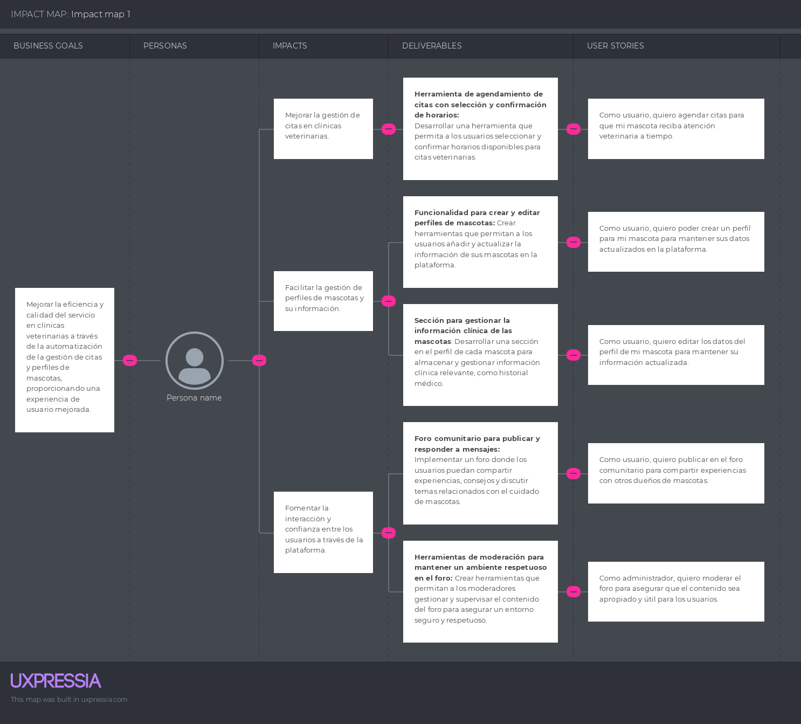
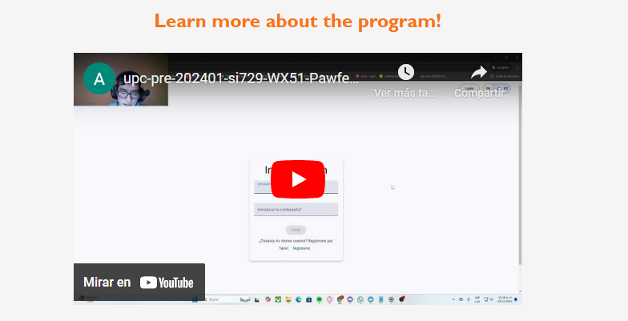

# COURSE PROJECT

---

    <strong>Universidad Peruana de Ciencias Aplicadas (UPC)</strong>     
    </img> 
    <strong>Carrera de Ingeniería de Software - Ciclo V</strong>  
    <strong>Desarrollo de Aplicaciones Open Source - SI729</strong> 
     <strong>Profesor: Alberto Wilmer Sanchez Seña</strong> 
     <strong><b>INFORME DEL TRABAJO FINAL</strong></b> 

    <strong>Startup del Proyecto: Aceitunitas</strong> 
    <strong>Producto: Pawfect Care</strong> 

    <h3 align="center">Team Members:</h3>

    <table align="center">
        <tr>
            <th style="text-align:center;">Member</th>
            <th style="text-align:center;">Code</th>
        </tr>
        <tr>
            <td>Bastidas Bastidas, Diego Martin</td>
            <td>U20221A301</td>
        </tr>
        <tr>
            <td>Chavez Uribe, Ario Joel</td>
            <td>U202213468</td>
        </tr>
        <tr>
            <td>Gutierrez Garcia, Jose Eduardo</td>
            <td>U202221518</td>
        </tr>
        <tr>
            <td>Perez Garcia, David Alexander</td>
            <td>U202222942</td>
        </tr>
        <tr>
            <td>Zuniga Calle, Sebastian Gabriel</td>
            <td>U20221b479</td>
        </tr>
    </table>
    

</body>

 <strong>2024-02</strong>

 

---

# Registro de Versiones del Informe

| Versión | Fecha | Autor | Descripción de la modificación |
|----|----|----|----|
| TB1 | 25/08/2024 | Aceitunitas | Redacción de los Capítulos I: Introduction, II: Requirements Elicitation & Analysis, III: Requirements Specification, IV: Product Design, V: Product Implementation, Validation & Deployment. |
| TP1 | 27/09/2024 | Aceitunitas | Adición del Capítulo V: 5.2.2., 5.2.2.1., 5.2.2.2., 5.2.2.3., 5.2.2.4., 5.2.2.5., 5.2.2.6., 5.2.2.7., 5.2.2.8. |
| TB2 | 03/11/2024 | Aceitunitas | Adición del Capítulo V: 5.2.3., 5.2.3.1., 5.2.3.2., 5.2.3.3., 5.2.3.4., 5.2.3.5., 5.2.3.6., 5.2.3.7., 5.2.3.8, 5.3, 5.3.1, 5.3.2, 5.3.3, 5.4|
| TF1 | 21/11/2024 | Aceitunitas | Adición del Capítulo V: 5.2.4., 5.2.4.1., 5.2.4.2., 5.2.4.3., 5.2.4.4., 5.2.4.5., 5.2.4.6., 5.2.4.7., 5.2.4.8|
# Project Report Collaboration Insights

**TB1** Las tareas correspondientes a la TB1 han sido completadas y están debidamente documentadas en el repositorio de GitHub para Pawfect Care-Report. Puedes acceder al repositorio a través del siguiente enlace: [https://github.com/UPC-PRE-SI729-2402-WX51-G4-Aceitunitas/Pawfect-Care-Report.git](https://github.com/UPC-PRE-SI729-2402-WX51-G4-Aceitunitas/Pawfect-Care-Report.git)

Durante la fase de elaboración del informe, se realizaron las siguientes actividades:

- Se crearon y redactaron los contenidos asignados a cada miembro utilizando formato Markdown, y se realizaron "Conventional Commits" para registrar el progreso en el repositorio.

-  Se generaron los recursos necesarios y agregaron las imagenes al repositorio en la carpeta "assets" en cada rama del informe.

- Se organizaron reuniones para coordinar el avance de los componentes del informe y para proporcionar actualizaciones sobre los progresos del Sprint 1, que se centró en el desarrollo de la Landing Page.

**TP1** Las tareas asignadas para la entrega del TP1 han sido completadas y documentadas de manera exhaustiva en el repositorio de GitHub de la organización del equipo: [https://github.com/UPC-PRE-SI729-2402-WX51-G4-Aceitunitas/Pawfect-Care-Report.git](https://github.com/UPC-PRE-SI729-2402-WX51-G4-Aceitunitas/Pawfect-Care-Report.git)

Se redactaron y diagramaron los contenidos asignados a cada integrante en formato Markdown, con commits regulares para mantener un seguimiento preciso del progreso en el repositorio.

Además, se han generado los artefactos necesarios utilizando las herramientas recomendadas, y se llevaron a cabo reuniones periódicas para coordinar el avance de los elementos del informe y comunicar los progresos del Sprint 2, centrado en el desarrollo de la aplicación web.

**TB2**: Las tareas asignadas para la entrega del TB2 han sido completadas y debidamente documentadas en el repositorio de GitHub del equipo. [https://github.com/UPC-PRE-SI729-2402-WX51-G4-Aceitunitas/Pawfect-Care-Report.git](https://github.com/UPC-PRE-SI729-2402-WX51-G4-Aceitunitas/Pawfect-Care-Report.git)

- Se redactaron y diagramaron los contenidos asignados a cada integrante en formato Markdown, seguido de commits para asegurar el seguimiento del progreso en el repositorio. 
- Se generaron los artefactos necesarios utilizando las herramientas recomendadas. 
- Se llevaron a cabo reuniones para coordinar el avance de los elementos del informe y comunicar los progresos del Sprint 3, enfocado en el desarrollo del frontend y avance del backend.

**TF1**: Las tareas asignadas para la entrega del TF1 han sido completadas y debidamente documentadas en el repositorio de GitHub del equipo. [https://github.com/UPC-PRE-SI729-2402-WX51-G4-Aceitunitas/Pawfect-Care-Report.git](https://github.com/UPC-PRE-SI729-2402-WX51-G4-Aceitunitas/Pawfect-Care-Report.git)

- Se realizaron actualizaciones tanto en el frontend como en el backend para garantizar la integración completa entre ambos.
- El frontend fue modificado para consumir las APIs del backend de manera eficiente, optimizando la comunicación entre los servicios.
- El backend fue desplegado en la nube, asegurando disponibilidad y escalabilidad para las funcionalidades de la aplicación.
- Se llevaron a cabo pruebas integrales para verificar que el consumo de servicios funcionara correctamente y cumpliera con los requerimientos del proyecto.
- Se coordinaron reuniones periódicas para alinear los avances técnicos con las metas del Sprint 4 y asegurar el cumplimiento de los plazos establecidos.

# Contenido
## Tabla de contenidos
- [**Registro de Versiones del Informe**](#registro-de-versiones-del-informe)
- [**Project Report Collaboration Insights**](#project-report-collaboration-insights)
- [**Contenido**](#contenido)
    - [Tabla de contenidos](#tabla-de-contenidos)
- [**Student Outcome**](#student-outcome)
- ## [ **Capítulo I: Introducción** ](#-capítulo-i-introducción-)
  - [**1.1. Startup Profile**](#11-startup-profile)
    - [**1.1.1. Descripción de la Startup**](#111-descripción-de-la-startup)
    - [**1.1.2. Perfiles de integrantes del equipo**](#112-perfiles-de-integrantes-del-equipo)
  - [**1.2. Solution Profile**](#12-solution-profile)
    - [**1.2.1 Antecedentes y problemática**](#121-antecedentes-y-problemática)
    - [What (¿Qué?)](#what-qué)
    - [Who (¿Quién?)](#who-quién)
    - [Where (¿Dónde?)](#where-dónde)
    - [When (¿Cuándo?)](#when-cuándo)
    - [Why (¿Por qué?)](#why-por-qué)
    - [How (¿Cómo?)](#how-cómo)
    - [How much (¿Cuánto?)](#how-much-cuánto)
    - [**1.2.2 Lean UX Process**](#122-lean-ux-process)
    - [**1.2.2.1. Lean UX Problem Statements**](#1221-lean-ux-problem-statements)
    - [**1.2.2.2. Lean UX Assumptions**](#1222-lean-ux-assumptions)
    - [**1.2.2.3. Lean UX Hypothesis Statements**](#1223-lean-ux-hypothesis-statements)
    - [**1.2.2.4. Lean UX Canvas**](#1224-lean-ux-canvas)
  - [**1.3. Segmentos objetivo**](#13-segmentos-objetivo)
- ## [ **Capítulo II: Requirements Elicitation \& Analysis**](#-capítulo-ii-requirements-elicitation--analysis)
  - [**2.1. Competidores**](#21-competidores)
    - [**2.1.1. Análisis competitivo**](#211-análisis-competitivo)
    - [**2.1.2. Estrategias y tácticas frente a competidores**](#212-estrategias-y-tácticas-frente-a-competidores)
  - [**2.2. Entrevistas**](#22-entrevistas)
    - [**2.2.1. Diseño de entrevistas**](#221-diseño-de-entrevistas)
    - [**2.2.2. Registro de entrevistas**](#222-registro-de-entrevistas)
    - [**2.2.3. Análisis de entrevistas**](#223-análisis-de-entrevistas)
  - [**2.3. Needfinding**](#23-needfinding)
    - [**2.3.1. User Personas**](#231-user-personas)
    - [**2.3.2. User Task Matrix**](#232-user-task-matrix)
    - [**2.3.3. User Journey Mapping**](#233-user-journey-mapping)
    - [**2.3.4. Empathy Mapping**](#234-empathy-mapping)
    - [**2.3.5. As-is Scenario Mapping**](#235-as-is-scenario-mapping)
  - [**2.4. Ubiquitous Language**](#24-ubiquitous-language)
- ## [ **Capítulo III: Requirements Specification**](#-capítulo-iii-requirements-specification)
  - [**3.1. To-Be Scenario Mapping**](#31-to-be-scenario-mapping)
  - [**3.2. User Stories**](#32-user-stories)
  - [**3.3. Impact Mapping**](#33-impact-mapping)
  - [**3.4. Product Backlog**](#34-product-backlog)
- ## [**Capítulo IV: Product Design**](#capítulo-iv-product-design)
  - [**4.1. Style Guidelines**](#41-style-guidelines)
    - [**4.1.1. General Style Guidelines**](#411-general-style-guidelines)
    - [**4.1.2. Web Style Guidelines**](#412-web-style-guidelines)
  - [**4.2. Information Architecture**](#42-information-architecture)
    - [**4.2.1. Organization Systems**](#421-organization-systems)
    - [**4.2.2. Labeling Systems**](#422-labeling-systems)
    - [**4.2.3. SEO Tags and Meta Tags**](#423-seo-tags-and-meta-tags)
    - [**4.2.4. Searching Systems**](#424-searching-systems)
    - [**4.2.5. Navigation Systems**](#425-navigation-systems)
  - [**4.3. Landing Page UI Design**](#43-landing-page-ui-design)
    - [**4.3.1. Landing Page Wireframe**](#431-landing-page-wireframe)
    - [**4.3.2. Landing Page Mock-up**](#432-landing-page-mock-up)
  - [**4.4. Web Applications UX/UI Design**](#44-web-applications-uxui-design)
    - [**4.4.1. Web Applications Wireframes**](#441-web-applications-wireframes)
    - [**4.4.2. Web Applications Wireflow Diagrams**](#442-web-applications-wireflow-diagrams)
    - [**4.4.3. Web Applications Mock-ups**](#443-web-applications-mock-ups)
    - [**4.4.4. Web Applications User Flow Diagrams**](#444-web-applications-user-flow-diagrams)
  - [**4.5. Web Applications Prototyping**](#45-web-applications-prototyping)
  - [**4.6. Domain-Driven Software Architecture**](#46-domain-driven-software-architecture)
    - [**4.6.1. Software Architecture Context Diagram**](#461-software-architecture-context-diagram)
    - [**4.6.2. Software Architecture Container Diagrams**](#462-software-architecture-container-diagrams)
    - [**4.6.3. Software Architecture Components Diagrams**](#463-software-architecture-components-diagrams)
  - [**4.7. Software Object-Oriented Design**](#47-software-object-oriented-design)
    - [**4.7.1. Class Diagrams**](#471-class-diagrams)
    - [**4.7.2. Class Dictionary**](#472-class-dictionary)
  - [**4.8. Database Design**](#48-database-design)
    - [**4.8.1. Database Diagram**](#481-database-diagram)
- ## [**Capítulo V: Product Implementation, Validation \& Deployment**](#capítulo-v-product-implementation-validation--deployment)
  - [**5.1. Software Configuration Management**](#51-software-configuration-management)
    - [**5.1.1. Software Development Environment Configuration**](#511-software-development-environment-configuration)
    - [**5.1.2. Source Code Management**](#512-source-code-management)
    - [**5.1.3. Source Code Style Guide \& Conventions**](#513-source-code-style-guide--conventions)
    - [**5.1.4. Software Deployment Configuration**](#514-software-deployment-configuration)
  - [**5.2. Landing Page, Services \& Applications Implementation**](#52-landing-page-services--applications-implementation)
    - [**5.2.1. Sprint 1**](#521-sprint-1)
    - [**5.2.1.1. Sprint Planning 1**](#5211-sprint-planning-1)
    - [**5.2.1.2. Sprint Backlog 1**](#5212-sprint-backlog-1)
    - [**5.2.1.3. Development Evidence for Sprint Review**](#5213-development-evidence-for-sprint-review)
    - [**5.2.1.4. Testing Suite Evidence for Sprint Review**](#5214-testing-suite-evidence-for-sprint-review)
    - [**5.2.1.5. Execution Evidence for Sprint Review**](#5215-execution-evidence-for-sprint-review)
    - [**5.2.1.6. Services Documentation Evidence for Sprint Review**](#5216-services-documentation-evidence-for-sprint-review)
    - [**5.2.1.7. Software Deployment Evidence for Sprint Review**](#5217-software-deployment-evidence-for-sprint-review)
    - [**5.2.1.8. Team Collaboration Insights during Sprint**](#5218-team-collaboration-insights-during-sprint)
    - [**5.2.2. Sprint 2**](#522-sprint-2)
    - [**5.2.2.1. Sprint Planning 2**](#5221-sprint-planning-2)
    - [**5.2.2.2. Sprint Backlog 2**](#5222-sprint-backlog-2)
    - [**5.2.2.3. Development Evidence for Sprint Review**](#5223-development-evidence-for-sprint-review)
    - [**5.2.2.4. Testing Suite Evidence for Sprint Review**](#5224-testing-suite-evidence-for-sprint-review)
    - [**5.2.2.5. Execution Evidence for Sprint Review**](#5225-execution-evidence-for-sprint-review)
    - [**5.2.2.6. Services Documentation Evidence for Sprint Review**](#5226-services-documentation-evidence-for-sprint-review)
    - [**5.2.2.7. Software Deployment Evidence for Sprint Review**](#5227-software-deployment-evidence-for-sprint-review)
    - [**5.2.2.8. Team Collaboration Insights during Sprint**](#5228-team-collaboration-insights-during-sprint)
    - [**5.2.3. Sprint 3**](#523-sprint-3)
    - [**5.2.3.1. Sprint Planning 3**](#5231-sprint-planning-3)
    - [**5.2.3.2. Sprint Backlog 3**](#5232-sprint-backlog-3)
    - [**5.2.3.3. Development Evidence for Sprint Review**](#5233-development-evidence-for-sprint-review)
    - [**5.2.3.4. Testing Suite Evidence for Sprint Review**](#5234-testing-suite-evidence-for-sprint-review)
    - [**5.2.3.5. Execution Evidence for Sprint Review**](#5235-execution-evidence-for-sprint-review)
    - [**5.2.3.6. Services Documentation Evidence for Sprint Review**](#5236-services-documentation-evidence-for-sprint-review)
    - [**5.2.3.7. Software Deployment Evidence for Sprint Review**](#5237-software-deployment-evidence-for-sprint-review)
    - [**5.2.3.8. Team Collaboration Insights during Sprint**](#5238-team-collaboration-insights-during-sprint)
    - [**5.2.4. Sprint 4**](#524-sprint-4)
    - [**5.2.4.1. Sprint Planning 4**](#5241-sprint-planning-4)
    - [**5.2.4.2. Sprint Backlog 4**](#5242-sprint-backlog-4)
    - [**5.2.4.3. Development Evidence for Sprint Review**](#5243-development-evidence-for-sprint-review)
    - [**5.2.4.4. Testing Suite Evidence for Sprint Review**](#5234-testing-suite-evidence-for-sprint-review)
    - [**5.2.4.5. Execution Evidence for Sprint Review**](#5245-execution-evidence-for-sprint-review)
    - [**5.2.4.6. Services Documentation Evidence for Sprint Review**](#5246-services-documentation-evidence-for-sprint-review)
    - [**5.2.4.7. Software Deployment Evidence for Sprint Review**](#5247-software-deployment-evidence-for-sprint-review)
    - [**5.2.4.8. Team Collaboration Insights during Sprint**](#5248-team-collaboration-insights-during-sprint)
  - [**5.3. Validation Interviews**](#53-validation-interviews)
    - [**5.3.1. Diseño de Entrevistas**](#531-diseño-de-entrevistas)
    - [**5.3.2. Registro de Entrevistas**](#532-registro-de-entrevistas)
    - [**5.3.3. Evaluaciones según heurísticas**](#533-evaluaciones-según-heurísticas)
  - [**5.4. Video About-the-Product**](#54-video-about-the-product)
- [**Conclusiones**](#conclusiones)
- [**Conclusiones y recomendaciones**](#conclusiones-y-recomendaciones)
- [**Video About-the-Team**](#video-about-the-team)
- [**Bibliografía**](#bibliografía)
- [**Anexos**](#anexos)

# Student Outcome

| Criterio específico | Acciones realizadas | Conclusiones |
|----|----|----|
|Comunica oralmente con efectividad a diferentes rangos de audiencia.| **Bastidas Bastidas, Diego Martin** *TB1* Realicé los capítulos I y II, enfocándome en la introducción y el análisis de la problemática de la startup. Me encargué de describir el perfil de la startup, los perfiles de los integrantes del equipo y el proceso Lean UX. A través de mi presentación, logré explicar de manera clara los antecedentes y las soluciones propuestas, lo que permitió a la audiencia comprender el análisis competitivo y los resultados de las entrevistas.  *TP*   En el TP, me encargué del desarrollo del componente para la creación de perfiles de mascota (US04), que incluyó datos básicos e imagen de perfil. Durante mi presentación, logré explicar de manera clara y técnica cómo se implementó este componente y su impacto en la experiencia de los usuarios finales, adaptando el mensaje tanto para audiencias técnicas como no técnicas. *TB2*  Realicé las entrevistas de validación con los usuarios para obtener información relevante sobre sus necesidades y expectativas. Durante estas sesiones, me enfoqué en formular preguntas claras y específicas que permitieran obtener respuestas detalladas y constructivas, asegurando que los participantes se sintieran cómodos y dispuestos a compartir sus experiencias.  *TF*   En esta entrega, me encargué de la actualización del frontend. Durante mi presentación, logré comunicar de manera clara los cambios realizados y cómo estos mejoraron la experiencia de usuario al integrar las funcionalidades con el backend. Mi explicación se enfocó en detallar las actualizaciones técnicas de forma comprensible para audiencias tanto técnicas como no técnicas, asegurando un entendimiento efectivo de los avances.  **Chavez Uribe, Ario Joel** *TB1* Me encargué del Capítulo V, donde desarrollé la implementación y validación del producto. Presenté la configuración del entorno de desarrollo y la gestión del código fuente, lo que incluyó las convenciones de estilo y la configuración de despliegue del software. Durante mi presentación, logré simplificar conceptos técnicos y asegurarme de que la audiencia entendiera el progreso de los sprints y el proceso de despliegue. *TP* Me ocupé del desarrollo del módulo de gestión de perfiles de usuarios (US04), permitiendo la edición y eliminación de cuentas. En mi presentación, logré transmitir de manera eficiente los retos y soluciones aplicadas en la gestión de datos de los usuarios, manteniendo la claridad técnica y haciendo comprensible el proceso para audiencias no técnicas. *TB2*  Me encargué del desarrollo tanto del backend como del frontend, así como de la landing page. Presenté el progreso del trabajo en varias reuniones, explicando las decisiones de diseño y los desafíos técnicos que enfrenté. Utilicé ejemplos visuales y técnicos adecuados a las audiencias presentes para asegurar una comprensión clara.  *TF*   Me encargué del desarrollo de componentes en el backend, mejoras en el frontend y ajustes en la landing page. En mi presentación, expliqué con detalle el impacto de estos desarrollos en el funcionamiento general de la aplicación. Adapté mi comunicación para audiencias diversas, utilizando un enfoque técnico para los miembros del equipo y uno más accesible para stakeholders no técnicos.  **Gutierrez Garcia, Jose Eduardo** *TB1* Como líder del grupo, lideré el desarrollo del Capítulo III, que abarcó la especificación de requisitos. Me aseguré de que el equipo estuviera alineado y trabajara de manera efectiva. Al presentar el mapeo de impacto, las user stories y el backlog de productos, logré que la audiencia comprendiera cómo se estructuran las futuras mejoras de la plataforma. También gestioné la documentación en Markdown, asegurando que fuera clara y organizada. *TP* En este TP, trabajé en la implementación de la lista de clientes, gestionando la visualización y administración de los perfiles de clientes dentro de la plataforma. Durante la exposición, aseguré que la audiencia comprendiera el impacto de esta funcionalidad en el flujo general del sistema, utilizando ejemplos prácticos y lenguaje accesible tanto para el equipo como para oyentes externos. *TB2*  Me encargué del desarrollo del backend y de la implementación en la nube, presentando los avances en las sesiones de equipo. Expliqué los componentes técnicos de la infraestructura y su importancia para la funcionalidad general de la aplicación, adaptando mi lenguaje para que tanto los miembros técnicos como no técnicos pudieran seguirme.  *TF*   Lideré el proceso de despliegue en la nube, asegurando la disponibilidad del backend, y participé en la actualización del frontend para integrar los servicios desplegados. Durante mi exposición, expliqué de manera clara los pasos realizados en el deployment y cómo esto contribuyó a la estabilidad del sistema, adaptando el lenguaje a las necesidades de la audiencia técnica y no técnica.   **Perez Garcia, David Alexander** *TB1* Realicé el Capítulo IV, centrándome en el diseño de la landing page y el prototipo de la aplicación. Me encargué de desarrollar los wireframes, mockups y los sistemas de etiquetado, asegurando que el diseño fuera funcional y estético. En mi presentación, logré comunicar de manera clara cómo el diseño UI/UX mejora la experiencia del usuario y resuelve sus necesidades de manera efectiva. *TP* Me encargué del desarrollo del componente de edición de perfil de mascota (US05), lo que permitió que los usuarios finales pudieran modificar datos previamente ingresados. En mi presentación, destaqué la importancia de la usabilidad y la experiencia del usuario, explicando los elementos clave de diseño y cómo mejoraron la funcionalidad de la plataforma. *TB2*  Fui responsable del desarrollo del backend y frontend, participando activamente en las reuniones de equipo para compartir mis progresos y desafíos. Explicaba las soluciones técnicas que implementaba de forma clara, asegurando que todos los miembros del equipo pudieran aportar y colaborar efectivamente.  *TF*   Contribuí al desarrollo del backend, asegurando que los servicios necesarios estuvieran disponibles para el frontend. En mi presentación, destaqué los aspectos técnicos de las mejoras realizadas y cómo estas permitieron un consumo efectivo de las APIs. Logré comunicar estos avances de manera efectiva a diferentes audiencias, ajustando mi mensaje según el nivel técnico requerido.    **Zuniga Calle, Sebastian Gabriel** *TB1* Trabajé en el Capítulo IV en la parte de la arquitectura de software y el diseño orientado a objetos. Desarrollé los diagramas de contexto, contenedores y componentes, además de los diagramas de clases y la base de datos. Durante mi presentación, logré que la audiencia comprendiera los detalles técnicos y cómo la arquitectura soporta la estructura general del software.  *TP* Trabajé en el desarrollo de la arquitectura de software y el diseño orientado a objetos en este TP. En mi presentación, me centré en explicar los detalles técnicos de los diagramas de contexto, contenedores y clases. Adapté la presentación para audiencias con conocimientos técnicos diversos, asegurando que los conceptos de arquitectura fueran fácilmente comprensibles.  *TB2*  No Participó.  *TF*  No Participó   | TB1: Como equipo, logramos comunicar de manera efectiva cada una de nuestras áreas de trabajo, adaptándonos a las diferentes audiencias y asegurando que tanto los aspectos técnicos como los estratégicos fueran claros. A lo largo del proyecto, trabajamos de forma coordinada y presentamos información comprensible para una amplia gama de oyentes, demostrando una excelente capacidad de trabajo en equipo y dominio de nuestras respectivas áreas. TP:  En el trabajo parcial, el equipo logró una comunicación efectiva al presentar sus avances y resultados. Cada miembro adaptó su mensaje a la audiencia, asegurando que tanto los aspectos técnicos como los estratégicos fueran comprendidos por todos los oyentes. Esta capacidad para simplificar y transmitir información técnica compleja es clave para el éxito de proyectos colaborativos, y nuestro equipo demostró una sólida habilidad para hacerlo.  TB2:  Como equipo en la TB2, logramos fortalecer nuestra capacidad de comunicación oral y escrita al abordar los diferentes aspectos del proyecto. A través de presentaciones claras y adaptadas a las audiencias técnicas y no técnicas, cada miembro del equipo contribuyó a crear un ambiente colaborativo que facilitó la comprensión de los avances y desafíos enfrentados. La efectividad en nuestra comunicación no solo mejoró la interacción entre nosotros, sino que también permitió que los stakeholders entendieran mejor nuestras decisiones y progresos. En resumen, nuestro enfoque en la claridad y la precisión en la comunicación fue fundamental para el éxito del proyecto, garantizando que todos los involucrados estuvieran alineados y bien informados a lo largo del ciclo de desarrollo.  TF1:  En el TF1, el equipo demostró una comunicación oral efectiva al exponer los avances del proyecto a diferentes rangos de audiencia. Cada miembro presentó sus contribuciones, desde el desarrollo y actualización del frontend y backend hasta el despliegue en la nube, asegurándose de que la información técnica fuera comprensible tanto para los integrantes del equipo como para los stakeholders. La claridad en la exposición de los cambios realizados y su impacto en la funcionalidad de la aplicación permitió que todos los involucrados entendieran el progreso y el valor agregado del trabajo realizado en esta etapa del proyecto.|

| Criterio específico | Acciones realizadas | Conclusiones |
|----|----|----|
|Comunica por escrito con efectividad a diferentes rangos de audiencia.| **Bastidas Bastidas, Diego Martin** *TB1* Realicé los capítulos I y II, donde me enfoqué en la introducción y el análisis de la problemática de la startup. Escribí de manera clara y precisa la descripción de la startup y los perfiles de los integrantes del equipo. Además, desarrollé el proceso Lean UX y el análisis competitivo, asegurándome de que mi escritura fuera comprensible tanto para audiencias técnicas como no técnicas. Logré transmitir la información de manera efectiva para diferentes niveles de comprensión. *TP* En el TP, me encargué de documentar el desarrollo del perfil de mascota (US04) y su integración al sistema. Utilicé un lenguaje claro para explicar tanto el flujo de datos como la funcionalidad, asegurándome de que fuera comprensible para desarrolladores y stakeholders no técnicos. Adapté el contenido para que la documentación pudiera ser útil para todos los lectores involucrados en el proyecto.   *TB2*  Desarrollé la documentación técnica del backend, asegurando que la información fuera accesible para usuarios con diferentes niveles de experiencia. Me enfoqué en presentar de manera clara y concisa las soluciones implementadas en el proyecto.   *TF*   Documenté las actualizaciones realizadas en el frontend, detallando los cambios implementados para mejorar la interacción de los usuarios con la aplicación. A través de mis aportes escritos, logré explicar de manera clara cómo las nuevas funcionalidades del frontend se integran con el backend y contribuyen a la experiencia del usuario.  **Chavez Uribe, Ario Joel** *TB1* Me encargué del Capítulo V, que trataba sobre la implementación y validación del producto. Redacté la configuración del entorno de desarrollo y la gestión del código fuente, utilizando un lenguaje técnico pero comprensible para audiencias menos familiarizadas con estos temas. Mi objetivo fue presentar los detalles de los sprints y el despliegue del software de manera que fueran accesibles tanto para desarrolladores como para lectores menos técnicos. *TP*  Redacté la documentación sobre la implementación del módulo de gestión de usuarios (US04), detallando los flujos de trabajo y los elementos técnicos clave. Utilicé un lenguaje técnico claro pero accesible para audiencias no especializadas, permitiendo que la documentación fuera comprensible para desarrolladores y stakeholders que no tienen conocimientos avanzados en desarrollo. *TB2*  Contribuí al desarrollo del backend y frontend, redactando documentación que explicaba las decisiones técnicas tomadas y su justificación, adaptando el lenguaje para ser comprensible tanto para técnicos como para no técnicos.  *TF*   Redacté la documentación correspondiente a los desarrollos realizados en el backend, frontend y la landing page. Me aseguré de describir técnicamente los procesos y los resultados obtenidos, presentando la información de manera clara para que fuera entendida tanto por miembros del equipo técnico como por stakeholders no técnicos.   **Gutierrez Garcia, Jose Eduardo** *TB1* Como líder del grupo, desarrollé el Capítulo III, centrándome en la especificación de requisitos. Me aseguré de que los documentos escritos, como el mapeo de impacto, las user stories y el backlog de productos, fueran claros y fáciles de seguir por cualquier lector. También gestioné la documentación en Markdown, estructurándola de manera lógica para que fuera accesible tanto para miembros técnicos del equipo como para otras partes interesadas. *TP* Como líder del grupo, redacté la documentación sobre la implementación de la lista de clientes en el sistema. Me aseguré de que la documentación fuera clara y coherente, utilizando Markdown para organizar la información y facilitar su lectura. Adapté la escritura a las diferentes necesidades del equipo y otros interesados, asegurando que la especificación de requisitos y el mapeo de impacto fueran entendidos por todos. *TB2* Me encargué de la documentación sobre el proceso de deployment en la nube, presentando los pasos de forma estructurada y clara, lo que permitió que los lectores entendieran los aspectos técnicos sin dificultad.   *TF*   Documenté el proceso de despliegue en la nube y la actualización del frontend, asegurando que el impacto de estos cambios quedara claramente plasmado en los reportes. Mi redacción fue precisa y adaptada a diferentes niveles de audiencia, permitiendo un entendimiento completo de las tareas realizadas y su relevancia dentro del proyecto.  **Perez Garcia, David Alexander** *TB1* Realicé el Capítulo IV, donde escribí sobre el diseño de la landing page y el prototipo de la aplicación. Utilicé un lenguaje que facilitara la comprensión de los wireframes, mockups y sistemas de etiquetado para diferentes niveles de audiencia, asegurando que tanto diseñadores como usuarios finales pudieran entender la funcionalidad y el valor del diseño. Me enfoqué en presentar la información visual de manera clara y accesible en los documentos. *TP* Redacté la documentación correspondiente al componente de edición de perfil de mascota (US05). Mi enfoque fue describir de manera clara el diseño UI/UX, utilizando un lenguaje accesible para diseñadores y usuarios finales. Además, detallé cómo la experiencia del usuario sería optimizada, haciendo que los elementos técnicos fueran comprensibles para aquellos con menos experiencia en diseño o programación. *TB2* Realicé la redacción de la documentación que abarcaba tanto el backend como el frontend, enfocándome en hacer la información técnica accesible y comprensible para diferentes audiencias, facilitando su comprensión del sistema.  *TF*   Redacté la documentación sobre las actualizaciones realizadas en el backend, enfocándome en detallar las funcionalidades implementadas y cómo estas se conectan con el resto de los componentes del sistema. Mi enfoque en la claridad y el detalle técnico aseguró que los lectores pudieran comprender los avances logrados en esta área.   **Zuniga Calle, Sebastian Gabriel** *TB1* Trabajé en el Capítulo IV en la parte de la arquitectura de software y el diseño orientado a objetos. Redacté los diagramas de contexto, contenedores y componentes, así como los diagramas de clases y la base de datos. Utilicé un lenguaje técnico adecuado para los ingenieros, pero también me aseguré de que los conceptos complejos fueran comprensibles para una audiencia más amplia. Mi objetivo fue que la documentación escrita fuera clara y útil para cualquier lector. *TP*  Documenté los detalles técnicos de la arquitectura de software, incluyendo diagramas de clases y componentes. Utilicé un lenguaje técnico adecuado para los desarrolladores, pero también me aseguré de que los conceptos más complejos fueran explicados de forma comprensible para los miembros del equipo sin un fuerte trasfondo técnico.  *TB2*  No Participó.  *TF*  No Participó | TB1: Como equipo, logramos redactar la documentación del proyecto de manera efectiva, adaptando nuestro lenguaje escrito a las necesidades de diferentes audiencias. A lo largo del proyecto, trabajamos de forma coordinada para que tanto los aspectos técnicos como los conceptuales fueran accesibles y fáciles de entender para todos los involucrados, asegurando que nuestra escritura fuera clara, precisa y efectiva en todo momento.  TP:   En el trabajo Parcial, el equipo logró una comunicación escrita efectiva, adaptando el lenguaje a las necesidades de diferentes audiencias. Nos aseguramos de que la documentación técnica fuera clara y comprensible para desarrolladores, diseñadores, y stakeholders no técnicos, lo que facilitó el entendimiento de las funcionalidades y el progreso del proyecto. La precisión y claridad en nuestra redacción fueron claves para garantizar el éxito del proyecto y la colaboración entre todos los miembros del equipo.  TB2: A lo largo de TB2, el equipo demostró una fuerte capacidad para comunicar por escrito de manera efectiva, adaptando nuestro lenguaje a las diversas audiencias involucradas en el proyecto. Nos aseguramos de que la documentación técnica fuera clara y accesible, lo que facilitó la comprensión de las funcionalidades y los objetivos del proyecto. La adaptabilidad en nuestro enfoque de comunicación fue esencial para mantener a todos los miembros del equipo y a los stakeholders bien informados, lo que contribuyó al éxito global del desarrollo del proyecto. TF1:  En el TF1, el equipo destacó en la comunicación escrita al documentar detalladamente los avances y actualizaciones del proyecto en el repositorio. Cada integrante contribuyó a la redacción de reportes claros y precisos que abarcaban desde la actualización del frontend y backend hasta el despliegue en la nube. Se adaptó el lenguaje escrito para diferentes audiencias, asegurando que tanto los aspectos técnicos como los logros del equipo fueran comprensibles para desarrolladores, diseñadores y stakeholders no técnicos. La claridad y organización de los documentos generados fueron clave para transmitir el impacto de los cambios realizados y garantizar el entendimiento del progreso del proyecto.  |

----

# **Capítulo I: Introducción**

## 1.1. Startup Profile

### 1.1.1. Descripción de la Startup

“Pawfect Care” es una plataforma integral destinada a la gestión veterinaria y a la visualización de historiales clínicos. La idea fundamental detrás de esta plataforma es simplificar y optimizar la administración de diversos aspectos relacionados con el cuidado de las mascotas. Esto incluye la gestión de usuarios, clientes, productos y servicios, así como la organización de historiales clínicos. El objetivo es proporcionar una herramienta que facilite tanto a los propietarios de mascotas como a los veterinarios en el manejo de la información y las tareas diarias.

- **Misión:** Nuestra misión es mejorar la calidad de vida de las mascotas y sus dueños, ofreciendo una plataforma que simplifique la gestión veterinaria y el acceso a la información de salud de las mascotas

- **Visión:** Ser la plataforma líder en la gestión veterinaria, reconocida por su eficiencia, confiabilidad y facilidad de uso.

### 1.1.2. Perfiles de integrantes del equipo

|                    Photo                        |                                                                                                                                                                                                                                                                                                    Description                                                                                                                                                                                                                                                                                                    |
| :------------------------------------------------: | :---------------------------------------------------------------------------------------------------------------------------------------------------------------------------------------------------------------------------------------------------------------------------------------------------------------------------------------------------------------------------------------------------------------------------------------------------------------------------------------------------------------------------------------------------------------------------------------------------------------: |
|  |                                                                         Soy estudiante del 6to ciclo de la carrera de Ingeniería de Software. Decidí estudiar esta carrera porque desde pequeño me llamaba la atención el funcionamiento de una computadora y los procesos que conlleva. Me gusta practicar deportes de contacto, salir a pasear y sobre todo me encanta ser Groomer canino y trabajar con mascotas.                                                                                                                         |
|   | Soy estudiante de la carrera de Ingeniería de Software. Tengo interés en aprender sobre nuevas tecnologías, el desarrollo web y de aplicaciones. Me considero una persona que le gusta apoyar en proyectos innovadores que me permitan crecer como persona.                                                                        |
|   | Mi nombre es Jose Gutierrez, tengo 20 años, actualmente me encuentro cruzando mi 5to ciclo de la carrera de ingeniería de software en la UPC. Me gusta jugar videojuegos y practicar natación, soy un gran aficionado de la tecnología y del ensamblaje de computadoras. Me considero una persona dispuesta siempre a aprender tecnologías nuevas, creativa y responsable. |
|    |                                                                                                                              Mi nombre es David Alexander, un entusiasta de la tecnología. Actualmente me encuentro en el 6to ciclo de la Ingeniería de software en la UPC. Fuera de las aulas, me divierto explorando los límites del desarrollo frontend. La programación me permite crear soluciones innovadoras. Soy un autodidacta nato, siempre ávido de aprender nuevas herramientas y lenguajes de programación.                                                                                                                              |
|        |  Mi nombre es Gabriel Zuniga, estudiante de la carrera de Ingeniería de Software cursando el 6to ciclo. Tengo interés en lo relacionado con el desarrollo funcional multiplataforma, enfocándome en la parte del backend. La mayoría de mi tiempo es invertido en enriquecer mis conocimientos en todo lo relacionado a mi perfil profesional.   |

## 1.2. Solution Profile

Pawfect Care es una aplicación diseñada específicamente para el uso en clínicas veterinarias, enfocada en la gestión interna de todas sus operaciones y en facilitar el acceso a la información clínica para los dueños de las mascotas. Esta aplicación no solo permite a los veterinarios manejar de manera más eficiente y organizada los historiales clínicos de sus pacientes, sino que también ofrece herramientas para gestionar recordatorios, controlar el inventario de productos y realizar otras tareas esenciales para el funcionamiento de la veterinaria.
La interfaz de Pawfect Care ha sido diseñada para ser intuitiva y amigable, lo que permite a los veterinarios llevar un control detallado y preciso de cada aspecto de su práctica sin complicaciones. Además, la aplicación proporciona una funcionalidad adicional: la posibilidad de publicar las historias clínicas para que los dueños de las mascotas puedan acceder a ellas cuando lo necesiten. Esto garantiza que los propietarios estén siempre informados sobre el estado de salud de sus mascotas y puedan consultar los detalles médicos en cualquier momento, mejorando así la comunicación y la transparencia entre la clínica y sus clientes.

### 1.2.1. Antecedentes y problemática

Con la finalidad de poder conocer y comprender con mayor precisión las necesidades de nuestros usuarios, en este caso universitarios, hemos hecho un estudio por medio de la técnica 5w’s & 2H’s. Según el sitio web Rockcontent (2019) 5w’s & 2H’s es una de las metodologías de gestión empresarial más utilizadas. Puede aplicarse en muchos momentos, empresas y proyectos, ayuda a responder una serie de preguntas decisivas para hacer que las acciones de un negocio sean más estratégicas y precisas. Sin más preámbulos, por siguiente mostraremos la información que hemos logrado recopilar por medio de esta técnica:

#### Uso de la técnica The 5'W's w Y 2'H's

| LAS 5W y 2H | Pregunta                                                | Descripción                                                                                                                                                                                                                                                                                                                                                                                                                                                                                                          |
| ----------- | ------------------------------------------------------- | -------------------------------------------------------------------------------------------------------------------------------------------------------------------------------------------------------------------------------------------------------------------------------------------------------------------------------------------------------------------------------------------------------------------------------------------------------------------------------------------------------------------- |
| What?        | ¿Cuál es el problema?                                     | El problema radica en la ausencia de una aplicación que sea tanto intuitiva como fácil de usar en el entorno veterinario, y que, además, permita integrar y gestionar eficazmente los múltiples aspectos que involucra esta práctica                                                                                                                   |
| When?       | ¿Cuándo sucede el problema?                                   | El problema surge cuando las clínicas veterinarias carecen de una aplicación que sea intuitiva y sencilla de usar, lo que dificulta la integración y gestión eficiente de los diversos aspectos necesarios para su funcionamiento diario.                                                                                                                                                                                                            |
| Where?       | ¿Dónde sucede el problema?                             | El problema ocurre en las clínicas veterinarias, donde la falta de una aplicación complica la integración y gestión de las múltiples áreas necesarias para su funcionamiento. Esto no solo afecta a los veterinarios en su labor diaria, sino que también impacta a los dueños de mascotas, quienes necesitan una forma sencilla de acceder a la información y los servicios relacionados con la salud de sus animales.                                                                                                                                            |
| Why?      | ¿Por qué sucede el problema?                               | El problema se debe al desconocimiento de aplicaciones que estén específicamente diseñadas para atender las necesidades complejas y diversas de una clínica veterinaria. Existen muchas aplicaciones pero no son lo suficientemente flexibles o integrales para abarcar todos los campos necesarios, como la gestión de historiales clínicos, el control de inventario, y la comunicación con los dueños de las mascotas. Esto crea dificultades tanto para los veterinarios, que se ven obligados a utilizar múltiples herramientas o procesos manuales, como para los dueños de mascotas, que enfrentan limitaciones en el acceso a la información relevante.                                                                                                                                                                                        |
| Who?        | ¿Qué llevara a las personas a usar nuestro producto?                         | Las personas optarán por Pawfect Care debido a la facilidad con la que podrán completar los campos necesarios, la amplia difusión que la aplicación tendrá en redes sociales, y especialmente por lo sencillo que resulta rellenar las historias clínicas sin la complicación de tener que llenar campos obligatorios. |
| How?        | ¿En qué condiciones los clientes usaran nuestro producto?               | Los clientes utilizarán nuestro producto en condiciones donde necesiten una solución eficiente y fácil de usar para gestionar las operaciones de su clínica veterinaria. Esto incluye situaciones en las que buscan una herramienta que simplifique el manejo de historiales clínicos, controle el inventario, y facilite la comunicación con los dueños de las mascotas. Además, lo usarán cuando requieran una aplicación que les permita acceder y compartir información médica de manera rápida y sin complicaciones, especialmente en un entorno donde el tiempo y la precisión son esenciales.                                                                                                                                                                                  |
| How Much?   | ¿Con qué frecuencia o en qué cantidad se utilizará nuestro producto? |  Nuestro producto está diseñado para ser utilizado diariamente por las clínicas veterinarias. El sistema de gestión clínica se utilizará en la mayoría de las interacciones clínicas, desde la admisión de pacientes hasta el seguimiento post-tratamiento. Dado que el acceso a la información clínica y la gestión de citas es una necesidad recurrente, esperamos que el personal utilice la plataforma constantemente a lo largo del día. Además, los dueños de mascotas podrán acceder a la información relevante de sus mascotas, lo que también incentivará un uso frecuente por parte de ellos, especialmente para verificar el historial clínico y programar citas.                                                                                             |

## 1.2.2. Lean UX Process.

#### 1.2.2.1. Lean UX Problem Statements.

La aplicación Pawfect Care busca resolver la necesidad de una herramienta integral que facilite la gestión diaria de las clínicas veterinarias. Al ofrecer una interfaz intuitiva y fácil de usar, la aplicación trata de eliminar las complejidades y dificultades asociadas con la administración de múltiples aspectos de la práctica veterinaria en un solo lugar, permitiendo que tanto veterinarios como propietarios de mascotas tengan acceso rápido y sencillo a la información relevante.

#### 1.2.2.2. Lean UX Assumptions.

Para desarrollar la aplicación Pawfect Care, partimos de varias suposiciones clave que guiarán nuestro proceso de diseño y desarrollo. Estas suposiciones están basadas en una comprensión inicial de las necesidades y problemas de nuestros usuarios objetivo, así como en los resultados esperados para el negocio. A medida que avanzamos en el desarrollo, estas suposiciones se validarán mediante pruebas y retroalimentación continua para asegurar que la solución propuesta cumpla con las expectativas y resuelva eficazmente los desafíos identificados.

**Features:**

- Sistema de gestión de citas para facilitar la organización del tiempo en las clínicas.
- Almacenamiento y visualización de historiales clínicos de las mascotas de forma rápida y segura.
- Notificaciones automáticas para recordatorios de vacunas, tratamientos o revisiones.
- Sección para la venta de productos veterinarios, integrando un catálogo accesible para los clientes.
- Sistema de reportes de ingresos, control de inventario, y análisis de datos para mejorar la eficiencia administrativa.
- Interfaz intuitiva y adaptable para ser utilizada tanto en dispositivos móviles como en computadoras.

**Business Outcomes:**

- Aumento de la eficiencia operativa de las clínicas, reduciendo el tiempo en tareas administrativas.
- Mejora en la satisfacción del cliente, permitiendo un acceso rápido a la información médica de sus mascotas y facilitando la interacción con la clínica.
- Generación de ingresos adicionales a través de suscripciones premium que ofrezcan funciones avanzadas y comisiones por la venta de productos veterinarios.
- Reducción de errores y tiempos de espera en la gestión clínica, lo que aumentará la retención de clientes y atraerá nuevos usuarios.

**Users:**
- **Segmento 1 – Médicos Veterinarios:** Clínicas veterinarias de diversos tamaños, desde consultorios pequeños hasta grandes centros con múltiples especialistas. Este segmento busca mejorar la gestión diaria de sus clínicas, optimizando la administración de información médica, inventarios y citas, para aumentar su productividad y ofrecer un mejor servicio a sus clientes.

- **Segmento 2 – Dueños de Mascotas:** Propietarios que necesitan gestionar de manera eficiente la salud de sus mascotas, incluyendo jóvenes acostumbrados a usar aplicaciones móviles y también aquellos menos familiarizados con la tecnología pero que desean una forma más accesible de organizar la información médica de sus animales.

**User Outcomes & Benefits:**

- Reducción de tiempo en la gestión de citas y actualización de historiales médicos.
- Mejor organización en el manejo de inventarios y productos.
- Mejora en la relación con los clientes, ofreciendo un acceso directo a la información de salud de sus mascotas.
- Simplificación en la administración de las clínicas veterinarias, reduciendo errores y tiempos de espera.

**User Assumptions:**

- **¿Quién es el usuario?**
  os usuarios principales son las clínicas veterinarias y los dueños de mascotas. 

- **¿Dónde encaja la aplicación en su vida?**
  La aplicación se integra en la rutina diaria de las clínicas veterinarias y en la vida cotidiana de las mascotas, facilitando su tratamiento y cuidado. 

- **¿Qué problemas tienen nuestros usuarios y como se puede resolver?**
  Los usuarios enfrentan la falta de una aplicación especializado para la gestión integral de clínicas veterinarias y la ausencia de un portal donde se pueda acceder fácilmente a la historia clínica de una mascota. Nuestra aplicación resuelve estos problemas proporcionando una plataforma única para administrar todos los aspectos de la clínica y facilitar el acceso a la información médica. 

- **¿Dónde y cuándo es usada nuestra aplicación?**
  La aplicación se utiliza principalmente en clínicas veterinarias. Los momentos clave para su uso son durante las consultas veterinarias y cuando los dueños deciden cambiar de veterinario y necesitan trasladar el historial clínico o el registro de vacunas a otro establecimiento. 

- **¿Qué características son importantes?**
  Las características esenciales incluyen una interfaz fácil de usar en dispositivos móviles, computadoras y laptops. Además, es crucial la eliminación de campos innecesarios u obligatorios que puedan complicar el proceso de registro. 

- **¿Cómo debe verse nuestra aplicación y como debe comportarse?**
 Nuestra aplicación debe tener un diseño funcional y amigable, tanto para veterinarios como para dueños de mascotas. Debe permitir un registro rápido y sencillo de nuevos pacientes y la actualización de historiales clínicos, evitando campos obligatorios que no aporten valor al proceso de registro y atención. 

**Business Assumptions**

- Los veterinarios y asistentes están dispuestos a adoptar herramientas digitales si mejoran la eficiencia en sus clínicas.
- Los dueños de mascotas valorarán una aplicación que les permita acceder a la información de salud de sus animales en cualquier momento.
- Las clínicas veterinarias estarán dispuestas a pagar por suscripciones premium o herramientas avanzadas de gestión si aumentan la productividad.
- El mercado de clínicas veterinarias aún utiliza métodos manuales o desactualizados, lo que genera ineficiencias que la aplicación puede resolver.
- Habrá una aceptación de la aplicación tanto por usuarios jóvenes familiarizados con la tecnología como por aquellos menos habituados al uso de herramientas digitales.

#### 1.2.2.3. Lean UX Hypothesis Statements.

Para asegurar que nuestra solución esté alineada con las necesidades y expectativas de nuestros usuarios, hemos formulado las siguientes hipótesis utilizando el enfoque Lean UX. Este enfoque nos permitirá validar nuestras suposiciones a través de iteraciones constantes y ajustes basados en el feedback de los usuarios

**Creemos que** si diseñamos una aplicación intuitiva que permita a los veterinarios gestionar historiales clínicos y recordatorios de manera eficiente.
**Sabremos** que hemos tenido éxito cuando observemos un aumento en la eficiencia operativa y una reducción en el tiempo dedicado a tareas administrativas en las clínicas veterinarias
**cuando** las clínicas adopten nuestra aplicación y reporten mejoras en su flujo de trabajo diario, habremos validado nuestra hipótesis.

**Creemos que** lal ofrecer una plataforma que facilite el acceso a la historia clínica de las mascotas para los dueños
**Sabremos** que nuestra solución es efectiva cuando recibamos comentarios positivos de los usuarios sobre la facilidad de acceso y la utilidad de la información médica compartida
**cuando** los dueños de mascotas utilicen la aplicación para consultar y manejar la salud de sus animales sin problemas, habremos confirmado que estamos resolviendo una necesidad real.

**Creemos que** que si eliminamos los campos obligatorios innecesarios y simplificamos el proceso de registro en la aplicación.
**Sabremos** que hemos logrado nuestro objetivo cuando los usuarios experimenten una mayor satisfacción y una reducción en los errores de entrada de datos.
**cuando** tanto veterinarios como propietarios de mascotas reporten una experiencia de usuario fluida y sin frustraciones, habremos validado que nuestra aplicación cumple con las expectativas de simplicidad y funcionalidad.

feat(chapter-1): improve layout of Lean UX Canvas in report

## 1.3. Segmentos objetivo.

Para asegurar el éxito de Pawfect Care, hemos identificado dos segmentos clave que serán el foco principal de nuestras estrategias de desarrollo y marketing. Estos segmentos representan a nuestros usuarios ideales y nos permitirán adaptar nuestras funcionalidades y servicios a sus necesidades específicas, maximizando así el impacto de la plataforma.

**Segmento Objetivo 1 - Clínicas Veterinarias**

El primer segmento objetivo incluye a las clínicas veterinarias de diversos tamaños, desde pequeñas clínicas independientes hasta grandes centros especializados con múltiples profesionales. Pawfect Care les ofrece una plataforma que simplifica la gestión interna de sus operaciones, permitiendo una mayor eficiencia en la programación de citas, gestión de historiales médicos y la comunicación con los dueños de las mascotas. Estas clínicas buscan una herramienta que facilite el acceso a información clínica y mejore la administración de sus recursos, todo bajo una interfaz intuitiva y accesible. El valor de Pawfect Care radica en su capacidad para optimizar procesos, lo que se traduce en un mejor servicio y atención para los animales.

**Segmento Objetivo 2 - Dueño de Mascotas:**

El segundo segmento está compuesto por los dueños de mascotas, quienes son responsables del bienestar y la salud de sus animales. Este grupo de usuarios busca soluciones prácticas que les permitan manejar de manera eficiente la salud de sus mascotas, incluyendo la programación de citas, acceso a historiales médicos y recordatorios de vacunación. Pawfect Care les proporciona una plataforma que centraliza toda esta información y facilita el acceso desde cualquier dispositivo, brindándoles tranquilidad y control sobre el cuidado de sus animales. La conveniencia y facilidad de uso son elementos clave para este segmento, que espera una experiencia fluida y personalizada.

---

# **Capítulo II: Requirements Elicitation & Analysis**

## 2.1. Competidores.

<table>
    <thead>
        <tr>
            <th>Nombre</th>
            <th>Descripción</th>
        </tr>
    </thead>
    <tbody>
        <tr>
            <td rowspan align="center">VetPraxis
            <td>Es una solución de gestión para clínicas veterinarias, diseñada para optimizar la administración de operaciones diarias. Ofrece funcionalidades que incluyen la gestión de citas, historias clínicas electrónicas, administración de inventario, y facturación. También proporciona herramientas para la comunicación con los clientes y el seguimiento de tratamientos. 
            Página web:<a href="https://vetpraxis.net/"> https://vetpraxis.net/</a>
        </tr>
        <tr>
            <td align="center">VetApp
            <td> Es una plataforma desarrollada para la gestión de clínicas veterinarias. Proporciona características como la programación de citas, el manejo de historias clínicas electrónicas, y la administración de inventario. 
            Página web:<a href="https://vetapp.app/en"> https://vetapp.app/en</a>
        </tr>
        <tr>
           <td rowspan align="center">PetClinic  
           <td>Es una aplicación diseñada para gestionar clínicas veterinarias y consultas de mascotas. Incluye funciones para la gestión de citas, el manejo de historias clínicas electrónicas, y la administración de inventario y facturación. La plataforma está orientada a mejorar la organización y eficiencia dentro de las clínicas, ofreciendo herramientas para el seguimiento de tratamientos y la comunicación con los clientes. PetClinic está adaptada a las necesidades específicas del sector veterinario en Perú. 
           Página web:<a href="https://petclinic.es/"> https://petclinic.es/</a>
    </tbody>
</table>

### 2.1.1. Análisis competitivo.
<table style="width: 100%;">
  <tr>
    <th colspan="6" style="padding: 8px; text-align: center;"> Competitive Analysis Landscape</th>
  </tr>
  <tr>
    <td>¿Por qué llevar a cabo este análisis?</td>
    <td colspan="5">Para comparar las características tanto internas como externas de los productos que compiten con nosotros.</td>
  </tr>
  <tr>
    <td colspan="2"></td>
    <td align="center">Pawfect Care </td>
    <td align="center">VetPraxis </td>
    <td align="center">VetApp </td>
    <td align="center">PetClinic </td> 
  </tr>
  <tr>
    <td rowspan="2" align="center">Perfil</td>
    <td align="center">Overview</td>
    <td>
    Plataforma para clínicas veterinarias que simplifica la gestión de historiales clínicos, recordatorios e inventarios con una interfaz fácil de usar.</td>
    <td>Software de gestión veterinaria que optimiza citas, historiales clínicos y facturación con una interfaz amigable.</td>
    <td>Aplicación móvil para gestionar citas, recordatorios, historiales médicos de mascotas, facilitando la comunicación entre veterinarios y propietarios.</td>
    <td>Plataforma que integra administración de historiales clínicos, citas e inventario para mejorar la eficiencia en clínicas veterinarias.</td>
  </tr>
  <tr>
    <td>Ventaja competitiva ¿Qué valor ofrece a los clientes?</td>
    <td>Interfaz intuitiva que facilita la gestión de historiales, recordatorios e inventario.</td>
    <td>Gestión integral de citas, historiales y facturación con una interfaz amigable.</td>
    <td>Gestión móvil de citas e historiales médicos que mejora la comunicación entre veterinarios y propietarios.</td>
    <td>Plataforma única para administrar historiales, citas e inventario en clínicas veterinarias.</td>
  </tr>
  <tr>
    <td rowspan="2" align="center">Perfil de Marketing</td>
    <td>Mercado objetivo</td>
    <td>
    Clínicas veterinarias y dueños de mascotas.</td>
    <td>Clínicas veterinarias medianas y grandes.</td>
    <td>Propietarios de mascotas y veterinarios móviles.</td>
    <td>Clínicas veterinarias pequeñas y medianas.</td>
  </tr>
  <tr>
    <td>Estrategias de marketing</td>
    <td>Redes sociales y colaboraciones con clínicas.</td>
    <td>Marketing de contenido y webinars.</td>
    <td>Redes sociales.</td>
    <td>Publicidad dirigida y promociones.</td>
  </tr>
  <tr>
    <td rowspan="3" align="center">Perfil del Producto</td>
    <td>Productos & Servicios</td>
    <td>Gestión de historiales clínicos, recordatorios e inventarios.</td>
    <td>Gestión de citas, historiales clínicos y facturación.</td>
    <td>Aplicación móvil para gestionar citas e historiales médicos.</td>
    <td>Plataforma de administración de historiales, citas e inventario.</td>
  </tr>
  <tr>
    <td>Precios & Costos</td>
    <td>Suscripción mensual con diferentes niveles.</td>
    <td>Licencia de software con tarifas anuales.</td>
    <td>Descarga gratuita con compras dentro de la app.</td>
    <td>Suscripción con tarifas basadas en el tamaño de la clínica.</td>
  </tr>
  <tr>
    <td>Canales de distribución (Web y/o Móvil)</td>
    <td>Web y móvil.</td>
    <td>Web.</td>
    <td>Móvil (App stores)</td>
    <td>Web.</td>
  </tr>
  <tr>
    <td rowspan="4" align="center">Análisis SWOT</td>
    <td>Fortalezas</td>
    <td>Interfaz intuitiva y fácil de usar; integración de múltiples funciones.</td>
    <td>Gestión integral y amigable; adaptado para clínicas medianas y grandes.</td>
    <td>Acceso móvil conveniente; mejora la comunicación con propietarios de mascotas.</td>
    <td>Plataforma integral para clínicas pequeñas y medianas; fácil de usa.</td>
  </tr>
  <tr>
    <td>Debilidades</td>
    <td>Dependencia de la adopción por parte de clínicas veterinarias.</td>
    <td>Costos potencialmente altos para pequeñas clínicas.</td>
    <td>Funcionalidades limitadas comparadas con plataformas completas.</td>
    <td>Limitado a clínicas de menor tamaño; menos atractivo para grandes clínicas.</td>
  </tr>
  <tr>
    <td>Oportunidades</td>
    <td>
    Expansión en el mercado de clínicas veterinarias pequeñas y medianas.</td>
    <td>Crecimiento en el segmento de clínicas grandes y asociaciones veterinarias.</td>
    <td>Expansión en el mercado de usuarios móviles y propietarios de mascotas.</td>
    <td>Penetración en el mercado de clínicas veterinarias pequeñas</td>
  </tr>
  <tr>
    <td>Amenazas</td>
    <td>Competencia de otras plataformas con características similares.</td>
    <td>Competencia con soluciones de bajo costo o gratuitas.</td>
    <td>Alta competencia en aplicaciones móviles para la salud de mascotas.</td>
    <td>Competencia de soluciones más avanzadas para clínicas grandes.</td>
  </tr>
<table>

### 2.1.2. Estrategias y tácticas frente a competidores.
<strong> Estrategias:</strong> 
- <strong>Interfaz Intuitiva y Fácil de Usar:</strong> Pawfect Care se diferenciará por su interfaz amigable y fácil de usar, lo que simplifica la gestión diaria para los veterinarios y dueños de mascotas. Esto contrasta con muchas soluciones existentes que pueden ser complicadas o difíciles de navegar.
- <strong>Características Exclusivas:</strong> La aplicación ofrecerá características únicas como la personalización de historiales clínicos y recordatorios adaptados a las necesidades específicas de cada clínica y propietario de mascotas, lo cual no está comúnmente disponible en otras plataformas.
- <strong>Valor Agregado:</strong> Se enfocará en agregar valor a través de un sistema integral que combina gestión de citas, control de inventarios, notificaciones automáticas y una sección para la venta de productos veterinarios, abordando múltiples necesidades en una sola plataforma.
- <strong>Adaptabilidad: </strong>Pawfect Care se adaptará a diferentes tamaños de clínicas y será accesible tanto en dispositivos móviles como en computadoras, lo que la convierte en una solución flexible para diversas necesidades.

<strong>Tácticas: </strong> 
- <strong>Demostraciones Personalizadas:</strong> Se organizarán demostraciones en vivo en clínicas veterinarias para mostrar de manera práctica cómo la plataforma mejora la eficiencia y facilita la gestión clínica. Estas demostraciones permitirán a los clientes potenciales experimentar la funcionalidad de Pawfect Care en su entorno de trabajo.
- <strong>Períodos de Prueba Gratuita:</strong> Se ofrecerán períodos de prueba gratuita para que las clínicas puedan experimentar los beneficios de la aplicación sin compromiso. Esto permitirá a los usuarios evaluar la utilidad y el impacto de la plataforma en su operación diaria.
- <strong>Testimonios y Casos de Éxito:</strong> Se recopilarán y publicarán testimonios y casos de éxito de usuarios satisfechos que hayan experimentado mejoras significativas en su gestión veterinaria. Estos testimonios se utilizarán en campañas de marketing, en el sitio web de la aplicación y en materiales promocionales para construir credibilidad y atraer nuevos clientes.
-<strong> Soporte Proactivo y Capacitación:</strong> Se proporcionará soporte proactivo y capacitación personalizada para ayudar a las clínicas a integrar la plataforma de manera eficiente. Esto asegurará que los usuarios obtengan el máximo provecho de las características avanzadas y reduzcan el tiempo de adaptación.
- <strong>Optimización Continua:</strong> Se implementará un proceso de retroalimentación continua para identificar áreas de mejora y responder rápidamente a las necesidades cambiantes del mercado. Esto permitirá a Pawfect Care mantenerse a la vanguardia y adaptarse a nuevas tendencias y demandas.
- <strong>Partnerships Estratégicos:</strong> Se explorarán asociaciones estratégicas con proveedores de productos veterinarios y organizaciones de salud animal para ampliar la red de distribución y aumentar la visibilidad de la plataforma.

## 2.2. Entrevistas.

El objetivo de las entrevistas es obtener una comprensión profunda de las experiencias, perspectivas y opiniones de los segmentos de mercado seleccionados. Nuestra meta es recopilar información valiosa que nos permita entender mejor a nuestro público objetivo y mejorar nuestra comprensión de los usuarios. Estas conversaciones nos proporcionarán una visión más clara de las necesidades y deseos de nuestros usuarios, lo que nos ayudará a adaptar nuestros productos o servicios de manera más efectiva a sus requisitos.

### 2.2.1. Diseño de entrevistas.

En esta parte, se han formulado varias preguntas destinadas a nuestros segmentos de interés con el fin de obtener información cualitativa, como opiniones o descripciones. Esta información será crucial para el desarrollo de nuestra solución.

**Preguntas Generales:**

- ¿Cuál es tu nombre?
- ¿Cuántos años tienes?
- ¿Donde resides?
- ¿Cuál es tu ocupación?

**Preguntas para el Segmento Objetivo 1 - Médicos Veterinarios:**

- ¿Conoces alguna aplicación de gestión veterinaria? ¿Cuál es?
- ¿Lo escogieron por alguna razón es especial?
- ¿Fue la primera aplicación que usaron?
- ¿Qué es lo que te gusta de esa aplicación?
- ¿Qué te disgusta de esa aplicación?
- ¿Qué sería una de las cosas que si o si cambiarias?

**Preguntas para el Segmento Objetivo 2 - Dueños de Mascotas:**

- ¿Con que frecuencia vas al veterinario?
- ¿Qué método usas para llevar el control de tu mascota?
- ¿Alguna vez perdiste los documentos?
- ¿En medio de algún tratamiento cambiaste de veterinario?
- ¿Qué opinas de tener la historia clínica en una aplicación?
- ¿Usarías una aplicación como la descrita?

### 2.2.2. Registro de entrevistas.

**Entrevista para el Segmento Objetivo 1 - Médicos Veterinarios:**

---

Entrevista N°1:

**Entrevistada:** Jasmin Flores  
**Sexo:** Femenino  
**Edad:** 26 años 
**Domicilio:** San Miguel 
**Inicio de la Entrevista:** 0:03 
**Duración de la Entrevista:** 4:49 

**Enlace:** <a href="https://upcedupe-my.sharepoint.com/:v:/g/personal/u20221a301_upc_edu_pe/EQ-ZYy2RvYpNgt1Qfy9tHTUByB1wTz3kGVrQscVWHWam9A?nav=eyJyZWZlcnJhbEluZm8iOnsicmVmZXJyYWxBcHAiOiJPbmVEcml2ZUZvckJ1c2luZXNzIiwicmVmZXJyYWxBcHBQbGF0Zm9ybSI6IldlYiIsInJlZmVycmFsTW9kZSI6InZpZXciLCJyZWZlcnJhbFZpZXciOiJNeUZpbGVzTGlua0NvcHkifX0&e=j1mdQ7"> https://upcedupe-my.sharepoint.com/:v:/g/personal/u20221a301_upc_edu_pe/EQ-ZYy2RvYpNgt1Qfy9tHTUByB1wTz3kGVrQscVWHWam9A?nav=eyJyZWZlcnJhbEluZm8iOnsicmVmZXJyYWxBcHAiOiJPbmVEcml2ZUZvckJ1c2luZXNzIiwicmVmZXJyYWxBcHBQbGF0Zm9ybSI6IldlYiIsInJlZmVycmFsTW9kZSI6InZpZXciLCJyZWZlcnJhbFZpZXciOiJNeUZpbGVzTGlua0NvcHkifX0&e=j1mdQ7</a>

**Resumen de la Entrevista**: La doctora Jasmín nos comenta que en la veterinaria donde trabaja, solo tienen un usuario que se puede abrir en varios dispositivos para completar las historias clínicas. Lo que le agrada de esta aplicación es que está diseñada específicamente para el trabajo en veterinarias, con campos adaptados a cada especie o raza. Sin embargo, lo que no le gusta es que, aunque algunos campos no son obligatorios, tener que pasarlos para completar la historia clínica toma más tiempo del que desearía.

---

Entrevista N°2:

**Entrevistado:** Erick Monzón 
**Sexo:** Masculino  
**Edad:** 30 años  
**Domicilio:** Magdalena del Mar 
**Inicio de la Entrevista:** 0:00 
**Duración de la Entrevista:** 6:22 

 

**Enlace:** <a href="https://upcedupe-my.sharepoint.com/:v:/g/personal/u20221a301_upc_edu_pe/EbCW9J6OzTFKoDAHzGbfWzEBpDcpUG7M16WiUuDkC7iPMA"> https://upcedupe-my.sharepoint.com/:v:/g/personal/u20221a301_upc_edu_pe/EbCW9J6OzTFKoDAHzGbfWzEBpDcpUG7M16WiUuDkC7iPMA</a>

**Resumen de la Entrevista:** 	El Doctor Erick nos comenta que en su trabajo utilizan VetPraxis, principalmente porque es una aplicación muy reconocida y muchas veterinarias la emplean. Sin embargo, señala que tiene ciertas deficiencias, especialmente en lo que respecta a la eficiencia. Una de las principales críticas que hace es la inclusión de numerosos campos obligatorios que considera innecesarios, como el teléfono de trabajo, RUC, enlaces a redes sociales como Facebook e Instagram, y otros detalles que realmente no son relevantes para la atención al cliente. Esto se traduce en un proceso de creación de historias clínicas que puede tomar entre 7 y 10 minutos, un tiempo excesivo, especialmente en situaciones de emergencia donde la rapidez es crucial. Erick enfatiza que uno de los cambios que realizaría de manera prioritaria sería la eliminación de estos campos superfluos, para agilizar el proceso y hacer la aplicación más eficiente.

---

Entrevista N°3:

**Entrevistado:** Vanesa Gómez  
**Sexo:** Femenino  
**Edad:** 25 años 
**Domicilio:** Lince  
**Inicio de la Entrevista:** 0:00 
**Duración de la Entrevista:** 6:58 

 

**Enlace:** <a href="https://upcedupe-my.sharepoint.com/:v:/g/personal/u20221a301_upc_edu_pe/EYY7QpIHFxlDh0ksAmySO-kB1yHNDLGTJPHi61WTR0jlWg?nav=eyJyZWZlcnJhbEluZm8iOnsicmVmZXJyYWxBcHAiOiJPbmVEcml2ZUZvckJ1c2luZXNzIiwicmVmZXJyYWxBcHBQbGF0Zm9ybSI6IldlYiIsInJlZmVycmFsTW9kZSI6InZpZXciLCJyZWZlcnJhbFZpZXciOiJNeUZpbGVzTGlua0NvcHkifX0&e=JeOE4m"> https://upcedupe-my.sharepoint.com/:v:/g/personal/u20221a301_upc_edu_pe/EYY7QpIHFxlDh0ksAmySO-kB1yHNDLGTJPHi61WTR0jlWg?nav=eyJyZWZlcnJhbEluZm8iOnsicmVmZXJyYWxBcHAiOiJPbmVEcml2ZUZvckJ1c2luZXNzIiwicmVmZXJyYWxBcHBQbGF0Zm9ybSI6IldlYiIsInJlZmVycmFsTW9kZSI6InZpZXciLCJyZWZlcnJhbFZpZXciOiJNeUZpbGVzTGlua0NvcHkifX0&e=JeOE4m</a>

**Resumen de la Entrevista:** La doctora Vanesa comenta que en su trabajo actual utilizan VetPraxis, principalmente porque es la aplicación más conocida entre las veterinarias. Sin embargo, en su trabajo anterior, usaban fichas en papel, que luego archivaban en un Excel donde guardaban el número de historia clínica y el nombre de la mascota para facilitar la búsqueda posterior. Al igual que el doctor Erick, Vanesa no está satisfecha con los campos innecesarios que VetPraxis requiere, ya que le toma entre 10 y 15 minutos crear una historia clínica, lo cual considera excesivo. En su anterior trabajo, también encontraba ineficiente el método físico, ya que la letra a veces no era legible o las historias se traspapelaban, lo que causaba molestias a los clientes. Vanesa cambiaría estos campos innecesarios que ralentizan el proceso de creación de historias clínicas en VetPraxis.

**Entrevista para el Segmento Objetivo 2 - Dueños de Mascotas:**

---
Entrevista N°1:

**Entrevistado:** Sebastián Silva 
**Sexo:** Masculino 
**Edad:** 20 años 
**Domicilio:** San Luis  
**Inicio de la Entrevista:** 0:00 
**Duración de la Entrevista:** 6:58 

 

**Enlace:** <a href="https://upcedupe-my.sharepoint.com/:v:/g/personal/u20221a301_upc_edu_pe/Ec1XInM48xNOvR2jbzHkwuABf9CG5aosdZClZOwqh0nyYw"> https://upcedupe-my.sharepoint.com/:v:/g/personal/u20221a301_upc_edu_pe/Ec1XInM48xNOvR2jbzHkwuABf9CG5aosdZClZOwqh0nyYw</a>

**Resumen de la Entrevista:** Sebastián nos comenta que lleva a su mascota al veterinario entre una y dos veces al año, aunque si su gato presentara algún malestar, lo llevaría con mayor frecuencia. Con su perro, solía ir una vez a la semana debido a una infección en el oído. Sebastián mencionó que no recuerda dónde dejó la carpeta con toda la documentación médica de su mascota y que le gustaría tener una aplicación donde pudiera almacenar todo el historial médico de sus mascotas. De esta manera, podría actuar más rápidamente en caso de una emergencia, ya que tendría la información disponible en su celular. A pesar de esto, seguiría utilizando el formato físico como respaldo para no perder ningún registro de las atenciones a sus mascotas.

---

Entrevista N°2:

**Entrevistada:** Lucerito Guzmán 
**Sexo:** Femenino 
**Edad:** 22 años 
**Domicilio:** Callao  
**Inicio de la Entrevista:** 0:00 
**Duración de la Entrevista:** 7:10 

 

<a href="https://upcedupe-my.sharepoint.com/:v:/g/personal/u20221a301_upc_edu_pe/EQxyGm-xOy9Gixk9iwdU5-4B7_sjaOllyMTn6QX3f6py1Q?nav=eyJyZWZlcnJhbEluZm8iOnsicmVmZXJyYWxBcHAiOiJPbmVEcml2ZUZvckJ1c2luZXNzIiwicmVmZXJyYWxBcHBQbGF0Zm9ybSI6IldlYiIsInJlZmVycmFsTW9kZSI6InZpZXciLCJyZWZlcnJhbFZpZXciOiJNeUZpbGVzTGlua0NvcHkifX0&e=aOWtoD"> https://upcedupe-my.sharepoint.com/:v:/g/personal/u20221a301_upc_edu_pe/EQxyGm-xOy9Gixk9iwdU5-4B7_sjaOllyMTn6QX3f6py1Q?nav=eyJyZWZlcnJhbEluZm8iOnsicmVmZXJyYWxBcHAiOiJPbmVEcml2ZUZvckJ1c2luZXNzIiwicmVmZXJyYWxBcHBQbGF0Zm9ybSI6IldlYiIsInJlZmVycmFsTW9kZSI6InZpZXciLCJyZWZlcnJhbFZpZXciOiJNeUZpbGVzTGlua0NvcHkifX0&e=aOWtoD</a>

**Resumen de la Entrevista**: Lucerito nos comenta que visita al veterinario con bastante regularidad: una vez cada tres meses por su gata pequeña y una vez al mes para bañar a su perra. Ha tenido problemas con la pérdida de cartillas de vacunación, exámenes y otros documentos relacionados con sus gatas adultas. Además, ha cambiado de veterinaria en dos o tres ocasiones por diferentes razones, lo que le ha generado confusión sobre los productos utilizados en el baño de su perra y la marca de las vacunas administradas. Por estos motivos, está totalmente a favor de utilizar una aplicación como ez.vet, ya que le facilitaría acceder a la historia clínica de sus mascotas.

---

Entrevista N°3:

**Entrevistada:** Estrella Ticona 
**Sexo:** Femenino 
**Edad:** 19 años 
**Domicilio:** Chorrillos  
**Inicio de la Entrevista:** 0:00 
**Duración de la Entrevista:** 7:10 

 

<a href="https://upcedupe-my.sharepoint.com/:v:/g/personal/u20221a301_upc_edu_pe/EZguwL4OXjdNkBzBDBzk7_IBxOR3aJXNCJtxhTOVihRx2w?nav=eyJyZWZlcnJhbEluZm8iOnsicmVmZXJyYWxBcHAiOiJPbmVEcml2ZUZvckJ1c2luZXNzIiwicmVmZXJyYWxBcHBQbGF0Zm9ybSI6IldlYiIsInJlZmVycmFsTW9kZSI6InZpZXciLCJyZWZlcnJhbFZpZXciOiJNeUZpbGVzTGlua0NvcHkifX0&e=YgjxMN"> https://upcedupe-my.sharepoint.com/:v:/g/personal/u20221a301_upc_edu_pe/EZguwL4OXjdNkBzBDBzk7_IBxOR3aJXNCJtxhTOVihRx2w?nav=eyJyZWZlcnJhbEluZm8iOnsicmVmZXJyYWxBcHAiOiJPbmVEcml2ZUZvckJ1c2luZXNzIiwicmVmZXJyYWxBcHBQbGF0Zm9ybSI6IldlYiIsInJlZmVycmFsTW9kZSI6InZpZXciLCJyZWZlcnJhbFZpZXciOiJNeUZpbGVzTGlua0NvcHkifX0&e=YgjxMN</a>

**Resumen de la Entrevista:** Estrella nos comenta que solía visitar al veterinario con frecuencia porque su mascota anterior estaba enferma, y actualmente sigue yendo regularmente. Ella lleva un control manual en papel de su mascota, lo que le ha hecho perder en algunas ocasiones la cartilla de vacunación y los registros de controles. Con su mascota anterior, cambió varias veces de veterinario, ya que no siempre estaba convencida de los diagnósticos, y aunque realizaba los exámenes, solo recibía la interpretación de los resultados, sin los informes, lo que la obligaba a repetir los exámenes al cambiar de veterinario.

Le parece excelente la idea de tener una función como la mencionada en el proyecto, ya que esto le evitaría ciertos inconvenientes al llevar a sus mascotas al veterinario. Está completamente segura de que usaría la aplicación descrita en el proyecto.

---
### 2.2.3. Análisis de entrevistas.

***Segmento 1: Médicos Veterinarios***

- El 100% de los entrevistados utilizan software de gestión en sus clínicas veterinarias. Dos de ellos (66.7%) emplean VetPraxis debido a su reconocimiento en el mercado, mientras que uno (33.3%) utiliza otro software específico para veterinarias.
- El 100% de los veterinarios expresaron preocupaciones sobre el tiempo que toma completar las historias clínicas. El 66.7% de ellos reportaron que el proceso puede tomar entre 7 y 15 minutos, lo cual consideran excesivo. Esto destaca la necesidad de soluciones más eficientes.
- El 100% de los entrevistados mencionaron insatisfacción con la eficiencia del software que utilizan. Todos ellos señalaron la presencia de campos innecesarios que complican el proceso de creación de historias clínicas.
- El 33.3% de los entrevistados aprecian que el software esté adaptado a las necesidades específicas de las veterinarias, con campos diseñados para cada especie o raza. Sin embargo, incluso en estos casos, la eficiencia sigue siendo una preocupación.

***Segmento 2: Dueños de Mascotas***

- El 50% de los entrevistados lleva a sus mascotas al veterinario entre una y dos veces al año, generalmente por chequeos rutinarios o situaciones de salud menores. El otro 50% visita al veterinario con mayor regularidad, cada tres meses para una gata y una vez al mes para bañar a su perra. Esto sugiere que el uso de servicios veterinarios puede variar considerablemente según las necesidades específicas de la mascota. 
- Todos los entrevistados tienen dificultades para mantener organizados los documentos médicos de sus mascotas. Uno de los participantes no recuerda dónde guardó la carpeta con la documentación médica, mientras que otro ha perdido documentos importantes como cartillas de vacunación y exámenes. 
- El 66.7% de los entrevistados ha cambiado de veterinario alguna vez, lo que ha generado confusión sobre los productos o medicamentos utilizados en sus mascotas.
## 2.3. Needfinding.

El Needfinding es una metodología cualitativa centrada en captar las opiniones y sentimientos de los usuarios. Su propósito, como su nombre sugiere, es identificar, explorar, analizar, descubrir, y valorar de manera sencilla las necesidades que pueden dirigir y orientar el desarrollo y diseño de cualquier proyecto.

En este proyecto, hemos optado por interactuar con posibles usuarios a través de entrevistas y cuestionarios. A continuación, se presentan diversos análisis derivados de estas entrevistas en los siguientes artefactos.

### 2.3.1. User Personas.

- **Segmento Objetivo 1 - Médicos Veterinarios**

 

- **Segmento Objetivo 2 - Dueños de Mascotas**

 

### 2.3.2. User Task Matrix.

***Segmento 1: Médicos Veterinarios***

|**Vanesa Gómez Suarez**|||
| :-: | :- | :- |
|**Actividades**|**Frecuencia**|**Importancia**|
|Elaborar y mantener actualizadas las historias clínicas de los pacientes.|Alta|Alta|
|Rellenar los campos requeridos en el software.|Alta|Alta|
|Acceder y buscar los registros médicos de las mascotas.|Alta|Alta|
|Programar y administrar citas veterinarias.|Media|Alta|
|Guardar y organizar los documentos médicos.|Media|Media|
|Solucionar problemas relacionados con la legibilidad y el extravío de documentos.|Media|Alta|
|Optimizar la eficiencia en el proceso de documentación.|Media|Alta|
|
Atender a los clientes de forma rápida y eficiente.

|Alta|Alta|

***Segmento 2: Dueños de Mascotas***

|**Lucerito Guzmán León**|||
| :-: | :- | :- |
|**Actividades**|**Frecuencia**|**Importancia**|
|Llevar a sus mascotas al veterinario.|Alta|Alta|
|Agendar y administrar citas veterinarias.|Alta|Alta|
|Mantener y ordenar la documentación médica de sus mascotas.|Alta|Alta|
|Consultar los historiales clínicos de sus mascotas.|Media|Alta|
|Cambiar de veterinario cuando sea necesario.|Baja|Media|
|Responder rápidamente ante emergencias médicas.|Media|Alta|
|Guardar y respaldar la información médica en formatos digital y físico.|Alta|Alta|
---

### 2.3.3. User Journey Mapping.

- **Primer segmento: Médicos Veterinarios**

  

- **Segundo segmento: Dueños de Mascotas**

  

### 2.3.4. Empathy Mapping.

- **Primer segmento: Médicos Veterinarios**
  

- **Segundo segmento: Dueños de Mascotas**
  

### 2.3.5. As-is Scenario Mapping.

- **Primer segmento: Médicos Veterinarios**
  

- **Segundo segmento: Dueños de Mascotas**
  

## 2.4. Ubiquitous Language.

En esta sección se presenta un glosario de términos y conceptos utilizados en el dominio veterinario, específicos al área de especialidad y sector en el que se encuentra el problema y la solución. El propósito de este glosario es asegurar una comunicación clara y efectiva entre todos los miembros del equipo y los stakeholders, evitando ambigüedades. Este glosario se mantendrá actualizado a lo largo del proyecto.

**Términos del Glosario**

- **Clinical History (Historia Clínica):**
  Registro detallado de la salud de un paciente veterinario, incluyendo diagnósticos, tratamientos, y observaciones previas.
- **Diagnosis (Diagnóstico):**
  Proceso de identificación de una enfermedad o condición en un paciente basado en la evaluación de los síntomas y pruebas.
- **Treatment Plan (Plan de Tratamiento):**
  Conjunto de acciones médicas recomendadas por el veterinario para tratar la enfermedad o condición del paciente.
- **Follow-up (Seguimiento):**
  Evaluación continua del paciente después de un tratamiento para asegurarse de que se esté recuperando adecuadamente.
- **Preventive Care (Cuidado Preventivo):**
  Medidas y prácticas aplicadas para prevenir enfermedades en los animales, como vacunaciones y desparasitaciones.
- **Consultation (Consulta):**
  Sesión en la que un veterinario examina al paciente, discute síntomas con el propietario, y proporciona un diagnóstico o plan de tratamiento.
- **Pet Owner (Propietario de Mascota):**
  Persona responsable del cuidado y bienestar de una mascota, y quien toma decisiones sobre su salud y tratamiento.
- **Surgical Procedure (Procedimiento Quirúrgico):**
  Intervención médica que requiere una operación para tratar o corregir un problema de salud en el paciente.
- **Emergency Care (Cuidado de Emergencia):**
  Atención veterinaria proporcionada en situaciones críticas donde la vida del paciente está en riesgo.
- **Veterinary Clinic (Clínica Veterinaria):**
  Establecimiento donde se brindan servicios de salud a los animales, incluyendo consultas, tratamientos y cirugías.

---
# Capítulo III: Requirements Specification## 3.1. To-Be Scenario Mapping.

- **Primer segmento: Médicos Veterinarios**

  

- **Segundo segmento: Dueños de Mascotas**

  

## 3.2. User Stories
## Gestión de Usuarios
**EP01: Como administrador, deseo gestionar los usuarios para asegurar que solo personas autorizadas tengan acceso al sistema.**

| User Story ID | Título                     | Descripción                                                                                                                                                    |
|---------------|----------------------------|----------------------------------------------------------------------------------------------------------------------------------------------------------------|
| US01          | Registro de Usuario        | Como visitante, deseo registrarme en la plataforma para poder utilizar las funcionalidades del sistema                                                        |
| US02          | Recuperación de Contraseña | Como usuario, deseo recuperar mi contraseña en caso de olvidarla para no perder el acceso a mi cuenta                                                         |
| US03          | Gestión de Perfiles de Usuarios | Como administrador, deseo gestionar los perfiles de los usuarios para mantener la información y permisos actualizados.                                    |

---
# Gestión de Mascotas
**EP02: Como usuario, deseo gestionar la información de mis mascotas para mantener sus datos actualizados.**

| User Story ID | Título                     | Descripción                                                                                                                                                    |
|---------------|----------------------------|----------------------------------------------------------------------------------------------------------------------------------------------------------------|
| US04          | Creación de Perfil de Mascota | Como usuario, deseo crear un perfil de mi mascota para tener su información almacenada en la plataforma.                                                  |
| US05          | Edición de Perfil de Mascota | Como usuario, deseo editar el perfil de mi mascota para actualizar su información cuando sea necesario.                                                    |
| US06          | Visualización de Perfiles de Mascotas | Como usuario, deseo visualizar los perfiles de mis mascotas para revisar la información registrada.                                                    |
| US07          | Búsqueda de Mascotas por ID | Como administrador, deseo buscar mascotas por ID para acceder rápidamente a su información en el sistema.                                                   |
| US08          | Gestión de Perfiles de Mascotas | Como administrador, deseo gestionar los perfiles de mascotas para asegurarme de que la información esté correctamente registrada y actualizada.          |

---

# Gestión de Citas Veterinarias
**EP03: Como usuario, deseo gestionar las citas veterinarias de mis mascotas para asegurarme de que reciban atención médica a tiempo.**

| User Story ID | Título                     | Descripción                                                                                                                                                    |
|---------------|----------------------------|----------------------------------------------------------------------------------------------------------------------------------------------------------------|
| US09          | Agendamiento de Citas      | Como usuario, deseo agendar citas veterinarias para asegurar que mi mascota reciba atención médica en el momento adecuado.                                     |
| US10          | Cancelación de Citas       | Como usuario, deseo cancelar una cita si no puedo asistir, para evitar problemas de horario y reorganizar la atención.                                        |
| US11          | Gestión de Citas Veterinarias | Como administrador, deseo gestionar las citas veterinarias para coordinar correctamente la atención de las mascotas.                                     |
| US12          | Búsqueda de Citas por ID   | Como administrador, deseo buscar citas por ID para acceder rápidamente a la información de la cita.                                                           |
| US13          | Edición de Citas Veterinarias | Como administrador, deseo editar las citas para hacer cambios en la fecha o estado cuando sea necesario.                                                 |

---

# Gestión de Notificaciones
**EP04: Como usuario, deseo recibir notificaciones sobre eventos importantes relacionados con mis mascotas para estar siempre informado.**

| User Story ID | Título                     | Descripción                                                                                                                                                    |
|---------------|----------------------------|----------------------------------------------------------------------------------------------------------------------------------------------------------------|
| US14          | Notificación de Citas Veterinarias | Como usuario, deseo recibir notificaciones de citas veterinarias para recordarme cuándo debo llevar a mi mascota al veterinario.                      |
| US15          | Notificación de Historial Médico | Como usuario, deseo recibir notificaciones sobre actualizaciones en el historial médico de mi mascota para estar al tanto de su salud.                   |
| US16          | Gestión de Notificaciones   | Como administrador, deseo gestionar el envío de notificaciones para asegurarme de que los usuarios reciban información importante a tiempo.               |

---

# Navegación y Funcionalidades de la Landing Page
**EP05: Como visitante, deseo explorar la página principal de Pawfect Care para entender los servicios y características que ofrece la plataforma.**

| User Story ID | Título                                     | Descripción                                                                                                                                                     |
|---------------|-------------------------------------------|-----------------------------------------------------------------------------------------------------------------------------------------------------------------|
| US17          | Barra de Navegación en la Landing Page     | Como visitante, deseo usar la barra de navegación para acceder fácilmente a las diferentes secciones de la plataforma.                                        |
| US18          | Visualización de la Sección "Why Choose Us?" | Como visitante, deseo revisar la sección "Why Choose Us?" para entender los beneficios y servicios de la plataforma.                                     |
| US19          | Gestión de Suscripciones en la Landing Page | Como visitante, deseo revisar los planes de suscripción en la página principal para elegir el plan más adecuado para mí.                                  |
| US20          | Revisión de Reseñas de Clientes           | Como visitante, deseo revisar las reseñas de otros clientes para evaluar la experiencia de otros usuarios con la plataforma.                                 |
| US21          | Envío de Mensajes de Contacto             | Como visitante, deseo enviar un mensaje de contacto a través de la landing page para comunicarme con el equipo de Pawfect Care.                             |
| US22          | Visualización de Videos en la Sección de Características | Como visitante, deseo ver los videos informativos sobre los productos y servicios para conocer más sobre Pawfect Care.                                    |

---

# Gestión de Clientes
**EP06: Como administrador, deseo gestionar la información de los clientes para mantener los datos actualizados y organizados.**

| User Story ID | Título                     | Descripción                                                                                                                                                    |
|---------------|----------------------------|----------------------------------------------------------------------------------------------------------------------------------------------------------------|
| US24          | Creación de Perfiles de Clientes | Como administrador, deseo crear perfiles de clientes para registrar la información de contacto y sus mascotas.                                            |
| US25          | Edición de Perfiles de Clientes | Como administrador, deseo editar los perfiles de clientes para actualizar su información personal y de contacto.                                          |
| US26          | Búsqueda de Clientes por ID | Como administrador, deseo buscar clientes por su ID para acceder rápidamente a su información y gestionar sus mascotas.                                      |

---

# Gestión de Eventos Veterinarios
**EP07: Como administrador o doctor veterinario, deseo gestionar los eventos veterinarios para asegurarme de que las mascotas reciban la atención adecuada.**

| User Story ID | Título                     | Descripción                                                                                                                                                    |
|---------------|----------------------------|----------------------------------------------------------------------------------------------------------------------------------------------------------------|
| US27          | Creación de Eventos Veterinarios | Como administrador, deseo crear eventos veterinarios como desparasitaciones, vacunaciones, y chequeos para gestionar el historial médico de las mascotas.    |
| US28          | Edición de Eventos Veterinarios | Como administrador, deseo editar los eventos veterinarios para corregir fechas o agregar información adicional.                                            |
| US29          | Búsqueda de Eventos por ID | Como administrador, deseo buscar eventos veterinarios por ID para revisar o modificar la información rápidamente.                                            |
| US30          | Gestión del Estado de los Eventos | Como administrador, deseo cambiar el estado de los eventos (ej. completado, pendiente) para reflejar su estado actual.                                   |

---

# Gestión de Historial Médico de las Mascotas
**EP08: Como usuario o administrador, deseo gestionar el historial médico de las mascotas para llevar un registro de sus atenciones y tratamientos.**

| User Story ID | Título                     | Descripción                                                                                                                                                    |
|---------------|----------------------------|----------------------------------------------------------------------------------------------------------------------------------------------------------------|
| US31          | Visualización del Historial Médico | Como usuario, deseo visualizar el historial médico de mi mascota para revisar su estado de salud y tratamientos previos.                                  |
| US32          | Actualización del Historial Médico | Como administrador o doctor veterinario, deseo actualizar el historial médico de las mascotas para que los usuarios tengan la información más reciente sobre sus tratamientos. |

---

# Funcionalidades de Idioma en la App Web
**EP09: Como usuario, deseo cambiar el idioma de la plataforma para navegar entre las versiones en inglés y español de la app web.**

| User Story ID | Título                     | Descripción                                                                                                                                                    |
|---------------|----------------------------|----------------------------------------------------------------------------------------------------------------------------------------------------------------|
| US23          | Cambio de Idioma en la App Web | Como usuario, deseo cambiar el idioma de la app web para poder utilizarla en inglés o español según mi preferencia.                                        |

  
# Historias de Usuario y Criterios de Aceptación

## US01: Registro de Usuario
**Relacionado con (Epic ID):** EP01

**Descripción:**  
Como administrador, deseo gestionar los usuarios para asegurar que solo personas autorizadas tengan acceso al sistema.

### Criterios de Aceptación:
- **Escenario 1:** El usuario necesita registrarse en el sistema  
  - **Dado que** el usuario está en la página de registro,  
  - **Cuando** el usuario completa todos los campos requeridos (nombre completo, teléfono, correo electrónico, dirección y contraseña),  
  - **Entonces** el sistema debe permitir al usuario crear una cuenta y mostrar un mensaje de confirmación.

- **Escenario 2:** El usuario ingresa un correo electrónico ya registrado  
  - **Dado que** el usuario intenta registrarse con un correo electrónico ya asociado a una cuenta,  
  - **Cuando** el usuario ingresa el correo duplicado y envía el formulario,  
  - **Entonces** el sistema debe mostrar un mensaje de error indicando que el correo ya está registrado.

- **Escenario 3:** El usuario deja campos obligatorios sin llenar  
  - **Dado que** el usuario intenta registrarse sin completar todos los campos obligatorios,  
  - **Cuando** el usuario presiona el botón de registro sin llenar todos los campos,  
  - **Entonces** el sistema debe mostrar un mensaje de error solicitando que se completen todos los campos requeridos.

---

## US02: Recuperación de Contraseña
**Relacionado con (Epic ID):** EP01

**Descripción:**  
Como usuario, deseo recuperar mi contraseña en caso de olvidarla para no perder el acceso a mi cuenta.

### Criterios de Aceptación:
- **Escenario 1:** El usuario necesita recuperar su contraseña  
  - **Dado que** el usuario ha olvidado su contraseña y está en la página de recuperación de contraseña,  
  - **Cuando** el usuario ingresa su correo electrónico registrado y solicita la recuperación,  
  - **Entonces** el sistema debe enviar un correo con un enlace para restablecer la contraseña.

- **Escenario 2:** El usuario ingresa un correo electrónico no registrado  
  - **Dado que** el usuario intenta recuperar la contraseña con un correo electrónico no registrado en el sistema,  
  - **Cuando** el usuario envía el formulario con el correo no registrado,  
  - **Entonces** el sistema debe mostrar un mensaje de error indicando que no se ha encontrado ninguna cuenta asociada a ese correo.

- **Escenario 3:** El usuario no recibe el correo de recuperación  
  - **Dado que** el usuario ha solicitado la recuperación de la contraseña,  
  - **Cuando** no recibe el correo de recuperación en un tiempo razonable (10 minutos),  
  - **Entonces** el sistema debe ofrecer al usuario la opción de reenviar el correo de recuperación o contactar con el soporte.

---

## US03: Gestión de Perfiles de Usuarios
**Relacionado con (Epic ID):** EP01

**Descripción:**  
Como administrador, deseo gestionar los perfiles de los usuarios para mantener la información y permisos actualizados.

### Criterios de Aceptación:
- **Escenario 1:** El administrador edita el perfil de un usuario  
  - **Dado que** el administrador está en la sección de gestión de usuarios,  
  - **Cuando** selecciona el perfil de un usuario y edita su información (nombre, correo, teléfono, dirección),  
  - **Entonces** el sistema debe permitir que el administrador guarde los cambios y mostrar un mensaje de confirmación.

- **Escenario 2:** El administrador desactiva una cuenta de usuario  
  - **Dado que** el administrador desea desactivar la cuenta de un usuario,  
  - **Cuando** selecciona la opción de desactivar en la lista de usuarios,  
  - **Entonces** el sistema debe cambiar el estado del usuario a "inactivo" y el usuario no podrá acceder al sistema hasta ser reactivado.

- **Escenario 3:** El administrador elimina un perfil de usuario  
  - **Dado que** el administrador está gestionando perfiles de usuarios,  
  - **Cuando** selecciona la opción de eliminar el perfil de un usuario,  
  - **Entonces** el sistema debe eliminar permanentemente el perfil y todos sus datos asociados, mostrando una advertencia antes de la eliminación.

---

## US04: Creación de Perfil de Mascota
**Relacionado con (Epic ID):** EP02

**Descripción:**  
Como usuario, deseo crear un perfil de mi mascota para tener su información almacenada en la plataforma.

### Criterios de Aceptación:
- **Escenario 1:** El usuario crea un perfil para su mascota  
  - **Dado que** el usuario está en la página de creación de perfil de mascota,  
  - **Cuando** ingresa toda la información requerida (nombre de la mascota, fecha de nacimiento, raza, género, historial clínico),  
  - **Entonces** el sistema debe permitir la creación del perfil y mostrar un mensaje de confirmación de éxito.

- **Escenario 2:** El usuario deja campos obligatorios sin llenar  
  - **Dado que** el usuario está intentando crear el perfil de una mascota,  
  - **Cuando** deja uno o más campos obligatorios vacíos,  
  - **Entonces** el sistema debe mostrar un mensaje de error indicando que debe completar todos los campos requeridos antes de crear el perfil.

- **Escenario 3:** El usuario introduce un nombre de mascota duplicado  
  - **Dado que** el usuario está creando un perfil de mascota,  
  - **Cuando** ingresa un nombre de mascota que ya existe en su cuenta,  
  - **Entonces** el sistema debe mostrar una advertencia solicitando al usuario que elija un nombre único o que diferencie entre mascotas con nombres similares.

---

## US05: Edición de Perfil de Mascota
**Relacionado con (Epic ID):** EP02

**Descripción:**  
Como usuario, deseo editar el perfil de mi mascota para actualizar su información cuando sea necesario.

### Criterios de Aceptación:
- **Escenario 1:** El usuario edita el perfil de su mascota  
  - **Dado que** el usuario está en la página de edición del perfil de su mascota,  
  - **Cuando** realiza cambios en la información del perfil (por ejemplo, actualiza el historial clínico o cambia la raza),  
  - **Entonces** el sistema debe permitir guardar los cambios y mostrar un mensaje de confirmación de éxito.

- **Escenario 2:** El usuario intenta guardar un perfil con información incompleta  
  - **Dado que** el usuario está editando el perfil de una mascota,  
  - **Cuando** intenta guardar el perfil sin haber completado todos los campos requeridos,  
  - **Entonces** el sistema debe mostrar un mensaje de error solicitando que complete toda la información requerida.

  ---

  ## US11: Gestión de Citas Veterinarias
**Relacionado con (Epic ID):** EP03

**Descripción:**  
Como administrador, deseo gestionar las citas veterinarias para coordinar correctamente la atención de las mascotas.

### Criterios de Aceptación:
- **Escenario 1:** El administrador visualiza todas las citas  
  - **Dado que** el administrador está en la sección de gestión de citas,  
  - **Cuando** accede al listado de citas agendadas,  
  - **Entonces** el sistema debe mostrar todas las citas con detalles como fecha, hora, veterinario asignado, y estado de la cita (agendada, cancelada, etc.).

- **Escenario 2:** El administrador filtra las citas por estado o fecha  
  - **Dado que** el administrador está gestionando las citas,  
  - **Cuando** utiliza los filtros para buscar citas según estado (agendada, cancelada, completada) o fecha,  
  - **Entonces** el sistema debe mostrar solo las citas que coincidan con los criterios seleccionados.

---

## US12: Búsqueda de Citas por ID
**Relacionado con (Epic ID):** EP03

**Descripción:**  
Como administrador, deseo buscar citas por ID para acceder rápidamente a la información de la cita.

### Criterios de Aceptación:
- **Escenario 1:** El administrador busca una cita por su ID  
  - **Dado que** el administrador está en la sección de citas,  
  - **Cuando** ingresa el ID de una cita en el campo de búsqueda,  
  - **Entonces** el sistema debe mostrar la cita correspondiente al ID ingresado.

- **Escenario 2:** El administrador ingresa un ID inválido  
  - **Dado que** el administrador está buscando una cita por ID,  
  - **Cuando** ingresa un ID que no existe en el sistema,  
  - **Entonces** el sistema debe mostrar un mensaje de error indicando que no se encontró ninguna cita con ese ID.

---

## US13: Edición de Citas Veterinarias
**Relacionado con (Epic ID):** EP03

**Descripción:**  
Como administrador, deseo editar las citas para hacer cambios en la fecha o estado cuando sea necesario.

### Criterios de Aceptación:
- **Escenario 1:** El administrador edita la fecha de una cita  
  - **Dado que** el administrador está en la página de gestión de citas,  
  - **Cuando** selecciona una cita y cambia su fecha u hora,  
  - **Entonces** el sistema debe actualizar la cita y enviar una notificación al usuario afectado indicando el cambio.

- **Escenario 2:** El administrador cambia el estado de una cita  
  - **Dado que** el administrador está gestionando citas,  
  - **Cuando** selecciona una cita y cambia su estado (de agendada a completada o cancelada),  
  - **Entonces** el sistema debe reflejar el cambio y enviar una actualización al usuario de la cita.

---

## US14: Notificación de Citas Veterinarias
**Relacionado con (Epic ID):** EP04

**Descripción:**  
Como usuario, deseo recibir notificaciones de citas veterinarias para recordarme cuándo debo llevar a mi mascota al veterinario.

### Criterios de Aceptación:
- **Escenario 1:** El usuario recibe una notificación de recordatorio de cita  
  - **Dado que** el usuario ha agendado una cita veterinaria,  
  - **Cuando** faltan 24 horas para la cita,  
  - **Entonces** el sistema debe enviar una notificación al usuario recordándole la cita con los detalles de la misma (fecha, hora, veterinario).

- **Escenario 2:** El usuario recibe una notificación de recordatorio el día de la cita  
  - **Dado que** el usuario tiene una cita veterinaria programada,  
  - **Cuando** es el mismo día de la cita, 1 hora antes de la hora programada,  
  - **Entonces** el sistema debe enviar una notificación final de recordatorio.

---

## US15: Notificación de Historial Médico
**Relacionado con (Epic ID):** EP04

**Descripción:**  
Como usuario, deseo recibir notificaciones sobre actualizaciones en el historial médico de mi mascota para estar al tanto de su salud.

### Criterios de Aceptación:
- **Escenario 1:** El usuario recibe una notificación de actualización del historial médico  
  - **Dado que** el veterinario ha actualizado el historial médico de la mascota,  
  - **Cuando** se añaden nuevos registros médicos (vacunas, diagnósticos, tratamientos),  
  - **Entonces** el sistema debe enviar una notificación al usuario indicando que hay actualizaciones disponibles en el historial médico de su mascota.

- **Escenario 2:** El usuario recibe una notificación de resultados de exámenes médicos  
  - **Dado que** el usuario está esperando los resultados de un examen médico para su mascota,  
  - **Cuando** el veterinario sube los resultados al sistema,  
  - **Entonces** el sistema debe notificar al usuario de que los resultados están disponibles para su revisión.

---

## US16: Gestión de Notificaciones
**Relacionado con (Epic ID):** EP04

**Descripción:**  
Como administrador, deseo gestionar el envío de notificaciones para asegurarme de que los usuarios reciban información importante a tiempo.

### Criterios de Aceptación:
- **Escenario 1:** El administrador programa el envío de notificaciones  
  - **Dado que** el administrador está en la sección de gestión de notificaciones,  
  - **Cuando** establece los criterios de envío (por ejemplo, recordatorios de citas con 24 horas de antelación),  
  - **Entonces** el sistema debe programar las notificaciones de acuerdo a los criterios establecidos.

- **Escenario 2:** El administrador cancela una notificación programada  
  - **Dado que** el administrador ha programado una notificación para una cita,  
  - **Cuando** la cita es cancelada o reprogramada,  
  - **Entonces** el sistema debe cancelar automáticamente la notificación relacionada o ajustarla a la nueva fecha/hora.

---

## US27: Creación de Eventos Veterinarios
**Relacionado con (Epic ID):** EP07

**Descripción:**  
Como administrador, deseo crear eventos veterinarios como desparasitaciones, vacunaciones y chequeos para gestionar el historial médico de las mascotas.

### Criterios de Aceptación:
- **Escenario 1:** Creación de un evento veterinario exitoso  
  - **Dado que** soy un administrador o doctor veterinario,  
  - **Cuando** accedo al módulo de creación de eventos veterinarios e ingreso los detalles requeridos (tipo de evento, fecha, mascota, etc.),  
  - **Entonces** el sistema debe guardar el evento en el historial médico de la mascota y mostrar un mensaje de confirmación de creación exitosa.

- **Escenario 2:** Creación de evento con campos obligatorios faltantes  
  - **Dado que** soy un administrador intentando crear un evento veterinario,  
  - **Cuando** intento guardar un evento sin completar los campos obligatorios (ej. tipo de evento o fecha),  
  - **Entonces** el sistema debe mostrar un mensaje de error indicando que se deben completar todos los campos requeridos antes de guardar.

---

## US28: Edición de Eventos Veterinarios
**Relacionado con (Epic ID):** EP07

**Descripción:**  
Como administrador, deseo editar los eventos veterinarios para corregir fechas o agregar información adicional.

### Criterios de Aceptación:
- **Escenario 1:** Edición de evento veterinario exitoso  
  - **Dado que** soy un administrador,  
  - **Cuando** accedo a un evento veterinario previamente creado y realizo modificaciones (ej. cambiar la fecha o agregar notas adicionales),  
  - **Entonces** el sistema debe guardar los cambios y mostrar una notificación de que el evento ha sido editado con éxito.

- **Escenario 2:** Edición de evento con fecha no válida  
  - **Dado que** soy un administrador editando un evento,  
  - **Cuando** intento cambiar la fecha a una fecha inválida (ej. una fecha en el pasado para un evento futuro),  
  - **Entonces** el sistema debe mostrar un mensaje indicando que la fecha no es válida y debe ser corregida.

---

## US29: Búsqueda de Eventos por ID
**Relacionado con (Epic ID):** EP07

**Descripción:**  
Como administrador, deseo buscar eventos veterinarios por ID para revisar o modificar la información rápidamente.

### Criterios de Aceptación:
- **Escenario 1:** Búsqueda exitosa de evento por ID  
  - **Dado que** soy un administrador,  
  - **Cuando** ingreso el ID de un evento veterinario en el campo de búsqueda,  
  - **Entonces** el sistema debe mostrar los detalles del evento correspondiente y permitir su revisión o modificación.

- **Escenario 2:** Búsqueda de evento con ID no existente  
  - **Dado que** soy un administrador buscando un evento veterinario,  
  - **Cuando** ingreso un ID que no existe en el sistema,  
  - **Entonces** el sistema debe mostrar un mensaje indicando que no se ha encontrado ningún evento con ese ID.

---

## US30: Gestión del Estado de los Eventos
**Relacionado con (Epic ID):** EP07

**Descripción:**  
Como administrador, deseo cambiar el estado de los eventos (ej. completado, pendiente) para reflejar su estado actual.

### Criterios de Aceptación:
- **Escenario 1:** Cambio exitoso de estado de evento  
  - **Dado que** soy un administrador gestionando eventos veterinarios,  
  - **Cuando** cambio el estado de un evento de "pendiente" a "completado",  
  - **Entonces** el sistema debe actualizar el estado del evento y reflejar el cambio en el historial médico de la mascota.

- **Escenario 2:** Cambio de estado con eventos no completados  
  - **Dado que** soy un administrador revisando un evento,  
  - **Cuando** intento cambiar el estado de un evento a "completado" pero no se han realizado todas las acciones requeridas (ej. una cita pendiente),  
  - **Entonces** el sistema debe mostrar una advertencia indicando que el evento no puede marcarse como completado hasta que se cumplan todos los requisitos.

---

## US31: Visualización del Historial Médico
**Relacionado con (Epic ID):** EP08

**Descripción:**  
Como usuario, deseo visualizar el historial médico de mi mascota para revisar su estado de salud y tratamientos previos.

### Criterios de Aceptación:
- **Escenario 1:** Visualización exitosa del historial médico  
  - **Dado que** soy un usuario autenticado en la plataforma,  
  - **Cuando** accedo al perfil de mi mascota y selecciono la opción de visualizar el historial médico,  
  - **Entonces** el sistema debe mostrarme todos los detalles del historial médico, incluyendo diagnósticos, tratamientos, y citas previas de mi mascota.

- **Escenario 2:** Historial médico sin información registrada  
  - **Dado que** soy un usuario autenticado accediendo al perfil de mi mascota,  
  - **Cuando** intento visualizar el historial médico y no existen registros previos de atención,  
  - **Entonces** el sistema debe mostrar un mensaje indicando que no hay información médica disponible en el historial de la mascota.

---

## US32: Actualización del Historial Médico
**Relacionado con (Epic ID):** EP08

**Descripción:**  
Como administrador o doctor veterinario, deseo actualizar el historial médico de las mascotas para que los usuarios tengan la información más reciente sobre sus tratamientos.

### Criterios de Aceptación:
- **Escenario 1:** Actualización exitosa del historial médico  
  - **Dado que** soy un administrador o doctor veterinario,  
  - **Cuando** realizo una actualización en el historial médico de una mascota (ej. registrar un nuevo diagnóstico o tratamiento),  
  - **Entonces** el sistema debe guardar los cambios y reflejar la nueva información en el perfil de la mascota, accesible para los usuarios.

- **Escenario 2:** Intento de actualización con campos obligatorios incompletos  
  - **Dado que** soy un administrador o doctor veterinario intentando actualizar el historial médico,  
  - **Cuando** dejo campos obligatorios sin completar (ej. fecha del tratamiento o diagnóstico),  
  - **Entonces** el sistema debe mostrar un mensaje de error solicitando que se completen los campos obligatorios antes de guardar los cambios.

- **Escenario 3:** Verificación de actualizaciones previas en el historial  
  - **Dado que** soy un administrador o doctor veterinario,  
  - **Cuando** accedo a un historial médico previamente actualizado,  
  - **Entonces** debo poder visualizar un registro detallado de todas las actualizaciones realizadas, incluyendo las fechas y los usuarios que realizaron cada modificación.

## 3.3. Impact Mapping.

Este Impact Map muestra cómo Pawfect Care alinea sus objetivos de negocio con los impactos deseados. Detalla los entregables específicos y las user stories que abordan estos impactos, asegurando que cada aspecto del desarrollo de la plataforma mejore la eficiencia y la experiencia del usuario.

  

## 3.4. Product Backlog.

Con el fin de simplificar la complejidad de las tareas, hemos utilizado la escala de Fibonacci (1/2/3/5/8) para crear nuestro product backlog.
Historia de usuario base:
Tomamos como referencia US06: Como usuario, quiero agendar citas para que mi mascota reciba atención veterinaria a tiempo. (Posee 3 puntos de historia).
Asimismo, utilizamos la herramienta “Planning Poker Online” para poder votar en grupo y decidir la dificultad de cada historia de usuario, tomando como punto intermedio el User Story 06

<table>
  <thead>
    <tr>
      <th># Orden</th>
      <th>User Story ID</th>
      <th>Título</th>
      <th>Descripción</th>
      <th>Story Points (1/2/3/5/8)</th>
    </tr>
  </thead>
  <tbody>
    <tr>
      <td>1</td>
      <td>US01</td>
      <td>Registro de Usuario</td>
      <td>Como administrador, deseo permitir a los usuarios registrarse para que puedan acceder al sistema.</td>
      <td>3</td>
    </tr>
    <tr>
      <td>2</td>
      <td>US06</td>
      <td>Agendamiento de Citas</td>
      <td>Como usuario, deseo gestionar las citas veterinarias de mis mascotas para asegurarme de que reciban atención médica a tiempo.</td>
      <td>3</td>
    </tr>
    <tr>
      <td>3</td>
      <td>US12</td>
      <td>Barra de navegación en la Landing Page</td>
      <td>Como usuario, quiero un menú para ver las secciones de la aplicación.</td>
      <td>2</td>
    </tr>
    <tr>
      <td>4</td>
      <td>US13</td>
      <td>Sección "Why Choose Us?"</td>
      <td>Como usuario, quiero una sección que explique por qué debo elegir Pawfect Care para entender los beneficios y características de la plataforma.</td>
      <td>2</td>
    </tr>
    <tr>
      <td>5</td>
      <td>US02</td>
      <td>Recuperación de Contraseña</td>
      <td>Como administrador, deseo que los usuarios puedan recuperar sus contraseñas en caso de olvido </td>
      <td>2</td>
    </tr>
    <tr>
      <td>6</td>
      <td>US05</td>
      <td>Edición de Perfil de Mascota</td>
      <td>Como usuario, deseo gestionar la información de mis mascotas para mantener sus datos actualizados.</td>
      <td>3</td>
    </tr>
    <tr>
      <td>7</td>
      <td>US03</td>
      <td>Gestión de Perfiles de Usuarios</td>
      <td>Como administrador, deseo gestionar los perfiles de los usuarios para asegurar que solo personas autorizadas tengan acceso.</td>
      <td>5</td>
    </tr>
    <tr>
      <td>8</td>
      <td>US04</td>
      <td>Creación de Perfil de Mascota</td>
      <td>Como usuario, deseo crear un perfil de mascota para mantener sus datos organizados.</td>
      <td>3</td>
    </tr>
    <tr>
      <td>9</td>
      <td>US07</td>
      <td>Cancelación de Citas</td>
      <td>Como usuario, deseo cancelar las citas veterinarias de mis mascotas cuando sea necesario.</td>
      <td>2</td>
    </tr>
    <tr>
      <td>10</td>
      <td>US08</td>
      <td>Notificaciones de Citas</td>
      <td>Como usuario, deseo recibir notificaciones sobre eventos importantes relacionados con las citas de mis mascotas.</td>
      <td>2</td>
    </tr>
    <tr>
      <td>11</td>
      <td>US14</td>
      <td>	Sección de suscripciones</td>
      <td>Como usuario, quiero una sección de suscripciones para entender las opciones de pago y los beneficios asociados.</td>
      <td>2</td>
    </tr>
    <tr>
      <td>12</td>
      <td>US15</td>
      <td>Reseñas de clientes</td>
      <td>Como usuario, quiero leer reseñas de otros clientes para evaluar la calidad del servicio antes de usar la plataforma.</td>
      <td>2</td>
    </tr>
    <tr>
      <td>13</td>
      <td>US099</td>
      <td>Notificaciones de Historial Médico</td>
      <td>Como usuario, deseo recibir notificaciones sobre actualizaciones en el historial médico de mis mascotas.</td>
      <td>3</td>
    </tr>
    <tr>
      <td>14</td>
      <td>US10</td>
      <td>	Publicación en el Foro</td>
      <td>Como usuario, deseo publicar en un foro comunitario para intercambiar experiencias y consejos con otros dueños de mascotas.</td>
      <td>5</td>
    </tr>
    <tr>
      <td>15</td>
      <td>US11</td>
      <td>Moderación del Foro</td>
      <td>Como usuario, deseo moderar el foro para asegurar que las discusiones sean respetuosas y relevantes.</td>
      <td>8</td>
    </tr>
      </tbody>
</table>

---

## 3.1. To-Be Scenario Mapping.

- **Primer segmento: Médicos Veterinarios**

  

- **Segundo segmento: Dueños de Mascotas**

  

## 3.2. User Stories.

<!-- Tabla para Epic01 -->
<table>
  <thead>
    <tr>
      <th>Epic ID</th>
      <th>Gestión de Usuarios
      </th>
    </tr>
  </thead>
  <tbody>
    <tr>
      <td>Epic01</td>
      <td>Como administrador, deseo gestionar los usuarios para asegurar que solo personas autorizadas tengan acceso al sistema.</td>
    </tr>
  </tbody>
</table>

<table>
  <thead>
    <tr>
      <th>User Story ID</th>
      <th>Título</th>
    </tr>
  </thead>
  <tbody>
    <tr>
      <td>US01</td>
      <td>Registro de Usuario</td>
    </tr>
    <tr>
      <td>US02</td>
      <td>Recuperación de Contraseña</td>
    </tr>
    <tr>
      <td>US03</td>
      <td>Gestión de Perfiles de Usuarios</td>
    </tr>
  </tbody>
</table>

<!-- Tabla para Epic02 -->
 
<table>
  <thead>
    <tr>
      <th>Epic ID</th>
      <th>Gestión de Mascotas</th>
    </tr>
  </thead>
  <tbody>
    <tr>
      <td>Epic02</td>
      <td>Como usuario, deseo gestionar la información de mis mascotas para mantener sus datos actualizados.</td>
    </tr>
  </tbody>
</table>

<table>
  <thead>
    <tr>
      <th>User Story ID</th>
      <th>Título</th>
    </tr>
  </thead>
  <tbody>
    <tr>
      <td>US04</td>
      <td>Creación de Perfil de Mascota</td>
    </tr>
    <tr>
      <td>US05</td>
      <td>Edición de Perfil de Mascota</td>
    </tr>
    <tr>
      <td>US06</td>
      <td>Visualización de Perfiles de Mascotas</td>
    </tr>
    <tr>
      <td>US07</td>
      <td> Búsqueda de Mascotas por ID</td>
    </tr>
    <tr>
      <td>US08</td>
      <td>Gestión de Perfiles de Mascotas</td>
    </tr>
  </tbody>
</table>

 
<!-- Tabla para Epic03 -->
<table>
  <thead>
    <tr>
      <th>Epic ID</th>
      <th>Gestión de Citas Veterinarias</th>
    </tr>
  </thead>
  <tbody>
    <tr>
      <td>Epic03</td>
      <td>Como usuario, deseo gestionar las citas veterinarias de mis mascotas para asegurarme de que reciban atención médica a tiempo.</td>
    </tr>
  </tbody>
</table>

<table>
  <thead>
    <tr>
      <th>User Story ID</th>
      <th>Título</th>
    </tr>
  </thead>
  <tbody>
    <tr>
      <td>US09</td>
      <td>Agendamiento de Citas</td>
    </tr>
    <tr>
      <td>US10</td>
      <td>Cancelación de Citas</td>
    </tr>
    <tr>
      <td>US11</td>
      <td>Gestión de Citas Veterinarias</td>
    </tr>
    <tr>
      <td>US12</td>
      <td>Búsqueda de Citas por ID</td>
    </tr>
    <tr>
      <td>US13</td>
      <td>Edición de Citas Veterinarias</td>
    </tr>
  </tbody>
</table>

 
<!-- Tabla para Epic04 -->
<table>
  <thead>
    <tr>
      <th>Epic ID</th>
      <th>Gestión de Notificaciones</th>
    </tr>
  </thead>
  <tbody>
    <tr>
      <td>Epic04</td>
      <td>Como usuario, deseo recibir notificaciones sobre eventos importantes relacionados con mis mascotas para estar siempre informado.</td>
    </tr>
  </tbody>
</table>

<table>
  <thead>
    <tr>
      <th>User Story ID</th>
      <th>Título</th>
    </tr>
  </thead>
  <tbody>
    <tr>
      <td>US14</td>
      <td>Notificaciones de Citas</td>
    </tr>
    <tr>
      <td>US15</td>
      <td>Notificaciones de Historial Médico</td>
    </tr>
    <tr>
      <td>US16</td>
      <td>Gestión de Notificaciones</td>
    </tr>
  </tbody>
</table>

<!-- Tabla para Epic05 -->
<table>
  <thead>
    <tr>
      <th>Epic ID</th>
      <th>Navegación y Funcionalidades de la Landing Page</th>
    </tr>
  </thead>
  <tbody>
    <tr>
      <td>Epic05</td>
      <td>Como usuario, deseo explorar la página principal de Pawfect Care para entender los servicios y características que ofrece la plataforma.</td>
    </tr>
  </tbody>
</table>

<table>
  <thead>
    <tr>
      <th>User Story ID</th>
      <th>Título</th>
    </tr>
  </thead>
  <tbody>
    <tr>
      <td>US17</td>
      <td>Barra de Navegación en la Landing Page</td>
    </tr>
    <tr>
      <td>US18</td>
      <td>Visualización de la Sección "Why Choose Us?"</td>
    </tr>
    <tr>
      <td>US19</td>
      <td>Gestión de Suscripciones en la Landing Page</td>
    </tr>
    <tr>
      <td>US20</td>
      <td>Revisión de Reseñas de Clientes</td>
    </tr>
    <tr>
      <td>US21</td>
      <td>Envío de Mensajes de Contacto</td>
    </tr>
    <tr>
      <td>US22</td>
      <td>Visualización de Videos en la Sección de Características</td>
    </tr>
  </tbody>
</table>

<!-- Tabla para Epic06 -->
<table>
  <thead>
    <tr>
      <th>Epic ID</th>
      <th>Gestión de Clientes</th>
    </tr>
  </thead>
  <tbody>
    <tr>
      <td>Epic06</td>
      <td>Como administrador, deseo gestionar la información de los clientes para mantener los datos actualizados y organizados.</td>
    </tr>
  </tbody>
</table>

<table>
  <thead>
    <tr>
      <th>User Story ID</th>
      <th>Título</th>
    </tr>
  </thead>
  <tbody>
    <tr>
      <td>US24</td>
      <td>Creación de Perfiles de Clientes</td>
    </tr>
    <tr>
      <td>US25</td>
      <td>Edición de Perfiles de Clientes</td>
    </tr>
    <tr>
      <td>US26</td>
      <td>Búsqueda de Clientes por ID</td>
    </tr>
  </tbody>
</table>

<!-- Tabla para Epic07 -->
<table>
  <thead>
    <tr>
      <th>Epic ID</th>
      <th>Gestión de Eventos Veterinarios</th>
    </tr>
  </thead>
  <tbody>
    <tr>
      <td>Epic07</td>
      <td>Como administrador o doctor veterinario, deseo gestionar los eventos veterinarios para asegurarme de que las mascotas reciban la atención adecuada.</td>
    </tr>
  </tbody>
</table>

<table>
  <thead>
    <tr>
      <th>User Story ID</th>
      <th>Título</th>
    </tr>
  </thead>
  <tbody>
    <tr>
      <td>US27</td>
      <td>Creación de Eventos Veterinarios</td>
    </tr>
    <tr>
      <td>US28</td>
      <td>Edición de Eventos Veterinarios</td>
    </tr>
    <tr>
      <td>US29</td>
      <td>Búsqueda de Eventos por ID</td>
    </tr>
    <tr>
      <td>US30</td>
      <td>Gestión del Estado de los Eventos</td>
    </tr>
  </tbody>
</table>

<!-- Tabla para Epic08 -->
<table>
  <thead>
    <tr>
      <th>Epic ID</th>
      <th>Gestión de Historial Médico de las Mascotas</th>
    </tr>
  </thead>
  <tbody>
    <tr>
      <td>Epic08</td>
      <td>Como usuario o administrador, deseo gestionar el historial médico de las mascotas para llevar un registro de sus atenciones y tratamientos.</td>
    </tr>
  </tbody>
</table>

<table>
  <thead>
    <tr>
      <th>User Story ID</th>
      <th>Título</th>
    </tr>
  </thead>
  <tbody>
    <tr>
      <td>US31</td>
      <td>Visualización del Historial Médico</td>
    </tr>
    <tr>
      <td>US32</td>
      <td>Actualización del Historial Médico</td>
    </tr>
  </tbody>
</table>

<!-- Tabla para Epic09 -->
<table>
  <thead>
    <tr>
      <th>Epic ID</th>
      <th>Funcionalidades de Idioma en la App Web</th>
    </tr>
  </thead>
  <tbody>
    <tr>
      <td>Epic09</td>
      <td>Como usuario, deseo cambiar el idioma de la plataforma para navegar entre las versiones en inglés y español de la app web.</td>
    </tr>
  </tbody>
</table>

<table>
  <thead>
    <tr>
      <th>User Story ID</th>
      <th>Título</th>
    </tr>
  </thead>
  <tbody>
    <tr>
      <td>US23</td>
      <td>Cambio de Idioma en la App Web</td>
    </tr>
  </tbody>
</table>

---
<!--User Story 1-->

  
<table>
    <thead>
        <tr>
            <th class= "red">Epic/Story ID</th>
            <th class= "red">US01</th>
            <th class= "red">Relacionado con (Epic ID)</th>
            <th class= "red">EP1</th>
        </tr>
    </thead>
    <tbody>
        <tr>
            <td class= "red">Título</td>
            <th colspan=3 align= "justify">Registro de Usuario</th>
        </tr>
        <tr>
            <td class= "red">Descripción</td>
            <th colspan=3 align= "justify">Como administrador, deseo gestionar los usuarios para asegurar que solo personas autorizadas tengan acceso al sistema.</th>
        </tr>
        <tr> 
            <td colspan=4><b class= "red">Criterios de Aceptación:</b>
             <b>Scenario 1:</b> El usuario necesita registrarse en el sistema.
             <b>Dado que</b> el usuario está en la página de registro,
             <b>Cuando</b> iel usuario completa todos los campos requeridos (nombre completo, teléfono, correo electrónico, dirección y contraseña),
             <b>Entonces</b> el sistema debe permitir al usuario crear una cuenta y mostrar un mensaje de confirmación.
             <b>Scenario 2:</b>El usuario ingresa un correo electrónico ya registrado
             <b>Dado que</b>el usuario intenta registrarse con un correo electrónico ya asociado a una cuenta,
             <b>Cuando</b> el usuario ingresa el correo duplicado y envía el formulario,
             <b>Entonces</b> el sistema debe mostrar un mensaje de error indicando que el correo ya está registrado.
             <b>Scenario 3:</b>El usuario deja campos obligatorios sin llenar
             <b>Dado que</b>el usuario intenta registrarse sin completar todos los campos obligatorios,				
             <b>Cuando</b> el usuario presiona el botón de registro sin llenar todos los campos,
             <b>Entonces</b> el sistema debe mostrar un mensaje de error solicitando que se completen todos los campos requeridos.
            </td>
        </tr>
    </tbody>
</table>
<!--User Story 2-->
<table>
    <thead>
        <tr>
            <th class= "red">Epic/Story ID</th>
            <th class= "red">US02</th>
            <th class= "red">Relacionado con (Epic ID)</th>
            <th class= "red">EP1</th>
        </tr>
    </thead>
    <tbody>
        <tr>
            <td class= "red">Título</td>
            <th colspan=3 align= "justify">Recuperación de Contraseña</th>
        </tr>
        <tr>
            <td class= "red">Descripción</td>
            <th colspan=3 align= "justify">Como administrador, quiero permitir que los usuarios recuperen su contraseña en caso de que la olviden.</th>
        </tr>
        <tr> 
            <td colspan=4><b class= "red">Criterios de Aceptación:</b>
             <b>Scenario 1:</b> El usuario necesita recuperar su contraseña.
             <b>Dado que</b> el usuario olvidó su contraseña,
             <b>Cuando</b> solicite la recuperación,
             <b>Entonces</b> Recibirá un enlace para restablecerla a través de su correo electrónico.
             <b>Scenario 2:</b> El usuario necesita restablecer su contraseña.
             <b>Dado que</b>el usuario ha recibido el correo de restablecimiento,
             <b>Cuando</b> haga clic en el enlace y establezca una nueva contraseña,
             <b>Entonces</b> su contraseña será actualizada exitosamente.
            </td>
        </tr>
    </tbody>
</table>

<!--User Story 3-->
<table>
    <thead>
        <tr>
            <th class= "red">Epic/Story ID</th>
            <th class= "red">US03</th>
            <th class= "red">Relacionado con (Epic ID)</th>
            <th class= "red">EP1</th>
        </tr>
    </thead>
    <tbody>
        <tr>
            <td class= "red">Título</td>
            <th colspan=3 align= "justify">Gestión de Perfiles de Usuarios</th>
        </tr>
        <tr>
            <td class= "red">Descripción</td>
            <th colspan=3 align= "justify">Como administrador, quiero gestionar los perfiles de los usuarios para mantener los datos actualizados.</th>
        </tr>
        <tr> 
            <td colspan=4><b class= "red">Criterios de Aceptación:</b>
             <b>Scenario 1:</b> El usuario necesita actualizar su información personal.
             <b>Dado que</b> el usuario está dentro de su perfil,
             <b>Cuando</b> edite sus datos personales (nombre, correo, etc.),
             <b>Entonces</b> podrá guardar los cambios y actualizar su perfil
             <b>Scenario 2:</b> El usuario necesita visualizar su perfil.
             <b>Dado que</b>el usuario está en su cuenta,
             <b>Cuando</b> haga clic en "Perfil",
             <b>Entonces</b> verá su información actual almacenada.
            </td>
        </tr>
    </tbody>
</table>

<!--User Story 4-->
<table>
    <thead>
        <tr>
            <th class= "red">Epic/Story ID</th>
            <th class= "red">US04</th>
            <th class= "red">Relacionado con (Epic ID)</th>
            <th class= "red">EP2</th>
        </tr>
    </thead>
    <tbody>
        <tr>
            <td class= "red">Título</td>
            <th colspan=3 align= "justify">Creación de Perfil de Mascota</th>
        </tr>
        <tr>
            <td class= "red">Descripción</td>
            <th colspan=3 align= "justify">Como usuario, quiero poder crear un perfil para mi mascota para mantener sus datos actualizados en la plataforma.</th>
        </tr>
        <tr> 
            <td colspan=4><b class= "red">Criterios de Aceptación:</b>
             <b>Scenario 1:</b>  El usuario necesita crear un perfil de su mascota.
             <b>Dado que</b> el usuario está registrado en la plataforma,
             <b>Cuando</b> acceda a la opción "Agregar Mascota" y complete los campos requeridos,
             <b>Entonces</b> podrá crear un perfil con los detalles de su mascota (nombre, raza, edad, etc.).</td>
        </tr>
    </tbody>
</table>

<!--User Story 5-->
<table>
    <thead>
        <tr>
            <th class= "red">Epic/Story ID</th>
            <th class= "red">US05</th>
            <th class= "red">Relacionado con (Epic ID)</th>
            <th class= "red">EP2</th>
        </tr>
    </thead>
    <tbody>
        <tr>
            <td class= "red">Título</td>
            <th colspan=3 align= "justify">Edición de Perfil de Mascota</th>
        </tr>
        <tr>
            <td class= "red">Descripción</td>
            <th colspan=3 align= "justify">Como usuario, quiero editar los datos del perfil de mi mascota para mantener su información actualizada.</th>
        </tr>
        <tr> 
            <td colspan=4><b class= "red">Criterios de Aceptación:</b>
             <b>Scenario 1:</b> El usuario necesita modificar la información de su mascota.
             <b>Dado que</b> el usuario ha creado un perfil de mascota,
             <b>Cuando</b> seleccione la opción de editar,
             <b>Entonces</b> podrá modificar los campos necesarios y guardar los cambios.</td>
        </tr>
    </tbody>
</table>

<!--User Story 6-->
<table>
    <thead>
        <tr>
            <th class= "red">Epic/Story ID</th>
            <th class= "red">US06</th>
            <th class= "red">Relacionado con (Epic ID)</th>
            <th class= "red">EP3</th>
        </tr>
    </thead>
    <tbody>
        <tr>
            <td class= "red">Título</td>
            <th colspan=3 align= "justify"> Agendamiento de Citas</th>
        </tr>
        <tr>
            <td class= "red">Descripción</td>
            <th colspan=3 align= "justify">Como usuario, quiero agendar citas para que mi mascota reciba atención veterinaria a tiempo.</th>
        </tr>
        <tr> 
            <td colspan=4><b class= "red">Criterios de Aceptación:</b>
             <b>Scenario 1:</b>  El usuario necesita agendar una cita.
             <b>Dado que</b> el usuario necesita una consulta veterinaria,
             <b>Cuando</b> acceda a la opción de "Agendar Cita" y seleccione la fecha, hora y tipo de servicio,
             <b>Entonces</b>  la cita será agendada correctamente y recibirá una confirmación.</td>
        </tr>
    </tbody>
</table>

<!--User Story 7-->
<table>
    <thead>
        <tr>
            <th class= "red">Epic/Story ID</th>
            <th class= "red">US07</th>
            <th class= "red">Relacionado con (Epic ID)</th>
            <th class= "red">EP3</th>
        </tr>
    </thead>
    <tbody>
        <tr>
            <td class= "red">Título</td>
            <th colspan=3 align= "justify">Cancelación de Citas</th>
        </tr>
        <tr>
            <td class= "red">Descripción</td>
            <th colspan=3 align= "justify"> Como usuario, quiero cancelar citas agendadas en caso de que no pueda asistir.</th>
        </tr>
        <tr> 
            <td colspan=4><b class= "red">Criterios de Aceptación:</b>
             <b>Scenario 1:</b> El usuario necesita cancelar una cita previamente agendada.
             <b>Dado que</b> el usuario ha reservado una cita
             <b>Cuando</b>  haga clic en "Cancelar Cita" en su historial de citas,
             <b>Entonces</b> la cita será eliminada y se enviará una notificación de cancelación.</td>
        </tr>
    </tbody>
</table>

<!--User Story 8-->
<table>
    <thead>
        <tr>
            <th class= "red">Epic/Story ID</th>
            <th class= "red">US08</th>
            <th class= "red">Relacionado con (Epic ID)</th>
            <th class= "red">EP4</th>
        </tr>
    </thead>
    <tbody>
        <tr>
            <td class= "red">Título</td>
            <th colspan=3 align= "justify">Notificaciones de Citas</th>
        </tr>
        <tr>
            <td class= "red">Descripción</td>
            <th colspan=3 align= "justify"><b>Como usuario, quiero recibir notificaciones de mis citas veterinarias para no olvidarlas.</th>
        </tr>
        <tr> 
            <td colspan=4><b class= "red">Criterios de Aceptación:</b>
             <b>Scenario 1:</b> El usuario necesita una notificación previa a la cita.
             <b>Dado que</b> el usuario tiene una cita programada,
             <b>Cuando</b> se acerque la fecha,
             <b>Entonces</b> recibirá una notificación recordatoria por correo o notificación en la app.</td>
        </tr>
    </tbody>
</table>

<!--User Story 9-->
<table>
    <thead>
        <tr>
            <th class= "red">Epic/Story ID</th>
            <th class= "red">US09</th>
            <th class= "red">Relacionado con (Epic ID)</th>
            <th class= "red">EP4</th>
        </tr>
    </thead>
    <tbody>
        <tr>
            <td class= "red">Título</td>
            <th colspan=3 align= "justify"> Notificaciones de Historial Médico</th>
        </tr>
        <tr>
            <td class= "red">Descripción</td>
            <th colspan=3 align= "justify"><b>Como usuario, quiero recibir notificaciones sobre cambios en el historial médico de mis mascotas para estar informado de su estado de salud.</th>
        </tr>
        <tr>
            <td colspan=4><b class= "red">Criterios de Aceptación:</b>
             <b>Scenario 1:</b> El usuario necesita estar al tanto de cambios en el historial.
             <b>Dado que</b>  el veterinario actualiza el historial médico de la mascota,
             <b>Cuando</b> se haga una modificación, <b>Entonces</b>el usuario recibirá una notificación de la actualización.</td>
        </tr>
    </tbody>
</table>

<!--User Story 10-->
<table>
    <thead>
        <tr>
            <th class= "red">Epic/Story ID</th>
            <th class= "red">US10</th>
            <th class= "red">Relacionado con (Epic ID)</th>
            <th class= "red">EP5</th>
        </tr>
    </thead>
    <tbody>
        <tr>
            <td class= "red">Título</td>
            <th colspan=3 align= "justify"> Publicación en el Foro</th>
        </tr>
        <tr>
            <td class= "red">Descripción</td>
            <th colspan=3 align= "justify"><b>Como usuario, quiero publicar en el foro comunitario para compartir experiencias con otros dueños de mascotas.</th>
        </tr>
        <tr> 
            <td colspan=4><b class= "red">Criterios de Aceptación:</b>
             <b>Scenario 1:</b> El usuario necesita compartir una experiencia en el foro.
             <b>Dado que</b> está registrado en el foro,
             <b>Cuando</b> escriba una publicación y la envíe,
             <b>Entonces</b> esta será visible para otros usuarios.</td>
        </tr>
    </tbody>
</table>

<!--User Story 11-->
<table>
    <thead>
        <tr>
            <th class= "red">Epic/Story ID</th>
            <th class= "red">US11</th>
            <th class= "red">Relacionado con (Epic ID)</th>
            <th class= "red">EP5</th>
        </tr>
    </thead>
    <tbody>
        <tr>
            <td class= "red">Título</td>
            <th colspan=3 align= "justify">Moderación del Foro</th>
        </tr>
        <tr>
            <td class= "red">Descripción</td>
            <th colspan=3 align= "justify"><b>Como administrador, quiero moderar el foro para asegurar que el contenido sea apropiado y útil para los usuarios.</th>
        </tr>
        <tr> 
            <td colspan=4><b class= "red">Criterios de Aceptación:</b>
             <b>Scenario 1:</b> El administrador necesita moderar contenido.
             <b>Dado que</b> el foro está activo,
             <b>Cuando</b>  haya publicaciones inadecuadas,
             <b>Entonces</b> el administrador podrá eliminarlas o bloquear al usuario responsable.</td>
        </tr>
    </tbody>
</table>

<!--User Story 12-->
<table>
    <thead>
        <tr>
            <th class= "red">Epic/Story ID</th>
            <th class= "red">US12</th>
            <th class= "red">Relacionado con (Epic ID)</th>
            <th class= "red">EP6</th>
        </tr>
    </thead>
    <tbody>
        <tr>
            <td class= "red">Título</td>
            <th colspan=3 align= "justify">Barra de navegación en la Landing Page</th>
        </tr>
        <tr>
            <td class= "red">Descripción</td>
            <th colspan=3 align= "justify"><b>Como usuario, quiero un menú para ver las secciones de la aplicación.</th>
        </tr>
        <tr> 
            <td colspan=4><b class= "red">Criterios de Aceptación:</b>
             <b>Scenario 1:</b> El usuario necesita el menú para visualizar las secciones de la Landing Page.
             <b>Dado que</b> el usuario se encuentra en la Landing Page,
             <b>Cuando</b> visualice la barra de navegación,
             <b>Entonces</b> podrá interactuar con las diferentes secciones y botones de la página.</td>
        </tr>
    </tbody>
</table>

<!--User Story 13-->
<table>
    <thead>
        <tr>
            <th class= "red">Epic/Story ID</th>
            <th class= "red">US13</th>
            <th class= "red">Relacionado con (Epic ID)</th>
            <th class= "red">EP6</th>
        </tr>
    </thead>
    <tbody>
        <tr>
            <td class= "red">Título</td>
            <th colspan=3 align= "justify">Sección "Why Choose Us?"</th>
        </tr>
        <tr>
            <td class= "red">Descripción</td>
            <th colspan=3 align= "justify"><b>Como usuario, quiero una sección que explique por qué debo elegir Pawfect Care para entender los beneficios y características de la plataforma.</th>
        </tr>
        <tr> 
            <td colspan=4><b class= "red">Criterios de Aceptación:</b>
             <b>Scenario 1:</b> El usuario necesita visualizar la sección de beneficios.
             <b>Dado que</b> el usuario está explorando la Landing Page,
             <b>Cuando</b> desplace la página hacia la sección "Why Choose Us?"
             <b>Entonces</b> podrá ver una lista clara de las ventajas y razones para utilizar Pawfect Care.
             <b>Scenario 2:</b> El usuario necesita entender los beneficios de Pawfect Care
             <b>Dado que</b>el usuario lee la sección "Why Choose Us?",
             <b>Cuando</b>  revise cada beneficio descrito,
             <b>Entonces</b> podrá comprender cómo la plataforma se destaca frente a la competencia.
            </td>
        </tr>
    </tbody>
</table>

<!--User Story 14-->
<table>
    <thead>
        <tr>
            <th class= "red">Epic/Story ID</th>
            <th class= "red">US14</th>
            <th class= "red">Relacionado con (Epic ID)</th>
            <th class= "red">EP6</th>
        </tr>
    </thead>
    <tbody>
        <tr>
            <td class= "red">Título</td>
            <th colspan=3 align= "justify">Sección de suscripciones</th>
        </tr>
        <tr>
            <td class= "red">Descripción</td>
            <th colspan=3 align= "justify"> Como usuario, quiero una sección de suscripciones para entender las opciones de pago y los beneficios asociados a cada nivel de suscripción.</th>
        </tr>
        <tr> 
            <td colspan=4><b class= "red">Criterios de Aceptación:</b>
             <b>Scenario 1:</b> El usuario necesita conocer los diferentes planes de suscripción.
             <b>Dado que</b> el usuario está en la Landing Page,
             <b>Cuando</b> navegue a la sección de suscripciones,
             <b>Entonces</b> verá una comparación de los diferentes planes disponibles, junto con los beneficios de cada uno.
             <b>Scenario 2:</b> El usuario necesita seleccionar un plan de suscripción.
             <b>Dado que</b> el usuario está en la sección de suscripciones,
             <b>Cuando</b>  haga clic en el botón de selección de plan,
             <b>Entonces</b> será redirigido a la página de pago o suscripción correspondiente.</td>
        </tr>
    </tbody>
</table>

<!--User Story 15-->
<table>
    <thead>
        <tr>
            <th class= "red">Epic/Story ID</th>
            <th class= "red">US15</th>
            <th class= "red">Relacionado con (Epic ID)</th>
            <th class= "red">EP6</th>
        </tr>
    </thead>
    <tbody>
        <tr>
            <td class= "red">Título</td>
            <th colspan=3 align= "justify">Reseñas de clientes</th>
        </tr>
        <tr>
            <td class= "red">Descripción</td>
            <th colspan=3 align= "justify">Como usuario, quiero leer reseñas de otros clientes para evaluar la confiabilidad y calidad del servicio antes de usar la plataforma.</th>
        </tr>
        <tr> 
            <td colspan=4><b class= "red">Criterios de Aceptación:</b>
             <b>Scenario 1:</b> El usuario necesita ver las reseñas de clientes.
             <b>Dado que</b> el usuario está en la Landing Page,
             <b>Cuando</b> llegue a la sección de reseñas,
             <b>Entonces</b> podrá visualizar las opiniones y valoraciones de otros usuarios que han utilizado Pawfect Care.
             <b>Scenario 2:</b> El usuario necesita conocer la experiencia de otros usuarios.
             <b>Dado que</b>El usuario necesita conocer la experiencia de otros usuarios.
             <b>Cuando</b>   lea las experiencias de otros clientes,
             <b>Entonces</b> podrá tomar una decisión informada sobre si utilizar o no la plataforma.</td>
        </tr>
    </tbody>
</table>

## 3.3. Impact Mapping.

Este Impact Map muestra cómo Pawfect Care alinea sus objetivos de negocio con los impactos deseados. Detalla los entregables específicos y las user stories que abordan estos impactos, asegurando que cada aspecto del desarrollo de la plataforma mejore la eficiencia y la experiencia del usuario.

  

## 3.4. Product Backlog.

Con el fin de simplificar la complejidad de las tareas, hemos utilizado la escala de Fibonacci (1/2/3/5/8) para crear nuestro product backlog.
Historia de usuario base:
Tomamos como referencia US06: Como usuario, quiero agendar citas para que mi mascota reciba atención veterinaria a tiempo. (Posee 3 puntos de historia).
Asimismo, utilizamos la herramienta “Planning Poker Online” para poder votar en grupo y decidir la dificultad de cada historia de usuario, tomando como punto intermedio el User Story 06

<table>
  <thead>
    <tr>
      <th># Orden</th>
      <th>User Story ID</th>
      <th>Título</th>
      <th>Descripción</th>
      <th>Story Points (1/2/3/5/8)</th>
    </tr>
  </thead>
  <tbody>
    <tr>
      <td>1</td>
      <td>US01</td>
      <td>Registro de Usuario</td>
      <td>Como administrador, deseo permitir a los usuarios registrarse para que puedan acceder al sistema.</td>
      <td>3</td>
    </tr>
    <tr>
      <td>2</td>
      <td>US02</td>
      <td>Recuperación de Contraseña</td>
      <td>Como administrador, deseo que los usuarios puedan recuperar sus contraseñas en caso de olvido.</td>
      <td>2</td>
    </tr>
    <tr>
      <td>3</td>
      <td>US03</td>
      <td>Gestión de Perfiles de Usuarios</td>
      <td>Como administrador, deseo gestionar los perfiles de los usuarios para asegurar que solo personas autorizadas tengan acceso.</td>
      <td>5</td>
    </tr>
    <tr>
      <td>4</td>
      <td>US04</td>
      <td>Creación de Perfil de Mascota</td>
      <td>Como usuario, deseo crear un perfil de mascota para mantener sus datos organizados.</td>
      <td>3</td>
    </tr>
    <tr>
      <td>5</td>
      <td>US05</td>
      <td>Edición de Perfil de Mascota</td>
      <td>Como usuario, deseo gestionar la información de mis mascotas para mantener sus datos actualizados.</td>
      <td>3</td>
    </tr>
    <tr>
      <td>6</td>
      <td>US06</td>
      <td>Agendamiento de Citas</td>
      <td>Como usuario, deseo gestionar las citas veterinarias de mis mascotas para asegurarme de que reciban atención médica a tiempo.</td>
      <td>3</td>
    </tr>
    <tr>
      <td>7</td>
      <td>US07</td>
      <td>Cancelación de Citas</td>
      <td>Como usuario, deseo cancelar las citas veterinarias de mis mascotas cuando sea necesario.</td>
      <td>2</td>
    </tr>
    <tr>
      <td>8</td>
      <td>US08</td>
      <td>Notificaciones de Citas</td>
      <td>Como usuario, deseo recibir notificaciones sobre eventos importantes relacionados con las citas de mis mascotas.</td>
      <td>2</td>
    </tr>
    <tr>
      <td>9</td>
      <td>US09</td>
      <td>Sección "About Us"</td>
      <td>Como usuario, quiero una sección que explique quiénes somos para entender mejor nuestra misión y valores.</td>
      <td>2</td>
    </tr>
    <tr>
      <td>10</td>
      <td>US10</td>
      <td>Publicación en el Foro</td>
      <td>Como usuario, deseo publicar en un foro comunitario para intercambiar experiencias y consejos con otros dueños de mascotas.</td>
      <td>5</td>
    </tr>
    <tr>
      <td>11</td>
      <td>US11</td>
      <td>Moderación del Foro</td>
      <td>Como usuario, deseo moderar el foro para asegurar que las discusiones sean respetuosas y relevantes.</td>
      <td>8</td>
    </tr>
    <tr>
      <td>12</td>
      <td>US12</td>
      <td>Barra de navegación en la Landing Page</td>
      <td>Como usuario, quiero un menú para ver las secciones de la aplicación.</td>
      <td>2</td>
    </tr>
    <tr>
      <td>13</td>
      <td>US13</td>
      <td>Sección "Why Choose Us?"</td>
      <td>Como usuario, quiero una sección que explique por qué debo elegir Pawfect Care para entender los beneficios y características de la plataforma.</td>
      <td>2</td>
    </tr>
    <tr>
      <td>14</td>
      <td>US14</td>
      <td>Sección de suscripciones</td>
      <td>Como usuario, quiero una sección de suscripciones para entender las opciones de pago y los beneficios asociados.</td>
      <td>2</td>
    </tr>
    <tr>
      <td>15</td>
      <td>US15</td>
      <td>Reseñas de clientes</td>
      <td>Como usuario, quiero leer reseñas de otros clientes para evaluar la calidad del servicio antes de usar la plataforma.</td>
      <td>2</td>
    </tr>
    <tr>
      <td>16</td>
      <td>US16</td>
      <td>Notificaciones de Historial Médico</td>
      <td>Como usuario, deseo recibir notificaciones sobre actualizaciones en el historial médico de mis mascotas.</td>
      <td>3</td>
    </tr>
    <tr>
      <td>17</td>
      <td>US17</td>
      <td>Integración de Pagos</td>
      <td>Como usuario, deseo realizar pagos en línea para las citas y servicios veterinarios de manera segura.</td>
      <td>5</td>
    </tr>
    <tr>
      <td>18</td>
      <td>US18</td>
      <td>Perfil de Veterinario</td>
      <td>Como usuario, deseo ver los perfiles de los veterinarios disponibles para elegir a quién llevar a mis mascotas.</td>
      <td>3</td>
    </tr>
    <tr>
      <td>19</td>
      <td>US19</td>
      <td>Historial Médico de Mascotas</td>
      <td>Como usuario, quiero acceder al historial médico de mis mascotas para tener toda la información disponible en un solo lugar.</td>
      <td>3</td>
    </tr>
    <tr>
      <td>20</td>
      <td>US20</td>
      <td>Sección de Preguntas Frecuentes (FAQ)</td>
      <td>Como usuario, quiero tener acceso a una sección de preguntas frecuentes para resolver mis dudas rápidamente.</td>
      <td>2</td>
    </tr>
    <tr>
      <td>21</td>
      <td>US21</td>
      <td>Informes de Citas</td>
      <td>Como administrador, deseo generar informes sobre las citas para analizar la utilización de los servicios veterinarios.</td>
      <td>5</td>
    </tr>
    <tr>
      <td>22</td>
      <td>US22</td>
      <td>Alertas de Salud para Mascotas</td>
      <td>Como usuario, deseo recibir alertas sobre la salud y el bienestar de mis mascotas basadas en su historial médico.</td>
      <td>3</td>
    </tr>
    <tr>
      <td>23</td>
      <td>US23</td>
      <td>Funciones de Búsqueda Avanzada</td>
      <td>Como usuario, deseo poder buscar información sobre servicios veterinarios, veterinarios disponibles y más de manera eficiente.</td>
      <td>5</td>
    </tr>
    <tr>
      <td>24</td>
      <td>US24</td>
      <td>Integración con Redes Sociales</td>
      <td>Como usuario, deseo poder compartir mis experiencias en redes sociales para fomentar la comunidad.</td>
      <td>3</td>
    </tr>
    <tr>
      <td>25</td>
      <td>US25</td>
      <td>Aplicación Móvil</td>
      <td>Como usuario, deseo tener una aplicación móvil para gestionar mis citas y servicios desde mi dispositivo.</td>
      <td>8</td>
    </tr>
    <tr>
      <td>26</td>
      <td>US26</td>
      <td>Chat de Soporte</td>
      <td>Como usuario, deseo tener acceso a un chat de soporte en línea para resolver mis problemas en tiempo real.</td>
      <td>5</td>
    </tr>
    <tr>
      <td>27</td>
      <td>US27</td>
      <td>Notificaciones Push</td>
      <td>Como usuario, deseo recibir notificaciones push para estar al tanto de recordatorios y actualizaciones importantes.</td>
      <td>3</td>
    </tr>
    <tr>
      <td>28</td>
      <td>US28</td>
      <td>Rastreo de Servicios</td>
      <td>Como usuario, deseo rastrear el estado de mis servicios veterinarios para saber en qué etapa se encuentran.</td>
      <td>5</td>
    </tr>
    <tr>
      <td>29</td>
      <td>US29</td>
      <td>Sección de Testimonios</td>
      <td>Como usuario, quiero ver testimonios de otros dueños de mascotas para saber cómo les ha ido con el servicio.</td>
      <td>2</td>
    </tr>
    <tr>
      <td>30</td>
      <td>US30</td>
      <td>Programa de Lealtad</td>
      <td>Como usuario, deseo un programa de lealtad que me recompense por utilizar los servicios con regularidad.</td>
      <td>5</td>
    </tr>
    <tr>
      <td>31</td>
      <td>US31</td>
      <td>Encuestas de Satisfacción</td>
      <td>Como administrador, deseo enviar encuestas de satisfacción a los usuarios para mejorar los servicios ofrecidos.</td>
      <td>3</td>
    </tr>
    <tr>
      <td>32</td>
      <td>US32</td>
      <td>Integración con Sistemas Externos</td>
      <td>Como administrador, deseo integrar el sistema con otros servicios externos para mejorar la funcionalidad de la aplicación.</td>
      <td>8</td>
    </tr>
  </tbody>
</table>

---

# Capítulo IV: Product Design

El diseño de producto es una fase fundamental en el desarrollo de cualquier software, ya que define cómo los usuarios interactuarán con la plataforma y garantiza que la experiencia de usuario sea intuitiva, fluida y estéticamente atractiva. En este capítulo, detallamos el proceso de diseño que seguimos para Pawfect Care, desde las directrices generales de estilo hasta la arquitectura de software y la base de datos. Cada sección refleja nuestro enfoque en la creación de una experiencia de usuario óptima y un diseño de interfaz que facilite la navegación y el uso de la plataforma, tanto en la landing page como en las aplicaciones web.

### 4.1. Style Guidelines.

Son un conjunto de reglas y estándares que definen la apariencia visual y la sensación de un producto. Son como un manual de estilo que garantiza que todos los elementos del diseño, desde los colores y las tipografías hasta los iconos y las imágenes, se mantienen coherentes y alineados con la marca y la identidad visual del producto.A continuación, se detallará las directrices de estilo de nuestro proyecto.

#### 4.1.1. General Style Guidelines.

Propondremos pautas de estilo fundamentales que establecen una base sólida para un diseño versátil y eficiente, asegurando una experiencia de usuario óptima y coherente con los valores y objetivos de nuestra marca.
- *Coherencia:* Aseguran que todos los elementos del diseño se comuniquen de manera consistente, creando una experiencia de usuario unificada.
- *Identidad de marca:* Refuerzan la identidad visual de la marca, haciendo que el producto sea fácilmente reconocible.
- *Eficiencia:* Agilizan el proceso de diseño, ya que los diseñadores tienen un punto de referencia claro para tomar decisiones estéticas.
- *Escalabilidad:* Facilitan la expansión del producto, ya que las guías pueden adaptarse a nuevos elementos o plataformas.
- *Tipografía:* Para reflejar la identidad visual de la marca y optimizar la experiencia del usuario, seleccionamos cuidadosamente tipografías que fusionan estilo y claridad. Optamos por las variantes ‘Gill Sans', 'Gill Sans MT', Calibri, 'Trebuchet MS', sans-serif para garantizar coherencia en todo el sitio web. En el diseño de Pawfect Care, hemos jerarquizado la tipografía en cuatro niveles: encabezados, texto principal, botones y enlaces, asegurando una armonía visual que facilita tanto la lectura como la navegación.
- *Colores:* Nuestra paleta de colores está diseñada para transmitir la esencia de nuestra marca y crear una conexión clara y atractiva con nuestros usuarios. Hemos elegido un anarjando (#FF9800) como color principal y un limpio blanco (#FFFFFF) como secundario, ambos proporcionando una base tranquila y profesional. Estos se complementan con tonos de acento como el anaranjado claro rgb(255 152 0 30%), que destacan elementos importantes y mejoran la interacción con retroalimentación visual. Los fondos claros (#f5f5f5), se usan para lograr una estética uniforme y agradable en toda la aplicación.
 
- *Espaciado:* En nuestro diseño, implementaremos un espaciado dinámico entre en rango de 1rem a 8 rem entre los elementos, asegurando una disposición consistente a lo largo de la interfaz. Estos espaciados permitirán una separación adecuada entre los componentes, mejorando tanto la legibilidad como la experiencia de uso, mientras se mantiene un estilo limpio, ordenado y visualmente armonioso en toda la aplicación.

#### 4.1.2. Web Style Guidelines.

*Responsive Web Interface*

- *Diseño Responsivo:* La aplicación utiliza flexbox y CSS grid para garantizar que el diseño sea adaptable y funcione perfectamente en diferentes tamaños de pantalla y dispositivos.
- *Interfaz Intuitiva:* Hemos implementado elementos de diseño como botones y enlaces para facilitar la interacción y mejorar la experiencia del usuario.
- **Compatibilidad con Navegadores: **La aplicación es compatible con los principales navegadores, como Chrome, Firefox y Safari, garantizando consistencia y funcionalidad en todos ellos.
- *Velocidad de Carga Optimizada:* Las imágenes han sido optimizadas para reducir su peso, asegurando una rápida carga, incluso para usuarios con conexiones a internet lentas.

### 4.2. Information Architecture.

La arquitectura de la información juega un papel clave en la estructuración y organización del contenido, permitiendo que los usuarios accedan a él de manera intuitiva y clara. En esta sección, exploraremos los sistemas de categorización, etiquetado, optimización SEO y metaetiquetas, así como los mecanismos de búsqueda y navegación que dan forma a la arquitectura de nuestro producto.

#### 4.2.1. Organization Systems.

El propósito del sistema de organización de la página es establecer la estructura visual del contenido y la navegación en la misma. En el caso de pawfectcare, el esquema de organización de contenido se divide en módulos y se enfoca en los siguientes temas:

*Homepage:*
La página se divide en distintas secciones que incluyen: Home , Why Choose Us?, Contact, Service Features, Sign In y Sign Up.

Los sistemas de organización son cruciales para estructurar el contenido de manera clara y lógica, mejorando la navegación y comprensión. Se utilizan varios enfoques para lograrlo:
- *Jerarquía de información:* El contenido se organiza en niveles, dividiendo los temas principales en categorías y subcategorías, lo que permite a los usuarios explorar de manera secuencial y ordenada.
- *Categorización temática:* El contenido se agrupa por temas relacionados, facilitando la búsqueda de información dentro de categorías específicas.
- *Orden de prioridad:* Se destaca el contenido más relevante o importante para que esté fácilmente accesible, ayudando a los usuarios a encontrar lo esencial de inmediato.
- *Etiquetado:* Se añaden palabras clave descriptivas, permitiendo que los usuarios encuentren información relacionada rápidamente a través de búsquedas o navegación por etiquetas.

#### 4.2.2. Labeling Systems.

Los sistemas de etiquetado son cruciales para mejorar la navegación y la búsqueda de información en un producto. Aquí se presentan varios métodos para etiquetar el contenido, adaptados a las necesidades específicas de los usuarios:

- *Etiquetado Descriptivo:* Utiliza términos o frases que detallan el contenido de manera clara, facilitando a los usuarios la comprensión rápida del tema y la localización de información relevante a través de búsquedas.
- *Etiquetado por Audiencia:* Personaliza las etiquetas según el perfil o segmento de usuario, ofreciendo contenido relevante y ajustado a sus necesidades particulares.
- *Etiquetado por Popularidad o Relevancia:* Asigna etiquetas basadas en la popularidad o importancia del contenido, lo que puede incluir etiquetas generadas por análisis de datos o mediante la participación de los usuarios a través de votaciones e interacciones.

#### 4.2.3. SEO Tags and Meta Tags

Las etiquetas SEO y metaetiquetas son cruciales para optimizar la visibilidad y el posicionamiento en los motores de búsqueda. Los tipos más relevantes son:
 
- *Etiqueta de Título (Title Tag):* Define el título que aparece en los resultados de búsqueda, debe ser claro, relevante y contener palabras clave.
- *Metaetiqueta de Descripción (Meta Description Tag):* Ofrece una breve descripción del contenido de la página, lo que puede aumentar la tasa de clics (CTR), aunque no afecta directamente al ranking.
- *Etiqueta de Encabezado (Header Tags):* Utiliza etiquetas como H1, H2, H3 para organizar el contenido, ayudando a los motores de búsqueda a entender la estructura y relevancia.
- *Etiqueta de Idioma (Language Tag):* Indica el idioma principal del contenido, facilitando la clasificación en búsquedas locales y ayudando a los motores de búsqueda a identificar el idioma.
- *Metaetiqueta de Robots (Meta Robots Tag):* Instruye a los motores de búsqueda sobre cómo indexar y rastrear la página, especificando si debe ser indexada o si deben seguirse los enlaces.

#### 4.2.4. Searching Systems.

Los sistemas de búsqueda son fundamentales para que los usuarios encuentren la información rápidamente. A continuación, se describen los tipos de búsqueda:

- *Búsqueda por Palabras Clave:* Permite a los usuarios ingresar términos específicos para encontrar coincidencias en el contenido del producto, devolviendo resultados relevantes basados en esos términos.
- *Búsqueda por Filtros:* Ofrece opciones para refinar los resultados mediante criterios como categoría, fecha o tipo de archivo, mejorando la precisión de la búsqueda.
- *Búsqueda por Facetas:* Permite a los usuarios refinar los resultados según diferentes dimensiones o características del contenido, como ubicación o clasificación, facilitando la búsqueda dentro de grandes volúmenes de datos.
- *Búsqueda por Relevancia:* Clasifica los resultados según su pertinencia al término de búsqueda, utilizando algoritmos para mostrar los resultados más útiles y relevantes para el usuario.

#### 4.2.5. Navigation Systems.

Los sistemas de navegación son cruciales para que los usuarios exploren y accedan al contenido de un producto de manera eficiente. Aquí se presentan algunos de los métodos de navegación más comunes:

- *Menús de Navegación:* Organizan y presentan secciones y páginas del producto mediante menús desplegables, en la parte superior o lateral, y enlaces en el pie de página.
- *Navegación por Pestañas:* Utiliza pestañas para dividir el contenido en secciones o categorías, permitiendo a los usuarios cambiar entre ellas sin recargar la página.
- *Navegación por Íconos:* Emplea íconos visuales para representar diferentes secciones o funciones, permitiendo a los usuarios acceder al contenido o realizar acciones específicas con un clic.
- *Navegación por Scroll Infinito:* Permite a los usuarios desplazarse hacia abajo en una sola página para cargar contenido adicional conforme avanzan, ideal para sitios con grandes volúmenes de contenido.

### 4.3. Landing Page UI Design.

La Landing Page es utilizada para captar la atención de los usuarios y guiarlos hacia acciones específicas, como registrarse, comprar un producto o conocer un servicio. En esta sección, se abordará el diseño de la interfaz de usuario de la Landing page, destacando los elementos clave que mejoran la experiencia del usuario y crean una página dinámica e intuitiva.

#### 4.3.1. Landing Page Wireframe.

El wireframe de landing page es como un boceto o esqueleto básico de una página de aterrizaje antes de que se diseñe visualmente. Es una representación simplificada de la estructura y la distribución de los elementos de la página, como el encabezado, el cuerpo, los formularios y los llamados a la acción. Sirve para visualizar cómo se organizará la información y cómo interactuará el usuario con la página, permitiendo hacer ajustes y mejoras antes de pasar al diseño final.
El wireframe de la página de destino incluirá:

- *Encabezado:* Presentará el logotipo de la marca y, posiblemente, un eslogan impactante para captar la atención inmediata de los usuarios.
- *Sección de Características:* Destacará los principales beneficios del producto o servicio, utilizando una combinación de imágenes y texto breve para transmitir el mensaje de manera efectiva.
- *Llamada a la Acción (CTA):* Incluirá un botón destacado que animará a los usuarios a realizar una acción específica, como registrarse, comprar o aprender más.
- *Testimonios o Reseñas:* Mostrará opiniones de clientes satisfechos para aumentar la confianza y la credibilidad del producto o servicio.
- *Sección de Contacto o Formulario:* Ofrecerá una forma sencilla para que los usuarios contacten a la empresa o envíen consultas, facilitando la interacción directa.

Este wireframe servirá como base para el diseño final y la implementación, asegurando una experiencia de usuario fluida y efectiva.

Enlace del Wireframe de la Landing Page: https://www.figma.com/design/JnmdjjCQT13eu57Cy7hdXU/LANDING-PAGE-OPEN-SOURCE?node-id=0-1&t=NwDvcfY3AJxE2oRp-1

#### 4.3.2. Landing Page Mock-up.

En esta sección, presentamos el mock-up de la página de destino para nuestra aplicación web.

*Hero de la Aplicación:* El hero de Pawfect Care destaca con dos imágenes de fondo que muestran diversas interfaces del sistema veterinario. Incluye botones de llamada a la acción "¡Get started!" y “Contact now” para animar a los usuarios a interactuar. Con un título impactante y una breve descripción, el hero refleja la esencia de nuestra empresa y, junto con una barra de navegación, facilita el acceso rápido a las distintas secciones de la página web, asegurando una experiencia de navegación fluida y envolvente.

*Imagen y Motivos de la aplicación:* En esta sección de la landing page, lo que destaca son los beneficios clave que ofrece el servicio a sus usuarios, específicamente a los dueños de mascotas. Estos beneficios están presentados de forma clara y concisa, apoyados por iconos llamativos para facilitar su comprensión.

*Alcance de la aplicación:* En esta sección de suscripción se encarga de presentar los diferentes planes de manera clara y concisa. Al destacar los beneficios de cada plan y ofrecer una variedad de opciones, se facilita la toma de decisiones para el usuario. Con algunas pequeñas mejoras, esta sección podría ser aún más efectiva.

*Testimonios de la aplicación:*
En la sección de testimonios, presentamos las experiencias genuinas de nuestros clientes satisfechos. Cada testimonio incluye una foto del cliente y una breve descripción que resalta cómo nuestra empresa transformó sus espacios y superó sus expectativas. Estos testimonios sirven como prueba concreta de la calidad y el impacto positivo de nuestro trabajo, fomentando la confianza y credibilidad entre los potenciales clientes.

*Acerca de la aplicación:* En esta seccion se enfatiza que cada clínica veterinaria tiene necesidades únicas, y que la plataforma Pawfect Care se adapta a estas particularidades, permitiendo personalizar el proceso de reserva en línea,Asimismo la plataforma busca disminuir la cantidad de llamadas que recibe la clínica, al permitir que los clientes reserven sus citas directamente en línea.

*Contáctanos de la Aplicación:* En nuestra sección "Contáctanos", ofrecemos una forma fácil y directa de ponerte en contacto con nosotros. Disponemos de un formulario donde puedes proporcionar tu nombre completo, numero teléfono y un mensaje detallando cómo podemos asistirte. Esta herramienta nos ayuda a comprender tus necesidades de manera precisa y a responder de forma efectiva, garantizando un servicio personalizado y atento en cada etapa.

*Footer de la Aplicación:* En el footer, facilitamos el acceso rápido a nuestras redes sociales y opciones de contacto adicionales. Incluimos nuestro logo distintivo y enlaces para seguirnos en Twitter, Facebook e Instagram. Además, proporcionamos un número de teléfono y una dirección de correo electrónico, ofreciendo múltiples vías de comunicación.

Enlace de los Mock-up: https://www.figma.com/design/JnmdjjCQT13eu57Cy7hdXU/LANDING-PAGE-OPEN-SOURCE?node-id=0-1&t=NwDvcfY3AJxE2oRp-1

### 4.4. Web Applications UX/UI Design.

Diseñar la experiencia de usuario para las aplicaciones web implica pensar en cada paso que los usuarios darán. Esta sección presenta los wireframes, flujos de usuario, y mockups que garantizan una experiencia intuitiva.

#### 4.4.1. Web Applications Wireframes.

En esta sección se muestran los wireframes realizados para nuestra app.

*Login de la aplicación*

*Registro de la aplicacion*

*Listado de mascotas*

*Registro de mascotas*

*Edición del perfil de la mascota*

*Historial de la mascota*

*Listado de eventos de la veterinaria*

*Creacion de eventos de la  veterianaria*

*Edición de un evento realizado por la veterinaria*

*Listado de clientes de la veterinaria*

*Registro de clientes de la veterinaria*

*Edicion de clientes y listado de mascotas asociadas al cliente*

Enlace del web application wireframes: https://www.figma.com/design/JnmdjjCQT13eu57Cy7hdXU/LANDING-PAGE-OPEN-SOURCE?node-id=0-1&t=NwDvcfY3AJxE2oRp-1

#### 4.4.2. Web Applications Wireflow Diagrams.

Los Wireflows se utilizan principalmente para aplicaciones que involucran flujos de trabajo.

Enlace de los Mireflow: https://www.figma.com/design/JnmdjjCQT13eu57Cy7hdXU/LANDING-PAGE-OPEN-SOURCE?node-id=0-1&t=NwDvcfY3AJxE2oRp-1

#### 4.4.2. Web Applications Mock-ups.

*Login de la aplicación*

*Registrarse*

*Sección listado de mascotas*

*Sección edición de mascotas*

*Sección edición de perfil*

*Sección historial de  la mascota*

*Sección Listado de eventos*

*Sección Creación de eventos*

*Sección edición de eventos*

*Sección listado de clientes*

*Registro de clientes*

*Edicion de clientes*

*Sección Información de la mascota*

Enlace de los web applications Mock-ups: https://www.figma.com/design/JnmdjjCQT13eu57Cy7hdXU/LANDING-PAGE-OPEN-SOURCE?node-id=0-1&t=NwDvcfY3AJxE2oRp-1

#### 4.4.3. Web Applications User Flow Diagrams.

*Segmento Administracion veterinaria*

*Gestión de mascotas*

*Gestión de eventos*

*Gestion de Clientes*

*Segmento Clientes*
Visualización del historial de la mascota

### 4.5. Web Applications Prototyping.

En esta sección se realizó la navegación para mostrar los user flows de nuestra aplicación web

Video del prototipo: https://upcedupe-my.sharepoint.com/:v:/g/personal/u202222942_upc_edu_pe/EQvCW-J5AvNMp7V0LnzxwWgB1LRddvYi7j22x7tsRPO17g?nav=eyJyZWZlcnJhbEluZm8iOnsicmVmZXJyYWxBcHAiOiJTdHJlYW1XZWJBcHAiLCJyZWZlcnJhbFZpZXciOiJTaGFyZURpYWxvZy1MaW5rIiwicmVmZXJyYWxBcHBQbGF0Zm9ybSI6IldlYiIsInJlZmVycmFsTW9kZSI6InZpZXcifX0%3D&e=hd15Xj 

Enlace del prototipo: https://www.figma.com/design/JnmdjjCQT13eu57Cy7hdXU/LANDING-PAGE-OPEN-SOURCE?node-id=0-1&t=NwDvcfY3AJxE2oRp-1
## 4.6. Domain-Driven Software Architecture. 

Este enfoque enfatiza la importancia de entender a fondo el negocio para el que se está desarrollando el software, con el objetivo de crear soluciones que satisfagan sus requerimientos de manera precisa.

### 4.6.1. Software Architecture Context Diagram.

El esquema de contexto es una herramienta de análisis que permite comprender las relaciones entre Pawfect Care y su entorno, facilitando así la identificación de posibles puntos de integración y mejora.

  

### 4.6.2. Software Architecture Container Diagrams

El diagrama de contenedores es una herramienta esencial para comprender la arquitectura de Pawfect Care y detectar posibles cuellos de botella o dependencias innecesarias.

  

### 4.6.3. Software Architecture Components Diagrams.

Los diagramas de componentes ofrecen una vista detallada de la arquitectura del software, ilustrando cómo se descompone en módulos y cómo estos se relacionan entre sí para formar un sistema cohesivo.

*Veterinarians Bounded Context*

  

*Pet Owners Bounded Context*

  

## 4.7. Software Object-Oriented Design.

En esta parte, exploramos la arquitectura interna del sistema, mostrando cómo los patrones de diseño se han aplicado para organizar y optimizar los componentes del software.

### 4.7.1. Class Diagrams.

  

### 4.7.2. Class Dictionary.

A continuación se presenta el código en formato markdown con las clases, atributos y métodos correspondientes:

### User
#### Representa a los usuarios del sistema, que pueden ser veterinarios o clientes.

| Campo        | Tipo      | Descripción                                    |
|--------------|-----------|------------------------------------------------|
| id           | long int  | Identificador único del usuario.               |
| firstname    | string    | Nombre del usuario.                            |
| lastname     | string    | Apellido del usuario.                          |
| email        | string    | Correo electrónico del usuario.                |
| password     | string    | Contraseña del usuario.                        |

### Client
#### Representa a los clientes del sistema que poseen mascotas.

| Campo        | Tipo      | Descripción                                    |
|--------------|-----------|------------------------------------------------|
| phone        | string    | Número de teléfono del cliente.                |
| address      | string    | Dirección del cliente.                         |
| pets         | list<Pet> | Lista de mascotas que posee el cliente.        |

### Veterinarian
#### Representa a los veterinarios en el sistema.

| Campo        | Tipo              | Descripción                                  |
|--------------|-------------------|----------------------------------------------|
| specialty    | string            | Especialidad del veterinario.                |
| appointments | list<Appointment> | Lista de citas que tiene el veterinario.     |

### Pet
#### Representa a las mascotas registradas por los clientes.

| Campo         | Tipo               | Descripción                                      |
|---------------|--------------------|--------------------------------------------------|
| id            | long int           | Identificador único de la mascota.               |
| name          | string             | Nombre de la mascota.                            |
| age           | short int          | Edad de la mascota.                              |
| breed         | string             | Raza de la mascota.                              |
| client        | Client             | Propietario de la mascota.                       |
| medicalHistory| list<MedicalHistory>| Lista de historiales médicos.                     |
| currentStatus | PetStatus          | Estado actual de salud de la mascota.            |

### PetStatus
#### Define los posibles estados de salud de una mascota.

| Campo         | Tipo        | Descripción                                            |
|---------------|-------------|--------------------------------------------------------|
| currentStatus | enum_status | Estado de salud de la mascota (saludable, enfermo, etc.).|
| updateDate    | localDate   | Fecha de la última actualización del estado.            |
| pet           | Pet         | Mascota a la que pertenece este estado.                 |

### Appointment
#### Representa las citas entre un veterinario y una mascota.

| Campo        | Tipo             | Descripción                                      |
|--------------|------------------|--------------------------------------------------|
| id           | long int         | Identificador único de la cita.                  |
| date         | LocalDateTime    | Fecha y hora de la cita.                         |
| pet          | Pet              | Mascota que asiste a la cita.                    |
| veterinarian | Veterinarian     | Veterinario que atiende la cita.                 |
| description  | string           | Descripción o motivo de la cita.                 |

### MedicalHistory
#### Representa el historial médico de una mascota.

| Campo        | Tipo              | Descripción                                        |
|--------------|-------------------|----------------------------------------------------|
| id           | long int          | Identificador único del historial.                 |
| date         | localDate         | Fecha del historial médico.                        |
| description  | string            | Descripción del historial médico.                  |
| treatments   | list<Treatment>   | Lista de tratamientos aplicados.                   |
| veterinarian | Veterinarian      | Veterinario a cargo del historial.                 |
| pet          | Pet               | Mascota a la que pertenece este historial.          |

### Treatment
#### Representa los tratamientos realizados a una mascota.

| Campo           | Tipo            | Descripción                                          |
|-----------------|-----------------|------------------------------------------------------|
| id              | long int        | Identificador único del tratamiento.                 |
| name            | string          | Nombre del tratamiento.                              |
| description     | string          | Descripción del tratamiento.                         |
| duration        | int             | Duración del tratamiento (en días, horas, etc.).     |
| medicalHistory  | MedicalHistory  | Historial médico al que pertenece este tratamiento.  |

### ClientRepository
#### Se encarga de gestionar las operaciones de base de datos relacionadas con los clientes.

| Método               | Tipo de Retorno  | Descripción                                  |
|----------------------|------------------|----------------------------------------------|
| save(Client)         | void             | Guarda un nuevo cliente.                     |
| findById(long id)    | Client           | Busca un cliente por su ID.                  |
| delete(Client)       | void             | Elimina un cliente.                          |
| findAll()            | List<Client>     | Encuentra todos los clientes registrados.    |

### PetRepository
#### Gestiona las operaciones de base de datos relacionadas con las mascotas.

| Método               | Tipo de Retorno  | Descripción                                  |
|----------------------|------------------|----------------------------------------------|
| save(Pet)            | void             | Guarda una nueva mascota.                    |
| findById(long id)    | Pet              | Busca una mascota por su ID.                 |
| delete(Pet)          | void             | Elimina una mascota.                         |
| findAll()            | List<Pet>        | Encuentra todas las mascotas registradas.    |

### AppointmentRepository
#### Gestiona las operaciones de base de datos relacionadas con las citas.

| Método               | Tipo de Retorno  | Descripción                                  |
|----------------------|------------------|----------------------------------------------|
| save(Appointment)     | void             | Guarda una nueva cita.                       |
| findById(long id)     | Appointment      | Busca una cita por su ID.                    |
| delete(Appointment)   | void             | Elimina una cita.                            |
| findAll()             | List<Appointment>| Encuentra todas las citas registradas.       |

### ClientService
#### Proporciona la lógica de negocio relacionada con los clientes.

| Método               | Tipo de Retorno  | Descripción                                  |
|----------------------|------------------|----------------------------------------------|
| register(Client)      | void             | Registra un nuevo cliente.                   |
| getClientById(long id)| Client           | Obtiene un cliente por su ID.                |
| getAllClients()       | List<Client>     | Obtiene todos los clientes registrados.      |

### PetService
#### Gestiona la lógica de negocio relacionada con las mascotas.

| Método                   | Tipo de Retorno  | Descripción                                    |
|--------------------------|------------------|------------------------------------------------|
| register(Pet)             | void             | Registra una nueva mascota.                    |
| getPetById(long id)       | Pet              | Obtiene una mascota por su ID.                 |
| updatePetStatus(PetStatus)| void             | Actualiza el estado de salud de una mascota.   |

### AppointmentService
#### Gestiona la lógica de negocio relacionada con las citas.

| Método                        | Tipo de Retorno  | Descripción                                  |
|-------------------------------|------------------|----------------------------------------------|
| scheduleAppointment(Appointment) | void          | Programa una nueva cita.                     |
| getAppointmentById(long id)    | Appointment      | Obtiene una cita por su ID.                  |
| getAllAppointments()           | List<Appointment>| Obtiene todas las citas registradas.         |

## 4.8. Database Design.

Decidimos emplear MySQL como sistema gestor de bases de datos, administrado a través de MySQL Workbench. Esta decisión se fundamenta en la familiaridad del equipo con el lenguaje SQL y en la capacidad de la herramienta para satisfacer las demandas de nuestro proyecto.

  

---
# Capítulo V: Product Implementation, Validation & Deployment
### 5.1. Software Configuration Management.
#### 5.1.1. Software Development Environment Configuration.
En esta sección, detallaremos las herramientas y plataformas que hemos utilizado como equipo para la realización de nuestro startup. Estas herramientas son esenciales para el desarrollo, la colaboración y la gestión del proyecto. A continuación, se presenta un resumen de cada una de las herramientas utilizadas:

- **GitHub**

    **Descripción:** GitHub es una plataforma de alojamiento de código fuente y colaboración basada en Git. Nos permite gestionar el código del proyecto, realizar revisiones de código, y colaborar de manera eficiente con nuestro equipo. 
    **Uso:** Se utilizó para el versionado del código, gestión de ramas y pull requests, así como para la documentación del proyecto.

- **Git**

    **Descripción:** Git es un sistema de control de versiones distribuido que facilita la gestión de cambios en el código fuente.  **Uso:** Se empleó para realizar commits, push y pull de cambios, así como para la gestión de ramas, permitiendo una colaboración fluida y eficiente en el desarrollo del proyecto.

- **Canva**

    **Descripción:** Canva es una herramienta de diseño gráfico en línea que permite crear gráficos y elementos visuales de manera intuitiva.  **Uso:** Se utilizó para diseñar gráficos y elementos visuales para la landing page del proyecto, incluyendo banners, íconos y otros elementos de diseño que mejoran la presentación visual de la aplicación.

- **Visual Studio Code**

    **Descripción:** Visual Studio Code (VS Code) es un editor de código fuente ligero y extensible que soporta una amplia variedad de lenguajes de programación.  **Uso:** Se utilizó como el principal editor de código para escribir y editar el código del proyecto, aprovechando sus extensiones para mejorar la productividad y facilitar el desarrollo.

- **WhatsApp**

    **Descripción:** WhatsApp es una aplicación de mensajería instantánea que facilita la comunicación rápida y efectiva.  **Uso:** Se empleó para la comunicación diaria entre los miembros del equipo, coordinando tareas, resolviendo problemas y organizando reuniones informales.

- **Google Meet**

    **Descripción:** Google Meet es una herramienta de videoconferencia que permite realizar reuniones virtuales con facilidad.  **Uso:** Se utilizó para llevar a cabo reuniones virtuales de equipo, facilitando discusiones en tiempo real y presentaciones de avances del proyecto a los stakeholders y al equipo.

- **Figma**

    **Descripción:** Figma es una herramienta de diseño colaborativo en línea que permite crear y prototipar interfaces de usuario.  **Uso:** Se empleó para el diseño de interfaces y prototipos del proyecto, permitiendo la colaboración en tiempo real entre diseñadores y desarrolladores para ajustar y revisar el diseño de la aplicación.

  

#### 5.1.2. Source Code Management.

**Gestión del Código Fuente:**

En esta sección, se detalla cómo gestionamos y supervisamos el desarrollo del código para el proyecto PawFect Care. Utilizamos GitHub como nuestra plataforma principal para la gestión del código fuente, complementada por Git como sistema de control de versiones. Además, seguimos el flujo de trabajo GitFlow para estructurar el desarrollo de manera eficiente.

- Repositorio GitHub para nuestra Landing Page:
<b>https://upc-pre-si729-2402-wx51-g4-aceitunitas.github.io/-PawfectCareLanding-Page.github.io/</b>

**Ramas Principales:**
- **main:** Esta rama, a menudo llamada "master", contiene la versión más estable y final del proyecto, lista para ser desplegada en producción. Los cambios integrados en esta rama han pasado todas las pruebas y revisiones necesarias, y se consideran completamente preparados para su lanzamiento.

- **develop:** La rama develop es el punto central de integración para las nuevas funcionalidades y mejoras en desarrollo. Las características y correcciones se fusionan en esta rama, donde se realizan pruebas adicionales antes de su eventual integración en la rama main.

**Ramas Auxiliares:**

- **releases:** Las ramas de tipo releases se crean para preparar nuevas versiones del proyecto. En estas ramas se llevan a cabo las pruebas finales y se corrigen errores menores antes del lanzamiento oficial. Una vez que una versión ha sido validada, los cambios se integran en la rama develop para futuros desarrollos y luego se fusionan en la rama main para su despliegue.

**Uso de GitFlow:**

- **Feature Branches:** Se utilizan ramas de características para desarrollar nuevas funcionalidades. Estas ramas se crean a partir de la rama develop y, una vez que se completa el desarrollo y se aprueban las revisiones, se fusionan nuevamente en la rama develop.

- **Bugfix Branches:** Para solucionar errores que necesitan ser corregidos antes de la siguiente versión, se utilizan ramas de corrección de errores. Estas ramas se crean a partir de la rama develop o, en casos críticos, desde la rama main.

- **Hotfix Branches:** Se emplean para abordar errores críticos que requieren una solución urgente en producción. Estas ramas se crean a partir de la rama main, y una vez que el problema se resuelve, los cambios se fusionan tanto en la rama main como en la rama develop.

Este enfoque estructurado con GitFlow nos permite gestionar el desarrollo del código de manera eficiente, facilitando la integración de nuevas características, la corrección de errores y la preparación de versiones estables para producción.

**Commits Conventions:**

En PawFect Care, los commits se nombran de acuerdo con el avance y el contenido específico del trabajo realizado. No seguimos una convención rígida para los nombres de los commits; en su lugar, los desarrolladores utilizan descripciones claras y concisas para reflejar las modificaciones implementadas. Esto nos permite una mayor flexibilidad a la hora de registrar el progreso, asegurando que cada commit tenga un nombre que represente con precisión el trabajo efectuado.

#### 5.1.3. Source Code Style Guide & Conventions.
En PawFect hemos implementado varias convenciones de estilo para asegurar un desarrollo de código claro y consistente en distintos lenguajes y tecnologías:

<b>HTML y CSS:</b>  

1. El tipo de documento se declara al inicio del archivo con `<!DOCTYPE html>`.

2. Se añaden los meta tags necesarios.

3. La etiqueta `<title>` se incluye dentro del bloque `<head>`.

4. Usamos una indentación de dos espacios.

5. Se escriben en minúsculas los nombres de los elementos HTML, atributos, propiedades, valores y selectores CSS.

6. Los atributos de los elementos HTML siempre están entre comillas.

7. Cada elemento HTML debe contar con su etiqueta de cierre.

8. Se evita escribir líneas de código demasiado largas.

9. Para las imágenes, se especifican tanto el ancho y alto como el texto alternativo.

<b>JavaScript</b>

1. Cada línea de código termina con un punto y coma.

2. Las variables y funciones siguen la convención de CamelCase.

3. Las cadenas de texto (strings) se colocan entre comillas simples.

4. La indentación es de 2 espacios.

5. Se utiliza preferentemente let y const en lugar de var para declarar variables.

6. Gherkin (Convenciones de Gherkin para Especificaciones Legibles)

7. Se utilizan los términos "Given", "When", "Then" y "And" para definir los pasos del escenario.

8. Los pasos que comienzan con "And" se indentan.

9. Se deja una línea en blanco entre los pasos.

10. Los parámetros se colocan entre comillas simples.

11. Se separan los escenarios con un comentario y dos líneas en blanco.

Estas convenciones nos ayudan a mantener el código organizado, legible y coherente a lo largo del proyecto.

- US01:

- US02:

- US03:

- US04:

- US05:

- US06:

- US07:

- US08:

- US09:

- US010:

- US11:

- US12:

- US13:

- US014:

- US15:

### 5.1.4. Configuración de la implementación del software
En este apartado, abordaremos el despliegue de la Landing Page de Pawfect Care utilizando GitHub. A continuación, se describen los pasos para habilitar el acceso a la página de destino de Pawfect Care y se incluirán capturas de pantalla para ilustrar el proceso.

1. Nos aseguramos que la configuración de GitHub Pages esté habilitada para el repositorio de la Landing Page de Pawfect Care. Para ello, accedemos a la configuración del repositorio en GitHub.  

2. Accdemos a Github Pages:  

3. Tras seleccionar la configuracion adecuada, GitHub Pages nos proporcionará la URL de la Landing Page de Pawfect Care, la cual podremos compartir y acceder públicamente.  

Enlace a la Landing Page de Pawfect Care: 
https://upc-pre-si729-2402-wx51-g4-aceitunitas.github.io/-PawfectCareLanding-Page.github.io/ 

## 5.2. Landing Page, Services & Applications Implementation

### 5.2.1. Sprint 1

#### 5.2.1.1. Sprint Planning 1

<table>
  <tr>
    <th> Sprint # </th>
    <th> Sprint 1 </th>
  </tr>
  <tr>
    <td style="font-weight: bold;" colspan="2"> Sprint Planning Background </td>
  </tr>
  <tr>
    <td style="font-weight: bold;"> Date </td>
    <td> 09/07/2024 </td>
  </tr>
  <tr>
    <td style="font-weight: bold;"> Time </td>
    <td> 19:00 horas (GMT-5) </td>
  </tr>
  <tr>
    <td style="font-weight: bold;"> Location </td>
    <td> Virtual (Google Meet) </td>
  </tr>
  <tr>
    <td style="font-weight: bold;"> Prepared By </td>
    <td> Gutierrez Garcia, Jose Eduardo </td>
  </tr>
  <tr>
    <td style="font-weight: bold;"> Attendees (to planning meeting) </td>
    <td>
      Bastidas Bastidas, Diego Martin 
      Chavez Uribe, Ario Joel 
      Gutierrez Garcia, Jose Eduardo 
      Perez Garcia, David Alexander 
      Zuniga Calle, Sebastian Gabriel
    </td>
  </tr>
  <tr>
    <td style="font-weight: bold;"> Sprint 1 Review Summary </td>
    <td> Al este ser nuestro primer sprint de desarrollo no existe un review summary del sprint </td>
  </tr>
  <tr>
    <td style="font-weight: bold;"> Sprint 1 Retrospective Summary </td>
    <td> Ya que es nuestro primer sprint aún no identificamos ningun plane de mejora. </td>
  </tr>
  <tr>
    <td style="font-weight: bold;" colspan="2"> Sprint Goal & User Stories </td>
  </tr>
  <tr>
    <td style="font-weight: bold;"> Sprint 1 Goal </td>
    <td> Desarrollar e implementar las secciones clave de la Landing Page para que los usuarios puedan explorar las características principales de Pawfect Care y entender los beneficios del servicio. </td>
  </tr>
  <tr>
    <td style="font-weight: bold;"> Sprint 1 Velocity </td>
    <td> <strong>8 </strong>  El equipo ha establecido una capacidad de 8 Story Points para este Sprint, basada en la experiencia y la carga de trabajo estimada. </td>
  </tr>
  <tr>
    <td style="font-weight: bold;"> Sum of Story Points </td>
    <td> 8 </td>
  </tr>
</table>

#### 5.2.1.2. Sprint Backlog 1

| id   | Title                  | Id  | Title                                                    | Description                                                                                                   | Estimations(Hours) | Assigned To   | Status(To-do /InProcess/ToReview/Done) |
| ---- | ---------------------- | --- | -------------------------------------------------------- | ------------------------------------------------------------------------------------------------------------- | ------------------ | ------------- | -------------------------------------- |
| US12 | Barra de navegación en la Landing Page     | TS01 |Barra de navegación en la Landing Page (Desarrollado en HTML, CSS y JS).| Implementación del header y la barra de navegación, desarrollados en HTML, CSS y JS con diseño responsive. | 8                  | Diego | Done                                   |
| US13 | Sección "Why Choose Us?"    | TS02 | Sección "Why Choose Us?" (Desarrollado en HTML, CSS y JS).|Implementación de la sección "Why Choose Us", con diseño responsive y optimización en HTML, CSS y JS. | 6                | David | Done                                   |
| US03 | Sección de suscripciones           | TS03 | Sección de suscripciones (Desarrollado en HTML, CSS y JS).| Desarrollo de la sección de suscripciones, con integración de opciones de pago, en HTML, CSS y JS.           | 4                 | Jose   | Done                                   |
| US04 | Reseñas de clientes | TS04 | Reseñas de clientes (Desarrollado en HTML, CSS y JS).| Implementación de la sección de reseñas de clientes, con diseño responsive en HTML, CSS y JS.| 4 | Ario & Gabriel | Done

Este enfoque asegura que el equipo se concentre en las partes esenciales de la Landing Page, permitiendo que los usuarios exploren la plataforma de manera efectiva.

#### 5.2.1.3. Development Evidence for Sprint Review

| Repository | Branch | Commit Id | Commit  Message | Commit  Message Body | Commited  on (Date) |
|:-------------:|:---------------:|:-------------:|:-------------:|:---------------:|:-------------:|
| [PawFect Care  Landing Page](https://github.com/UPC-PRE-SI729-2402-WX51-G4-Aceitunitas/Pawfect-Care-Report) | main | b342095| Create index.html |  | 09/07/2024 |
| Landing | feat/section-home | e352819| feat: added/section-home |  | 09/07/2024 |
| Landing | feat/section-subscription | 5e84a90 | feat: added Section subscription |  | 09/07/2024 |
| Landing | feat/section-subscription | faf615f | feat: complete Section subscription |  | 09/07/2024|
| Landing | feat/section-review | 2b26403 | Add: feat: added contact, review and footer |  | 09/07/2024 |
| Landing | feat/section-typography | a1fe77e | feat: typography changed |  | 09/07/2024 |
| Landing | main| 2f9452b | feat: landing page deployment|  | 09/07/2024 |

#### 5.2.1.4. Testing Suite Evidence for Sprint Review
Durante este sprint, hemos llevado a cabo las pruebas de aceptación utilizando la herramienta Gherkin. Puedes encontrar los escenarios de estas pruebas dando click aqui: https://github.com/UPC-PRE-SI729-2402-WX51-G4-Aceitunitas/PawFect-care-Acceptance-Tests

| Repository | Branch | Commit Id | Commit  Message | Commit  Message Body | Commited  on (Date) |
|:-------------:|:---------------:|:-------------:|:-------------:|:---------------:|:-------------:|
| PawFect Care   Acceptance Tests | main | 4bbda94 | Initial commit |  | 09/07/2024 |
|   | main | 66c33e5 | feat: added acceptance tests |  | 09/07/2024 |
|   | main | 91e4297 | feat: added images |  | 09/07/2024 |

#### 5.2.1.5. Execution Evidence for Sprint Review
En esta entrega, el equipo PawFect Care ha logrado completar con éxito la creación y el deployment de la Landing Page.

Enlace del deployment de la Landing Page: [https://upc-pre-si729-2402-wx51-g4-aceitunitas.github.io/-PawfectCareLanding-Page.github.io/](https://upc-pre-si729-2402-wx51-g4-aceitunitas.github.io/-PawfectCareLanding-Page.github.io/)

Sección de header donde se encuentra el menu de navegación principal y el Banner donde se muestra un mensaje con una imagen acerca de PawFect Care:

Sección para saber que ofrecemos en nuestra plataforma:

Seccion de ventajas

Sección de ventajas 2

Sección para ver las subscripciones que ofrecemos:

Sección de reseñas de clientes:

Sección de contacto:

Sección de footer:

#### 5.2.1.6. Services Documentation Evidence for Sprint Review

En esta entrega, nos enfocamos en Landing page, por lo que no fue necesario ningún servicio adicional.

#### 5.2.1.7. Software Deployment Evidence for Sprint Review

En este caso se uso GitHub Pages, para desplegar la Landing page, el cual nos sirvio para, a partir de un código en un repositorio poder desplegar la página. Enlace de la landing page: https://upc-pre-si729-2402-wx51-g4-aceitunitas.github.io/-PawfectCareLanding-Page.github.io/

#### 5.2.1.8. Team Collaboration Insights during Sprint
Para llevar a cabo este proyecto se usaron distintas herramientas como Visual Studio Code; junto con manejo de versiones en Git. En este caso se dividio la landing page mostrada anteriormente en sectores, a partir de esto cada uno presentó su parte y luego un miembro juntó las partes para finalmente tener el resultado deseado.

### 5.2.2. Sprint 2

#### 5.2.2.1. Sprint Planning 1

<table>
  <tr>
    <th> Sprint # </th>
    <th> Sprint 2 </th>
  </tr>
  <tr>
    <td style="font-weight: bold;" colspan="2"> Sprint Planning Background </td>
  </tr>
  <tr>
    <td style="font-weight: bold;"> Date </td>
    <td> 26/09/2024 </td>
  </tr>
  <tr>
    <td style="font-weight: bold;"> Time </td>
    <td> 23:00 horas (GMT-5) </td>
  </tr>
  <tr>
    <td style="font-weight: bold;"> Location </td>
    <td> Virtual (Google Meet) </td>
  </tr>
  <tr>
    <td style="font-weight: bold;"> Prepared By </td>
    <td> Gutierrez Garcia, Jose Eduardo </td>
  </tr>
  <tr>
    <td style="font-weight: bold;"> Attendees (to planning meeting) </td>
    <td>
      Bastidas Bastidas, Diego Martin 
      Chavez Uribe, Ario Joel 
      Gutierrez Garcia, Jose Eduardo 
      Perez Garcia, David Alexander 
      Zuniga Calle, Sebastian Gabriel
    </td>
  </tr>
  <tr>
    <td style="font-weight: bold;"> Sprint 2 Review Summary </td>
    <td> Este sprint estuvo enfocado en el desarrollo del front-end y la implementación básica de la web app de Pawfect Care. Las funcionalidades claves de la landing page fueron completadas, permitiendo que los usuarios exploren el servicio. Las secciones desarrolladas incluyen el diseño de la barra de navegación, el área de suscripciones y las reseñas de clientes. El equipo cumplió con la entrega planificada y avanzó en la estructuración de la interfaz gráfica. </td>
  </tr>
  <tr>
    <td style="font-weight: bold;"> Sprint 2 Retrospective Summary </td>
    <td> Aunque fue un sprint de desarrollo, el equipo identificó algunas áreas de mejora en la comunicación durante el proceso de implementación. La retroalimentación se centró en ajustar los tiempos de reunión y mejorar la distribución de tareas en el equipo. Se propuso mayor enfoque en la planificación de tareas individuales para evitar cuellos de botella. </td>
  </tr>
  <tr>
    <td style="font-weight: bold;" colspan="2"> Sprint Goal & User Stories </td>
  </tr>
  <tr>
    <td style="font-weight: bold;"> Sprint 2 Goal </td>
    <td> El objetivo de este sprint es desarrollar e implementar el front-end de la aplicación web, permitiendo a los usuarios navegar de manera intuitiva y explorar las principales características de Pawfect Care. Se busca tener una Landing Page completamente funcional que muestre los beneficios del servicio. </td>
  </tr>
  <tr>
    <td style="font-weight: bold;"> Sprint 2 Velocity </td>
    <td> <strong>8 </strong>  El equipo ha establecido una capacidad de 8 Story Points para este Sprint, tomando en cuenta el alcance del desarrollo del front-end y la carga estimada de trabajo. </td>
  </tr>
  <tr>
    <td style="font-weight: bold;"> Sum of Story Points </td>
    <td> 8 </td>
  </tr>
</table>

#### 5.2.2.2. Sprint Backlog 2

| id   | Title                  | Id  | Title                                                    | Description                                                                                                   | Estimations(Hours) | Assigned To   | Status(To-do /InProcess/ToReview/Done) |
| ---- | ---------------------- | --- | -------------------------------------------------------- | ------------------------------------------------------------------------------------------------------------- | ------------------ | ------------- | -------------------------------------- |
| US04 | 	Creación de Perfil de Mascota   | TS05 | 	Creación de Componente para Perfil de Mascota | Desarrollo de la funcionalidad para la creación de un perfil de mascota, con datos básicos e imagen de perfil. | 12   | Diego | Done                                   |
| US05 | Edición de Perfil de Mascota   | TS06 | Componente de Edición de Perfil de Mascota	 |Implementación de la funcionalidad para editar el perfil de la mascota. | 10 | David | Done                                   |
| US03 | Registro de Usuario   | TS07 | Implementación de la Lista de Clientes  	 | Creación de la lista de clientes, permitiendo la visualización y gestión de los perfiles de los clientes. | 8               | Jose   | Done                          |
| US04 | 	Gestión de Perfiles de Usuarios | TS08 | Módulo de Gestión de Perfiles de Usuarios	|Funcionalidad para gestionar perfiles de usuarios, permitiendo la edición y eliminación de cuentas. | 8 | Ario  | Done

En este sprint se implementaron funcionalidades clave como la creación y edición de perfiles de mascotas, el registro de usuarios, y la gestión de perfiles. Todas las tareas fueron desarrolladas con Angular y TypeScript, asegurando una integración eficiente y una experiencia de usuario fluida. Se añadieron características como la subida de imágenes y validaciones básicas de seguridad, completando con éxito las funcionalidades necesarias para gestionar perfiles de usuarios y mascotas.

#### 5.2.2.3. Development Evidence for Sprint Review

| Repository | Branch | Commit Id | Commit  Message | Commit  Message Body | Commited  on (Date) |
|:-------------:|:---------------:|:-------------:|:-------------:|:---------------:|:-------------:|
| [PawFect Care   FrontEnd](https://github.com/UPC-PRE-SI729-2402-WX51-G4-Aceitunitas/Pawfect-Care-App-Web) | main | a06a0ea| initial commit |  | 26/09/2024 |
| FrontEnd | feat/mascotas | 8d5679e| feat: added/pets-component |  | 27/09/2024 |
| FrontEnd | feat/login | 3a26b2c | feat: added/login section |  | 27/09/2024 |
| FrontEnd | feat/internationalization | 1d397be |feat: added/internationalization component |  | 09/07/2024|
| FrontEnd | feat/clientes | 127a580 | Afeat: added/clients-component |  | 27/09/2024 |
| FrontEnd | feat/API-Service | d4234f5 | feat: added/Fake API Services |  | 27/09/2024 |
| FrontEnd | develop| 520dfde | feat: FrontEnd deployment|  | 27/09/2024 |
| FrontEnd | main| b0aa017 | feat: FrontEnd deployment   |  | 27/09/2024 |

| Repository | Branch | Commit Id | Commit  Message | Commit  Message Body | Commited  on (Date) |
|:-------------:|:---------------:|:-------------:|:-------------:|:---------------:|:-------------:|
| [PawFect Care   Fake API](https://github.com/UPC-PRE-SI729-2402-WX51-G4-Aceitunitas/Pawfect-Care-FakeAPI) | develop | 2d1f417| feat: added api fake |  | 27/09/2024 |
| Fake API | main | 2d1f417 | feat: added api fake  |  | 27/09/2024 |

#### 5.2.2.4. Testing Suite Evidence for Sprint Review
Durante este sprint, hemos llevado a cabo las pruebas de aceptación utilizando la herramienta Gherkin. Puedes encontrar los escenarios de estas pruebas dando click aqui: [https://github.com/UPC-PRE-SI729-2402-WX51-G4-Aceitunitas/PawFect-care-Acceptance-Tests](https://github.com/UPC-PRE-SI729-2402-WX51-G4-Aceitunitas/PawFect-care-Acceptance-Tests)

| Repository | Branch | Commit Id | Commit  Message | Commit  Message Body | Commited  on (Date) |
|:-------------:|:---------------:|:-------------:|:-------------:|:---------------:|:-------------:|
| PawFect Care   Acceptance Tests | main | 4bbda94 | Initial commit |  | 09/07/2024 |
|   | main | 66c33e5 | feat: added acceptance tests |  | 09/07/2024 |
|   | main | 91e4297 | feat: added images |  | 09/07/2024 |

#### 5.2.2.5. Execution Evidence for Sprint Review
En esta entrega, el equipo PawFect Care ha logrado completar con éxito la creación y el deployment de el FrontEnd de la Aplicación Web.

Enlace del deployment de la Landing Page: [https://pawfect-care-app-web.web.app](https://pawfect-care-app-web.web.app/home)

Además, también hemos desplegado una Fake API para simular las interacciones del backend con los datos, permitiendo realizar pruebas y asegurar el correcto funcionamiento de las funcionalidades de la aplicación.

Enlace de la Fake API: [https://my-json-server.typicode.com/UPC-PRE-SI729-2402-WX51-G4-Aceitunitas/Pawfect-Care-FakeAPI](https://my-json-server.typicode.com/UPC-PRE-SI729-2402-WX51-G4-Aceitunitas/Pawfect-Care-FakeAPI)

**Sección de Home para saber quienes somos**

Seccion Lista de Mascotas

Seccion Lista de Clientes

Seccion Lista de Eventos

#### 5.2.2.6. Services Documentation Evidence for Sprint Review

En el alcance del sprint 2, se ha dado prioridad al desarrollo del frontend de la aplicación web, lo que significa que en este sprint no se observa la utilización de servicios web.

#### 5.2.2.7. Software Deployment Evidence for Sprint Review

Durante este sprint, se ha completado el desarrollo del frontend de la aplicación web. Para el despliegue, se utilizaron las siguientes herramientas y servicios:

  <li>Git: Sistema de control de versiones que utilizamos para trabajar de forma colaborativa y monitorear las versiones de la aplicación web en un repositorio remoto.</li>
  <li>Gitflow: Este flujo de trabajo colaborativo nos ha permitido dividir el trabajo en ramas dentro de nuestro repositorio, lo que facilita la colaboración en el desarrollo.</li>
  <li>GitHub: La plataforma que nos proporcionó la herramienta para crear nuestro repositorio y almacenar las versiones de nuestro proyecto.</li>
  <li>my-json-server.typicode: Utilizado para crear y desplegar una Fake API que simula las interacciones del backend, permitiendo realizar pruebas del frontend con datos estructurados.</li>
  <li>Firebase: Una plataforma que automatiza la implementación de aplicaciones web, lo que nos permitió alojar y desplegar nuestra aplicación web.</li>

#### 5.2.2.8. Team Collaboration Insights during Sprint

El equipo organizó el desarrollo del frontend de la aplicación web en ramas para abordar cada sección de forma independiente, optimizando así el mantenimiento y la colaboración durante el sprint. Se siguieron las convenciones estándar de GitFlow, por lo que se crearon ramas de desarrollo y de funcionalidad (bounded-context) según la necesidad. A continuación, se detallan las tareas asignadas a cada miembro del equipo, así como los comentarios del equipo a través de la plataforma GitHub:

| Alumno                         | Actividad                                                                                                                                                                                        |
| ------------------------------ | ------------------------------------------------------------------------------------------------------------------------------------------------------------------------------------------------ |
| Bastidas Bastidas, Diego Martin  | Se encargó de la creación del componente para el perfil de mascota, implementando la funcionalidad para la creación de un perfil con datos e imagen.              |
| Perez Garcia, David Alexander | Se encargó del desarrollo del componente de edición del perfil de mascota, permitiendo la modificación de los datos del perfil de la mascota. |
| Gutierrez Garcia, Jose Eduardo   |Se encargó de la implementación de la lista de clientes, permitiendo la visualización y gestión de los perfiles de los clientes en la plataforma.                                                  |
| Chavez Uribe, Ario Joel   |Se encargó de la implementación del módulo de gestión de perfiles de usuarios, permitiendo la edición y eliminación de cuentas en la plataforma              |
| Zuniga Calle, Sebastian Gabriel | Apoyó en la revisión general del código y contribuyó en la integración final del sprint para asegurar la funcionalidad entre los diferentes módulos.                          |

A continuación, se mostrará la tabla de colaboradores en el repositorio de GitHub, con el objetivo de identificar a cada miembro del equipo.

Tabla de integrantes:

| Username (GitHub) | Nombre                         |
| ----------------- | ------------------------------ |
| ghostnotfound404  | Bastidas Bastidas, Diego Martin  |
| feg06             | Chavez Uribe, Ario Joel  |
| elcrackje         | Gutierrez Garcia, Jose Eduardo  |
| davidalexd        | Perez Garcia, David Alexander   |
| SeZuu             | Zuniga Calle, Sebastian Gabriel   |

A continuación se mostrarán los gráficos de insights durante el sprint:

Anexo: Flujo de trabajo entre las ramas.

Anexo: Tablas de commits en el periodo de 1 mes.

### 5.2.3. Sprint 3

#### 5.2.3.1. Sprint Planning 3

<table>
  <tr>
    <th> Sprint # </th>
    <th> Sprint 3 </th>
  </tr>
  <tr>
    <td style="font-weight: bold;" colspan="2"> Sprint Planning Background </td>
  </tr>
  <tr>
    <td style="font-weight: bold;"> Date </td>
    <td> 03/11/2024 </td>
  </tr>
  <tr>
    <td style="font-weight: bold;"> Time </td>
    <td> 23:00 horas (GMT-5) </td>
  </tr>
  <tr>
    <td style="font-weight: bold;"> Location </td>
    <td> Virtual (Google Meet) </td>
  </tr>
  <tr>
    <td style="font-weight: bold;"> Prepared By </td>
    <td> Gutierrez Garcia, Jose Eduardo </td>
  </tr>
  <tr>
    <td style="font-weight: bold;"> Attendees (to planning meeting) </td>
    <td>
      Bastidas Bastidas, Diego Martin 
      Chavez Uribe, Ario Joel 
      Gutierrez Garcia, Jose Eduardo 
      Perez Garcia, David Alexander 
      Zuniga Calle, Sebastian Gabriel
    </td>
  </tr>
  <tr>
    <td style="font-weight: bold;"> Sprint 3 Review Summary </td>
    <td>Este sprint estuvo enfocado en la configuración del backend y en el despliegue inicial de la plataforma, incluyendo la implementación del sistema de autenticación (login) en la aplicación web. Además, se completó la integración de los videos "About the Product" y "About the Team" en la landing page, enriqueciendo la sección informativa para los usuarios. El equipo logró cumplir con las entregas previstas y avanzó en la consolidación de la estructura de la plataforma.</td>
 
  </tr>
  <tr>
    <<td style="font-weight: bold;">Sprint 3 Retrospective Summary</td>
    <td>En este sprint se destacó la necesidad de optimizar la colaboración entre los equipos de frontend y backend, especialmente en el proceso de integración de nuevas funcionalidades. Se sugirió mejorar la documentación y coordinación en el despliegue para reducir tiempos de espera y asegurar un flujo de trabajo más fluido.</td>
  </tr>
  <tr>
    <td style="font-weight: bold;" colspan="2"> Sprint Goal & User Stories </td>
  </tr>
  <tr>
    <td style="font-weight: bold;"> Sprint 3 Goal </td>
    <td>El objetivo de este sprint es completar el despliegue del backend y la integración del sistema de login en la aplicación web. También se busca enriquecer la landing page con videos informativos que permitan a los usuarios comprender mejor el producto y el equipo detrás de Pawfect Care.</td>
  </tr>
  <tr>z
    <td style="font-weight: bold;"> Sprint 3 Velocity </td>
    <td><strong>17</strong>  El equipo ha establecido una capacidad de 17 Story Points para este Sprint, considerando la complejidad del despliegue backend y la integración de nuevas funcionalidades en la web app.</td>
 
  </tr>
  <tr>
    <td style="font-weight: bold;"> Sum of Story Points </td>
    <td> 17 </td>
  </tr>
</table>

#### 5.2.3.2. Sprint Backlog 3

| id   | Title                                | Id  | Title                                                   | Description                                                                                                           | Estimations(Hours) | Assigned To   | Status (To-do /InProcess/ToReview/Done) |
| ---- | ------------------------------------ | --- | ------------------------------------------------------- | --------------------------------------------------------------------------------------------------------------------- | ------------------ | ------------- | ---------------------------------------- |
| US01 | Login en la App Web                  | TS10 | Componente de Autenticación (Login)                     | Desarrollo del sistema de autenticación, permitiendo a los usuarios iniciar sesión de manera segura.                  | 10                 | David         | Done                                     |
| US02 | Recuperación de Contraseña           | TS15 | Implementación de Recuperación de Contraseña            | Desarrollo de la funcionalidad para recuperar contraseñas olvidadas a través de correo electrónico o SMS.             | 8                  | Diego         | To-do                                   |
| US23 | Cambio de Idioma en la App Web       | TS09 | Desarrollo de Funcionalidad para Cambio de Idioma       | Implementación de un selector de idioma para la app web, permitiendo cambiar entre inglés y español.                  | 8                  | Diego         | Done                                     |
| US17 | Barra de Navegación en la Landing Page | TS12 | Componentes de Navegación                               | Configuración de la barra de navegación para una navegación intuitiva entre secciones.                                | 6                  | Jose          | Done                                     |
| US22 | Visualización de Videos en la Landing Page | TS11 | Integración de Videos en la Landing Page               | Integración de los videos "About the Product" y "About the Team" en la landing page con controles de reproducción.    | 6                  | Jose          | Done                                     |
| US24 | Creación de Perfiles de Clientes      | TS13 | Bounded Context para Clientes                           | Configuración y despliegue del módulo de clientes en el backend, incluyendo creación y almacenamiento de perfiles.    | 12                 | Ario          | Done                                     |
| US04 | Creación de Perfiles de Mascotas      | TS14 | Bounded Context para Mascotas                           | Configuración y despliegue del módulo de mascotas en el backend, incluyendo creación y gestión de perfiles de mascotas. | 12               | Diego         | Done                                     |

En este sprint, se completaron las funcionalidades de **login**, **cambio de idioma**, y los **videos en la landing page**. También se desplegaron en el backend los bounded contexts de **clientes** y **mascotas**. El único elemento pendiente es la **recuperación de contraseña**. Este desarrollo se realizó con **Angular**, **TypeScript**, y **Node.js**, mejorando la experiencia de usuario y permitiendo una gestión integral de clientes y mascotas en el sistema.

#### 5.2.3.3. Development Evidence for Sprint Review

| Repository | Branch | Commit Id | Commit  Message | Commit  Message Body | Commited  on (Date) |
|:-------------:|:---------------:|:-------------:|:-------------:|:---------------:|:-------------:|
| [PawFect Care   BackEnd](https://github.com/UPC-PRE-SI729-2402-WX51-G4-Aceitunitas/PawFect-Care-BackEnd) | main | 4e2e1e9| feat(pets): add pets bounded context |  | 20/10/2024 |
| BackEnd | feat/clients-bounded-context | 4e2e1e9 | feat(clients): add clients bounded context |  | 20/10/2024 |
| BackEnd | feat/pets-bounded-context| 3a26b2c | feat(pets): add pets bounded context |  | 20/10/2024 |
| BackEnd | feat/Azure-Settings | b3f3758|chore(deploy): update main_pawfectcare.yml for deployment configuration |  | 03/11/2024|
| BackEnd | develop | 3f04421|merge: integrate deployment configuration updates from feat/azure-settings |  | 03/11/2024|
| BackEnd | main| 170592a|merge: integrate deployment configuration updates from develop|  | 03/11/2024|

#### 5.2.3.4. Testing Suite Evidence for Sprint Review
Durante este sprint, hemos llevado a cabo las pruebas de aceptación utilizando la herramienta Gherkin. Puedes encontrar los escenarios de estas pruebas dando click aqui: [https://github.com/UPC-PRE-SI729-2402-WX51-G4-Aceitunitas/PawFect-care-Acceptance-Tests](https://github.com/UPC-PRE-SI729-2402-WX51-G4-Aceitunitas/PawFect-care-Acceptance-Tests)

| Repository | Branch | Commit Id | Commit  Message | Commit  Message Body | Commited  on (Date) |
|:-------------:|:---------------:|:-------------:|:-------------:|:---------------:|:-------------:|
| PawFect Care   Acceptance Tests | main | 4bbda94 | Initial commit |  | 09/07/2024 |
|   | main | 66c33e5 | feat: added acceptance tests |  | 09/07/2024 |
|   | main | 91e4297 | feat: added images |  | 09/07/2024 |

#### 5.2.3.5. Execution Evidence for Sprint Review
En este sprint, el equipo de PawFect Care completó exitosamente la creación y el deployment del BackEnd API en Azure Web Services, utilizando PostgreSQL for Azure como base de datos. Esta infraestructura garantiza un entorno escalable y seguro para el almacenamiento y gestión de datos de usuarios, clientes y mascotas, cumpliendo con los estándares de rendimiento y seguridad necesarios para la aplicación.

Además, se desplegó una nueva versión de la landing page y del frontend de la aplicación, lo cual mejora la experiencia de usuario y proporciona acceso a funcionalidades clave implementadas en este sprint, como la creación y gestión de perfiles de usuario y mascota. Esta actualización también incluye videos informativos sobre el producto y el equipo, que proporcionan una visión general de los servicios de PawFect Care.

La API del backend se documenta mediante Swagger, facilitando el acceso a todos los endpoints para el equipo de desarrollo y futuros colaboradores.

Enlace a la documentación de la API en Swagger:

Enlace del deployment del Backend: [https://pawfectcare-dnhqhvbmbxfgcqen.eastus2-01.azurewebsites.net/swagger-ui/index.html#/](https://pawfectcare-dnhqhvbmbxfgcqen.eastus2-01.azurewebsites.net/swagger-ui/index.html#/)

Enlace del deployment del FrontEnd: [https://pawfect-care-app-web.web.app](https://pawfect-care-app-web.web.app/home)

Enlace del deployment de la Landing Page: [https://upc-pre-si729-2402-wx51-g4-aceitunitas.github.io/-PawfectCareLanding-Page.github.io/](https://upc-pre-si729-2402-wx51-g4-aceitunitas.github.io/-PawfectCareLanding-Page.github.io/)

Este despliegue asegura una base sólida para el funcionamiento de PawFect Care, dejando el backend, el frontend y la landing page listos para futuras integraciones y escalabilidad conforme crezcan las necesidades del proyecto.

**Swagger UI**

**Seccion video about the team en landing page**

**Seccion video about the product en landing page**

#### 5.2.3.6. Services Documentation Evidence for Sprint Review

En el alcance del Sprint 3, se ha priorizado la creación y el despliegue del BackEnd API en Azure Web Services, así como la implementación de nuevas funcionalidades en la aplicación. Durante este sprint, se ha documentado extensivamente el uso de servicios web, específicamente a través de Swagger, lo que permite a los desarrolladores y colaboradores acceder fácilmente a la API y comprender los distintos endpoints disponibles.

La documentación incluye:

Descripción de los endpoints para la gestión de usuarios, clientes y mascotas.
Detalles sobre las operaciones permitidas, como la creación, edición y recuperación de datos.
Ejemplos de solicitudes y respuestas para facilitar la integración con el frontend.
Este enfoque no solo mejora la claridad sobre cómo interactuar con el backend, sino que también asegura que todos los miembros del equipo tengan un entendimiento compartido sobre las capacidades de la API, lo cual es crucial para el desarrollo y la colaboración continua.

Con el backend completamente documentado y disponible, el equipo está bien posicionado para futuras fases de desarrollo y para la integración de nuevas características en la aplicación PawFect Care.

#### 5.2.3.7. Software Deployment Evidence for Sprint Review

Durante este sprint, se ha completado el desarrollo del backend de la aplicación web, así como la actualización del frontend. Para el despliegue, se utilizaron las siguientes herramientas y servicios:

- **Git:** Sistema de control de versiones utilizado para facilitar la colaboración entre los miembros del equipo y monitorear las versiones de la aplicación web en un repositorio remoto.

- **GitFlow:** Este flujo de trabajo colaborativo nos permitió gestionar las ramas del repositorio de manera efectiva, asegurando que el desarrollo de nuevas funcionalidades se hiciera en ramas separadas y facilitando la integración al proyecto principal.

- **GitHub Desktop:** Herramienta de interfaz gráfica que utilizamos para interactuar con nuestro repositorio de GitHub de manera intuitiva, simplificando la gestión de commits, ramas y pull requests.

- **GitHub:** Plataforma de desarrollo colaborativo que nos proporcionó el repositorio donde almacenamos y gestionamos el código fuente de nuestro proyecto, facilitando el seguimiento de cambios y la colaboración.

- **Azure Web Services:** Servicio en la nube utilizado para desplegar el backend de nuestra aplicación. Esto nos permitió implementar una infraestructura escalable y segura para la API de PawFect Care.

- **PostgreSQL for Azure:** Servicio de base de datos en la nube que utilizamos para almacenar y gestionar los datos de la aplicación. Esta solución proporcionó un entorno robusto para nuestras operaciones de backend.

Enlace del deployment de la Landing Page: [https://pawfectcare-dnhqhvbmbxfgcqen.eastus2-01.azurewebsites.net/swagger-ui/index.html#/](https://pawfectcare-dnhqhvbmbxfgcqen.eastus2-01.azurewebsites.net/swagger-ui/index.html#/)

Enlace del deployment de la Landing Page: [https://pawfect-care-app-web.web.app](https://pawfect-care-app-web.web.app/home)

Enlace del deployment de la Landing Page: [https://upc-pre-si729-2402-wx51-g4-aceitunitas.github.io/-PawfectCareLanding-Page.github.io/](https://upc-pre-si729-2402-wx51-g4-aceitunitas.github.io/-PawfectCareLanding-Page.github.io/)

Este enfoque integral asegura que tanto el frontend como el backend de la aplicación estén correctamente implementados y funcionales, permitiendo a los usuarios finales una experiencia óptima al interactuar con PawFect Care.

#### 5.2.3.8. Team Collaboration Insights during Sprint

El equipo organizó el desarrollo del frontend y backend de la aplicación web en ramas para abordar cada sección de forma independiente, optimizando así el mantenimiento y la colaboración durante el sprint. Se siguieron las convenciones estándar de GitFlow, por lo que se crearon ramas de desarrollo y de funcionalidad (bounded-context) según la necesidad. A continuación, se detallan las tareas asignadas a cada miembro del equipo, así como los comentarios del equipo a través de la plataforma GitHub:

| Alumno                          | Actividad                                                                                                                                                                                        |
| ------------------------------- | ------------------------------------------------------------------------------------------------------------------------------------------------------------------------------------------------ |
| Gutierrez Garcia, Jose Eduardo  | Se encargó del desarrollo y despliegue del backend de la aplicación en la nube, asegurando que la API estuviera operativa y lista para su uso.                                                  |
| Bastidas Bastidas, Diego Martin  | Se encargó de realizar entrevistas y colaborar en el desarrollo del backend, contribuyendo con su experiencia en la gestión de datos y funcionalidades de la aplicación. |
| Perez Garcia, David Alexander   | Se encargó del desarrollo tanto del backend como del frontend, implementando características que mejoraron la interacción del usuario con la plataforma.                                         |
| Chavez Uribe, Ario Joel        | Se encargó del desarrollo del frontend y la landing page, enfocándose en crear una experiencia de usuario intuitiva y atractiva.                                                                 |

Este enfoque colaborativo permitió que el equipo integrara diferentes perspectivas y habilidades, garantizando un avance efectivo en el proyecto PawFect Care. 

A continuación, se mostrará la tabla de colaboradores en el repositorio de GitHub, con el objetivo de identificar a cada miembro del equipo.

Tabla de integrantes:

| Username (GitHub) | Nombre                         |
| ----------------- | ------------------------------ |
| ghostnotfound404  | Bastidas Bastidas, Diego Martin  |
| feg06             | Chavez Uribe, Ario Joel  |
| elcrackje         | Gutierrez Garcia, Jose Eduardo  |
| davidalexd        | Perez Garcia, David Alexander   |

A continuación se mostrarán los gráficos de insights durante el sprint:

Anexo: Flujo de trabajo entre las ramas.

Anexo: Tablas de commits en el periodo de 1 mes.

### 5.2.4. Sprint 4

#### 5.2.4.1. Sprint Planning 4

<table>
  <tr>
    <th> Sprint # </th>
    <th> Sprint 4 </th>
  </tr>
  <tr>
    <td style="font-weight: bold;" colspan="2"> Sprint Planning Background </td>
  </tr>
  <tr>
    <td style="font-weight: bold;"> Date </td>
    <td> 21/11/2024 </td>
  </tr>
  <tr>
    <td style="font-weight: bold;"> Time </td>
    <td> 13:00 horas (GMT-5) </td>
  </tr>
  <tr>
    <td style="font-weight: bold;"> Location </td>
    <td> Virtual (Google Meet) </td>
  </tr>
  <tr>
    <td style="font-weight: bold;"> Prepared By </td>
    <td> Gutierrez Garcia, Jose Eduardo </td>
  </tr>
  <tr>
    <td style="font-weight: bold;"> Attendees (to planning meeting) </td>
    <td>
      Bastidas Bastidas, Diego Martin 
      Chavez Uribe, Ario Joel 
      Gutierrez Garcia, Jose Eduardo 
      Perez Garcia, David Alexander 
      Zuniga Calle, Sebastian Gabriel
    </td>
  </tr>
  <tr>
    <td style="font-weight: bold;"> Sprint 4 Review Summary </td>
    <td>Este sprint se centró en la integración del frontend con el backend, logrando que el frontend consumiera correctamente los servicios del backend desplegado. También se completó la funcionalidad de creación y gestión de perfiles de usuario y mascotas, asegurando una experiencia fluida para los usuarios. Adicionalmente, se implementaron mejoras en la landing page, como el cambio de idioma y la barra de navegación, proporcionando una experiencia de usuario más completa.</td>
 
  </tr>
  <tr>
    <<td style="font-weight: bold;">Sprint 4 Retrospective Summary</td>
    <td> Durante este sprint se identificaron áreas de mejora en la sincronización entre los desarrollos del backend y frontend, particularmente en el manejo de errores y en la documentación de las APIs. Se sugirió establecer revisiones de integración más frecuentes para evitar retrasos en la entrega de funcionalidades.</td>
  </tr>
  <tr>
    <td style="font-weight: bold;" colspan="2"> Sprint Goal & User Stories </td>
  </tr>
  <tr>
    <td style="font-weight: bold;"> Sprint 4 Goal </td>
    <td> El objetivo de este sprint fue completar la integración entre el frontend y el backend, garantizando que el frontend consumiera los servicios del backend de forma eficiente. Además, se buscó finalizar las funcionalidades relacionadas con la creación y gestión de perfiles de usuarios y mascotas, así como optimizar la landing page para mejorar la experiencia de los usuarios.</td>
  </tr>
  <tr>z
    <td style="font-weight: bold;"> Sprint 4 Velocity </td>
    <td><strong>17</strong>  El equipo determinó una capacidad de 20 Story Points para este sprint, considerando el esfuerzo necesario para la integración completa y las nuevas funcionalidades implementadas.</td>
 
  </tr>
  <tr>
    <td style="font-weight: bold;"> Sum of Story Points </td>
    <td> 20 </td>
  </tr>
</table>

#### 5.2.4.2. Sprint Backlog 4

| **ID**  | **Title**                              | **Task ID** | **Task Title**                                    | **Description**                                                                                     | **Estimations (Hours)** | **Assigned To** | **Status**              |
|---------|----------------------------------------|-------------|--------------------------------------------------|-----------------------------------------------------------------------------------------------------|--------------------------|-----------------|-------------------------|
| US01    | Login en la App Web                   | TS10        | Componente de Autenticación (Login)              | Desarrollo del sistema de autenticación, permitiendo a los usuarios iniciar sesión de manera segura. | 10                       | David           | Done                    |
| US02    | Recuperación de Contraseña            | TS15        | Implementación de Recuperación de Contraseña     | Desarrollo de la funcionalidad para recuperar contraseñas olvidadas a través de correo electrónico o SMS. | 8                        | Diego           | To-do                  |
| US23    | Cambio de Idioma en la App Web        | TS09        | Desarrollo de Funcionalidad para Cambio de Idioma | Implementación de un selector de idioma para la app web, permitiendo cambiar entre inglés y español. | 8                        | Diego           | Done                    |
| US17    | Barra de Navegación en la Landing Page | TS12        | Componentes de Navegación                        | Configuración de la barra de navegación para una navegación intuitiva entre secciones.              | 6                        | Jose            | Done                    |
| US22    | Visualización de Videos en la Landing Page | TS11        | Integración de Videos en la Landing Page         | Integración de los videos "About the Product" y "About the Team" en la landing page con controles de reproducción. | 6                        | Jose            | Done                    |
| US24    | Creación de Perfiles de Clientes       | TS13        | Bounded Context para Clientes                    | Configuración y despliegue del módulo de clientes en el backend, incluyendo creación y almacenamiento de perfiles. | 12                       | Ario            | Done                    |
| US04    | Creación de Perfiles de Mascotas       | TS14        | Bounded Context para Mascotas                    | Configuración y despliegue del módulo de mascotas en el backend, incluyendo creación y gestión de perfiles de mascotas. | 12                       | Diego           | Done                    |

#### 5.2.4.3. Development Evidence for Sprint Review

| Repository | Branch | Commit Id | Commit  Message | Commit  Message Body | Commited  on (Date) |
|:-------------:|:---------------:|:-------------:|:-------------:|:---------------:|:-------------:|
| [PawFect Care   BackEnd](https://github.com/UPC-PRE-SI729-2402-WX51-G4-Aceitunitas/PawFect-Care-BackEnd) | main | 4e2e1e9| feat(pets): add pets bounded context |  | 20/10/2024 |
| BackEnd | feat/medicalhistory | fe993e0 | feat(medicalhistory): add medicalhistory bounded context |  | 21/11/2024 |
| BackEnd | feat/Azure-Settings | b3f3758|chore(deploy): update main_pawfectcare.yml for deployment configuration |  | 21/11/2024|
| BackEnd | develop | 47ff021 |merge: integrate medicalhistory bounded context from feat/medicalhistory |  | 21/11/2024|
| BackEnd | main| 1936y8a |merge:  medicalhistory bounded context from develop|  | 21/11/2024|

#### 5.2.4.4. Testing Suite Evidence for Sprint Review
Durante este sprint, hemos llevado a cabo las pruebas de aceptación utilizando la herramienta Gherkin. Puedes encontrar los escenarios de estas pruebas dando click aqui: [https://github.com/UPC-PRE-SI729-2402-WX51-G4-Aceitunitas/PawFect-care-Acceptance-Tests](https://github.com/UPC-PRE-SI729-2402-WX51-G4-Aceitunitas/PawFect-care-Acceptance-Tests)

| Repository | Branch | Commit Id | Commit  Message | Commit  Message Body | Commited  on (Date) |
|:-------------:|:---------------:|:-------------:|:-------------:|:---------------:|:-------------:|
| PawFect Care   Acceptance Tests | main | 4bbda94 | Initial commit |  | 09/07/2024 |
|   | main | 66c33e5 | feat: added acceptance tests |  | 09/07/2024 |
|   | main | 91e4297 | feat: added images |  | 09/07/2024 |

#### 5.2.4.5. Execution Evidence for Sprint Review
En este sprint, el equipo de PawFect Care completó exitosamente la integración entre el frontend y el backend, permitiendo que las funcionalidades del frontend consuman la API desarrollada en el backend. Esto marca un hito importante en el desarrollo del proyecto, ya que garantiza la interacción fluida y en tiempo real entre la interfaz de usuario y la base de datos en PostgreSQL for Azure, todo desplegado en Azure Web Services.

Además, se actualizaron y probaron las funcionalidades de inicio de sesión, cambio de idioma y gestión de perfiles de clientes y mascotas, verificando su correcto funcionamiento tanto a nivel de interfaz como de API. Estas integraciones mejoran la experiencia del usuario y consolidan la plataforma como una solución robusta para la gestión veterinaria.

Por otro lado, la documentación de la API mediante Swagger sigue vigente y se actualizó con los nuevos endpoints utilizados por el frontend, lo que facilita la comprensión y el mantenimiento del sistema por parte del equipo de desarrollo y futuros colaboradores.

Con estas implementaciones, el proyecto avanza significativamente hacia un entorno funcional y centrado en el usuario, asegurando el cumplimiento de los objetivos planteados en este sprint.

Enlace a la documentación de la API en Swagger:

Enlace del deployment del Backend: [https://pawfectcare-dnhqhvbmbxfgcqen.eastus2-01.azurewebsites.net/swagger-ui/index.html#/](https://pawfectcare-dnhqhvbmbxfgcqen.eastus2-01.azurewebsites.net/swagger-ui/index.html#/)

Enlace del deployment del FrontEnd: [https://pawfect-care-app-web.web.app](https://pawfect-care-app-web.web.app/home)

Enlace del deployment de la Landing Page: [https://upc-pre-si729-2402-wx51-g4-aceitunitas.github.io/-PawfectCareLanding-Page.github.io/](https://upc-pre-si729-2402-wx51-g4-aceitunitas.github.io/-PawfectCareLanding-Page.github.io/)

Este despliegue asegura una base sólida para el funcionamiento de PawFect Care, dejando el backend, el frontend y la landing page listos para futuras integraciones y escalabilidad conforme crezcan las necesidades del proyecto.

**Swagger UI**

#### 5.2.4.6. Services Documentation Evidence for Sprint Review

En el alcance del Sprint 4, el equipo de PawFect Care se centró en la integración y despliegue de los Bounded Contexts de clientes y mascotas en el backend, además de asegurar que el frontend consuma correctamente la API. Durante este sprint, se actualizó y extendió la documentación de servicios web mediante Swagger, proporcionando una guía clara y completa para el uso de la API por parte del frontend y futuros desarrolladores.

La documentación incluye:

Descripción detallada de los endpoints relacionados con clientes y mascotas.
Operaciones permitidas como la creación, edición y eliminación de datos en estos módulos.
Ejemplos actualizados de solicitudes y respuestas para garantizar una integración efectiva con el frontend.
Información sobre las capas de seguridad y autenticación implementadas en el backend.
Este nivel de documentación asegura que todos los miembros del equipo tengan una comprensión compartida y uniforme sobre el comportamiento y las capacidades de la API, lo que facilita el desarrollo continuo y la integración de nuevas funcionalidades.

Con los Bounded Contexts documentados y plenamente funcionales, el equipo está preparado para avanzar hacia nuevas iteraciones del proyecto, enfocándose en optimizar la experiencia de usuario y mejorar las funcionalidades clave de la aplicación.

#### 5.2.4.7. Software Deployment Evidence for Sprint Review

Durante este sprint, se ha completado el desarrollo del backend de la aplicación web, así como la actualización del frontend. Para el despliegue, se utilizaron las siguientes herramientas y servicios:

- **Git:** Sistema de control de versiones utilizado para facilitar la colaboración entre los miembros del equipo y monitorear las versiones de la aplicación web en un repositorio remoto.

- **GitFlow:** Este flujo de trabajo colaborativo nos permitió gestionar las ramas del repositorio de manera efectiva, asegurando que el desarrollo de nuevas funcionalidades se hiciera en ramas separadas y facilitando la integración al proyecto principal.

- **GitHub Desktop:** Herramienta de interfaz gráfica que utilizamos para interactuar con nuestro repositorio de GitHub de manera intuitiva, simplificando la gestión de commits, ramas y pull requests.

- **GitHub:** Plataforma de desarrollo colaborativo que nos proporcionó el repositorio donde almacenamos y gestionamos el código fuente de nuestro proyecto, facilitando el seguimiento de cambios y la colaboración.

- **Azure Web Services:** Servicio en la nube utilizado para desplegar el backend de nuestra aplicación. Esto nos permitió implementar una infraestructura escalable y segura para la API de PawFect Care.

- **PostgreSQL for Azure:** Servicio de base de datos en la nube que utilizamos para almacenar y gestionar los datos de la aplicación. Esta solución proporcionó un entorno robusto para nuestras operaciones de backend.

Enlace del deployment de la Landing Page: [https://pawfectcare-dnhqhvbmbxfgcqen.eastus2-01.azurewebsites.net/swagger-ui/index.html#/](https://pawfectcare-dnhqhvbmbxfgcqen.eastus2-01.azurewebsites.net/swagger-ui/index.html#/)

Enlace del deployment de el frontend : [https://pawfect-care-app-web.web.app](https://pawfect-care-app-web.web.app/home)

Enlace del deployment de el backend: [https://upc-pre-si729-2402-wx51-g4-aceitunitas.github.io/-PawfectCareLanding-Page.github.io/](https://upc-pre-si729-2402-wx51-g4-aceitunitas.github.io/-PawfectCareLanding-Page.github.io/)

Este enfoque integral asegura que tanto el frontend como el backend de la aplicación estén correctamente implementados y funcionales, permitiendo a los usuarios finales una experiencia óptima al interactuar con PawFect Care.

#### 5.2.3.8. Team Collaboration Insights during Sprint

En el Sprint 4, el equipo organizó el desarrollo del frontend y backend de la aplicación web utilizando ramas específicas para cada funcionalidad, siguiendo las convenciones de GitFlow. Este enfoque permitió a los desarrolladores trabajar de manera independiente en diferentes aspectos del proyecto, facilitando la colaboración y el mantenimiento del código.

A continuación, se detallan las tareas asignadas a cada miembro del equipo, junto con las contribuciones realizadas a través de la plataforma GitHub:

| Alumno                          | Actividad                                                                                                                                                                                        |  
| ------------------------------- | ------------------------------------------------------------------------------------------------------------------------------------------------------------------------------------------------ |  
| **Gutierrez Garcia, Jose Eduardo**  | Desarrollo y despliegue del backend en la nube, garantizando la operatividad de la API y su integración con el frontend.                                                  |  
| **Bastidas Bastidas, Diego Martin**  | Desarrollo del backend y soporte en la integración de datos, contribuyendo al diseño y funcionalidad de los módulos clave. |  
| **Perez Garcia, David Alexander**   | Implementación de características tanto en el backend como en el frontend, mejorando la experiencia de usuario y asegurando la funcionalidad de la plataforma.                                         |  
| **Chavez Uribe, Ario Joel**        | Desarrollo del frontend y diseño de la landing page, enfocándose en la usabilidad y estética para ofrecer una experiencia intuitiva.                                                                 |  
                                                             |

Este enfoque colaborativo permitió que el equipo integrara diversas perspectivas y habilidades, asegurando un progreso efectivo en el desarrollo de PawFect Care. Además, se utilizaron herramientas como GitHub para coordinar las tareas y realizar revisiones de código, fortaleciendo la calidad del producto final.

A continuación, se mostrará la tabla de colaboradores en el repositorio de GitHub, con el objetivo de identificar a cada miembro del equipo.

Tabla de integrantes:

| Username (GitHub) | Nombre                         |
| ----------------- | ------------------------------ |
| ghostnotfound404  | Bastidas Bastidas, Diego Martin  |
| feg06             | Chavez Uribe, Ario Joel  |
| elcrackje         | Gutierrez Garcia, Jose Eduardo  |
| davidalexd        | Perez Garcia, David Alexander   |

A continuación se mostrarán los gráficos de insights durante el sprint:

Anexo: Flujo de trabajo entre las ramas.

Anexo: Tablas de commits en el periodo de 1 mes.

### 5.3. Validation Interviews
#### 5.3.1. Diseño de Entrevistas
  ***Segmento 1: Médicos Veterinarios***
1. ¿Cual es tu nombre?
1. ¿Cuantos años tienes?
1. ¿Tiempo de experiencia?
1. ¿Que Aplicativo usas?
1. ¿Que te parecio la interacción con Pawfect Care?
1. ¿Que es lo que modificarias o añadirias?

***Segmento 2: Dueños de Mascotas***

1. ¿Que te parecio la interacción con Pawfect Care?
1. ¿Que es lo que modificarias o añadirias?
1. ¿Que tan sencillo te parecio el uso de Pawfect Care?
#### 5.3.2. Registro de Entrevistas

   ***Segmento 1: Médicos Veterinarios***

   **Entrevistado N°1: Valentino Tirado**

- **Sexo: Masculino** 
- **Edad: 32 años**
- **Domicilio: Los Olivos** 

**Entrevista:** 

[`https://upcedupe-my.sharepoint.com/:v:/g/personal/u20221a301_upc_edu_pe/EUx7FkGdfXlFub7BA-ppHLwBZgLQV6tDt1LyUZzG-bGDOw?nav=eyJyZWZlcnJhbEluZm8iOnsicmVmZXJyYWxBcHAiOiJPbmVEcml2ZUZvckJ1c2luZXNzIiwicmVmZXJyYWxBcHBQbGF0Zm9ybSI6IldlYiIsInJlZmVycmFsTW9kZSI6InZpZXciLCJyZWZlcnJhbFZpZXciOiJNeUZpbGVzTGlua0NvcHkifX0&e=WX6I6x`](https://upcedupe-my.sharepoint.com/:v:/g/personal/u20221a301_upc_edu_pe/EUx7FkGdfXlFub7BA-ppHLwBZgLQV6tDt1LyUZzG-bGDOw?nav=eyJyZWZlcnJhbEluZm8iOnsicmVmZXJyYWxBcHAiOiJPbmVEcml2ZUZvckJ1c2luZXNzIiwicmVmZXJyYWxBcHBQbGF0Zm9ybSI6IldlYiIsInJlZmVycmFsTW9kZSI6InZpZXciLCJyZWZlcnJhbFZpZXciOiJNeUZpbGVzTGlua0NvcHkifX0&e=WX6I6x)

- **Momento en el que Inicia: 0:00 min**
- **Duración: 7:10 min**

**Resumen:**

`	`El doctor Valentino nos explica que esta aplicación representa una innovación significativa en su práctica, ya que permite optimizar notablemente el tiempo durante las consultas. Uno de los aspectos que destaca es la facilidad y rapidez para crear historias clínicas, una tarea que actualmente le resulta tediosa y que consume mucho tiempo cuando utiliza VetPraxis. Esta plataforma, sin embargo, le ofrece una solución más eficiente y ágil. Además, sugiere la incorporación de una sección específica para el "Servicio de Baños", que permitiría registrar los baños realizados cada día, facilitando un control más organizado y detallado de estos servicios en beneficio de sus pacientes y de su equipo de trabajo.

**Entrevistado N°2: Anamaria Linares**

- **Sexo: Femenino** 
- **Edad: 28 años**
- **Domicilio: San Miguel** 

**Entrevista:** 

[`https://upcedupe-my.sharepoint.com/:v:/g/personal/u20221a301_upc_edu_pe/EX3RCizXhMRJutn6EsuAy9IBckxpeIO2bu3eQ5yNuSqRvw?nav=eyJyZWZlcnJhbEluZm8iOnsicmVmZXJyYWxBcHAiOiJPbmVEcml2ZUZvckJ1c2luZXNzIiwicmVmZXJyYWxBcHBQbGF0Zm9ybSI6IldlYiIsInJlZmVycmFsTW9kZSI6InZpZXciLCJyZWZlcnJhbFZpZXciOiJNeUZpbGVzTGlua0NvcHkifX0&e=xspNht`](https://upcedupe-my.sharepoint.com/:v:/g/personal/u20221a301_upc_edu_pe/EX3RCizXhMRJutn6EsuAy9IBckxpeIO2bu3eQ5yNuSqRvw?nav=eyJyZWZlcnJhbEluZm8iOnsicmVmZXJyYWxBcHAiOiJPbmVEcml2ZUZvckJ1c2luZXNzIiwicmVmZXJyYWxBcHBQbGF0Zm9ybSI6IldlYiIsInJlZmVycmFsTW9kZSI6InZpZXciLCJyZWZlcnJhbFZpZXciOiJNeUZpbGVzTGlua0NvcHkifX0&e=xspNht)

- **Momento en el que Inicia: 0:00 min**
- **Duración: 5:19 min**

**Resumen:**

` ` La doctora Anamaria actualmente utiliza VetPraxis, pero ha expresado su descontento debido a la gran cantidad de campos que, aunque no son obligatorios, resultan innecesarios y terminan ralentizando la creación de historias clínicas. Esto le hace perder tiempo en sus tareas diarias. Sin embargo, la doctora encuentra interesante la propuesta de la nueva aplicación, especialmente por su simplicidad y facilidad de uso, que considera una mejora significativa. Además, sugiere añadir una sección dedicada al "grooming", ya que en la clínica veterinaria donde trabaja se ofrece este servicio, y le parece importante tener un apartado específico para llevar un control adecuado de estos procedimientos. Esta función, según comenta, facilitaría la gestión y registro de los servicios de grooming, mejorando la organización y seguimiento dentro de la clínica.

**Entrevistado N°3: Luis Palomino** 

- **Sexo: Masculino**
- **Edad: 28 años**
- **Domicilio: Santa Anita** 

**Entrevista:** 

[`https://upcedupe-my.sharepoint.com/:v:/g/personal/u20221a301_upc_edu_pe/EVG2Btag0ZVHnSZkWnNPrIYBEW7RGSWmj959XB4SonNg0Q?nav=eyJyZWZlcnJhbEluZm8iOnsicmVmZXJyYWxBcHAiOiJPbmVEcml2ZUZvckJ1c2luZXNzIiwicmVmZXJyYWxBcHBQbGF0Zm9ybSI6IldlYiIsInJlZmVycmFsTW9kZSI6InZpZXciLCJyZWZlcnJhbFZpZXciOiJNeUZpbGVzTGlua0NvcHkifX0&e=Xl2mXC`](https://upcedupe-my.sharepoint.com/:v:/g/personal/u20221a301_upc_edu_pe/EVG2Btag0ZVHnSZkWnNPrIYBEW7RGSWmj959XB4SonNg0Q?nav=eyJyZWZlcnJhbEluZm8iOnsicmVmZXJyYWxBcHAiOiJPbmVEcml2ZUZvckJ1c2luZXNzIiwicmVmZXJyYWxBcHBQbGF0Zm9ybSI6IldlYiIsInJlZmVycmFsTW9kZSI6InZpZXciLCJyZWZlcnJhbFZpZXciOiJNeUZpbGVzTGlua0NvcHkifX0&e=Xl2mXC)

- **Momento en el que Inicia: 0:00 min**
- **Duración: 7:45 min**

**Resumen:**

` ` El doctor Luis Palomino opina que el aplicativo podría ser de gran utilidad para mejorar la experiencia de los usuarios en el proceso de reserva de citas médicas. Sin embargo, también sugiere que se incorporen algunas mejoras que optimicen aún más su funcionalidad. En particular, considera que sería beneficioso incluir una breve descripción de cada doctor, que permita a los clientes conocer un poco más sobre su especialidad, experiencia y enfoque de atención. Además, recomienda que se incluya información sobre la cantidad de citas disponibles por cada profesional, de modo que los usuarios puedan planificar sus visitas de forma más eficiente y agilizar el proceso de selección. De esta manera, el aplicativo no solo facilitaría el acceso a las citas, sino que también contribuiría a una experiencia de uso más satisfactoria y completa.

***Segmento 2: Dueños de Mascotas***

**Entrevistado N°1: Sebastián Silva**

- **Sexo: Masculino**
- **Edad: 20**
- **Domicilio: San Luis** 

**Entrevista:** 

[`https://upcedupe-my.sharepoint.com/:v:/g/personal/u20221a301_upc_edu_pe/EWO04koXWcVAs4nPzrfvTFcB8sZNHkuyGgmyve2v9Y3bCA?nav=eyJyZWZlcnJhbEluZm8iOnsicmVmZXJyYWxBcHAiOiJPbmVEcml2ZUZvckJ1c2luZXNzIiwicmVmZXJyYWxBcHBQbGF0Zm9ybSI6IldlYiIsInJlZmVycmFsTW9kZSI6InZpZXciLCJyZWZlcnJhbFZpZXciOiJNeUZpbGVzTGlua0NvcHkifX0&e=5zSnLn`](https://upcedupe-my.sharepoint.com/:v:/g/personal/u20221a301_upc_edu_pe/EWO04koXWcVAs4nPzrfvTFcB8sZNHkuyGgmyve2v9Y3bCA?nav=eyJyZWZlcnJhbEluZm8iOnsicmVmZXJyYWxBcHAiOiJPbmVEcml2ZUZvckJ1c2luZXNzIiwicmVmZXJyYWxBcHBQbGF0Zm9ybSI6IldlYiIsInJlZmVycmFsTW9kZSI6InZpZXciLCJyZWZlcnJhbFZpZXciOiJNeUZpbGVzTGlua0NvcHkifX0&e=5zSnLn)

- **Momento en el que Inicia: 0:00 min**
- **Duración: 7:33 min**

**Resumen:**

` `Sebastián Silva expresa que está muy satisfecho con el aplicativo y considera excelente la idea de tener acceso a la historia clínica de su mascota en cualquier lugar. Esto le resulta especialmente útil, ya que le permite brindar una explicación más completa y precisa si en algún momento necesita cambiar de médico o de veterinaria. Además, sugiere agregar un apartado específico para "Enfermedades", donde se pueda incluir una breve descripción de cada una. Esta funcionalidad ayudaría a ofrecer una visión más detallada y clara sobre el diagnóstico de su mascota, facilitando tanto el seguimiento de su salud como la comprensión de las condiciones médicas en caso de consultas con otros profesionales.

**Entrevistado N°2: Sebastian Escobar**

- **Sexo: Masculino** 
- **Edad: 20 años**
- **Domicilio: Santa Anita**

**Entrevista:** 

[`https://upcedupe-my.sharepoint.com/:v:/g/personal/u20221a301_upc_edu_pe/Edj5SJ4zT29EjTLgcsUoObkBt5xJVe5eXwZ1aGQfNuB44w?nav=eyJyZWZlcnJhbEluZm8iOnsicmVmZXJyYWxBcHAiOiJPbmVEcml2ZUZvckJ1c2luZXNzIiwicmVmZXJyYWxBcHBQbGF0Zm9ybSI6IldlYiIsInJlZmVycmFsTW9kZSI6InZpZXciLCJyZWZlcnJhbFZpZXciOiJNeUZpbGVzTGlua0NvcHkifX0&e=nZAvtC`](https://upcedupe-my.sharepoint.com/:v:/g/personal/u20221a301_upc_edu_pe/Edj5SJ4zT29EjTLgcsUoObkBt5xJVe5eXwZ1aGQfNuB44w?nav=eyJyZWZlcnJhbEluZm8iOnsicmVmZXJyYWxBcHAiOiJPbmVEcml2ZUZvckJ1c2luZXNzIiwicmVmZXJyYWxBcHBQbGF0Zm9ybSI6IldlYiIsInJlZmVycmFsTW9kZSI6InZpZXciLCJyZWZlcnJhbFZpZXciOiJNeUZpbGVzTGlua0NvcHkifX0&e=nZAvtC)

- **Momento en el que Inicia: 0:00 min**
- **Duración: 6:56 min**	

**Resumen:**

` `Sebastián Escobar considera muy útil la posibilidad de tener acceso a la historia clínica de su mascota en cualquier momento y destaca lo valioso que es que sea el propio doctor quien pueda detallar esta información. Esto le genera mayor confianza en la precisión y claridad de los registros médicos. Como sugerencia, Sebastián propuso un cambio en la paleta de colores del aplicativo, recomendando el uso de tonos pastel para darle un aspecto más suave y profesional, acorde a la apariencia de una aplicación médica. Este ajuste en el diseño visual contribuiría a una experiencia de uso más agradable y coherente con el propósito médico de la herramienta.

**Entrevistado N°3: Shantal Quezada**

- **Sexo: Femenino**
- **Edad: 25 años**
- **Domicilio: Surco** 

**Entrevista:** 

[`https://upcedupe-my.sharepoint.com/:v:/g/personal/u20221a301_upc_edu_pe/ETg4urEPd_9BjxrgUNwage8Bsi9znPbJLLwyQ1sFmCcGmg?nav=eyJyZWZlcnJhbEluZm8iOnsicmVmZXJyYWxBcHAiOiJPbmVEcml2ZUZvckJ1c2luZXNzIiwicmVmZXJyYWxBcHBQbGF0Zm9ybSI6IldlYiIsInJlZmVycmFsTW9kZSI6InZpZXciLCJyZWZlcnJhbFZpZXciOiJNeUZpbGVzTGlua0NvcHkifX0&e=lhFfm`](https://upcedupe-my.sharepoint.com/:v:/g/personal/u20221a301_upc_edu_pe/ETg4urEPd_9BjxrgUNwage8Bsi9znPbJLLwyQ1sFmCcGmg?nav=eyJyZWZlcnJhbEluZm8iOnsicmVmZXJyYWxBcHAiOiJPbmVEcml2ZUZvckJ1c2luZXNzIiwicmVmZXJyYWxBcHBQbGF0Zm9ybSI6IldlYiIsInJlZmVycmFsTW9kZSI6InZpZXciLCJyZWZlcnJhbFZpZXciOiJNeUZpbGVzTGlua0NvcHkifX0&e=lhFfm)

- **Momento en el que Inicia: 0:00 min**
- **Duración: 4:43 min**

**Resumen:**

`	`Shantal encuentra muy atractiva la idea de contar con un aplicativo que le permita tener su historia clínica en un solo lugar, ya que de esta forma evitaría el riesgo de perderla. Sin embargo, sugiere una mejora importante en el proceso de registro de usuarios. Comenta que preferiría no depender de que la veterinaria le envíe un usuario y contraseña, ya que existe la posibilidad de que se olvide o se retrase. En su lugar, le gustaría tener la opción de crear su propia cuenta de manera autónoma, lo cual le brindaría más control y acceso inmediato a su información, haciéndole sentir que su historia clínica está segura y siempre disponible para ella.

#### 5.3.3. Evaluaciones según heurísticas

| **Site o App a Evaluar** | Pawfect-care |
| :- | :- |
| **Tareas a evaluar** | El alcance de esta evaluación incluye la revisión de la usabilidad de las siguientes tareas |
| **Desktop landing page** | - Información y descripción de la aplicación y sus funcionalidades    - Información y breve descripción sobre el equipo de trabajo    - Visualización de testimonios    - Header y footer funcionales |
| **Desktop Web Applications** | - Visualización de infromación registrada en el sistema   - Header y footer funcionales   - Pestañas de navegación dentro de la aplicación   - Botones interactivos y de uso intuitivo   - Visualización de ítems relacionados
| **No incluidas en esta versión de la evaluación** | - Desktop landing page   - Formulario para crear cuenta o cambiar contraseña   - Política de privacidad y condiciones de uso   - Desktop Web Applications   - Visualización de Perfil de usuario   - Descripción detallada de productos al seleccionar   - Política de privacidad y condiciones de uso

ESCALA DE SEVERIDAD:

Los errores serán puntuados tomando en cuenta la siguiente escala de severidad:

|Nivel|Descripción|
| :- | :- |
|1|Problema superficial: puede ser fácilmente superado por el usuario u ocurre con muy poca frecuencia. No necesita ser arreglado a no ser que exista disponibilidad de tiempo.|
|2|Problema menor: puede ocurrir un poco más frecuentemente o es un poco más difícil de superar para el usuario. Se le debería asignar una prioridad baja resolverlo de cara al siguiente release.|
|3|Problema mayor: ocurre frecuentemente o los usuarios no son capaces de resolverlos. Es importante que sean corregidos y se les debe asignar una prioridad alta.|
|4|Problema muy grave: un error de gran impacto que impide al usuario continuar con el uso de la herramienta. Es imperativo que sea corregido antes del lanzamiento.|

**TABLA RESUMEN AMBOS SEGMENTOS:**

**Web Application**

|#|Problema|Escala de severidad|Heurística/Principio violado|
| :- | :- | :- | :- |
|1||1|IA - Is it clear?|
|2||2|IA - Is it findable?|
|3||1|Usability - Consistency and standards|

**Landing Page**

|#|Problema|Escala de severidad|Heurística/Principio violado|
| :- | :- | :- | :- |
|1||1|IA - Is it clear?|
|2||1|IA - Is it usable?|
|3||1|IA - Is it usable?|

**DESCRIPCIÓN DE PROBLEMAS:**

**1. Web Application**

**PROBLEMA #1:**

| Severidad: 1 | Heurística violada: IA - Is it clear? |
| :- | :- |
| Problema: | La navegación dentro de la aplicación puede no ser clara, y los usuarios puedan tener dificultades para encontrar las secciones deseadas. |
| Recomendación: | Ampliar la estructura de la navegación y mejorar las etiquetas descriptivas a las pestañas. |

**PROBLEMA #2:** 

| Severidad: 2 | Heurística violada: IA - Is it findable? |
| :- | :- |
| Problema: | La información relevante está oculta o no es fácilmente accesible. |
| Recomendación: | Reorganizar la información para que sea más accesible y visible desde la pantalla principal. |

**2. Landing Page**

**PROBLEMA #1:**

| Severidad: 1| Heurística violada: Usability - Consistency and standards |
| :- | :- |
| Problema: | Hay inconsistencias en el diseño y los estándares utilizados en diferentes secciones de la aplicación. |
| Recomendación: | Establecer y seguir un conjunto claro de directrices de diseño para mantener la consistencia en toda la aplicación. |

**PROBLEMA #2:**

| *Severidad: 1 | Heurística violada: IA - Is it clear? |
| :- | :- |
| Problema: | La información sobre la aplicación y sus funcionalidades no es clara y puede confundir a los usuarios. |
| Recomendación: | Simplificar y clarificar la descripción de la aplicación y sus funcionalidades. |

**PROBLEMA #3:**

| Severidad: 1 | Heurística violada:IA - Is it usable? |
| :- | :- |
|Problema: | Los testimonios no son fáciles de visualizar y pueden pasar desapercibidos. |
| Recomendación: | Mejorar el apartado funcional respecto a solicitudes específicas.  |

### 5.4. Video About the Product

En este video, presentamos PawFect Care, una innovadora aplicación diseñada para mejorar la gestión de la salud y el bienestar de las mascotas. A través de una interfaz intuitiva y funcionalidades avanzadas, PawFect Care permite a los propietarios de mascotas acceder fácilmente a información relevante, programar citas veterinarias y mantener un historial médico actualizado para sus animales.

El video destaca las principales características de la aplicación, incluyendo:

- **Gestión de perfiles de mascotas**: Los usuarios pueden crear y editar perfiles detallados para cada mascota, lo que facilita el seguimiento de su salud y tratamientos.
- **Agenda de eventos veterinarios**: Permite a los usuarios programar y recordar eventos importantes, como vacunaciones y chequeos.
- **Acceso fácil al historial médico**: Los propietarios pueden revisar el historial de salud de sus mascotas de manera rápida y sencilla, asegurando que siempre tengan la información más reciente disponible.

- [`https://upcedupe-my.sharepoint.com/:v:/g/personal/u202213468_upc_edu_pe/EfYykhZYELdGmrhSNKWcMXABRwx0FC5VY1YIVwjKt1QPcA?e=WAhSOF&nav=eyJyZWZlcnJhbEluZm8iOnsicmVmZXJyYWxBcHAiOiJTdHJlYW1XZWJBcHAiLCJyZWZlcnJhbFZpZXciOiJTaGFyZURpYWxvZy1MaW5rIiwicmVmZXJyYWxBcHBQbGF0Zm9ybSI6IldlYiIsInJlZmVycmFsTW9kZSI6InZpZXcifX0%3D`](https://upcedupe-my.sharepoint.com/:v:/g/personal/u202213468_upc_edu_pe/EfYykhZYELdGmrhSNKWcMXABRwx0FC5VY1YIVwjKt1QPcA?e=WAhSOF&nav=eyJyZWZlcnJhbEluZm8iOnsicmVmZXJyYWxBcHAiOiJTdHJlYW1XZWJBcHAiLCJyZWZlcnJhbFZpZXciOiJTaGFyZURpYWxvZy1MaW5rIiwicmVmZXJyYWxBcHBQbGF0Zm9ybSI6IldlYiIsInJlZmVycmFsTW9kZSI6InZpZXcifX0%3D)

## Conclusiones

- La colaboración efectiva entre los miembros del equipo es crucial para el éxito del proyecto. Cada integrante debe tener claro su rol y responsabilidades, lo que permite avanzar de manera organizada y cubrir todos los aspectos necesarios, desde la planificación hasta la implementación.

- La creación de User Stories y Product Backlog ayuda a priorizar las funcionalidades clave. Esto garantiza que las necesidades más importantes de los usuarios sean abordadas primero, permitiendo desarrollar un producto más alineado con las expectativas y requisitos del mercado.

- La arquitectura de software y el diseño orientado a objetos facilitan la escalabilidad y el mantenimiento del producto. Es fundamental definir correctamente la estructura del sistema para permitir una implementación ágil y minimizar problemas durante el despliegue y la validación.

- Pruebas con APIs simuladas. El uso de la Fake API con my-json-server.typicode ha sido esencial para simular interacciones con el backend. Esto ha facilitado las pruebas del frontend sin necesidad de un backend completamente desarrollado, asegurando una experiencia de usuario más fluida y detectando posibles mejoras en la interacción entre las interfaces.

- Despliegue como hito clave. El deployment del frontend es un logro significativo, ya que representa la capacidad del equipo para trasladar el proyecto desde el entorno de desarrollo hasta un entorno accesible para los usuarios. Esto permite comenzar a probar la funcionalidad de la plataforma y recibir retroalimentación real de los usuarios

- Iteración y mejora continua: El uso de metodologías ágiles, como reuniones de sprint y retrospectivas, permitió ajustar las prioridades y mejorar el flujo de trabajo durante las diferentes etapas del proyecto, asegurando que los objetivos fueran alcanzados de manera eficiente.

- Uso de herramientas modernas: La integración de tecnologías como Spring Boot, PostgreSQL y despliegue en la nube demostró ser fundamental para garantizar un desarrollo robusto y una experiencia de usuario estable, marcando un estándar técnico alto para el proyecto.

- Colaboración interdisciplinaria: La interacción constante entre los responsables del backend, frontend y despliegue en la nube aseguró que los módulos del sistema fueran compatibles y funcionales, resolviendo posibles conflictos antes de avanzar a nuevas etapas.

- Gestión efectiva del repositorio: La adopción de convenciones claras para commits y la organización del repositorio en GitHub facilitaron el seguimiento de los avances y aseguraron un control de versiones eficiente para todo el equipo.

- Enfoque en la experiencia del usuario: Los esfuerzos en el diseño UI/UX, junto con las pruebas con APIs simuladas, permitieron desarrollar una plataforma intuitiva y atractiva para los usuarios finales, aumentando su satisfacción y usabilidad.

## Video About-the-Team

En este video, tenemos el honor de presentarles a nuestro equipo y detallar cómo colaboramos a lo largo del ciclo de desarrollo de nuestro proyecto. Cada miembro de nuestro grupo contribuye con una serie de habilidades y experiencias que enriquecen nuestra dinámica de trabajo. Durante el video, cada integrante compartirá su rol específico, así como las metodologías y herramientas que utilizamos para garantizar una comunicación efectiva y un desarrollo eficiente. Nos esforzamos por fomentar un ambiente de colaboración que nos permita enfrentar desafíos y alcanzar nuestros objetivos de manera conjunta. Agradecemos su atención y esperamos que este video les proporcione una visión clara de nuestro proceso de trabajo en equipo

Enlace Video About the team: 
[`https://upcedupe-my.sharepoint.com/:v:/g/personal/u202221518_upc_edu_pe/EVCOEDL7bjNBm7VWkDIlNXkBe9T_50zUyvkuH-lE-G9l4g?nav=eyJyZWZlcnJhbEluZm8iOnsicmVmZXJyYWxBcHAiOiJTdHJlYW1XZWJBcHAiLCJyZWZlcnJhbFZpZXciOiJTaGFyZURpYWxvZy1MaW5rIiwicmVmZXJyYWxBcHBQbGF0Zm9ybSI6IldlYiIsInJlZmVycmFsTW9kZSI6InZpZXcifX0%3D&e=2CKjXt`](https://upcedupe-my.sharepoint.com/:v:/g/personal/u202221518_upc_edu_pe/EVCOEDL7bjNBm7VWkDIlNXkBe9T_50zUyvkuH-lE-G9l4g?nav=eyJyZWZlcnJhbEluZm8iOnsicmVmZXJyYWxBcHAiOiJTdHJlYW1XZWJBcHAiLCJyZWZlcnJhbFZpZXciOiJTaGFyZURpYWxvZy1MaW5rIiwicmVmZXJyYWxBcHBQbGF0Zm9ybSI6IldlYiIsInJlZmVycmFsTW9kZSI6InZpZXcifX0%3D&e=2CKjXt)

## Bibliografía

- Sedano, L. (2024). _Manual para la gestión eficaz de clínicas veterinarias: Estrategias administrativas y organizativas._ Recuperado de https://puntomedic.cl/blogs/manuales-y-guias/manual-para-la-gestion-eficaz-de-clinicas-veterinarias-estrategias-administrativas-y-organizativas 

- BioSystems S.A. (s.f.). _Guía de buenas prácticas en veterinaria._ Barcelona, España: ioSystems S.A. Recuperado de https://covetrioja.org/wp-content/uploads/2021/10/VET_GuiaBuenasPracticas_ESP.pdf 

## Anexos

**Anexo 1:**

**Entrevias de Needfinding**

Entrevistas Médicos Veterinarios: 
- [`https://upcedupe-my.sharepoint.com/:v:/g/personal/u20221a301_upc_edu_pe/EQ-ZYy2RvYpNgt1Qfy9tHTUByB1wTz3kGVrQscVWHWam9A?nav=eyJyZWZlcnJhbEluZm8iOnsicmVmZXJyYWxBcHAiOiJPbmVEcml2ZUZvckJ1c2luZXNzIiwicmVmZXJyYWxBcHBQbGF0Zm9ybSI6IldlYiIsInJlZmVycmFsTW9kZSI6InZpZXciLCJyZWZlcnJhbFZpZXciOiJNeUZpbGVzTGlua0NvcHkifX0&e=j1mdQ7`](https://upcedupe-my.sharepoint.com/:v:/g/personal/u20221a301_upc_edu_pe/EQ-ZYy2RvYpNgt1Qfy9tHTUByB1wTz3kGVrQscVWHWam9A?nav=eyJyZWZlcnJhbEluZm8iOnsicmVmZXJyYWxBcHAiOiJPbmVEcml2ZUZvckJ1c2luZXNzIiwicmVmZXJyYWxBcHBQbGF0Zm9ybSI6IldlYiIsInJlZmVycmFsTW9kZSI6InZpZXciLCJyZWZlcnJhbFZpZXciOiJNeUZpbGVzTGlua0NvcHkifX0&e=j1mdQ7)

- [`https://upcedupe-my.sharepoint.com/:v:/g/personal/u20221a301_upc_edu_pe/EbCW9J6OzTFKoDAHzGbfWzEBpDcpUG7M16WiUuDkC7iPMA`](https://upcedupe-my.sharepoint.com/:v:/g/personal/u20221a301_upc_edu_pe/EbCW9J6OzTFKoDAHzGbfWzEBpDcpUG7M16WiUuDkC7iPMA)

- [`https://upcedupe-my.sharepoint.com/:v:/g/personal/u20221a301_upc_edu_pe/EYY7QpIHFxlDh0ksAmySO-kB1yHNDLGTJPHi61WTR0jlWg?nav=eyJyZWZlcnJhbEluZm8iOnsicmVmZXJyYWxBcHAiOiJPbmVEcml2ZUZvckJ1c2luZXNzIiwicmVmZXJyYWxBcHBQbGF0Zm9ybSI6IldlYiIsInJlZmVycmFsTW9kZSI6InZpZXciLCJyZWZlcnJhbFZpZXciOiJNeUZpbGVzTGlua0NvcHkifX0&e=JeOE4m`](https://upcedupe-my.sharepoint.com/:v:/g/personal/u20221a301_upc_edu_pe/EYY7QpIHFxlDh0ksAmySO-kB1yHNDLGTJPHi61WTR0jlWg?nav=eyJyZWZlcnJhbEluZm8iOnsicmVmZXJyYWxBcHAiOiJPbmVEcml2ZUZvckJ1c2luZXNzIiwicmVmZXJyYWxBcHBQbGF0Zm9ybSI6IldlYiIsInJlZmVycmFsTW9kZSI6InZpZXciLCJyZWZlcnJhbFZpZXciOiJNeUZpbGVzTGlua0NvcHkifX0&e=JeOE4m)

Entrevistas Dueños de Mascotas: 

- `[https://upcedupe-my.sharepoint.com/:v:/g/personal/u20221a301_upc_edu_pe/Ec1XInM48xNOvR2jbzHkwuABf9CG5aosdZClZOwqh0nyYw`](https://upcedupe-my.sharepoint.com/:v:/g/personal/u20221a301_upc_edu_pe/Ec1XInM48xNOvR2jbzHkwuABf9CG5aosdZClZOwqh0nyYw)

- [`https://upcedupe-my.sharepoint.com/:v:/g/personal/u20221a301_upc_edu_pe/EQxyGm-xOy9Gixk9iwdU5-4B7_sjaOllyMTn6QX3f6py1Q?nav=eyJyZWZlcnJhbEluZm8iOnsicmVmZXJyYWxBcHAiOiJPbmVEcml2ZUZvckJ1c2luZXNzIiwicmVmZXJyYWxBcHBQbGF0Zm9ybSI6IldlYiIsInJlZmVycmFsTW9kZSI6InZpZXciLCJyZWZlcnJhbFZpZXciOiJNeUZpbGVzTGlua0NvcHkifX0&e=aOWtoD`](https://upcedupe-my.sharepoint.com/:v:/g/personal/u20221a301_upc_edu_pe/EQxyGm-xOy9Gixk9iwdU5-4B7_sjaOllyMTn6QX3f6py1Q?nav=eyJyZWZlcnJhbEluZm8iOnsicmVmZXJyYWxBcHAiOiJPbmVEcml2ZUZvckJ1c2luZXNzIiwicmVmZXJyYWxBcHBQbGF0Zm9ybSI6IldlYiIsInJlZmVycmFsTW9kZSI6InZpZXciLCJyZWZlcnJhbFZpZXciOiJNeUZpbGVzTGlua0NvcHkifX0&e=aOWtoD)

- [`https://upcedupe-my.sharepoint.com/:v:/g/personal/u20221a301_upc_edu_pe/EZguwL4OXjdNkBzBDBzk7_IBxOR3aJXNCJtxhTOVihRx2w?nav=eyJyZWZlcnJhbEluZm8iOnsicmVmZXJyYWxBcHAiOiJPbmVEcml2ZUZvckJ1c2luZXNzIiwicmVmZXJyYWxBcHBQbGF0Zm9ybSI6IldlYiIsInJlZmVycmFsTW9kZSI6InZpZXciLCJyZWZlcnJhbFZpZXciOiJNeUZpbGVzTGlua0NvcHkifX0&e=YgjxMN`](https://upcedupe-my.sharepoint.com/:v:/g/personal/u20221a301_upc_edu_pe/EZguwL4OXjdNkBzBDBzk7_IBxOR3aJXNCJtxhTOVihRx2w?nav=eyJyZWZlcnJhbEluZm8iOnsicmVmZXJyYWxBcHAiOiJPbmVEcml2ZUZvckJ1c2luZXNzIiwicmVmZXJyYWxBcHBQbGF0Zm9ybSI6IldlYiIsInJlZmVycmFsTW9kZSI6InZpZXciLCJyZWZlcnJhbFZpZXciOiJNeUZpbGVzTGlua0NvcHkifX0&e=YgjxMN)

Video de muestra del prototipo: 
- [`https://upcedupe-my.sharepoint.com/:v:/g/personal/u202222942_upc_edu_pe/EQvCW-J5AvNMp7V0LnzxwWgB1LRddvYi7j22x7tsRPO17g?nav=eyJyZWZlcnJhbEluZm8iOnsicmVmZXJyYWxBcHAiOiJTdHJlYW1XZWJBcHAiLCJyZWZlcnJhbFZpZXciOiJTaGFyZURpYWxvZy1MaW5rIiwicmVmZXJyYWxBcHBQbGF0Zm9ybSI6IldlYiIsInJlZmVycmFsTW9kZSI6InZpZXcifX0%3D&e=hd15Xj`](https://upcedupe-my.sharepoint.com/:v:/g/personal/u202222942_upc_edu_pe/EQvCW-J5AvNMp7V0LnzxwWgB1LRddvYi7j22x7tsRPO17g?nav=eyJyZWZlcnJhbEluZm8iOnsicmVmZXJyYWxBcHAiOiJTdHJlYW1XZWJBcHAiLCJyZWZlcnJhbFZpZXciOiJTaGFyZURpYWxvZy1MaW5rIiwicmVmZXJyYWxBcHBQbGF0Zm9ybSI6IldlYiIsInJlZmVycmFsTW9kZSI6InZpZXcifX0%3D&e=hd15Xj)

**Anexo 2:**
**Entrevistas de validacion**

Entrevistas Médicos Veterinarios: 
-[`https://upcedupe-my.sharepoint.com/:v:/g/personal/u20221a301_upc_edu_pe/EUx7FkGdfXlFub7BA-ppHLwBZgLQV6tDt1LyUZzG-bGDOw?nav=eyJyZWZlcnJhbEluZm8iOnsicmVmZXJyYWxBcHAiOiJPbmVEcml2ZUZvckJ1c2luZXNzIiwicmVmZXJyYWxBcHBQbGF0Zm9ybSI6IldlYiIsInJlZmVycmFsTW9kZSI6InZpZXciLCJyZWZlcnJhbFZpZXciOiJNeUZpbGVzTGlua0NvcHkifX0&e=WX6I6x`](https://upcedupe-my.sharepoint.com/:v:/g/personal/u20221a301_upc_edu_pe/EUx7FkGdfXlFub7BA-ppHLwBZgLQV6tDt1LyUZzG-bGDOw?nav=eyJyZWZlcnJhbEluZm8iOnsicmVmZXJyYWxBcHAiOiJPbmVEcml2ZUZvckJ1c2luZXNzIiwicmVmZXJyYWxBcHBQbGF0Zm9ybSI6IldlYiIsInJlZmVycmFsTW9kZSI6InZpZXciLCJyZWZlcnJhbFZpZXciOiJNeUZpbGVzTGlua0NvcHkifX0&e=WX6I6x)

-[`https://upcedupe-my.sharepoint.com/:v:/g/personal/u20221a301_upc_edu_pe/EX3RCizXhMRJutn6EsuAy9IBckxpeIO2bu3eQ5yNuSqRvw?nav=eyJyZWZlcnJhbEluZm8iOnsicmVmZXJyYWxBcHAiOiJPbmVEcml2ZUZvckJ1c2luZXNzIiwicmVmZXJyYWxBcHBQbGF0Zm9ybSI6IldlYiIsInJlZmVycmFsTW9kZSI6InZpZXciLCJyZWZlcnJhbFZpZXciOiJNeUZpbGVzTGlua0NvcHkifX0&e=xspNht`](https://upcedupe-my.sharepoint.com/:v:/g/personal/u20221a301_upc_edu_pe/EX3RCizXhMRJutn6EsuAy9IBckxpeIO2bu3eQ5yNuSqRvw?nav=eyJyZWZlcnJhbEluZm8iOnsicmVmZXJyYWxBcHAiOiJPbmVEcml2ZUZvckJ1c2luZXNzIiwicmVmZXJyYWxBcHBQbGF0Zm9ybSI6IldlYiIsInJlZmVycmFsTW9kZSI6InZpZXciLCJyZWZlcnJhbFZpZXciOiJNeUZpbGVzTGlua0NvcHkifX0&e=xspNht)

-[`https://upcedupe-my.sharepoint.com/:v:/g/personal/u20221a301_upc_edu_pe/EVG2Btag0ZVHnSZkWnNPrIYBEW7RGSWmj959XB4SonNg0Q?nav=eyJyZWZlcnJhbEluZm8iOnsicmVmZXJyYWxBcHAiOiJPbmVEcml2ZUZvckJ1c2luZXNzIiwicmVmZXJyYWxBcHBQbGF0Zm9ybSI6IldlYiIsInJlZmVycmFsTW9kZSI6InZpZXciLCJyZWZlcnJhbFZpZXciOiJNeUZpbGVzTGlua0NvcHkifX0&e=Xl2mXC`](https://upcedupe-my.sharepoint.com/:v:/g/personal/u20221a301_upc_edu_pe/EVG2Btag0ZVHnSZkWnNPrIYBEW7RGSWmj959XB4SonNg0Q?nav=eyJyZWZlcnJhbEluZm8iOnsicmVmZXJyYWxBcHAiOiJPbmVEcml2ZUZvckJ1c2luZXNzIiwicmVmZXJyYWxBcHBQbGF0Zm9ybSI6IldlYiIsInJlZmVycmFsTW9kZSI6InZpZXciLCJyZWZlcnJhbFZpZXciOiJNeUZpbGVzTGlua0NvcHkifX0&e=Xl2mXC)

Entrevistas Dueños de Mascotas: 

-[`https://upcedupe-my.sharepoint.com/:v:/g/personal/u20221a301_upc_edu_pe/EWO04koXWcVAs4nPzrfvTFcB8sZNHkuyGgmyve2v9Y3bCA?nav=eyJyZWZlcnJhbEluZm8iOnsicmVmZXJyYWxBcHAiOiJPbmVEcml2ZUZvckJ1c2luZXNzIiwicmVmZXJyYWxBcHBQbGF0Zm9ybSI6IldlYiIsInJlZmVycmFsTW9kZSI6InZpZXciLCJyZWZlcnJhbFZpZXciOiJNeUZpbGVzTGlua0NvcHkifX0&e=5zSnLn`](https://upcedupe-my.sharepoint.com/:v:/g/personal/u20221a301_upc_edu_pe/EWO04koXWcVAs4nPzrfvTFcB8sZNHkuyGgmyve2v9Y3bCA?nav=eyJyZWZlcnJhbEluZm8iOnsicmVmZXJyYWxBcHAiOiJPbmVEcml2ZUZvckJ1c2luZXNzIiwicmVmZXJyYWxBcHBQbGF0Zm9ybSI6IldlYiIsInJlZmVycmFsTW9kZSI6InZpZXciLCJyZWZlcnJhbFZpZXciOiJNeUZpbGVzTGlua0NvcHkifX0&e=5zSnLn)

-[`https://upcedupe-my.sharepoint.com/:v:/g/personal/u20221a301_upc_edu_pe/EWO04koXWcVAs4nPzrfvTFcB8sZNHkuyGgmyve2v9Y3bCA?nav=eyJyZWZlcnJhbEluZm8iOnsicmVmZXJyYWxBcHAiOiJPbmVEcml2ZUZvckJ1c2luZXNzIiwicmVmZXJyYWxBcHBQbGF0Zm9ybSI6IldlYiIsInJlZmVycmFsTW9kZSI6InZpZXciLCJyZWZlcnJhbFZpZXciOiJNeUZpbGVzTGlua0NvcHkifX0&e=5zSnLn`](https://upcedupe-my.sharepoint.com/:v:/g/personal/u20221a301_upc_edu_pe/EWO04koXWcVAs4nPzrfvTFcB8sZNHkuyGgmyve2v9Y3bCA?nav=eyJyZWZlcnJhbEluZm8iOnsicmVmZXJyYWxBcHAiOiJPbmVEcml2ZUZvckJ1c2luZXNzIiwicmVmZXJyYWxBcHBQbGF0Zm9ybSI6IldlYiIsInJlZmVycmFsTW9kZSI6InZpZXciLCJyZWZlcnJhbFZpZXciOiJNeUZpbGVzTGlua0NvcHkifX0&e=5zSnLn)

-[`https://upcedupe-my.sharepoint.com/:v:/g/personal/u20221a301_upc_edu_pe/Edj5SJ4zT29EjTLgcsUoObkBt5xJVe5eXwZ1aGQfNuB44w?nav=eyJyZWZlcnJhbEluZm8iOnsicmVmZXJyYWxBcHAiOiJPbmVEcml2ZUZvckJ1c2luZXNzIiwicmVmZXJyYWxBcHBQbGF0Zm9ybSI6IldlYiIsInJlZmVycmFsTW9kZSI6InZpZXciLCJyZWZlcnJhbFZpZXciOiJNeUZpbGVzTGlua0NvcHkifX0&e=nZAvtC`](https://upcedupe-my.sharepoint.com/:v:/g/personal/u20221a301_upc_edu_pe/Edj5SJ4zT29EjTLgcsUoObkBt5xJVe5eXwZ1aGQfNuB44w?nav=eyJyZWZlcnJhbEluZm8iOnsicmVmZXJyYWxBcHAiOiJPbmVEcml2ZUZvckJ1c2luZXNzIiwicmVmZXJyYWxBcHBQbGF0Zm9ybSI6IldlYiIsInJlZmVycmFsTW9kZSI6InZpZXciLCJyZWZlcnJhbFZpZXciOiJNeUZpbGVzTGlua0NvcHkifX0&e=nZAvtC)

**Anexo 3:**

Landing Page Figma:  
[https://upc-pre-si729-2402-wx51-g4-aceitunitas.github.io/-PawfectCareLanding-Page.github.io/](https://upc-pre-si729-2402-wx51-g4-aceitunitas.github.io/-PawfectCareLanding-Page.github.io/)

**Anexo 4:**

Presentación del Proyecto tb1:  
[https://www.canva.com/design/DAGQLjUy_gQ/8tnT5faHRnI64wbnC4sIEQ/edit?utm_content=DAGQLjUy_gQ&utm_campaign=designshare&utm_medium=link2&utm_source=sharebutton](https://www.canva.com/design/DAGQLjUy_gQ/8tnT5faHRnI64wbnC4sIEQ/edit?utm_content=DAGQLjUy_gQ&utm_campaign=designshare&utm_medium=link2&utm_source=sharebutton)

Presentación del Proyecto tp: 
[https://www.canva.com/design/DAGSA0STNYI/ULixcO6N5Q5XX9MRRc3CLw/edit?utm_content=DAGSA0STNYI&utm_campaign=designshare&utm_medium=link2&utm_source=sharebutton](https://www.canva.com/design/DAGSA0STNYI/ULixcO6N5Q5XX9MRRc3CLw/edit?utm_content=DAGSA0STNYI&utm_campaign=designshare&utm_medium=link2&utm_source=sharebutton)

Presentación del Proyecto tb2: 
[https://www.canva.com/design/DAGSA0STNYI/ULixcO6N5Q5XX9MRRc3CLw/edit](https://www.canva.com/design/DAGSA0STNYI/ULixcO6N5Q5XX9MRRc3CLw/edit)

Presentación del Proyecto tf: 
[https://www.canva.com/design/DAGSA0STNYI/ULixcO6N5Q5XX9MRRc3CLw/edit](https://www.canva.com/design/DAGSA0STNYI/ULixcO6N5Q5XX9MRRc3CLw/edit)

**Anexo 5:**

Landing Page:  
[https://upc-pre-si729-2402-wx51-g4-aceitunitas.github.io/-PawfectCareLanding-Page.github.io/](https://upc-pre-si729-2402-wx51-g4-aceitunitas.github.io/-PawfectCareLanding-Page.github.io/)

**Anexo 6:**

Class Diagram: 
[https://lucid.app/lucidchart/361ed048-d40a-428f-9fce-46ad6b63b2e7/edit?viewport_loc=-2407%2C-1834%2C6485%2C3775%2CHWEp-vi-RSFO&invitationId=inv_f2d5b444-083c-417b-8a60-c2bbc478d9d7](https://lucid.app/lucidchart/361ed048-d40a-428f-9fce-46ad6b63b2e7/edit?viewport_loc=-2407%2C-1834%2C6485%2C3775%2CHWEp-vi-RSFO&invitationId=inv_f2d5b444-083c-417b-8a60-c2bbc478d9d7)

**Anexo 7:**

Repositorio en GitHub para la Landing Page: 
[https://github.com/UPC-PRE-SI729-2402-WX51-G4-Aceitunitas/-PawfectCareLanding-Page.github.io](https://github.com/UPC-PRE-SI729-2402-WX51-G4-Aceitunitas/-PawfectCareLanding-Page.github.io)

**Anexo 8:**
Repositorio en Github para sprint review: 
[https://github.com/UPC-PRE-SI729-2402-WX51-G4-Aceitunitas/PawFect-care-Acceptance-Tests.git](https://github.com/UPC-PRE-SI729-2402-WX51-G4-Aceitunitas/PawFect-care-Acceptance-Tests.git)

**Anexo 9:**
Repositorio para el FrontEnd de la Aplicación Web: 
[https://github.com/UPC-PRE-SI729-2402-WX51-G4-Aceitunitas/Pawfect-Care-App-Web.git](https://github.com/UPC-PRE-SI729-2402-WX51-G4-Aceitunitas/Pawfect-Care-App-Web.git)

**Anexo 10:**
Repositorio para la Fake API: 
[https://github.com/UPC-PRE-SI729-2402-WX51-G4-Aceitunitas/Pawfect-Care-FakeAPI.git](https://github.com/UPC-PRE-SI729-2402-WX51-G4-Aceitunitas/Pawfect-Care-FakeAPI.git)

**Anexo 11:**
Repositorio para el BackEnd de la Aplicación Web: 
[https://github.com/UPC-PRE-SI729-2402-WX51-G4-Aceitunitas/PawFect-Care-BackEnd](https://github.com/UPC-PRE-SI729-2402-WX51-G4-Aceitunitas/PawFect-Care-BackEnd)

**Anexo 12:**
Deployments: 

- **Landing Page**: [https://upc-pre-si729-2402-wx51-g4-aceitunitas.github.io/-PawfectCareLanding-Page.github.io/](https://upc-pre-si729-2402-wx51-g4-aceitunitas.github.io/-PawfectCareLanding-Page.github.io/)
- **Frontend**: [https://pawfect-care-app-web.web.app/](https://pawfect-care-app-web.web.app/)
- **Backend**: [https://pawfectcare-dnhqhvbmbxfgcqen.eastus2-01.azurewebsites.net/swagger-ui/index.html#/](https://pawfectcare-dnhqhvbmbxfgcqen.eastus2-01.azurewebsites.net/swagger-ui/index.html#/)

**Anexo 13:**
Enlace Video Expoción: 
- **TB1 :** [`https://upcedupe-my.sharepoint.com/:v:/g/personal/u202221518_upc_edu_pe/EYmCGW8DnQxHnaPzTOF4P5wBTMIL-5vqQwPFfK5kziwssQ?nav=eyJyZWZlcnJhbEluZm8iOnsicmVmZXJyYWxBcHAiOiJTdHJlYW1XZWJBcHAiLCJyZWZlcnJhbFZpZXciOiJTaGFyZURpYWxvZy1MaW5rIiwicmVmZXJyYWxBcHBQbGF0Zm9ybSI6IldlYiIsInJlZmVycmFsTW9kZSI6InZpZXcifX0%3D&e=hj42p4`](https://upcedupe-my.sharepoint.com/:v:/g/personal/u202221518_upc_edu_pe/EYmCGW8DnQxHnaPzTOF4P5wBTMIL-5vqQwPFfK5kziwssQ?nav=eyJyZWZlcnJhbEluZm8iOnsicmVmZXJyYWxBcHAiOiJTdHJlYW1XZWJBcHAiLCJyZWZlcnJhbFZpZXciOiJTaGFyZURpYWxvZy1MaW5rIiwicmVmZXJyYWxBcHBQbGF0Zm9ybSI6IldlYiIsInJlZmVycmFsTW9kZSI6InZpZXcifX0%3D&e=hj42p4)

- **TB2 :** [`https://upcedupe-my.sharepoint.com/:v:/g/personal/u202221518_upc_edu_pe/EXzNtJKTYtRMuHmwI9Yi4-0BWfWBAUgfzFDRq24_MQ2nQA?nav=eyJyZWZlcnJhbEluZm8iOnsicmVmZXJyYWxBcHAiOiJTdHJlYW1XZWJBcHAiLCJyZWZlcnJhbFZpZXciOiJTaGFyZURpYWxvZy1MaW5rIiwicmVmZXJyYWxBcHBQbGF0Zm9ybSI6IldlYiIsInJlZmVycmFsTW9kZSI6InZpZXcifX0%3D&e=jXlPn3`](https://upcedupe-my.sharepoint.com/:v:/g/personal/u202221518_upc_edu_pe/EXzNtJKTYtRMuHmwI9Yi4-0BWfWBAUgfzFDRq24_MQ2nQA?nav=eyJyZWZlcnJhbEluZm8iOnsicmVmZXJyYWxBcHAiOiJTdHJlYW1XZWJBcHAiLCJyZWZlcnJhbFZpZXciOiJTaGFyZURpYWxvZy1MaW5rIiwicmVmZXJyYWxBcHBQbGF0Zm9ybSI6IldlYiIsInJlZmVycmFsTW9kZSI6InZpZXcifX0%3D&e=jXlPn3)

**Anexo 14:**
Enlace Video About the team: 
[`https://upcedupe-my.sharepoint.com/:v:/g/personal/u202221518_upc_edu_pe/EVCOEDL7bjNBm7VWkDIlNXkBe9T_50zUyvkuH-lE-G9l4g?nav=eyJyZWZlcnJhbEluZm8iOnsicmVmZXJyYWxBcHAiOiJTdHJlYW1XZWJBcHAiLCJyZWZlcnJhbFZpZXciOiJTaGFyZURpYWxvZy1MaW5rIiwicmVmZXJyYWxBcHBQbGF0Zm9ybSI6IldlYiIsInJlZmVycmFsTW9kZSI6InZpZXcifX0%3D&e=2CKjXt`](https://upcedupe-my.sharepoint.com/:v:/g/personal/u202221518_upc_edu_pe/EVCOEDL7bjNBm7VWkDIlNXkBe9T_50zUyvkuH-lE-G9l4g?nav=eyJyZWZlcnJhbEluZm8iOnsicmVmZXJyYWxBcHAiOiJTdHJlYW1XZWJBcHAiLCJyZWZlcnJhbFZpZXciOiJTaGFyZURpYWxvZy1MaW5rIiwicmVmZXJyYWxBcHBQbGF0Zm9ybSI6IldlYiIsInJlZmVycmFsTW9kZSI6InZpZXcifX0%3D&e=2CKjXt)

**Anexo 15:**
Enlace Video About the product: 
[`https://upcedupe-my.sharepoint.com/:v:/g/personal/u202213468_upc_edu_pe/EfYykhZYELdGmrhSNKWcMXABRwx0FC5VY1YIVwjKt1QPcA?e=WAhSOF&nav=eyJyZWZlcnJhbEluZm8iOnsicmVmZXJyYWxBcHAiOiJTdHJlYW1XZWJBcHAiLCJyZWZlcnJhbFZpZXciOiJTaGFyZURpYWxvZy1MaW5rIiwicmVmZXJyYWxBcHBQbGF0Zm9ybSI6IldlYiIsInJlZmVycmFsTW9kZSI6InZpZXcifX0%3D`](https://upcedupe-my.sharepoint.com/:v:/g/personal/u202213468_upc_edu_pe/EfYykhZYELdGmrhSNKWcMXABRwx0FC5VY1YIVwjKt1QPcA?e=WAhSOF&nav=eyJyZWZlcnJhbEluZm8iOnsicmVmZXJyYWxBcHAiOiJTdHJlYW1XZWJBcHAiLCJyZWZlcnJhbFZpZXciOiJTaGFyZURpYWxvZy1MaW5rIiwicmVmZXJyYWxBcHBQbGF0Zm9ybSI6IldlYiIsInJlZmVycmFsTW9kZSI6InZpZXcifX0%3D)

---
