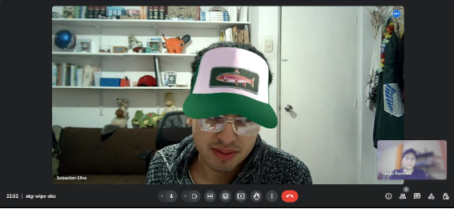
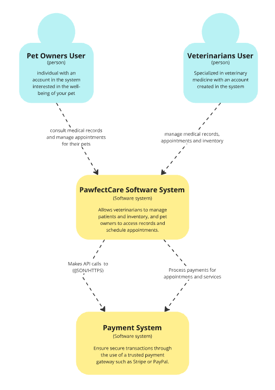

# COURSE PROJECT

---

    <strong>Universidad Peruana de Ciencias Aplicadas (UPC)</strong>     
    </img> 
    <strong>Carrera de Ingeniería de Software - Ciclo V</strong>  
    <strong>Desarrollo de Aplicaciones Open Source - SI729</strong> 
     <strong>Profesor: Alberto Wilmer Sanchez Seña</strong> 
     <strong><b>INFORME DEL TRABAJO FINAL</strong></b> 

    <strong>Startup del Proyecto: Aceitunitas</strong> 
    <strong>Producto: Pawfect Care</strong> 

    <h3 align="center">Team Members:</h3>

    <table align="center">
        <tr>
            <th style="text-align:center;">Member</th>
            <th style="text-align:center;">Code</th>
        </tr>
        <tr>
            <td>Bastidas Bastidas, Diego Martin</td>
            <td>U20221A301</td>
        </tr>
        <tr>
            <td>Chavez Uribe, Ario Joel</td>
            <td>U202213468</td>
        </tr>
        <tr>
            <td>Gutierrez Garcia, Jose Eduardo</td>
            <td>U202221518</td>
        </tr>
        <tr>
            <td>Perez Garcia, David Alexander</td>
            <td>U202222942</td>
        </tr>
        <tr>
            <td>Zuniga Calle, Sebastian Gabriel</td>
            <td>U20221b479</td>
        </tr>
    </table>
    

</body>

 <strong>2024-02</strong>

 

---

# Registro de Versiones del Informe

| Versión | Fecha | Autor | Descripción de la modificación |
|----|----|----|----|
| TB1 | 25/08/2024 | Aceitunitas | Redacción de los Capítulos I: Introduction, II: Requirements Elicitation & Analysis, III: Requirements Specification, IV: Product Design, V: Product Implementation, Validation & Deployment. |

# Project Report Collaboration Insights

Las tareas correspondientes a la TB1 han sido completadas y están debidamente documentadas en el repositorio de GitHub para Pawfect Care-Report. Puedes acceder al repositorio a través del siguiente enlace: [https://github.com/UPC-PRE-SI729-2402-WX51-G4-Aceitunitas/Pawfect-Care-Report.git](https://github.com/UPC-PRE-SI729-2402-WX51-G4-Aceitunitas/Pawfect-Care-Report.git)

Durante la fase de elaboración del informe, se realizaron las siguientes actividades:

- Se crearon y redactaron los contenidos asignados a cada miembro utilizando formato Markdown, y se realizaron "Conventional Commits" para registrar el progreso en el repositorio.

-  Se generaron los recursos necesarios y agregaron las imagenes al repositorio en la carpeta "assets" en cada rama del informe.

- Se organizaron reuniones para coordinar el avance de los componentes del informe y para proporcionar actualizaciones sobre los progresos del Sprint 1, que se centró en el desarrollo de la Landing Page.

# Contenido
## Tabla de contenidos
- [**Registro de Versiones del Informe**](#registro-de-versiones-del-informe)
- [**Project Report Collaboration Insights**](#project-report-collaboration-insights)
- [**Contenido**](#contenido)
    - [Tabla de contenidos](#tabla-de-contenidos)
- [**Student Outcome**](#student-outcome)
- ## [ **Capítulo I: Introducción** ](#-capítulo-i-introducción-)
  - [**1.1. Startup Profile**](#11-startup-profile)
    - [**1.1.1. Descripción de la Startup**](#111-descripción-de-la-startup)
    - [**1.1.2. Perfiles de integrantes del equipo**](#112-perfiles-de-integrantes-del-equipo)
  - [**1.2. Solution Profile**](#12-solution-profile)
    - [**1.2.1 Antecedentes y problemática**](#121-antecedentes-y-problemática)
    - [What (¿Qué?)](#what-qué)
    - [Who (¿Quién?)](#who-quién)
    - [Where (¿Dónde?)](#where-dónde)
    - [When (¿Cuándo?)](#when-cuándo)
    - [Why (¿Por qué?)](#why-por-qué)
    - [How (¿Cómo?)](#how-cómo)
    - [How much (¿Cuánto?)](#how-much-cuánto)
    - [**1.2.2 Lean UX Process**](#122-lean-ux-process)
    - [**1.2.2.1. Lean UX Problem Statements**](#1221-lean-ux-problem-statements)
    - [**1.2.2.2. Lean UX Assumptions**](#1222-lean-ux-assumptions)
    - [**1.2.2.3. Lean UX Hypothesis Statements**](#1223-lean-ux-hypothesis-statements)
    - [**1.2.2.4. Lean UX Canvas**](#1224-lean-ux-canvas)
  - [**1.3. Segmentos objetivo**](#13-segmentos-objetivo)
- ## [ **Capítulo II: Requirements Elicitation \& Analysis**](#-capítulo-ii-requirements-elicitation--analysis)
  - [**2.1. Competidores**](#21-competidores)
    - [**2.1.1. Análisis competitivo**](#211-análisis-competitivo)
    - [**2.1.2. Estrategias y tácticas frente a competidores**](#212-estrategias-y-tácticas-frente-a-competidores)
  - [**2.2. Entrevistas**](#22-entrevistas)
    - [**2.2.1. Diseño de entrevistas**](#221-diseño-de-entrevistas)
    - [**2.2.2. Registro de entrevistas**](#222-registro-de-entrevistas)
    - [**2.2.3. Análisis de entrevistas**](#223-análisis-de-entrevistas)
  - [**2.3. Needfinding**](#23-needfinding)
    - [**2.3.1. User Personas**](#231-user-personas)
    - [**2.3.2. User Task Matrix**](#232-user-task-matrix)
    - [**2.3.3. User Journey Mapping**](#233-user-journey-mapping)
    - [**2.3.4. Empathy Mapping**](#234-empathy-mapping)
    - [**2.3.5. As-is Scenario Mapping**](#235-as-is-scenario-mapping)
  - [**2.4. Ubiquitous Language**](#24-ubiquitous-language)
- ## [ **Capítulo III: Requirements Specification**](#-capítulo-iii-requirements-specification)
  - [**3.1. To-Be Scenario Mapping**](#31-to-be-scenario-mapping)
  - [**3.2. User Stories**](#32-user-stories)
  - [**3.3. Impact Mapping**](#33-impact-mapping)
  - [**3.4. Product Backlog**](#34-product-backlog)
- ## [**Capítulo IV: Product Design**](#capítulo-iv-product-design)
  - [**4.1. Style Guidelines**](#41-style-guidelines)
    - [**4.1.1. General Style Guidelines**](#411-general-style-guidelines)
    - [**4.1.2. Web Style Guidelines**](#412-web-style-guidelines)
  - [**4.2. Information Architecture**](#42-information-architecture)
    - [**4.2.1. Organization Systems**](#421-organization-systems)
    - [**4.2.2. Labeling Systems**](#422-labeling-systems)
    - [**4.2.3. SEO Tags and Meta Tags**](#423-seo-tags-and-meta-tags)
    - [**4.2.4. Searching Systems**](#424-searching-systems)
    - [**4.2.5. Navigation Systems**](#425-navigation-systems)
  - [**4.3. Landing Page UI Design**](#43-landing-page-ui-design)
    - [**4.3.1. Landing Page Wireframe**](#431-landing-page-wireframe)
    - [**4.3.2. Landing Page Mock-up**](#432-landing-page-mock-up)
  - [**4.4. Web Applications UX/UI Design**](#44-web-applications-uxui-design)
    - [**4.4.1. Web Applications Wireframes**](#441-web-applications-wireframes)
    - [**4.4.2. Web Applications Wireflow Diagrams**](#442-web-applications-wireflow-diagrams)
    - [**4.4.3. Web Applications Mock-ups**](#443-web-applications-mock-ups)
    - [**4.4.4. Web Applications User Flow Diagrams**](#444-web-applications-user-flow-diagrams)
  - [**4.5. Web Applications Prototyping**](#45-web-applications-prototyping)
  - [**4.6. Domain-Driven Software Architecture**](#46-domain-driven-software-architecture)
    - [**4.6.1. Software Architecture Context Diagram**](#461-software-architecture-context-diagram)
    - [**4.6.2. Software Architecture Container Diagrams**](#462-software-architecture-container-diagrams)
    - [**4.6.3. Software Architecture Components Diagrams**](#463-software-architecture-components-diagrams)
  - [**4.7. Software Object-Oriented Design**](#47-software-object-oriented-design)
    - [**4.7.1. Class Diagrams**](#471-class-diagrams)
    - [**4.7.2. Class Dictionary**](#472-class-dictionary)
  - [**4.8. Database Design**](#48-database-design)
    - [**4.8.1. Database Diagram**](#481-database-diagram)
- ## [**Capítulo V: Product Implementation, Validation \& Deployment**](#capítulo-v-product-implementation-validation--deployment)
  - [**5.1. Software Configuration Management**](#51-software-configuration-management)
    - [**5.1.1. Software Development Environment Configuration**](#511-software-development-environment-configuration)
    - [**5.1.2. Source Code Management**](#512-source-code-management)
    - [**5.1.3. Source Code Style Guide \& Conventions**](#513-source-code-style-guide--conventions)
    - [**5.1.4. Software Deployment Configuration**](#514-software-deployment-configuration)
  - [**5.2. Landing Page, Services \& Applications Implementation**](#52-landing-page-services--applications-implementation)
    - [**5.2.1. Sprint 1**](#521-sprint-1)
    - [**5.2.1.1. Sprint Planning 1**](#5211-sprint-planning-1)
    - [**5.2.1.2. Sprint Backlog 1**](#5212-sprint-backlog-1)
    - [**5.2.1.3. Development Evidence for Sprint Review**](#5213-development-evidence-for-sprint-review)
    - [**5.2.1.4. Testing Suite Evidence for Sprint Review**](#5214-testing-suite-evidence-for-sprint-review)
    - [**5.2.1.5. Execution Evidence for Sprint Review**](#5215-execution-evidence-for-sprint-review)
    - [**5.2.1.6. Services Documentation Evidence for Sprint Review**](#5216-services-documentation-evidence-for-sprint-review)
    - [**5.2.1.7. Software Deployment Evidence for Sprint Review**](#5217-software-deployment-evidence-for-sprint-review)
    - [**5.2.1.8. Team Collaboration Insights during Sprint**](#5218-team-collaboration-insights-during-sprint)
  - [**5.3. Validation Interviews**](#53-validation-interviews)
    - [**5.3.1. Diseño de Entrevistas**](#531-diseño-de-entrevistas)
    - [**5.3.2. Registro de Entrevistas**](#532-registro-de-entrevistas)
    - [**5.3.3. Evaluaciones según heurísticas**](#533-evaluaciones-según-heurísticas)
  - [**5.4. Video About-the-Product**](#54-video-about-the-product)
- [**Conclusiones**](#conclusiones)
- [**Conclusiones y recomendaciones**](#conclusiones-y-recomendaciones)
- [**Video About-the-Team**](#video-about-the-team)
- [**Bibliografía**](#bibliografía)
- [**Anexos**](#anexos)

# Student Outcome

| Criterio específico | Acciones realizadas | Conclusiones |
|----|----|----|
|Comunica oralmente con efectividad a diferentes rangos de audiencia.| **Bastidas Bastidas, Diego Martin** *TB1* Realicé los capítulos I y II, enfocándome en la introducción y el análisis de la problemática de la startup. Me encargué de describir el perfil de la startup, los perfiles de los integrantes del equipo y el proceso Lean UX. A través de mi presentación, logré explicar de manera clara los antecedentes y las soluciones propuestas, lo que permitió a la audiencia comprender el análisis competitivo y los resultados de las entrevistas.  **Chavez Uribe, Ario Joel** *TB1* Me encargué del Capítulo V, donde desarrollé la implementación y validación del producto. Presenté la configuración del entorno de desarrollo y la gestión del código fuente, lo que incluyó las convenciones de estilo y la configuración de despliegue del software. Durante mi presentación, logré simplificar conceptos técnicos y asegurarme de que la audiencia entendiera el progreso de los sprints y el proceso de despliegue.  **Gutierrez Garcia, Jose Eduardo** *TB1* Como líder del grupo, lideré el desarrollo del Capítulo III, que abarcó la especificación de requisitos. Me aseguré de que el equipo estuviera alineado y trabajara de manera efectiva. Al presentar el mapeo de impacto, las user stories y el backlog de productos, logré que la audiencia comprendiera cómo se estructuran las futuras mejoras de la plataforma. También gestioné la documentación en Markdown, asegurando que fuera clara y organizada.  **Perez Garcia, David Alexander** *TB1* Realicé el Capítulo IV, centrándome en el diseño de la landing page y el prototipo de la aplicación. Me encargué de desarrollar los wireframes, mockups y los sistemas de etiquetado, asegurando que el diseño fuera funcional y estético. En mi presentación, logré comunicar de manera clara cómo el diseño UI/UX mejora la experiencia del usuario y resuelve sus necesidades de manera efectiva.  **Zuniga Calle, Sebastian Gabriel** *TB1* Trabajé en el Capítulo IV en la parte de la arquitectura de software y el diseño orientado a objetos. Desarrollé los diagramas de contexto, contenedores y componentes, además de los diagramas de clases y la base de datos. Durante mi presentación, logré que la audiencia comprendiera los detalles técnicos y cómo la arquitectura soporta la estructura general del software. | TB1: Como equipo, logramos comunicar de manera efectiva cada una de nuestras áreas de trabajo, adaptándonos a las diferentes audiencias y asegurando que tanto los aspectos técnicos como los estratégicos fueran claros. A lo largo del proyecto, trabajamos de forma coordinada y presentamos información comprensible para una amplia gama de oyentes, demostrando una excelente capacidad de trabajo en equipo y dominio de nuestras respectivas áreas. |

| Criterio específico | Acciones realizadas | Conclusiones |
|----|----|----|
|Comunica por escrito con efectividad a diferentes rangos de audiencia.| **Bastidas Bastidas, Diego Martin** *TB1* Realicé los capítulos I y II, donde me enfoqué en la introducción y el análisis de la problemática de la startup. Escribí de manera clara y precisa la descripción de la startup y los perfiles de los integrantes del equipo. Además, desarrollé el proceso Lean UX y el análisis competitivo, asegurándome de que mi escritura fuera comprensible tanto para audiencias técnicas como no técnicas. Logré transmitir la información de manera efectiva para diferentes niveles de comprensión.  **Chavez Uribe, Ario Joel** *TB1* Me encargué del Capítulo V, que trataba sobre la implementación y validación del producto. Redacté la configuración del entorno de desarrollo y la gestión del código fuente, utilizando un lenguaje técnico pero comprensible para audiencias menos familiarizadas con estos temas. Mi objetivo fue presentar los detalles de los sprints y el despliegue del software de manera que fueran accesibles tanto para desarrolladores como para lectores menos técnicos.  **Gutierrez Garcia, Jose Eduardo** *TB1* Como líder del grupo, desarrollé el Capítulo III, centrándome en la especificación de requisitos. Me aseguré de que los documentos escritos, como el mapeo de impacto, las user stories y el backlog de productos, fueran claros y fáciles de seguir por cualquier lector. También gestioné la documentación en Markdown, estructurándola de manera lógica para que fuera accesible tanto para miembros técnicos del equipo como para otras partes interesadas.  **Perez Garcia, David Alexander** *TB1* Realicé el Capítulo IV, donde escribí sobre el diseño de la landing page y el prototipo de la aplicación. Utilicé un lenguaje que facilitara la comprensión de los wireframes, mockups y sistemas de etiquetado para diferentes niveles de audiencia, asegurando que tanto diseñadores como usuarios finales pudieran entender la funcionalidad y el valor del diseño. Me enfoqué en presentar la información visual de manera clara y accesible en los documentos.  **Zuniga Calle, Sebastian Gabriel** *TB1* Trabajé en el Capítulo IV en la parte de la arquitectura de software y el diseño orientado a objetos. Redacté los diagramas de contexto, contenedores y componentes, así como los diagramas de clases y la base de datos. Utilicé un lenguaje técnico adecuado para los ingenieros, pero también me aseguré de que los conceptos complejos fueran comprensibles para una audiencia más amplia. Mi objetivo fue que la documentación escrita fuera clara y útil para cualquier lector. | TB1: Como equipo, logramos redactar la documentación del proyecto de manera efectiva, adaptando nuestro lenguaje escrito a las necesidades de diferentes audiencias. A lo largo del proyecto, trabajamos de forma coordinada para que tanto los aspectos técnicos como los conceptuales fueran accesibles y fáciles de entender para todos los involucrados, asegurando que nuestra escritura fuera clara, precisa y efectiva en todo momento. |

----

# **Capítulo I: Introducción**

## 1.1. Startup Profile

### 1.1.1. Descripción de la Startup

“Pawfect Care” es una plataforma integral destinada a la gestión veterinaria y a la visualización de historiales clínicos. La idea fundamental detrás de esta plataforma es simplificar y optimizar la administración de diversos aspectos relacionados con el cuidado de las mascotas. Esto incluye la gestión de usuarios, clientes, productos y servicios, así como la organización de historiales clínicos. El objetivo es proporcionar una herramienta que facilite tanto a los propietarios de mascotas como a los veterinarios en el manejo de la información y las tareas diarias.

- **Misión:** Nuestra misión es mejorar la calidad de vida de las mascotas y sus dueños, ofreciendo una plataforma que simplifique la gestión veterinaria y el acceso a la información de salud de las mascotas

- **Visión:** Ser la plataforma líder en la gestión veterinaria, reconocida por su eficiencia, confiabilidad y facilidad de uso.

### 1.1.2. Perfiles de integrantes del equipo

|                    Photo                        |                                                                                                                                                                                                                                                                                                    Description                                                                                                                                                                                                                                                                                                    |
| :------------------------------------------------: | :---------------------------------------------------------------------------------------------------------------------------------------------------------------------------------------------------------------------------------------------------------------------------------------------------------------------------------------------------------------------------------------------------------------------------------------------------------------------------------------------------------------------------------------------------------------------------------------------------------------: |
|  |                                                                         Soy estudiante del 6to ciclo de la carrera de Ingeniería de Software. Decidí estudiar esta carrera porque desde pequeño me llamaba la atención el funcionamiento de una computadora y los procesos que conlleva. Me gusta practicar deportes de contacto, salir a pasear y sobre todo me encanta ser Groomer canino y trabajar con mascotas.                                                                                                                         |
|   | Soy estudiante de la carrera de Ingeniería de Software. Tengo interés en aprender sobre nuevas tecnologías, el desarrollo web y de aplicaciones. Me considero una persona que le gusta apoyar en proyectos innovadores que me permitan crecer como persona.                                                                        |
|   | Mi nombre es Jose Gutierrez, tengo 20 años, actualmente me encuentro cruzando mi 5to ciclo de la carrera de ingeniería de software en la UPC. Me gusta jugar videojuegos y practicar natación, soy un gran aficionado de la tecnología y del ensamblaje de computadoras. Me considero una persona dispuesta siempre a aprender tecnologías nuevas, creativa y responsable. |
|    |                                                                                                                              Mi nombre es David Alexander, un entusiasta de la tecnología. Actualmente me encuentro en el 6to ciclo de la Ingeniería de software en la UPC. Fuera de las aulas, me divierto explorando los límites del desarrollo frontend. La programación me permite crear soluciones innovadoras. Soy un autodidacta nato, siempre ávido de aprender nuevas herramientas y lenguajes de programación.                                                                                                                              |
|        |  Mi nombre es Gabriel Zuniga, estudiante de la carrera de Ingeniería de Software cursando el 6to ciclo. Tengo interés en lo relacionado con el desarrollo funcional multiplataforma, enfocándome en la parte del backend. La mayoría de mi tiempo es invertido en enriquecer mis conocimientos en todo lo relacionado a mi perfil profesional.   |

## 1.2. Solution Profile

Pawfect Care es una aplicación diseñada específicamente para el uso en clínicas veterinarias, enfocada en la gestión interna de todas sus operaciones y en facilitar el acceso a la información clínica para los dueños de las mascotas. Esta aplicación no solo permite a los veterinarios manejar de manera más eficiente y organizada los historiales clínicos de sus pacientes, sino que también ofrece herramientas para gestionar recordatorios, controlar el inventario de productos y realizar otras tareas esenciales para el funcionamiento de la veterinaria.
La interfaz de Pawfect Care ha sido diseñada para ser intuitiva y amigable, lo que permite a los veterinarios llevar un control detallado y preciso de cada aspecto de su práctica sin complicaciones. Además, la aplicación proporciona una funcionalidad adicional: la posibilidad de publicar las historias clínicas para que los dueños de las mascotas puedan acceder a ellas cuando lo necesiten. Esto garantiza que los propietarios estén siempre informados sobre el estado de salud de sus mascotas y puedan consultar los detalles médicos en cualquier momento, mejorando así la comunicación y la transparencia entre la clínica y sus clientes.

### 1.2.1. Antecedentes y problemática

Con la finalidad de poder conocer y comprender con mayor precisión las necesidades de nuestros usuarios, en este caso universitarios, hemos hecho un estudio por medio de la técnica 5w’s & 2H’s. Según el sitio web Rockcontent (2019) 5w’s & 2H’s es una de las metodologías de gestión empresarial más utilizadas. Puede aplicarse en muchos momentos, empresas y proyectos, ayuda a responder una serie de preguntas decisivas para hacer que las acciones de un negocio sean más estratégicas y precisas. Sin más preámbulos, por siguiente mostraremos la información que hemos logrado recopilar por medio de esta técnica:

#### Uso de la técnica The 5'W's w Y 2'H's

| LAS 5W y 2H | Pregunta                                                | Descripción                                                                                                                                                                                                                                                                                                                                                                                                                                                                                                          |
| ----------- | ------------------------------------------------------- | -------------------------------------------------------------------------------------------------------------------------------------------------------------------------------------------------------------------------------------------------------------------------------------------------------------------------------------------------------------------------------------------------------------------------------------------------------------------------------------------------------------------- |
| What?        | ¿Cuál es el problema?                                     | El problema radica en la ausencia de una aplicación que sea tanto intuitiva como fácil de usar en el entorno veterinario, y que, además, permita integrar y gestionar eficazmente los múltiples aspectos que involucra esta práctica                                                                                                                   |
| When?       | ¿Cuándo sucede el problema?                                   | El problema surge cuando las clínicas veterinarias carecen de una aplicación que sea intuitiva y sencilla de usar, lo que dificulta la integración y gestión eficiente de los diversos aspectos necesarios para su funcionamiento diario.                                                                                                                                                                                                            |
| Where?       | ¿Dónde sucede el problema?                             | El problema ocurre en las clínicas veterinarias, donde la falta de una aplicación complica la integración y gestión de las múltiples áreas necesarias para su funcionamiento. Esto no solo afecta a los veterinarios en su labor diaria, sino que también impacta a los dueños de mascotas, quienes necesitan una forma sencilla de acceder a la información y los servicios relacionados con la salud de sus animales.                                                                                                                                            |
| Why?      | ¿Por qué sucede el problema?                               | El problema se debe al desconocimiento de aplicaciones que estén específicamente diseñadas para atender las necesidades complejas y diversas de una clínica veterinaria. Existen muchas aplicaciones pero no son lo suficientemente flexibles o integrales para abarcar todos los campos necesarios, como la gestión de historiales clínicos, el control de inventario, y la comunicación con los dueños de las mascotas. Esto crea dificultades tanto para los veterinarios, que se ven obligados a utilizar múltiples herramientas o procesos manuales, como para los dueños de mascotas, que enfrentan limitaciones en el acceso a la información relevante.                                                                                                                                                                                        |
| Who?        | ¿Qué llevara a las personas a usar nuestro producto?                         | Las personas optarán por Pawfect Care debido a la facilidad con la que podrán completar los campos necesarios, la amplia difusión que la aplicación tendrá en redes sociales, y especialmente por lo sencillo que resulta rellenar las historias clínicas sin la complicación de tener que llenar campos obligatorios. |
| How?        | ¿En qué condiciones los clientes usaran nuestro producto?               | Los clientes utilizarán nuestro producto en condiciones donde necesiten una solución eficiente y fácil de usar para gestionar las operaciones de su clínica veterinaria. Esto incluye situaciones en las que buscan una herramienta que simplifique el manejo de historiales clínicos, controle el inventario, y facilite la comunicación con los dueños de las mascotas. Además, lo usarán cuando requieran una aplicación que les permita acceder y compartir información médica de manera rápida y sin complicaciones, especialmente en un entorno donde el tiempo y la precisión son esenciales.                                                                                                                                                                                  |
| How Much?   | ¿Con qué frecuencia o en qué cantidad se utilizará nuestro producto? |  Nuestro producto está diseñado para ser utilizado diariamente por las clínicas veterinarias. El sistema de gestión clínica se utilizará en la mayoría de las interacciones clínicas, desde la admisión de pacientes hasta el seguimiento post-tratamiento. Dado que el acceso a la información clínica y la gestión de citas es una necesidad recurrente, esperamos que el personal utilice la plataforma constantemente a lo largo del día. Además, los dueños de mascotas podrán acceder a la información relevante de sus mascotas, lo que también incentivará un uso frecuente por parte de ellos, especialmente para verificar el historial clínico y programar citas.                                                                                             |

## 1.2.2. Lean UX Process.

#### 1.2.2.1. Lean UX Problem Statements.

La aplicación Pawfect Care busca resolver la necesidad de una herramienta integral que facilite la gestión diaria de las clínicas veterinarias. Al ofrecer una interfaz intuitiva y fácil de usar, la aplicación trata de eliminar las complejidades y dificultades asociadas con la administración de múltiples aspectos de la práctica veterinaria en un solo lugar, permitiendo que tanto veterinarios como propietarios de mascotas tengan acceso rápido y sencillo a la información relevante.

#### 1.2.2.2. Lean UX Assumptions.

Para desarrollar la aplicación Pawfect Care, partimos de varias suposiciones clave que guiarán nuestro proceso de diseño y desarrollo. Estas suposiciones están basadas en una comprensión inicial de las necesidades y problemas de nuestros usuarios objetivo, así como en los resultados esperados para el negocio. A medida que avanzamos en el desarrollo, estas suposiciones se validarán mediante pruebas y retroalimentación continua para asegurar que la solución propuesta cumpla con las expectativas y resuelva eficazmente los desafíos identificados.

**Features:**

- Sistema de gestión de citas para facilitar la organización del tiempo en las clínicas.
- Almacenamiento y visualización de historiales clínicos de las mascotas de forma rápida y segura.
- Notificaciones automáticas para recordatorios de vacunas, tratamientos o revisiones.
- Sección para la venta de productos veterinarios, integrando un catálogo accesible para los clientes.
- Sistema de reportes de ingresos, control de inventario, y análisis de datos para mejorar la eficiencia administrativa.
- Interfaz intuitiva y adaptable para ser utilizada tanto en dispositivos móviles como en computadoras.

**Business Outcomes:**

- Aumento de la eficiencia operativa de las clínicas, reduciendo el tiempo en tareas administrativas.
- Mejora en la satisfacción del cliente, permitiendo un acceso rápido a la información médica de sus mascotas y facilitando la interacción con la clínica.
- Generación de ingresos adicionales a través de suscripciones premium que ofrezcan funciones avanzadas y comisiones por la venta de productos veterinarios.
- Reducción de errores y tiempos de espera en la gestión clínica, lo que aumentará la retención de clientes y atraerá nuevos usuarios.

**Users:**
- **Segmento 1 – Médicos Veterinarios:** Clínicas veterinarias de diversos tamaños, desde consultorios pequeños hasta grandes centros con múltiples especialistas. Este segmento busca mejorar la gestión diaria de sus clínicas, optimizando la administración de información médica, inventarios y citas, para aumentar su productividad y ofrecer un mejor servicio a sus clientes.

- **Segmento 2 – Dueños de Mascotas:** Propietarios que necesitan gestionar de manera eficiente la salud de sus mascotas, incluyendo jóvenes acostumbrados a usar aplicaciones móviles y también aquellos menos familiarizados con la tecnología pero que desean una forma más accesible de organizar la información médica de sus animales.

**User Outcomes & Benefits:**

- Reducción de tiempo en la gestión de citas y actualización de historiales médicos.
- Mejor organización en el manejo de inventarios y productos.
- Mejora en la relación con los clientes, ofreciendo un acceso directo a la información de salud de sus mascotas.
- Simplificación en la administración de las clínicas veterinarias, reduciendo errores y tiempos de espera.

**User Assumptions:**

- **¿Quién es el usuario?**
  os usuarios principales son las clínicas veterinarias y los dueños de mascotas. 

- **¿Dónde encaja la aplicación en su vida?**
  La aplicación se integra en la rutina diaria de las clínicas veterinarias y en la vida cotidiana de las mascotas, facilitando su tratamiento y cuidado. 

- **¿Qué problemas tienen nuestros usuarios y como se puede resolver?**
  Los usuarios enfrentan la falta de una aplicación especializado para la gestión integral de clínicas veterinarias y la ausencia de un portal donde se pueda acceder fácilmente a la historia clínica de una mascota. Nuestra aplicación resuelve estos problemas proporcionando una plataforma única para administrar todos los aspectos de la clínica y facilitar el acceso a la información médica. 

- **¿Dónde y cuándo es usada nuestra aplicación?**
  La aplicación se utiliza principalmente en clínicas veterinarias. Los momentos clave para su uso son durante las consultas veterinarias y cuando los dueños deciden cambiar de veterinario y necesitan trasladar el historial clínico o el registro de vacunas a otro establecimiento. 

- **¿Qué características son importantes?**
  Las características esenciales incluyen una interfaz fácil de usar en dispositivos móviles, computadoras y laptops. Además, es crucial la eliminación de campos innecesarios u obligatorios que puedan complicar el proceso de registro. 

- **¿Cómo debe verse nuestra aplicación y como debe comportarse?**
 Nuestra aplicación debe tener un diseño funcional y amigable, tanto para veterinarios como para dueños de mascotas. Debe permitir un registro rápido y sencillo de nuevos pacientes y la actualización de historiales clínicos, evitando campos obligatorios que no aporten valor al proceso de registro y atención. 

**Business Assumptions**

- Los veterinarios y asistentes están dispuestos a adoptar herramientas digitales si mejoran la eficiencia en sus clínicas.
- Los dueños de mascotas valorarán una aplicación que les permita acceder a la información de salud de sus animales en cualquier momento.
- Las clínicas veterinarias estarán dispuestas a pagar por suscripciones premium o herramientas avanzadas de gestión si aumentan la productividad.
- El mercado de clínicas veterinarias aún utiliza métodos manuales o desactualizados, lo que genera ineficiencias que la aplicación puede resolver.
- Habrá una aceptación de la aplicación tanto por usuarios jóvenes familiarizados con la tecnología como por aquellos menos habituados al uso de herramientas digitales.

#### 1.2.2.3. Lean UX Hypothesis Statements.

Para asegurar que nuestra solución esté alineada con las necesidades y expectativas de nuestros usuarios, hemos formulado las siguientes hipótesis utilizando el enfoque Lean UX. Este enfoque nos permitirá validar nuestras suposiciones a través de iteraciones constantes y ajustes basados en el feedback de los usuarios

**Creemos que** si diseñamos una aplicación intuitiva que permita a los veterinarios gestionar historiales clínicos y recordatorios de manera eficiente.
**Sabremos** que hemos tenido éxito cuando observemos un aumento en la eficiencia operativa y una reducción en el tiempo dedicado a tareas administrativas en las clínicas veterinarias
**cuando** las clínicas adopten nuestra aplicación y reporten mejoras en su flujo de trabajo diario, habremos validado nuestra hipótesis.

**Creemos que** lal ofrecer una plataforma que facilite el acceso a la historia clínica de las mascotas para los dueños
**Sabremos** que nuestra solución es efectiva cuando recibamos comentarios positivos de los usuarios sobre la facilidad de acceso y la utilidad de la información médica compartida
**cuando** los dueños de mascotas utilicen la aplicación para consultar y manejar la salud de sus animales sin problemas, habremos confirmado que estamos resolviendo una necesidad real.

**Creemos que** que si eliminamos los campos obligatorios innecesarios y simplificamos el proceso de registro en la aplicación.
**Sabremos** que hemos logrado nuestro objetivo cuando los usuarios experimenten una mayor satisfacción y una reducción en los errores de entrada de datos.
**cuando** tanto veterinarios como propietarios de mascotas reporten una experiencia de usuario fluida y sin frustraciones, habremos validado que nuestra aplicación cumple con las expectativas de simplicidad y funcionalidad.

#### 1.2.2.4. Lean UX Canvas.

<table border>
    <tr>
        <td ROWSPAN=2>
Lean UX Canvas
</td>
        <td ROWSPAN=2></td> 
        <td>
Fecha: 31/08/2024
</td> 
    </tr>
    <tr>
        <td>
Primera iteración
</td> 
    </tr>
    <tr>
        <td ROWSPAN>

**Business Problem**
La gestión de clínicas veterinarias enfrenta desafíos significativos debido al uso de métodos manuales o sistemas desactualizados, lo que resulta en ineficiencias operativas, errores en la documentación y una experiencia insatisfactoria tanto para los veterinarios como para los propietarios de mascotas. La falta de una herramienta integral complica la administración de citas, historiales clínicos y la venta de productos veterinarios.
</td>
            <td ROWSPAN=2>

**Solutions**

- Gestión de citas.
- Almacenamiento y visualización de historiales clínicos.
- Notificaciones automáticas para recordatorios de vacunas y tratamientos.
- Venta de productos veterinarios.
- Reportes de ingresos y control de inventario.
</td> <td ROWSPAN=2>

**Business Outcomes**

- Incremento de la eficiencia operativa en las clínicas veterinarias.
- Mejora en la satisfacción del cliente con acceso rápido a la información médica.
- Generación de ingresos adicionales a través de suscripciones premium y ventas de productos.
- Reducción de errores y tiempos de espera en la gestión clínica.
</td> 
    </tr>
    <tr>
        <td>

**Users**

- **Segmento 1 – Médicos Veterinarios:** Clínicas de diferentes tamaños que necesitan mejorar la gestión de información médica, citas e inventarios.
- **Segmento 2 – Dueños de Mascotas:** Propietarios que buscan una forma eficiente de gestionar la salud de sus mascotas y acceder a la información médica de manera digital.
</td> 
    </tr>
    <tr>
        <td ROWSPAN=2>

**Hypotheses**

- Creemos que diseñar una aplicación intuitiva para veterinarios mejorará la eficiencia en la gestión clínica.
- Sabemos que hemos tenido éxito cuando observamos una mejora en la eficiencia operativa y una reducción en el tiempo dedicado a tareas administrativas.
- Creemos que una plataforma que facilite el acceso a la historia clínica para los dueños será bien recibida.
- Sabemos que nuestra solución es efectiva cuando recibimos comentarios positivos sobre la facilidad de acceso a la información médica.
- Creemos que simplificar el proceso de registro eliminará campos innecesarios y mejorará la experiencia del usuario.
- Sabemos que hemos logrado nuestro objetivo cuando reportan una experiencia de usuario fluida y sin frustraciones.</td>

<td ROWSPAN=2>

**What's the most important thing we need to learn first?**

- Validar si la aplicación realmente mejora la eficiencia operativa de las clínicas veterinarias y facilita el acceso a la información médica para los dueños de mascotas.
</td>

<td>

**User Outcomes & Benefits**

- Reducción del tiempo en la gestión de citas y actualización de historiales.
- Mejor organización en inventarios y productos.
- Mejora en la relación con los clientes mediante acceso directo a la información médica.
- Simplificación en la administración de las clínicas, reduciendo errores y tiempos de espera.
</td> 
    </tr>
    <tr>
        <td>

**What's the least amount of work we need to do to learn the next most important?**

- Desarrollar un prototipo funcional que permita a un grupo selecto de usuarios (veterinarios y propietarios de mascotas) probar las características clave de la aplicación y proporcionar retroalimentación sobre su efectividad en la mejora de la eficiencia y la satisfacción del usuario.

</td> 
    </tr>
</table>

## 1.3. Segmentos objetivo.

Para asegurar el éxito de Pawfect Care, hemos identificado dos segmentos clave que serán el foco principal de nuestras estrategias de desarrollo y marketing. Estos segmentos representan a nuestros usuarios ideales y nos permitirán adaptar nuestras funcionalidades y servicios a sus necesidades específicas, maximizando así el impacto de la plataforma.

**Segmento Objetivo 1 - Clínicas Veterinarias**

El primer segmento objetivo incluye a las clínicas veterinarias de diversos tamaños, desde pequeñas clínicas independientes hasta grandes centros especializados con múltiples profesionales. Pawfect Care les ofrece una plataforma que simplifica la gestión interna de sus operaciones, permitiendo una mayor eficiencia en la programación de citas, gestión de historiales médicos y la comunicación con los dueños de las mascotas. Estas clínicas buscan una herramienta que facilite el acceso a información clínica y mejore la administración de sus recursos, todo bajo una interfaz intuitiva y accesible. El valor de Pawfect Care radica en su capacidad para optimizar procesos, lo que se traduce en un mejor servicio y atención para los animales.

**Segmento Objetivo 2 - Dueño de Mascotas:**

El segundo segmento está compuesto por los dueños de mascotas, quienes son responsables del bienestar y la salud de sus animales. Este grupo de usuarios busca soluciones prácticas que les permitan manejar de manera eficiente la salud de sus mascotas, incluyendo la programación de citas, acceso a historiales médicos y recordatorios de vacunación. Pawfect Care les proporciona una plataforma que centraliza toda esta información y facilita el acceso desde cualquier dispositivo, brindándoles tranquilidad y control sobre el cuidado de sus animales. La conveniencia y facilidad de uso son elementos clave para este segmento, que espera una experiencia fluida y personalizada.

---

# **Capítulo II: Requirements Elicitation & Analysis**

## 2.1. Competidores.

<table>
    <thead>
        <tr>
            <th>Nombre</th>
            <th>Descripción</th>
        </tr>
    </thead>
    <tbody>
        <tr>
            <td rowspan align="center">VetPraxis
            <td>Es una solución de gestión para clínicas veterinarias, diseñada para optimizar la administración de operaciones diarias. Ofrece funcionalidades que incluyen la gestión de citas, historias clínicas electrónicas, administración de inventario, y facturación. También proporciona herramientas para la comunicación con los clientes y el seguimiento de tratamientos. 
            Página web:<a href="https://vetpraxis.net/"> https://vetpraxis.net/</a>
        </tr>
        <tr>
            <td align="center">VetApp
            <td> Es una plataforma desarrollada para la gestión de clínicas veterinarias. Proporciona características como la programación de citas, el manejo de historias clínicas electrónicas, y la administración de inventario. 
            Página web:<a href="https://vetapp.app/en"> https://vetapp.app/en</a>
        </tr>
        <tr>
           <td rowspan align="center">PetClinic  
           <td>Es una aplicación diseñada para gestionar clínicas veterinarias y consultas de mascotas. Incluye funciones para la gestión de citas, el manejo de historias clínicas electrónicas, y la administración de inventario y facturación. La plataforma está orientada a mejorar la organización y eficiencia dentro de las clínicas, ofreciendo herramientas para el seguimiento de tratamientos y la comunicación con los clientes. PetClinic está adaptada a las necesidades específicas del sector veterinario en Perú. 
           Página web:<a href="https://petclinic.es/"> https://petclinic.es/</a>
    </tbody>
</table>

### 2.1.1. Análisis competitivo.
<table style="width: 100%;">
  <tr>
    <th colspan="6" style="padding: 8px; text-align: center;"> Competitive Analysis Landscape</th>
  </tr>
  <tr>
    <td>¿Por qué llevar a cabo este análisis?</td>
    <td colspan="5">Para comparar las características tanto internas como externas de los productos que compiten con nosotros.</td>
  </tr>
  <tr>
    <td colspan="2"></td>
    <td align="center">Pawfect Care </td>
    <td align="center">VetPraxis </td>
    <td align="center">VetApp </td>
    <td align="center">PetClinic </td> 
  </tr>
  <tr>
    <td rowspan="2" align="center">Perfil</td>
    <td align="center">Overview</td>
    <td>
    Plataforma para clínicas veterinarias que simplifica la gestión de historiales clínicos, recordatorios e inventarios con una interfaz fácil de usar.</td>
    <td>Software de gestión veterinaria que optimiza citas, historiales clínicos y facturación con una interfaz amigable.</td>
    <td>Aplicación móvil para gestionar citas, recordatorios, historiales médicos de mascotas, facilitando la comunicación entre veterinarios y propietarios.</td>
    <td>Plataforma que integra administración de historiales clínicos, citas e inventario para mejorar la eficiencia en clínicas veterinarias.</td>
  </tr>
  <tr>
    <td>Ventaja competitiva ¿Qué valor ofrece a los clientes?</td>
    <td>Interfaz intuitiva que facilita la gestión de historiales, recordatorios e inventario.</td>
    <td>Gestión integral de citas, historiales y facturación con una interfaz amigable.</td>
    <td>Gestión móvil de citas e historiales médicos que mejora la comunicación entre veterinarios y propietarios.</td>
    <td>Plataforma única para administrar historiales, citas e inventario en clínicas veterinarias.</td>
  </tr>
  <tr>
    <td rowspan="2" align="center">Perfil de Marketing</td>
    <td>Mercado objetivo</td>
    <td>
    Clínicas veterinarias y dueños de mascotas.</td>
    <td>Clínicas veterinarias medianas y grandes.</td>
    <td>Propietarios de mascotas y veterinarios móviles.</td>
    <td>Clínicas veterinarias pequeñas y medianas.</td>
  </tr>
  <tr>
    <td>Estrategias de marketing</td>
    <td>Redes sociales y colaboraciones con clínicas.</td>
    <td>Marketing de contenido y webinars.</td>
    <td>Redes sociales.</td>
    <td>Publicidad dirigida y promociones.</td>
  </tr>
  <tr>
    <td rowspan="3" align="center">Perfil del Producto</td>
    <td>Productos & Servicios</td>
    <td>Gestión de historiales clínicos, recordatorios e inventarios.</td>
    <td>Gestión de citas, historiales clínicos y facturación.</td>
    <td>Aplicación móvil para gestionar citas e historiales médicos.</td>
    <td>Plataforma de administración de historiales, citas e inventario.</td>
  </tr>
  <tr>
    <td>Precios & Costos</td>
    <td>Suscripción mensual con diferentes niveles.</td>
    <td>Licencia de software con tarifas anuales.</td>
    <td>Descarga gratuita con compras dentro de la app.</td>
    <td>Suscripción con tarifas basadas en el tamaño de la clínica.</td>
  </tr>
  <tr>
    <td>Canales de distribución (Web y/o Móvil)</td>
    <td>Web y móvil.</td>
    <td>Web.</td>
    <td>Móvil (App stores)</td>
    <td>Web.</td>
  </tr>
  <tr>
    <td rowspan="4" align="center">Análisis SWOT</td>
    <td>Fortalezas</td>
    <td>Interfaz intuitiva y fácil de usar; integración de múltiples funciones.</td>
    <td>Gestión integral y amigable; adaptado para clínicas medianas y grandes.</td>
    <td>Acceso móvil conveniente; mejora la comunicación con propietarios de mascotas.</td>
    <td>Plataforma integral para clínicas pequeñas y medianas; fácil de usa.</td>
  </tr>
  <tr>
    <td>Debilidades</td>
    <td>Dependencia de la adopción por parte de clínicas veterinarias.</td>
    <td>Costos potencialmente altos para pequeñas clínicas.</td>
    <td>Funcionalidades limitadas comparadas con plataformas completas.</td>
    <td>Limitado a clínicas de menor tamaño; menos atractivo para grandes clínicas.</td>
  </tr>
  <tr>
    <td>Oportunidades</td>
    <td>
    Expansión en el mercado de clínicas veterinarias pequeñas y medianas.</td>
    <td>Crecimiento en el segmento de clínicas grandes y asociaciones veterinarias.</td>
    <td>Expansión en el mercado de usuarios móviles y propietarios de mascotas.</td>
    <td>Penetración en el mercado de clínicas veterinarias pequeñas</td>
  </tr>
  <tr>
    <td>Amenazas</td>
    <td>Competencia de otras plataformas con características similares.</td>
    <td>Competencia con soluciones de bajo costo o gratuitas.</td>
    <td>Alta competencia en aplicaciones móviles para la salud de mascotas.</td>
    <td>Competencia de soluciones más avanzadas para clínicas grandes.</td>
  </tr>
<table>

### 2.1.2. Estrategias y tácticas frente a competidores.
<strong> Estrategias:</strong> 
- <strong>Interfaz Intuitiva y Fácil de Usar:</strong> Pawfect Care se diferenciará por su interfaz amigable y fácil de usar, lo que simplifica la gestión diaria para los veterinarios y dueños de mascotas. Esto contrasta con muchas soluciones existentes que pueden ser complicadas o difíciles de navegar.
- <strong>Características Exclusivas:</strong> La aplicación ofrecerá características únicas como la personalización de historiales clínicos y recordatorios adaptados a las necesidades específicas de cada clínica y propietario de mascotas, lo cual no está comúnmente disponible en otras plataformas.
- <strong>Valor Agregado:</strong> Se enfocará en agregar valor a través de un sistema integral que combina gestión de citas, control de inventarios, notificaciones automáticas y una sección para la venta de productos veterinarios, abordando múltiples necesidades en una sola plataforma.
- <strong>Adaptabilidad: </strong>Pawfect Care se adaptará a diferentes tamaños de clínicas y será accesible tanto en dispositivos móviles como en computadoras, lo que la convierte en una solución flexible para diversas necesidades.

<strong>Tácticas: </strong> 
- <strong>Demostraciones Personalizadas:</strong> Se organizarán demostraciones en vivo en clínicas veterinarias para mostrar de manera práctica cómo la plataforma mejora la eficiencia y facilita la gestión clínica. Estas demostraciones permitirán a los clientes potenciales experimentar la funcionalidad de Pawfect Care en su entorno de trabajo.
- <strong>Períodos de Prueba Gratuita:</strong> Se ofrecerán períodos de prueba gratuita para que las clínicas puedan experimentar los beneficios de la aplicación sin compromiso. Esto permitirá a los usuarios evaluar la utilidad y el impacto de la plataforma en su operación diaria.
- <strong>Testimonios y Casos de Éxito:</strong> Se recopilarán y publicarán testimonios y casos de éxito de usuarios satisfechos que hayan experimentado mejoras significativas en su gestión veterinaria. Estos testimonios se utilizarán en campañas de marketing, en el sitio web de la aplicación y en materiales promocionales para construir credibilidad y atraer nuevos clientes.
-<strong> Soporte Proactivo y Capacitación:</strong> Se proporcionará soporte proactivo y capacitación personalizada para ayudar a las clínicas a integrar la plataforma de manera eficiente. Esto asegurará que los usuarios obtengan el máximo provecho de las características avanzadas y reduzcan el tiempo de adaptación.
- <strong>Optimización Continua:</strong> Se implementará un proceso de retroalimentación continua para identificar áreas de mejora y responder rápidamente a las necesidades cambiantes del mercado. Esto permitirá a Pawfect Care mantenerse a la vanguardia y adaptarse a nuevas tendencias y demandas.
- <strong>Partnerships Estratégicos:</strong> Se explorarán asociaciones estratégicas con proveedores de productos veterinarios y organizaciones de salud animal para ampliar la red de distribución y aumentar la visibilidad de la plataforma.

## 2.2. Entrevistas.

El objetivo de las entrevistas es obtener una comprensión profunda de las experiencias, perspectivas y opiniones de los segmentos de mercado seleccionados. Nuestra meta es recopilar información valiosa que nos permita entender mejor a nuestro público objetivo y mejorar nuestra comprensión de los usuarios. Estas conversaciones nos proporcionarán una visión más clara de las necesidades y deseos de nuestros usuarios, lo que nos ayudará a adaptar nuestros productos o servicios de manera más efectiva a sus requisitos.

### 2.2.1. Diseño de entrevistas.

En esta parte, se han formulado varias preguntas destinadas a nuestros segmentos de interés con el fin de obtener información cualitativa, como opiniones o descripciones. Esta información será crucial para el desarrollo de nuestra solución.

**Preguntas Generales:**

- ¿Cuál es tu nombre?
- ¿Cuántos años tienes?
- ¿Donde resides?
- ¿Cuál es tu ocupación?

**Preguntas para el Segmento Objetivo 1 - Médicos Veterinarios:**

- ¿Conoces alguna aplicación de gestión veterinaria? ¿Cuál es?
- ¿Lo escogieron por alguna razón es especial?
- ¿Fue la primera aplicación que usaron?
- ¿Qué es lo que te gusta de esa aplicación?
- ¿Qué te disgusta de esa aplicación?
- ¿Qué sería una de las cosas que si o si cambiarias?

**Preguntas para el Segmento Objetivo 2 - Dueños de Mascotas:**

- ¿Con que frecuencia vas al veterinario?
- ¿Qué método usas para llevar el control de tu mascota?
- ¿Alguna vez perdiste los documentos?
- ¿En medio de algún tratamiento cambiaste de veterinario?
- ¿Qué opinas de tener la historia clínica en una aplicación?
- ¿Usarías una aplicación como la descrita?

### 2.2.2. Registro de entrevistas.

**Entrevista para el Segmento Objetivo 1 - Médicos Veterinarios:**

---

Entrevista N°1:

**Entrevistada:** Jasmin Flores  
**Sexo:** Femenino  
**Edad:** 26 años 
**Domicilio:** San Miguel 
**Inicio de la Entrevista:** 0:03 
**Duración de la Entrevista:** 4:49 

**Enlace:** <a href="https://upcedupe-my.sharepoint.com/:v:/g/personal/u20221a301_upc_edu_pe/EQ-ZYy2RvYpNgt1Qfy9tHTUByB1wTz3kGVrQscVWHWam9A?nav=eyJyZWZlcnJhbEluZm8iOnsicmVmZXJyYWxBcHAiOiJPbmVEcml2ZUZvckJ1c2luZXNzIiwicmVmZXJyYWxBcHBQbGF0Zm9ybSI6IldlYiIsInJlZmVycmFsTW9kZSI6InZpZXciLCJyZWZlcnJhbFZpZXciOiJNeUZpbGVzTGlua0NvcHkifX0&e=j1mdQ7"> https://upcedupe-my.sharepoint.com/:v:/g/personal/u20221a301_upc_edu_pe/EQ-ZYy2RvYpNgt1Qfy9tHTUByB1wTz3kGVrQscVWHWam9A?nav=eyJyZWZlcnJhbEluZm8iOnsicmVmZXJyYWxBcHAiOiJPbmVEcml2ZUZvckJ1c2luZXNzIiwicmVmZXJyYWxBcHBQbGF0Zm9ybSI6IldlYiIsInJlZmVycmFsTW9kZSI6InZpZXciLCJyZWZlcnJhbFZpZXciOiJNeUZpbGVzTGlua0NvcHkifX0&e=j1mdQ7</a>

**Resumen de la Entrevista**: La doctora Jasmín nos comenta que en la veterinaria donde trabaja, solo tienen un usuario que se puede abrir en varios dispositivos para completar las historias clínicas. Lo que le agrada de esta aplicación es que está diseñada específicamente para el trabajo en veterinarias, con campos adaptados a cada especie o raza. Sin embargo, lo que no le gusta es que, aunque algunos campos no son obligatorios, tener que pasarlos para completar la historia clínica toma más tiempo del que desearía.

---

Entrevista N°2:

**Entrevistado:** Erick Monzón 
**Sexo:** Masculino  
**Edad:** 30 años  
**Domicilio:** Magdalena del Mar 
**Inicio de la Entrevista:** 0:00 
**Duración de la Entrevista:** 6:22 

 

**Enlace:** <a href="https://upcedupe-my.sharepoint.com/:v:/g/personal/u20221a301_upc_edu_pe/EbCW9J6OzTFKoDAHzGbfWzEBpDcpUG7M16WiUuDkC7iPMA"> https://upcedupe-my.sharepoint.com/:v:/g/personal/u20221a301_upc_edu_pe/EbCW9J6OzTFKoDAHzGbfWzEBpDcpUG7M16WiUuDkC7iPMA</a>

**Resumen de la Entrevista:** 	El Doctor Erick nos comenta que en su trabajo utilizan VetPraxis, principalmente porque es una aplicación muy reconocida y muchas veterinarias la emplean. Sin embargo, señala que tiene ciertas deficiencias, especialmente en lo que respecta a la eficiencia. Una de las principales críticas que hace es la inclusión de numerosos campos obligatorios que considera innecesarios, como el teléfono de trabajo, RUC, enlaces a redes sociales como Facebook e Instagram, y otros detalles que realmente no son relevantes para la atención al cliente. Esto se traduce en un proceso de creación de historias clínicas que puede tomar entre 7 y 10 minutos, un tiempo excesivo, especialmente en situaciones de emergencia donde la rapidez es crucial. Erick enfatiza que uno de los cambios que realizaría de manera prioritaria sería la eliminación de estos campos superfluos, para agilizar el proceso y hacer la aplicación más eficiente.

---

Entrevista N°3:

**Entrevistado:** Vanesa Gómez  
**Sexo:** Femenino  
**Edad:** 25 años 
**Domicilio:** Lince  
**Inicio de la Entrevista:** 0:00 
**Duración de la Entrevista:** 6:58 

 

**Enlace:** <a href="https://upcedupe-my.sharepoint.com/:v:/g/personal/u20221a301_upc_edu_pe/EYY7QpIHFxlDh0ksAmySO-kB1yHNDLGTJPHi61WTR0jlWg?nav=eyJyZWZlcnJhbEluZm8iOnsicmVmZXJyYWxBcHAiOiJPbmVEcml2ZUZvckJ1c2luZXNzIiwicmVmZXJyYWxBcHBQbGF0Zm9ybSI6IldlYiIsInJlZmVycmFsTW9kZSI6InZpZXciLCJyZWZlcnJhbFZpZXciOiJNeUZpbGVzTGlua0NvcHkifX0&e=JeOE4m"> https://upcedupe-my.sharepoint.com/:v:/g/personal/u20221a301_upc_edu_pe/EYY7QpIHFxlDh0ksAmySO-kB1yHNDLGTJPHi61WTR0jlWg?nav=eyJyZWZlcnJhbEluZm8iOnsicmVmZXJyYWxBcHAiOiJPbmVEcml2ZUZvckJ1c2luZXNzIiwicmVmZXJyYWxBcHBQbGF0Zm9ybSI6IldlYiIsInJlZmVycmFsTW9kZSI6InZpZXciLCJyZWZlcnJhbFZpZXciOiJNeUZpbGVzTGlua0NvcHkifX0&e=JeOE4m</a>

**Resumen de la Entrevista:** La doctora Vanesa comenta que en su trabajo actual utilizan VetPraxis, principalmente porque es la aplicación más conocida entre las veterinarias. Sin embargo, en su trabajo anterior, usaban fichas en papel, que luego archivaban en un Excel donde guardaban el número de historia clínica y el nombre de la mascota para facilitar la búsqueda posterior. Al igual que el doctor Erick, Vanesa no está satisfecha con los campos innecesarios que VetPraxis requiere, ya que le toma entre 10 y 15 minutos crear una historia clínica, lo cual considera excesivo. En su anterior trabajo, también encontraba ineficiente el método físico, ya que la letra a veces no era legible o las historias se traspapelaban, lo que causaba molestias a los clientes. Vanesa cambiaría estos campos innecesarios que ralentizan el proceso de creación de historias clínicas en VetPraxis.

**Entrevista para el Segmento Objetivo 2 - Dueños de Mascotas:**

---
Entrevista N°1:

**Entrevistado:** Sebastián Silva 
**Sexo:** Masculino 
**Edad:** 20 años 
**Domicilio:** San Luis  
**Inicio de la Entrevista:** 0:00 
**Duración de la Entrevista:** 6:58 

 

**Enlace:** <a href="https://upcedupe-my.sharepoint.com/:v:/g/personal/u20221a301_upc_edu_pe/Ec1XInM48xNOvR2jbzHkwuABf9CG5aosdZClZOwqh0nyYw"> https://upcedupe-my.sharepoint.com/:v:/g/personal/u20221a301_upc_edu_pe/Ec1XInM48xNOvR2jbzHkwuABf9CG5aosdZClZOwqh0nyYw</a>

**Resumen de la Entrevista:** Sebastián nos comenta que lleva a su mascota al veterinario entre una y dos veces al año, aunque si su gato presentara algún malestar, lo llevaría con mayor frecuencia. Con su perro, solía ir una vez a la semana debido a una infección en el oído. Sebastián mencionó que no recuerda dónde dejó la carpeta con toda la documentación médica de su mascota y que le gustaría tener una aplicación donde pudiera almacenar todo el historial médico de sus mascotas. De esta manera, podría actuar más rápidamente en caso de una emergencia, ya que tendría la información disponible en su celular. A pesar de esto, seguiría utilizando el formato físico como respaldo para no perder ningún registro de las atenciones a sus mascotas.

---

Entrevista N°2:

**Entrevistada:** Lucerito Guzmán 
**Sexo:** Femenino 
**Edad:** 22 años 
**Domicilio:** Callao  
**Inicio de la Entrevista:** 0:00 
**Duración de la Entrevista:** 7:10 

 

<a href="https://upcedupe-my.sharepoint.com/:v:/g/personal/u20221a301_upc_edu_pe/EQxyGm-xOy9Gixk9iwdU5-4B7_sjaOllyMTn6QX3f6py1Q?nav=eyJyZWZlcnJhbEluZm8iOnsicmVmZXJyYWxBcHAiOiJPbmVEcml2ZUZvckJ1c2luZXNzIiwicmVmZXJyYWxBcHBQbGF0Zm9ybSI6IldlYiIsInJlZmVycmFsTW9kZSI6InZpZXciLCJyZWZlcnJhbFZpZXciOiJNeUZpbGVzTGlua0NvcHkifX0&e=aOWtoD"> https://upcedupe-my.sharepoint.com/:v:/g/personal/u20221a301_upc_edu_pe/EQxyGm-xOy9Gixk9iwdU5-4B7_sjaOllyMTn6QX3f6py1Q?nav=eyJyZWZlcnJhbEluZm8iOnsicmVmZXJyYWxBcHAiOiJPbmVEcml2ZUZvckJ1c2luZXNzIiwicmVmZXJyYWxBcHBQbGF0Zm9ybSI6IldlYiIsInJlZmVycmFsTW9kZSI6InZpZXciLCJyZWZlcnJhbFZpZXciOiJNeUZpbGVzTGlua0NvcHkifX0&e=aOWtoD</a>

**Resumen de la Entrevista**: Lucerito nos comenta que visita al veterinario con bastante regularidad: una vez cada tres meses por su gata pequeña y una vez al mes para bañar a su perra. Ha tenido problemas con la pérdida de cartillas de vacunación, exámenes y otros documentos relacionados con sus gatas adultas. Además, ha cambiado de veterinaria en dos o tres ocasiones por diferentes razones, lo que le ha generado confusión sobre los productos utilizados en el baño de su perra y la marca de las vacunas administradas. Por estos motivos, está totalmente a favor de utilizar una aplicación como ez.vet, ya que le facilitaría acceder a la historia clínica de sus mascotas.

---

Entrevista N°3:

**Entrevistada:** Estrella Ticona 
**Sexo:** Femenino 
**Edad:** 19 años 
**Domicilio:** Chorrillos  
**Inicio de la Entrevista:** 0:00 
**Duración de la Entrevista:** 7:10 

 

<a href="https://upcedupe-my.sharepoint.com/:v:/g/personal/u20221a301_upc_edu_pe/EZguwL4OXjdNkBzBDBzk7_IBxOR3aJXNCJtxhTOVihRx2w?nav=eyJyZWZlcnJhbEluZm8iOnsicmVmZXJyYWxBcHAiOiJPbmVEcml2ZUZvckJ1c2luZXNzIiwicmVmZXJyYWxBcHBQbGF0Zm9ybSI6IldlYiIsInJlZmVycmFsTW9kZSI6InZpZXciLCJyZWZlcnJhbFZpZXciOiJNeUZpbGVzTGlua0NvcHkifX0&e=YgjxMN"> https://upcedupe-my.sharepoint.com/:v:/g/personal/u20221a301_upc_edu_pe/EZguwL4OXjdNkBzBDBzk7_IBxOR3aJXNCJtxhTOVihRx2w?nav=eyJyZWZlcnJhbEluZm8iOnsicmVmZXJyYWxBcHAiOiJPbmVEcml2ZUZvckJ1c2luZXNzIiwicmVmZXJyYWxBcHBQbGF0Zm9ybSI6IldlYiIsInJlZmVycmFsTW9kZSI6InZpZXciLCJyZWZlcnJhbFZpZXciOiJNeUZpbGVzTGlua0NvcHkifX0&e=YgjxMN</a>

**Resumen de la Entrevista:** Estrella nos comenta que solía visitar al veterinario con frecuencia porque su mascota anterior estaba enferma, y actualmente sigue yendo regularmente. Ella lleva un control manual en papel de su mascota, lo que le ha hecho perder en algunas ocasiones la cartilla de vacunación y los registros de controles. Con su mascota anterior, cambió varias veces de veterinario, ya que no siempre estaba convencida de los diagnósticos, y aunque realizaba los exámenes, solo recibía la interpretación de los resultados, sin los informes, lo que la obligaba a repetir los exámenes al cambiar de veterinario.

Le parece excelente la idea de tener una función como la mencionada en el proyecto, ya que esto le evitaría ciertos inconvenientes al llevar a sus mascotas al veterinario. Está completamente segura de que usaría la aplicación descrita en el proyecto.

---
### 2.2.3. Análisis de entrevistas.

***Segmento 1: Médicos Veterinarios***

- El 100% de los entrevistados utilizan software de gestión en sus clínicas veterinarias. Dos de ellos (66.7%) emplean VetPraxis debido a su reconocimiento en el mercado, mientras que uno (33.3%) utiliza otro software específico para veterinarias.
- El 100% de los veterinarios expresaron preocupaciones sobre el tiempo que toma completar las historias clínicas. El 66.7% de ellos reportaron que el proceso puede tomar entre 7 y 15 minutos, lo cual consideran excesivo. Esto destaca la necesidad de soluciones más eficientes.
- El 100% de los entrevistados mencionaron insatisfacción con la eficiencia del software que utilizan. Todos ellos señalaron la presencia de campos innecesarios que complican el proceso de creación de historias clínicas.
- El 33.3% de los entrevistados aprecian que el software esté adaptado a las necesidades específicas de las veterinarias, con campos diseñados para cada especie o raza. Sin embargo, incluso en estos casos, la eficiencia sigue siendo una preocupación.

***Segmento 2: Dueños de Mascotas***

- El 50% de los entrevistados lleva a sus mascotas al veterinario entre una y dos veces al año, generalmente por chequeos rutinarios o situaciones de salud menores. El otro 50% visita al veterinario con mayor regularidad, cada tres meses para una gata y una vez al mes para bañar a su perra. Esto sugiere que el uso de servicios veterinarios puede variar considerablemente según las necesidades específicas de la mascota. 
- Todos los entrevistados tienen dificultades para mantener organizados los documentos médicos de sus mascotas. Uno de los participantes no recuerda dónde guardó la carpeta con la documentación médica, mientras que otro ha perdido documentos importantes como cartillas de vacunación y exámenes. 
- El 66.7% de los entrevistados ha cambiado de veterinario alguna vez, lo que ha generado confusión sobre los productos o medicamentos utilizados en sus mascotas.
## 2.3. Needfinding.

El Needfinding es una metodología cualitativa centrada en captar las opiniones y sentimientos de los usuarios. Su propósito, como su nombre sugiere, es identificar, explorar, analizar, descubrir, y valorar de manera sencilla las necesidades que pueden dirigir y orientar el desarrollo y diseño de cualquier proyecto.

En este proyecto, hemos optado por interactuar con posibles usuarios a través de entrevistas y cuestionarios. A continuación, se presentan diversos análisis derivados de estas entrevistas en los siguientes artefactos.

### 2.3.1. User Personas.

- **Segmento Objetivo 1 - Médicos Veterinarios**

 

- **Segmento Objetivo 2 - Dueños de Mascotas**

 

### 2.3.2. User Task Matrix.

***Segmento 1: Médicos Veterinarios***

|**Vanesa Gómez Suarez**|||
| :-: | :- | :- |
|**Actividades**|**Frecuencia**|**Importancia**|
|Elaborar y mantener actualizadas las historias clínicas de los pacientes.|Alta|Alta|
|Rellenar los campos requeridos en el software.|Alta|Alta|
|Acceder y buscar los registros médicos de las mascotas.|Alta|Alta|
|Programar y administrar citas veterinarias.|Media|Alta|
|Guardar y organizar los documentos médicos.|Media|Media|
|Solucionar problemas relacionados con la legibilidad y el extravío de documentos.|Media|Alta|
|Optimizar la eficiencia en el proceso de documentación.|Media|Alta|
|
Atender a los clientes de forma rápida y eficiente.

|Alta|Alta|

***Segmento 2: Dueños de Mascotas***

|**Lucerito Guzmán León**|||
| :-: | :- | :- |
|**Actividades**|**Frecuencia**|**Importancia**|
|Llevar a sus mascotas al veterinario.|Alta|Alta|
|Agendar y administrar citas veterinarias.|Alta|Alta|
|Mantener y ordenar la documentación médica de sus mascotas.|Alta|Alta|
|Consultar los historiales clínicos de sus mascotas.|Media|Alta|
|Cambiar de veterinario cuando sea necesario.|Baja|Media|
|Responder rápidamente ante emergencias médicas.|Media|Alta|
|Guardar y respaldar la información médica en formatos digital y físico.|Alta|Alta|
---

### 2.3.3. User Journey Mapping.

- **Primer segmento: Médicos Veterinarios**

  

- **Segundo segmento: Dueños de Mascotas**

  

### 2.3.4. Empathy Mapping.

- **Primer segmento: Médicos Veterinarios**
  

- **Segundo segmento: Dueños de Mascotas**
  

### 2.3.5. As-is Scenario Mapping.

- **Primer segmento: Médicos Veterinarios**
  

- **Segundo segmento: Dueños de Mascotas**
  

## 2.4. Ubiquitous Language.

En esta sección se presenta un glosario de términos y conceptos utilizados en el dominio veterinario, específicos al área de especialidad y sector en el que se encuentra el problema y la solución. El propósito de este glosario es asegurar una comunicación clara y efectiva entre todos los miembros del equipo y los stakeholders, evitando ambigüedades. Este glosario se mantendrá actualizado a lo largo del proyecto.

**Términos del Glosario**

- **Clinical History (Historia Clínica):**
  Registro detallado de la salud de un paciente veterinario, incluyendo diagnósticos, tratamientos, y observaciones previas.
- **Diagnosis (Diagnóstico):**
  Proceso de identificación de una enfermedad o condición en un paciente basado en la evaluación de los síntomas y pruebas.
- **Treatment Plan (Plan de Tratamiento):**
  Conjunto de acciones médicas recomendadas por el veterinario para tratar la enfermedad o condición del paciente.
- **Follow-up (Seguimiento):**
  Evaluación continua del paciente después de un tratamiento para asegurarse de que se esté recuperando adecuadamente.
- **Preventive Care (Cuidado Preventivo):**
  Medidas y prácticas aplicadas para prevenir enfermedades en los animales, como vacunaciones y desparasitaciones.
- **Consultation (Consulta):**
  Sesión en la que un veterinario examina al paciente, discute síntomas con el propietario, y proporciona un diagnóstico o plan de tratamiento.
- **Pet Owner (Propietario de Mascota):**
  Persona responsable del cuidado y bienestar de una mascota, y quien toma decisiones sobre su salud y tratamiento.
- **Surgical Procedure (Procedimiento Quirúrgico):**
  Intervención médica que requiere una operación para tratar o corregir un problema de salud en el paciente.
- **Emergency Care (Cuidado de Emergencia):**
  Atención veterinaria proporcionada en situaciones críticas donde la vida del paciente está en riesgo.
- **Veterinary Clinic (Clínica Veterinaria):**
  Establecimiento donde se brindan servicios de salud a los animales, incluyendo consultas, tratamientos y cirugías.

---

# Capítulo III: Requirements Specification

## 3.1. To-Be Scenario Mapping.

- **Primer segmento: Médicos Veterinarios**

  

- **Segundo segmento: Dueños de Mascotas**

  

## 3.2. User Stories.

<!-- Tabla para Epic01 -->
<table>
  <thead>
    <tr>
      <th>Epic ID</th>
      <th>Descripción del Epic
      </th>
    </tr>
  </thead>
  <tbody>
    <tr>
      <td>Epic01</td>
      <td>Como administrador, deseo gestionar los usuarios para asegurar que solo personas autorizadas tengan acceso al sistema.</td>
    </tr>
  </tbody>
</table>

<table>
  <thead>
    <tr>
      <th>User Story ID</th>
      <th>Título</th>
    </tr>
  </thead>
  <tbody>
    <tr>
      <td>US01</td>
      <td>Registro de Usuario</td>
    </tr>
    <tr>
      <td>US02</td>
      <td>Recuperación de Contraseña</td>
    </tr>
    <tr>
      <td>US03</td>
      <td>Gestión de Perfiles de Usuarios</td>
    </tr>
  </tbody>
</table>

<!-- Tabla para Epic02 -->
 
<table>
  <thead>
    <tr>
      <th>Epic ID</th>
      <th>Descripción del Epic</th>
    </tr>
  </thead>
  <tbody>
    <tr>
      <td>Epic02</td>
      <td>Como usuario, deseo gestionar la información de mis mascotas para mantener sus datos actualizados.</td>
    </tr>
  </tbody>
</table>

<table>
  <thead>
    <tr>
      <th>User Story ID</th>
      <th>Título</th>
    </tr>
  </thead>
  <tbody>
    <tr>
      <td>US04</td>
      <td>Creación de Perfil de Mascota</td>
    </tr>
    <tr>
      <td>US05</td>
      <td>Edición de Perfil de Mascota</td>
    </tr>
  </tbody>
</table>

 
<!-- Tabla para Epic03 -->
<table>
  <thead>
    <tr>
      <th>Epic ID</th>
      <th>Descripción del Epic</th>
    </tr>
  </thead>
  <tbody>
    <tr>
      <td>Epic03</td>
      <td>Como usuario, deseo gestionar las citas veterinarias de mis mascotas para asegurarme de que reciban atención médica a tiempo.</td>
    </tr>
  </tbody>
</table>

<table>
  <thead>
    <tr>
      <th>User Story ID</th>
      <th>Título</th>
    </tr>
  </thead>
  <tbody>
    <tr>
      <td>US06</td>
      <td>Agendamiento de Citas</td>
    </tr>
    <tr>
      <td>US07</td>
      <td>Cancelación de Citas</td>
    </tr>
  </tbody>
</table>

 
<!-- Tabla para Epic04 -->
<table>
  <thead>
    <tr>
      <th>Epic ID</th>
      <th>Descripción del Epic</th>
    </tr>
  </thead>
  <tbody>
    <tr>
      <td>Epic04</td>
      <td>Como usuario, deseo recibir notificaciones sobre eventos importantes relacionados con mis mascotas para estar siempre informado.</td>
    </tr>
  </tbody>
</table>

<table>
  <thead>
    <tr>
      <th>User Story ID</th>
      <th>Título</th>
    </tr>
  </thead>
  <tbody>
    <tr>
      <td>US08</td>
      <td>Notificaciones de Citas</td>
    </tr>
    <tr>
      <td>US09</td>
      <td>Notificaciones de Historial Médico</td>
    </tr>
  </tbody>
</table>

<!-- Tabla para Epic05 -->
<table>
  <thead>
    <tr>
      <th>Epic ID</th>
      <th>Descripción del Epic</th>
    </tr>
  </thead>
  <tbody>
    <tr>
      <td>Epic05</td>
      <td>Como usuario, deseo participar en un foro comunitario para intercambiar experiencias y consejos con otros dueños de mascotas.</td>
    </tr>
  </tbody>
</table>

<table>
  <thead>
    <tr>
      <th>User Story ID</th>
      <th>Título</th>
    </tr>
  </thead>
  <tbody>
    <tr>
      <td>US10</td>
      <td>Publicación en el Foro</td>
    </tr>
    <tr>
      <td>US11</td>
      <td>Moderación del Foro</td>
    </tr>
  </tbody>
</table>

<!-- Tabla para Epic06 -->
<table>
  <thead>
    <tr>
      <th>Epic ID</th>
      <th>Descripción del Epic</th>
    </tr>
  </thead>
  <tbody>
    <tr>
      <td>Epic06</td>
      <td>Como usuario, deseo explorar la página principal de Pawfect Care para entender los servicios y características que ofrece la plataforma.</td>
    </tr>
  </tbody>
</table>

<table>
  <thead>
    <tr>
      <th>User Story ID</th>
      <th>Título</th>
    </tr>
  </thead>
  <tbody>
    <tr>
      <td>US12</td>
      <td>Barra de navegación en la Landing Page</td>
    </tr>
    <tr>
      <td>US13</td>
      <td>Sección "Why Choose Us?"</td>
    </tr>
    <tr>
      <td>US14</td>
      <td>Sección de suscripciones</td>
    </tr>
    <tr>
      <td>US15</td>
      <td>Reseñas de clientes</td>
    </tr>
  </tbody>
</table>

---
  
<table>
    <thead>
        <tr>
            <th class= "red">Epic/Story ID</th>
            <th class= "red">US01</th>
            <th class= "red">Relacionado con (Epic ID)</th>
            <th class= "red">EP1</th>
        </tr>
    </thead>
    <tbody>
        <tr>
            <td class= "red">Título</td>
            <th colspan=3 align= "justify">Registro de Usuario</th>
        </tr>
        <tr>
            <td class= "red">Descripción</td>
            <th colspan=3 align= "justify">Como administrador, quiero permitir que los usuarios se registren en el sistema para tener acceso autorizado.</th>
        </tr>
        <tr> 
            <td colspan=4><b class= "red">Criterios de Aceptación:</b>
             <b>Scenario 1:</b> El usuario necesita registrarse en el sistema.
             <b>Dado que</b> el usuario quiere acceder a la plataforma,
             <b>Cuando</b> ingrese sus datos de registro (nombre, correo, contraseña),
             <b>Entonces</b> su cuenta será creada y podrá iniciar sesión en el sistema.
             <b>Scenario 2:</b> El usuario necesita validación de su correo.
             <b>Dado que</b>el usuario completó el formulario de registro,
             <b>Cuando</b> reciba un correo de verificación,
             <b>Entonces</b> podrá verificar su cuenta para finalizar el registro.</td>
        </tr>
    </tbody>
</table>
<table>
    <thead>
        <tr>
            <th class= "red">Epic/Story ID</th>
            <th class= "red">US02</th>
            <th class= "red">Relacionado con (Epic ID)</th>
            <th class= "red">EP1</th>
        </tr>
    </thead>
    <tbody>
        <tr>
            <td class= "red">Título</td>
            <th colspan=3 align= "justify">Recuperación de Contraseña</th>
        </tr>
        <tr>
            <td class= "red">Descripción</td>
            <th colspan=3 align= "justify">Como administrador, quiero permitir que los usuarios recuperen su contraseña en caso de que la olviden.</th>
        </tr>
        <tr> 
            <td colspan=4><b class= "red">Criterios de Aceptación:</b>
             <b>Scenario 1:</b> El usuario necesita recuperar su contraseña.
             <b>Dado que</b> el usuario olvidó su contraseña,
             <b>Cuando</b> solicite la recuperación,
             <b>Entonces</b> Recibirá un enlace para restablecerla a través de su correo electrónico.
             <b>Scenario 2:</b> El usuario necesita restablecer su contraseña.
             <b>Dado que</b>el usuario ha recibido el correo de restablecimiento,
             <b>Cuando</b> haga clic en el enlace y establezca una nueva contraseña,
             <b>Entonces</b> su contraseña será actualizada exitosamente.
            </td>
        </tr>
    </tbody>
</table>

<table>
    <thead>
        <tr>
            <th class= "red">Epic/Story ID</th>
            <th class= "red">US03</th>
            <th class= "red">Relacionado con (Epic ID)</th>
            <th class= "red">EP1</th>
        </tr>
    </thead>
    <tbody>
        <tr>
            <td class= "red">Título</td>
            <th colspan=3 align= "justify">Gestión de Perfiles de Usuarios</th>
        </tr>
        <tr>
            <td class= "red">Descripción</td>
            <th colspan=3 align= "justify">Como administrador, quiero gestionar los perfiles de los usuarios para mantener los datos actualizados.</th>
        </tr>
        <tr> 
            <td colspan=4><b class= "red">Criterios de Aceptación:</b>
             <b>Scenario 1:</b> El usuario necesita actualizar su información personal.
             <b>Dado que</b> el usuario está dentro de su perfil,
             <b>Cuando</b> edite sus datos personales (nombre, correo, etc.),
             <b>Entonces</b> podrá guardar los cambios y actualizar su perfil
             <b>Scenario 2:</b> El usuario necesita visualizar su perfil.
             <b>Dado que</b>el usuario está en su cuenta,
             <b>Cuando</b> haga clic en "Perfil",
             <b>Entonces</b> verá su información actual almacenada.
            </td>
        </tr>
    </tbody>
</table>

<table>
    <thead>
        <tr>
            <th class= "red">Epic/Story ID</th>
            <th class= "red">US04</th>
            <th class= "red">Relacionado con (Epic ID)</th>
            <th class= "red">EP2</th>
        </tr>
    </thead>
    <tbody>
        <tr>
            <td class= "red">Título</td>
            <th colspan=3 align= "justify">Creación de Perfil de Mascota</th>
        </tr>
        <tr>
            <td class= "red">Descripción</td>
            <th colspan=3 align= "justify">Como usuario, quiero poder crear un perfil para mi mascota para mantener sus datos actualizados en la plataforma.</th>
        </tr>
        <tr> 
            <td colspan=4><b class= "red">Criterios de Aceptación:</b>
             <b>Scenario 1:</b>  El usuario necesita crear un perfil de su mascota.
             <b>Dado que</b> el usuario está registrado en la plataforma,
             <b>Cuando</b> acceda a la opción "Agregar Mascota" y complete los campos requeridos,
             <b>Entonces</b> podrá crear un perfil con los detalles de su mascota (nombre, raza, edad, etc.).</td>
        </tr>
    </tbody>
</table>

<table>
    <thead>
        <tr>
            <th class= "red">Epic/Story ID</th>
            <th class= "red">US05</th>
            <th class= "red">Relacionado con (Epic ID)</th>
            <th class= "red">EP2</th>
        </tr>
    </thead>
    <tbody>
        <tr>
            <td class= "red">Título</td>
            <th colspan=3 align= "justify">Edición de Perfil de Mascota</th>
        </tr>
        <tr>
            <td class= "red">Descripción</td>
            <th colspan=3 align= "justify">Como usuario, quiero editar los datos del perfil de mi mascota para mantener su información actualizada.</th>
        </tr>
        <tr> 
            <td colspan=4><b class= "red">Criterios de Aceptación:</b>
             <b>Scenario 1:</b> El usuario necesita modificar la información de su mascota.
             <b>Dado que</b> el usuario ha creado un perfil de mascota,
             <b>Cuando</b> seleccione la opción de editar,
             <b>Entonces</b> podrá modificar los campos necesarios y guardar los cambios.</td>
        </tr>
    </tbody>
</table>

<table>
    <thead>
        <tr>
            <th class= "red">Epic/Story ID</th>
            <th class= "red">US06</th>
            <th class= "red">Relacionado con (Epic ID)</th>
            <th class= "red">EP3</th>
        </tr>
    </thead>
    <tbody>
        <tr>
            <td class= "red">Título</td>
            <th colspan=3 align= "justify"> Agendamiento de Citas</th>
        </tr>
        <tr>
            <td class= "red">Descripción</td>
            <th colspan=3 align= "justify">Como usuario, quiero agendar citas para que mi mascota reciba atención veterinaria a tiempo.</th>
        </tr>
        <tr> 
            <td colspan=4><b class= "red">Criterios de Aceptación:</b>
             <b>Scenario 1:</b>  El usuario necesita agendar una cita.
             <b>Dado que</b> el usuario necesita una consulta veterinaria,
             <b>Cuando</b> acceda a la opción de "Agendar Cita" y seleccione la fecha, hora y tipo de servicio,
             <b>Entonces</b>  la cita será agendada correctamente y recibirá una confirmación.</td>
        </tr>
    </tbody>
</table>

<table>
    <thead>
        <tr>
            <th class= "red">Epic/Story ID</th>
            <th class= "red">US07</th>
            <th class= "red">Relacionado con (Epic ID)</th>
            <th class= "red">EP3</th>
        </tr>
    </thead>
    <tbody>
        <tr>
            <td class= "red">Título</td>
            <th colspan=3 align= "justify">Cancelación de Citas</th>
        </tr>
        <tr>
            <td class= "red">Descripción</td>
            <th colspan=3 align= "justify"> Como usuario, quiero cancelar citas agendadas en caso de que no pueda asistir.</th>
        </tr>
        <tr> 
            <td colspan=4><b class= "red">Criterios de Aceptación:</b>
             <b>Scenario 1:</b> El usuario necesita cancelar una cita previamente agendada.
             <b>Dado que</b> el usuario ha reservado una cita
             <b>Cuando</b>  haga clic en "Cancelar Cita" en su historial de citas,
             <b>Entonces</b> la cita será eliminada y se enviará una notificación de cancelación.</td>
        </tr>
    </tbody>
</table>
<table>
    <thead>
        <tr>
            <th class= "red">Epic/Story ID</th>
            <th class= "red">US08</th>
            <th class= "red">Relacionado con (Epic ID)</th>
            <th class= "red">EP4</th>
        </tr>
    </thead>
    <tbody>
        <tr>
            <td class= "red">Título</td>
            <th colspan=3 align= "justify">Notificaciones de Citas</th>
        </tr>
        <tr>
            <td class= "red">Descripción</td>
            <th colspan=3 align= "justify"><b>Como usuario, quiero recibir notificaciones de mis citas veterinarias para no olvidarlas.</th>
        </tr>
        <tr> 
            <td colspan=4><b class= "red">Criterios de Aceptación:</b>
             <b>Scenario 1:</b> El usuario necesita una notificación previa a la cita.
             <b>Dado que</b> el usuario tiene una cita programada,
             <b>Cuando</b> se acerque la fecha,
             <b>Entonces</b> recibirá una notificación recordatoria por correo o notificación en la app.</td>
        </tr>
    </tbody>
</table>

<table>
    <thead>
        <tr>
            <th class= "red">Epic/Story ID</th>
            <th class= "red">US09</th>
            <th class= "red">Relacionado con (Epic ID)</th>
            <th class= "red">EP4</th>
        </tr>
    </thead>
    <tbody>
        <tr>
            <td class= "red">Título</td>
            <th colspan=3 align= "justify"> Notificaciones de Historial Médico</th>
        </tr>
        <tr>
            <td class= "red">Descripción</td>
            <th colspan=3 align= "justify"><b>Como usuario, quiero recibir notificaciones sobre cambios en el historial médico de mis mascotas para estar informado de su estado de salud.</th>
        </tr>
        <tr>
            <td colspan=4><b class= "red">Criterios de Aceptación:</b>
             <b>Scenario 1:</b> El usuario necesita estar al tanto de cambios en el historial.
             <b>Dado que</b>  el veterinario actualiza el historial médico de la mascota,
             <b>Cuando</b> se haga una modificación, <b>Entonces</b>el usuario recibirá una notificación de la actualización.</td>
        </tr>
    </tbody>
</table>

<table>
    <thead>
        <tr>
            <th class= "red">Epic/Story ID</th>
            <th class= "red">US10</th>
            <th class= "red">Relacionado con (Epic ID)</th>
            <th class= "red">EP5</th>
        </tr>
    </thead>
    <tbody>
        <tr>
            <td class= "red">Título</td>
            <th colspan=3 align= "justify"> Publicación en el Foro</th>
        </tr>
        <tr>
            <td class= "red">Descripción</td>
            <th colspan=3 align= "justify"><b>Como usuario, quiero publicar en el foro comunitario para compartir experiencias con otros dueños de mascotas.</th>
        </tr>
        <tr> 
            <td colspan=4><b class= "red">Criterios de Aceptación:</b>
             <b>Scenario 1:</b> El usuario necesita compartir una experiencia en el foro.
             <b>Dado que</b> está registrado en el foro,
             <b>Cuando</b> escriba una publicación y la envíe,
             <b>Entonces</b> esta será visible para otros usuarios.</td>
        </tr>
    </tbody>
</table>

<table>
    <thead>
        <tr>
            <th class= "red">Epic/Story ID</th>
            <th class= "red">US11</th>
            <th class= "red">Relacionado con (Epic ID)</th>
            <th class= "red">EP5</th>
        </tr>
    </thead>
    <tbody>
        <tr>
            <td class= "red">Título</td>
            <th colspan=3 align= "justify">Moderación del Foro</th>
        </tr>
        <tr>
            <td class= "red">Descripción</td>
            <th colspan=3 align= "justify"><b>Como administrador, quiero moderar el foro para asegurar que el contenido sea apropiado y útil para los usuarios.</th>
        </tr>
        <tr> 
            <td colspan=4><b class= "red">Criterios de Aceptación:</b>
             <b>Scenario 1:</b> El administrador necesita moderar contenido.
             <b>Dado que</b> el foro está activo,
             <b>Cuando</b>  haya publicaciones inadecuadas,
             <b>Entonces</b> el administrador podrá eliminarlas o bloquear al usuario responsable.</td>
        </tr>
    </tbody>
</table>

<table>
    <thead>
        <tr>
            <th class= "red">Epic/Story ID</th>
            <th class= "red">US12</th>
            <th class= "red">Relacionado con (Epic ID)</th>
            <th class= "red">EP6</th>
        </tr>
    </thead>
    <tbody>
        <tr>
            <td class= "red">Título</td>
            <th colspan=3 align= "justify">Barra de navegación en la Landing Page</th>
        </tr>
        <tr>
            <td class= "red">Descripción</td>
            <th colspan=3 align= "justify"><b>Como usuario, quiero un menú para ver las secciones de la aplicación.</th>
        </tr>
        <tr> 
            <td colspan=4><b class= "red">Criterios de Aceptación:</b>
             <b>Scenario 1:</b> El usuario necesita el menú para visualizar las secciones de la Landing Page.
             <b>Dado que</b> el usuario se encuentra en la Landing Page,
             <b>Cuando</b> visualice la barra de navegación,
             <b>Entonces</b> podrá interactuar con las diferentes secciones y botones de la página.</td>
        </tr>
    </tbody>
</table>

<table>
    <thead>
        <tr>
            <th class= "red">Epic/Story ID</th>
            <th class= "red">US13</th>
            <th class= "red">Relacionado con (Epic ID)</th>
            <th class= "red">EP6</th>
        </tr>
    </thead>
    <tbody>
        <tr>
            <td class= "red">Título</td>
            <th colspan=3 align= "justify">Sección "Why Choose Us?"</th>
        </tr>
        <tr>
            <td class= "red">Descripción</td>
            <th colspan=3 align= "justify"><b>Como usuario, quiero una sección que explique por qué debo elegir Pawfect Care para entender los beneficios y características de la plataforma.</th>
        </tr>
        <tr> 
            <td colspan=4><b class= "red">Criterios de Aceptación:</b>
             <b>Scenario 1:</b> El usuario necesita visualizar la sección de beneficios.
             <b>Dado que</b> el usuario está explorando la Landing Page,
             <b>Cuando</b> desplace la página hacia la sección "Why Choose Us?"
             <b>Entonces</b> podrá ver una lista clara de las ventajas y razones para utilizar Pawfect Care.
             <b>Scenario 2:</b> El usuario necesita entender los beneficios de Pawfect Care
             <b>Dado que</b>el usuario lee la sección "Why Choose Us?",
             <b>Cuando</b>  revise cada beneficio descrito,
             <b>Entonces</b> podrá comprender cómo la plataforma se destaca frente a la competencia.
            </td>
        </tr>
    </tbody>
</table>

<table>
    <thead>
        <tr>
            <th class= "red">Epic/Story ID</th>
            <th class= "red">US14</th>
            <th class= "red">Relacionado con (Epic ID)</th>
            <th class= "red">EP6</th>
        </tr>
    </thead>
    <tbody>
        <tr>
            <td class= "red">Título</td>
            <th colspan=3 align= "justify">Sección de suscripciones</th>
        </tr>
        <tr>
            <td class= "red">Descripción</td>
            <th colspan=3 align= "justify"> Como usuario, quiero una sección de suscripciones para entender las opciones de pago y los beneficios asociados a cada nivel de suscripción.</th>
        </tr>
        <tr> 
            <td colspan=4><b class= "red">Criterios de Aceptación:</b>
             <b>Scenario 1:</b> El usuario necesita conocer los diferentes planes de suscripción.
             <b>Dado que</b> el usuario está en la Landing Page,
             <b>Cuando</b> navegue a la sección de suscripciones,
             <b>Entonces</b> verá una comparación de los diferentes planes disponibles, junto con los beneficios de cada uno.
             <b>Scenario 2:</b> El usuario necesita seleccionar un plan de suscripción.
             <b>Dado que</b> el usuario está en la sección de suscripciones,
             <b>Cuando</b>  haga clic en el botón de selección de plan,
             <b>Entonces</b> será redirigido a la página de pago o suscripción correspondiente.</td>
        </tr>
    </tbody>
</table>

<table>
    <thead>
        <tr>
            <th class= "red">Epic/Story ID</th>
            <th class= "red">US15</th>
            <th class= "red">Relacionado con (Epic ID)</th>
            <th class= "red">EP6</th>
        </tr>
    </thead>
    <tbody>
        <tr>
            <td class= "red">Título</td>
            <th colspan=3 align= "justify">Reseñas de clientes</th>
        </tr>
        <tr>
            <td class= "red">Descripción</td>
            <th colspan=3 align= "justify">Como usuario, quiero leer reseñas de otros clientes para evaluar la confiabilidad y calidad del servicio antes de usar la plataforma.</th>
        </tr>
        <tr> 
            <td colspan=4><b class= "red">Criterios de Aceptación:</b>
             <b>Scenario 1:</b> El usuario necesita ver las reseñas de clientes.
             <b>Dado que</b> el usuario está en la Landing Page,
             <b>Cuando</b> llegue a la sección de reseñas,
             <b>Entonces</b> podrá visualizar las opiniones y valoraciones de otros usuarios que han utilizado Pawfect Care.
             <b>Scenario 2:</b> El usuario necesita conocer la experiencia de otros usuarios.
             <b>Dado que</b>El usuario necesita conocer la experiencia de otros usuarios.
             <b>Cuando</b>   lea las experiencias de otros clientes,
             <b>Entonces</b> podrá tomar una decisión informada sobre si utilizar o no la plataforma.</td>
        </tr>
    </tbody>
</table>

## 3.3. Impact Mapping.

Este Impact Map muestra cómo Pawfect Care alinea sus objetivos de negocio con los impactos deseados. Detalla los entregables específicos y las user stories que abordan estos impactos, asegurando que cada aspecto del desarrollo de la plataforma mejore la eficiencia y la experiencia del usuario.

  

## 3.4. Product Backlog.

Con el fin de simplificar la complejidad de las tareas, hemos utilizado la escala de Fibonacci (1/2/3/5/8) para crear nuestro product backlog.
Historia de usuario base:
Tomamos como referencia US06: Como usuario, quiero agendar citas para que mi mascota reciba atención veterinaria a tiempo. (Posee 3 puntos de historia).
Asimismo, utilizamos la herramienta “Planning Poker Online” para poder votar en grupo y decidir la dificultad de cada historia de usuario, tomando como punto intermedio el User Story 06

<table>
  <thead>
    <tr>
      <th># Orden</th>
      <th>User Story ID</th>
      <th>Título</th>
      <th>Descripción</th>
      <th>Story Points (1/2/3/5/8)</th>
    </tr>
  </thead>
  <tbody>
    <tr>
      <td>1</td>
      <td>US01</td>
      <td>Registro de Usuario</td>
      <td>Como administrador, deseo permitir a los usuarios registrarse para que puedan acceder al sistema.</td>
      <td>3</td>
    </tr>
    <tr>
      <td>2</td>
      <td>US06</td>
      <td>Agendamiento de Citas</td>
      <td>Como usuario, deseo gestionar las citas veterinarias de mis mascotas para asegurarme de que reciban atención médica a tiempo.</td>
      <td>3</td>
    </tr>
    <tr>
      <td>3</td>
      <td>US12</td>
      <td>Barra de navegación en la Landing Page</td>
      <td>Como usuario, quiero un menú para ver las secciones de la aplicación.</td>
      <td>2</td>
    </tr>
    <tr>
      <td>4</td>
      <td>US13</td>
      <td>Sección "Why Choose Us?"</td>
      <td>Como usuario, quiero una sección que explique por qué debo elegir Pawfect Care para entender los beneficios y características de la plataforma.</td>
      <td>2</td>
    </tr>
    <tr>
      <td>5</td>
      <td>US02</td>
      <td>Recuperación de Contraseña</td>
      <td>Como administrador, deseo que los usuarios puedan recuperar sus contraseñas en caso de olvido </td>
      <td>2</td>
    </tr>
    <tr>
      <td>6</td>
      <td>US05</td>
      <td>Edición de Perfil de Mascota</td>
      <td>Como usuario, deseo gestionar la información de mis mascotas para mantener sus datos actualizados.</td>
      <td>3</td>
    </tr>
    <tr>
      <td>7</td>
      <td>US03</td>
      <td>Gestión de Perfiles de Usuarios</td>
      <td>Como administrador, deseo gestionar los perfiles de los usuarios para asegurar que solo personas autorizadas tengan acceso.</td>
      <td>5</td>
    </tr>
    <tr>
      <td>8</td>
      <td>US04</td>
      <td>Creación de Perfil de Mascota</td>
      <td>Como usuario, deseo crear un perfil de mascota para mantener sus datos organizados.</td>
      <td>3</td>
    </tr>
    <tr>
      <td>9</td>
      <td>US07</td>
      <td>Cancelación de Citas</td>
      <td>Como usuario, deseo cancelar las citas veterinarias de mis mascotas cuando sea necesario.</td>
      <td>2</td>
    </tr>
    <tr>
      <td>10</td>
      <td>US08</td>
      <td>Notificaciones de Citas</td>
      <td>Como usuario, deseo recibir notificaciones sobre eventos importantes relacionados con las citas de mis mascotas.</td>
      <td>2</td>
    </tr>
    <tr>
      <td>11</td>
      <td>US14</td>
      <td>	Sección de suscripciones</td>
      <td>Como usuario, quiero una sección de suscripciones para entender las opciones de pago y los beneficios asociados.</td>
      <td>2</td>
    </tr>
    <tr>
      <td>12</td>
      <td>US15</td>
      <td>Reseñas de clientes</td>
      <td>Como usuario, quiero leer reseñas de otros clientes para evaluar la calidad del servicio antes de usar la plataforma.</td>
      <td>2</td>
    </tr>
    <tr>
      <td>13</td>
      <td>US099</td>
      <td>Notificaciones de Historial Médico</td>
      <td>Como usuario, deseo recibir notificaciones sobre actualizaciones en el historial médico de mis mascotas.</td>
      <td>3</td>
    </tr>
    <tr>
      <td>14</td>
      <td>US10</td>
      <td>	Publicación en el Foro</td>
      <td>Como usuario, deseo publicar en un foro comunitario para intercambiar experiencias y consejos con otros dueños de mascotas.</td>
      <td>5</td>
    </tr>
    <tr>
      <td>15</td>
      <td>US11</td>
      <td>Moderación del Foro</td>
      <td>Como usuario, deseo moderar el foro para asegurar que las discusiones sean respetuosas y relevantes.</td>
      <td>8</td>
    </tr>
      </tbody>
</table>

---

# Capítulo IV: Product Design

El diseño de producto es una fase fundamental en el desarrollo de cualquier software, ya que define cómo los usuarios interactuarán con la plataforma y garantiza que la experiencia de usuario sea intuitiva, fluida y estéticamente atractiva. En este capítulo, detallamos el proceso de diseño que seguimos para Pawfect Care, desde las directrices generales de estilo hasta la arquitectura de software y la base de datos. Cada sección refleja nuestro enfoque en la creación de una experiencia de usuario óptima y un diseño de interfaz que facilite la navegación y el uso de la plataforma, tanto en la landing page como en las aplicaciones web.

### 4.1. Style Guidelines.

Son un conjunto de reglas y estándares que definen la apariencia visual y la sensación de un producto. Son como un manual de estilo que garantiza que todos los elementos del diseño, desde los colores y las tipografías hasta los iconos y las imágenes, se mantienen coherentes y alineados con la marca y la identidad visual del producto.A continuación, se detallará las directrices de estilo de nuestro proyecto.

#### 4.1.1. General Style Guidelines.

Propondremos pautas de estilo fundamentales que establecen una base sólida para un diseño versátil y eficiente, asegurando una experiencia de usuario óptima y coherente con los valores y objetivos de nuestra marca.
- *Coherencia:* Aseguran que todos los elementos del diseño se comuniquen de manera consistente, creando una experiencia de usuario unificada.
- *Identidad de marca:* Refuerzan la identidad visual de la marca, haciendo que el producto sea fácilmente reconocible.
- *Eficiencia:* Agilizan el proceso de diseño, ya que los diseñadores tienen un punto de referencia claro para tomar decisiones estéticas.
- *Escalabilidad:* Facilitan la expansión del producto, ya que las guías pueden adaptarse a nuevos elementos o plataformas.
- *Tipografía:* Para reflejar la identidad visual de la marca y optimizar la experiencia del usuario, seleccionamos cuidadosamente tipografías que fusionan estilo y claridad. Optamos por las variantes ‘Gill Sans', 'Gill Sans MT', Calibri, 'Trebuchet MS', sans-serif para garantizar coherencia en todo el sitio web. En el diseño de Pawfect Care, hemos jerarquizado la tipografía en cuatro niveles: encabezados, texto principal, botones y enlaces, asegurando una armonía visual que facilita tanto la lectura como la navegación.
- *Colores:* Nuestra paleta de colores está diseñada para transmitir la esencia de nuestra marca y crear una conexión clara y atractiva con nuestros usuarios. Hemos elegido un anarjando (#FF9800) como color principal y un limpio blanco (#FFFFFF) como secundario, ambos proporcionando una base tranquila y profesional. Estos se complementan con tonos de acento como el anaranjado claro rgb(255 152 0 30%), que destacan elementos importantes y mejoran la interacción con retroalimentación visual. Los fondos claros (#f5f5f5), se usan para lograr una estética uniforme y agradable en toda la aplicación.
 
- *Espaciado:* En nuestro diseño, implementaremos un espaciado dinámico entre en rango de 1rem a 8 rem entre los elementos, asegurando una disposición consistente a lo largo de la interfaz. Estos espaciados permitirán una separación adecuada entre los componentes, mejorando tanto la legibilidad como la experiencia de uso, mientras se mantiene un estilo limpio, ordenado y visualmente armonioso en toda la aplicación.

#### 4.1.2. Web Style Guidelines.

*Responsive Web Interface*

- *Diseño Responsivo:* La aplicación utiliza flexbox y CSS grid para garantizar que el diseño sea adaptable y funcione perfectamente en diferentes tamaños de pantalla y dispositivos.
- *Interfaz Intuitiva:* Hemos implementado elementos de diseño como botones y enlaces para facilitar la interacción y mejorar la experiencia del usuario.
- **Compatibilidad con Navegadores: **La aplicación es compatible con los principales navegadores, como Chrome, Firefox y Safari, garantizando consistencia y funcionalidad en todos ellos.
- *Velocidad de Carga Optimizada:* Las imágenes han sido optimizadas para reducir su peso, asegurando una rápida carga, incluso para usuarios con conexiones a internet lentas.

### 4.2. Information Architecture.

La arquitectura de la información juega un papel clave en la estructuración y organización del contenido, permitiendo que los usuarios accedan a él de manera intuitiva y clara. En esta sección, exploraremos los sistemas de categorización, etiquetado, optimización SEO y metaetiquetas, así como los mecanismos de búsqueda y navegación que dan forma a la arquitectura de nuestro producto.

#### 4.2.1. Organization Systems.

El propósito del sistema de organización de la página es establecer la estructura visual del contenido y la navegación en la misma. En el caso de pawfectcare, el esquema de organización de contenido se divide en módulos y se enfoca en los siguientes temas:

*Homepage:*
La página se divide en distintas secciones que incluyen: Home , Why Choose Us?, Contact, Service Features, Sign In y Sign Up.

Los sistemas de organización son cruciales para estructurar el contenido de manera clara y lógica, mejorando la navegación y comprensión. Se utilizan varios enfoques para lograrlo:
- *Jerarquía de información:* El contenido se organiza en niveles, dividiendo los temas principales en categorías y subcategorías, lo que permite a los usuarios explorar de manera secuencial y ordenada.
- *Categorización temática:* El contenido se agrupa por temas relacionados, facilitando la búsqueda de información dentro de categorías específicas.
- *Orden de prioridad:* Se destaca el contenido más relevante o importante para que esté fácilmente accesible, ayudando a los usuarios a encontrar lo esencial de inmediato.
- *Etiquetado:* Se añaden palabras clave descriptivas, permitiendo que los usuarios encuentren información relacionada rápidamente a través de búsquedas o navegación por etiquetas.

#### 4.2.2. Labeling Systems.

Los sistemas de etiquetado son cruciales para mejorar la navegación y la búsqueda de información en un producto. Aquí se presentan varios métodos para etiquetar el contenido, adaptados a las necesidades específicas de los usuarios:

- *Etiquetado Descriptivo:* Utiliza términos o frases que detallan el contenido de manera clara, facilitando a los usuarios la comprensión rápida del tema y la localización de información relevante a través de búsquedas.
- *Etiquetado por Audiencia:* Personaliza las etiquetas según el perfil o segmento de usuario, ofreciendo contenido relevante y ajustado a sus necesidades particulares.
- *Etiquetado por Popularidad o Relevancia:* Asigna etiquetas basadas en la popularidad o importancia del contenido, lo que puede incluir etiquetas generadas por análisis de datos o mediante la participación de los usuarios a través de votaciones e interacciones.

#### 4.2.3. SEO Tags and Meta Tags

Las etiquetas SEO y metaetiquetas son cruciales para optimizar la visibilidad y el posicionamiento en los motores de búsqueda. Los tipos más relevantes son:
 
- *Etiqueta de Título (Title Tag):* Define el título que aparece en los resultados de búsqueda, debe ser claro, relevante y contener palabras clave.
- *Metaetiqueta de Descripción (Meta Description Tag):* Ofrece una breve descripción del contenido de la página, lo que puede aumentar la tasa de clics (CTR), aunque no afecta directamente al ranking.
- *Etiqueta de Encabezado (Header Tags):* Utiliza etiquetas como H1, H2, H3 para organizar el contenido, ayudando a los motores de búsqueda a entender la estructura y relevancia.
- *Etiqueta de Idioma (Language Tag):* Indica el idioma principal del contenido, facilitando la clasificación en búsquedas locales y ayudando a los motores de búsqueda a identificar el idioma.
- *Metaetiqueta de Robots (Meta Robots Tag):* Instruye a los motores de búsqueda sobre cómo indexar y rastrear la página, especificando si debe ser indexada o si deben seguirse los enlaces.

#### 4.2.4. Searching Systems.

Los sistemas de búsqueda son fundamentales para que los usuarios encuentren la información rápidamente. A continuación, se describen los tipos de búsqueda:

- *Búsqueda por Palabras Clave:* Permite a los usuarios ingresar términos específicos para encontrar coincidencias en el contenido del producto, devolviendo resultados relevantes basados en esos términos.
- *Búsqueda por Filtros:* Ofrece opciones para refinar los resultados mediante criterios como categoría, fecha o tipo de archivo, mejorando la precisión de la búsqueda.
- *Búsqueda por Facetas:* Permite a los usuarios refinar los resultados según diferentes dimensiones o características del contenido, como ubicación o clasificación, facilitando la búsqueda dentro de grandes volúmenes de datos.
- *Búsqueda por Relevancia:* Clasifica los resultados según su pertinencia al término de búsqueda, utilizando algoritmos para mostrar los resultados más útiles y relevantes para el usuario.

#### 4.2.5. Navigation Systems.

Los sistemas de navegación son cruciales para que los usuarios exploren y accedan al contenido de un producto de manera eficiente. Aquí se presentan algunos de los métodos de navegación más comunes:

- *Menús de Navegación:* Organizan y presentan secciones y páginas del producto mediante menús desplegables, en la parte superior o lateral, y enlaces en el pie de página.
- *Navegación por Pestañas:* Utiliza pestañas para dividir el contenido en secciones o categorías, permitiendo a los usuarios cambiar entre ellas sin recargar la página.
- *Navegación por Íconos:* Emplea íconos visuales para representar diferentes secciones o funciones, permitiendo a los usuarios acceder al contenido o realizar acciones específicas con un clic.
- *Navegación por Scroll Infinito:* Permite a los usuarios desplazarse hacia abajo en una sola página para cargar contenido adicional conforme avanzan, ideal para sitios con grandes volúmenes de contenido.

### 4.3. Landing Page UI Design.

La Landing Page es utilizada para captar la atención de los usuarios y guiarlos hacia acciones específicas, como registrarse, comprar un producto o conocer un servicio. En esta sección, se abordará el diseño de la interfaz de usuario de la Landing page, destacando los elementos clave que mejoran la experiencia del usuario y crean una página dinámica e intuitiva.

#### 4.3.1. Landing Page Wireframe.

El wireframe de landing page es como un boceto o esqueleto básico de una página de aterrizaje antes de que se diseñe visualmente. Es una representación simplificada de la estructura y la distribución de los elementos de la página, como el encabezado, el cuerpo, los formularios y los llamados a la acción. Sirve para visualizar cómo se organizará la información y cómo interactuará el usuario con la página, permitiendo hacer ajustes y mejoras antes de pasar al diseño final.
El wireframe de la página de destino incluirá:

- *Encabezado:* Presentará el logotipo de la marca y, posiblemente, un eslogan impactante para captar la atención inmediata de los usuarios.
- *Sección de Características:* Destacará los principales beneficios del producto o servicio, utilizando una combinación de imágenes y texto breve para transmitir el mensaje de manera efectiva.
- *Llamada a la Acción (CTA):* Incluirá un botón destacado que animará a los usuarios a realizar una acción específica, como registrarse, comprar o aprender más.
- *Testimonios o Reseñas:* Mostrará opiniones de clientes satisfechos para aumentar la confianza y la credibilidad del producto o servicio.
- *Sección de Contacto o Formulario:* Ofrecerá una forma sencilla para que los usuarios contacten a la empresa o envíen consultas, facilitando la interacción directa.

Este wireframe servirá como base para el diseño final y la implementación, asegurando una experiencia de usuario fluida y efectiva.

Enlace del Wireframe de la Landing Page: https://www.figma.com/design/JnmdjjCQT13eu57Cy7hdXU/LANDING-PAGE-OPEN-SOURCE?node-id=0-1&t=NwDvcfY3AJxE2oRp-1

#### 4.3.2. Landing Page Mock-up.

En esta sección, presentamos el mock-up de la página de destino para nuestra aplicación web.

*Hero de la Aplicación:* El hero de Pawfect Care destaca con dos imágenes de fondo que muestran diversas interfaces del sistema veterinario. Incluye botones de llamada a la acción "¡Get started!" y “Contact now” para animar a los usuarios a interactuar. Con un título impactante y una breve descripción, el hero refleja la esencia de nuestra empresa y, junto con una barra de navegación, facilita el acceso rápido a las distintas secciones de la página web, asegurando una experiencia de navegación fluida y envolvente.

*Imagen y Motivos de la aplicación:* En esta sección de la landing page, lo que destaca son los beneficios clave que ofrece el servicio a sus usuarios, específicamente a los dueños de mascotas. Estos beneficios están presentados de forma clara y concisa, apoyados por iconos llamativos para facilitar su comprensión.

*Alcance de la aplicación:* En esta sección de suscripción se encarga de presentar los diferentes planes de manera clara y concisa. Al destacar los beneficios de cada plan y ofrecer una variedad de opciones, se facilita la toma de decisiones para el usuario. Con algunas pequeñas mejoras, esta sección podría ser aún más efectiva.

*Testimonios de la aplicación:*
En la sección de testimonios, presentamos las experiencias genuinas de nuestros clientes satisfechos. Cada testimonio incluye una foto del cliente y una breve descripción que resalta cómo nuestra empresa transformó sus espacios y superó sus expectativas. Estos testimonios sirven como prueba concreta de la calidad y el impacto positivo de nuestro trabajo, fomentando la confianza y credibilidad entre los potenciales clientes.

*Acerca de la aplicación:* En esta seccion se enfatiza que cada clínica veterinaria tiene necesidades únicas, y que la plataforma Pawfect Care se adapta a estas particularidades, permitiendo personalizar el proceso de reserva en línea,Asimismo la plataforma busca disminuir la cantidad de llamadas que recibe la clínica, al permitir que los clientes reserven sus citas directamente en línea.

*Contáctanos de la Aplicación:* En nuestra sección "Contáctanos", ofrecemos una forma fácil y directa de ponerte en contacto con nosotros. Disponemos de un formulario donde puedes proporcionar tu nombre completo, numero teléfono y un mensaje detallando cómo podemos asistirte. Esta herramienta nos ayuda a comprender tus necesidades de manera precisa y a responder de forma efectiva, garantizando un servicio personalizado y atento en cada etapa.

*Footer de la Aplicación:* En el footer, facilitamos el acceso rápido a nuestras redes sociales y opciones de contacto adicionales. Incluimos nuestro logo distintivo y enlaces para seguirnos en Twitter, Facebook e Instagram. Además, proporcionamos un número de teléfono y una dirección de correo electrónico, ofreciendo múltiples vías de comunicación.

Enlace de los Mock-up: https://www.figma.com/design/JnmdjjCQT13eu57Cy7hdXU/LANDING-PAGE-OPEN-SOURCE?node-id=0-1&t=NwDvcfY3AJxE2oRp-1

### 4.4. Web Applications UX/UI Design.

Diseñar la experiencia de usuario para las aplicaciones web implica pensar en cada paso que los usuarios darán. Esta sección presenta los wireframes, flujos de usuario, y mockups que garantizan una experiencia intuitiva.

#### 4.4.1. Web Applications Wireframes.

En esta sección se muestran los wireframes realizados para nuestra app.

*Login de la aplicación*

*Registro de la aplicacion*

*Listado de mascotas*

*Registro de mascotas*

*Edición del perfil de la mascota*

*Historial de la mascota*

*Listado de eventos de la veterinaria*

*Creacion de eventos de la  veterianaria*

*Edición de un evento realizado por la veterinaria*

*Listado de clientes de la veterinaria*

*Registro de clientes de la veterinaria*

*Edicion de clientes y listado de mascotas asociadas al cliente*

Enlace del web application wireframes: https://www.figma.com/design/JnmdjjCQT13eu57Cy7hdXU/LANDING-PAGE-OPEN-SOURCE?node-id=0-1&t=NwDvcfY3AJxE2oRp-1

#### 4.4.2. Web Applications Wireflow Diagrams.

Los Wireflows se utilizan principalmente para aplicaciones que involucran flujos de trabajo.

Enlace de los Mireflow: https://www.figma.com/design/JnmdjjCQT13eu57Cy7hdXU/LANDING-PAGE-OPEN-SOURCE?node-id=0-1&t=NwDvcfY3AJxE2oRp-1

#### 4.4.2. Web Applications Mock-ups.

*Login de la aplicación*

*Registrarse*

*Sección listado de mascotas*

*Sección edición de mascotas*

*Sección edición de perfil*

*Sección historial de  la mascota*

*Sección Listado de eventos*

*Sección Creación de eventos*

*Sección edición de eventos*

*Sección listado de clientes*

*Registro de clientes*

*Edicion de clientes*

*Sección Información de la mascota*

Enlace de los web applications Mock-ups: https://www.figma.com/design/JnmdjjCQT13eu57Cy7hdXU/LANDING-PAGE-OPEN-SOURCE?node-id=0-1&t=NwDvcfY3AJxE2oRp-1

#### 4.4.3. Web Applications User Flow Diagrams.

*Segmento Administracion veterinaria*

*Gestión de mascotas*

*Gestión de eventos*

*Gestion de Clientes*

*Segmento Clientes*
Visualización del historial de la mascota

### 4.5. Web Applications Prototyping.

En esta sección se realizó la navegación para mostrar los user flows de nuestra aplicación web

Video del prototipo: https://upcedupe-my.sharepoint.com/:v:/g/personal/u202222942_upc_edu_pe/EQvCW-J5AvNMp7V0LnzxwWgB1LRddvYi7j22x7tsRPO17g?nav=eyJyZWZlcnJhbEluZm8iOnsicmVmZXJyYWxBcHAiOiJTdHJlYW1XZWJBcHAiLCJyZWZlcnJhbFZpZXciOiJTaGFyZURpYWxvZy1MaW5rIiwicmVmZXJyYWxBcHBQbGF0Zm9ybSI6IldlYiIsInJlZmVycmFsTW9kZSI6InZpZXcifX0%3D&e=hd15Xj 

Enlace del prototipo: https://www.figma.com/design/JnmdjjCQT13eu57Cy7hdXU/LANDING-PAGE-OPEN-SOURCE?node-id=0-1&t=NwDvcfY3AJxE2oRp-1
## 4.6. Domain-Driven Software Architecture. 

Este enfoque enfatiza la importancia de entender a fondo el negocio para el que se está desarrollando el software, con el objetivo de crear soluciones que satisfagan sus requerimientos de manera precisa.

### 4.6.1. Software Architecture Context Diagram.

El esquema de contexto es una herramienta de análisis que permite comprender las relaciones entre Pawfect Care y su entorno, facilitando así la identificación de posibles puntos de integración y mejora.

  

### 4.6.2. Software Architecture Container Diagrams

El diagrama de contenedores es una herramienta esencial para comprender la arquitectura de Pawfect Care y detectar posibles cuellos de botella o dependencias innecesarias.

  

### 4.6.3. Software Architecture Components Diagrams.

Los diagramas de componentes ofrecen una vista detallada de la arquitectura del software, ilustrando cómo se descompone en módulos y cómo estos se relacionan entre sí para formar un sistema cohesivo.

*Veterinarians Bounded Context*

  

*Pet Owners Bounded Context*

  

## 4.7. Software Object-Oriented Design.

En esta parte, exploramos la arquitectura interna del sistema, mostrando cómo los patrones de diseño se han aplicado para organizar y optimizar los componentes del software.

### 4.7.1. Class Diagrams.

  

### 4.7.2. Class Dictionary.

A continuación se presenta el código en formato markdown con las clases, atributos y métodos correspondientes:

### User
#### Representa a los usuarios del sistema, que pueden ser veterinarios o clientes.

| Campo        | Tipo      | Descripción                                    |
|--------------|-----------|------------------------------------------------|
| id           | long int  | Identificador único del usuario.               |
| firstname    | string    | Nombre del usuario.                            |
| lastname     | string    | Apellido del usuario.                          |
| email        | string    | Correo electrónico del usuario.                |
| password     | string    | Contraseña del usuario.                        |

### Client
#### Representa a los clientes del sistema que poseen mascotas.

| Campo        | Tipo      | Descripción                                    |
|--------------|-----------|------------------------------------------------|
| phone        | string    | Número de teléfono del cliente.                |
| address      | string    | Dirección del cliente.                         |
| pets         | list<Pet> | Lista de mascotas que posee el cliente.        |

### Veterinarian
#### Representa a los veterinarios en el sistema.

| Campo        | Tipo              | Descripción                                  |
|--------------|-------------------|----------------------------------------------|
| specialty    | string            | Especialidad del veterinario.                |
| appointments | list<Appointment> | Lista de citas que tiene el veterinario.     |

### Pet
#### Representa a las mascotas registradas por los clientes.

| Campo         | Tipo               | Descripción                                      |
|---------------|--------------------|--------------------------------------------------|
| id            | long int           | Identificador único de la mascota.               |
| name          | string             | Nombre de la mascota.                            |
| age           | short int          | Edad de la mascota.                              |
| breed         | string             | Raza de la mascota.                              |
| client        | Client             | Propietario de la mascota.                       |
| medicalHistory| list<MedicalHistory>| Lista de historiales médicos.                     |
| currentStatus | PetStatus          | Estado actual de salud de la mascota.            |

### PetStatus
#### Define los posibles estados de salud de una mascota.

| Campo         | Tipo        | Descripción                                            |
|---------------|-------------|--------------------------------------------------------|
| currentStatus | enum_status | Estado de salud de la mascota (saludable, enfermo, etc.).|
| updateDate    | localDate   | Fecha de la última actualización del estado.            |
| pet           | Pet         | Mascota a la que pertenece este estado.                 |

### Appointment
#### Representa las citas entre un veterinario y una mascota.

| Campo        | Tipo             | Descripción                                      |
|--------------|------------------|--------------------------------------------------|
| id           | long int         | Identificador único de la cita.                  |
| date         | LocalDateTime    | Fecha y hora de la cita.                         |
| pet          | Pet              | Mascota que asiste a la cita.                    |
| veterinarian | Veterinarian     | Veterinario que atiende la cita.                 |
| description  | string           | Descripción o motivo de la cita.                 |

### MedicalHistory
#### Representa el historial médico de una mascota.

| Campo        | Tipo              | Descripción                                        |
|--------------|-------------------|----------------------------------------------------|
| id           | long int          | Identificador único del historial.                 |
| date         | localDate         | Fecha del historial médico.                        |
| description  | string            | Descripción del historial médico.                  |
| treatments   | list<Treatment>   | Lista de tratamientos aplicados.                   |
| veterinarian | Veterinarian      | Veterinario a cargo del historial.                 |
| pet          | Pet               | Mascota a la que pertenece este historial.          |

### Treatment
#### Representa los tratamientos realizados a una mascota.

| Campo           | Tipo            | Descripción                                          |
|-----------------|-----------------|------------------------------------------------------|
| id              | long int        | Identificador único del tratamiento.                 |
| name            | string          | Nombre del tratamiento.                              |
| description     | string          | Descripción del tratamiento.                         |
| duration        | int             | Duración del tratamiento (en días, horas, etc.).     |
| medicalHistory  | MedicalHistory  | Historial médico al que pertenece este tratamiento.  |

### ClientRepository
#### Se encarga de gestionar las operaciones de base de datos relacionadas con los clientes.

| Método               | Tipo de Retorno  | Descripción                                  |
|----------------------|------------------|----------------------------------------------|
| save(Client)         | void             | Guarda un nuevo cliente.                     |
| findById(long id)    | Client           | Busca un cliente por su ID.                  |
| delete(Client)       | void             | Elimina un cliente.                          |
| findAll()            | List<Client>     | Encuentra todos los clientes registrados.    |

### PetRepository
#### Gestiona las operaciones de base de datos relacionadas con las mascotas.

| Método               | Tipo de Retorno  | Descripción                                  |
|----------------------|------------------|----------------------------------------------|
| save(Pet)            | void             | Guarda una nueva mascota.                    |
| findById(long id)    | Pet              | Busca una mascota por su ID.                 |
| delete(Pet)          | void             | Elimina una mascota.                         |
| findAll()            | List<Pet>        | Encuentra todas las mascotas registradas.    |

### AppointmentRepository
#### Gestiona las operaciones de base de datos relacionadas con las citas.

| Método               | Tipo de Retorno  | Descripción                                  |
|----------------------|------------------|----------------------------------------------|
| save(Appointment)     | void             | Guarda una nueva cita.                       |
| findById(long id)     | Appointment      | Busca una cita por su ID.                    |
| delete(Appointment)   | void             | Elimina una cita.                            |
| findAll()             | List<Appointment>| Encuentra todas las citas registradas.       |

### ClientService
#### Proporciona la lógica de negocio relacionada con los clientes.

| Método               | Tipo de Retorno  | Descripción                                  |
|----------------------|------------------|----------------------------------------------|
| register(Client)      | void             | Registra un nuevo cliente.                   |
| getClientById(long id)| Client           | Obtiene un cliente por su ID.                |
| getAllClients()       | List<Client>     | Obtiene todos los clientes registrados.      |

### PetService
#### Gestiona la lógica de negocio relacionada con las mascotas.

| Método                   | Tipo de Retorno  | Descripción                                    |
|--------------------------|------------------|------------------------------------------------|
| register(Pet)             | void             | Registra una nueva mascota.                    |
| getPetById(long id)       | Pet              | Obtiene una mascota por su ID.                 |
| updatePetStatus(PetStatus)| void             | Actualiza el estado de salud de una mascota.   |

### AppointmentService
#### Gestiona la lógica de negocio relacionada con las citas.

| Método                        | Tipo de Retorno  | Descripción                                  |
|-------------------------------|------------------|----------------------------------------------|
| scheduleAppointment(Appointment) | void          | Programa una nueva cita.                     |
| getAppointmentById(long id)    | Appointment      | Obtiene una cita por su ID.                  |
| getAllAppointments()           | List<Appointment>| Obtiene todas las citas registradas.         |

## 4.8. Database Design.

Decidimos emplear MySQL como sistema gestor de bases de datos, administrado a través de MySQL Workbench. Esta decisión se fundamenta en la familiaridad del equipo con el lenguaje SQL y en la capacidad de la herramienta para satisfacer las demandas de nuestro proyecto.

  

---

# Capítulo V: Product Implementation, Validation & Deployment
### 5.1. Software Configuration Management.
#### 5.1.1. Software Development Environment Configuration.
En esta sección, detallaremos las herramientas y plataformas que hemos utilizado como equipo para la realización de nuestro startup. Estas herramientas son esenciales para el desarrollo, la colaboración y la gestión del proyecto. A continuación, se presenta un resumen de cada una de las herramientas utilizadas:

- **GitHub**

    **Descripción:** GitHub es una plataforma de alojamiento de código fuente y colaboración basada en Git. Nos permite gestionar el código del proyecto, realizar revisiones de código, y colaborar de manera eficiente con nuestro equipo. 
    **Uso:** Se utilizó para el versionado del código, gestión de ramas y pull requests, así como para la documentación del proyecto.

- **Git**

    **Descripción:** Git es un sistema de control de versiones distribuido que facilita la gestión de cambios en el código fuente.  **Uso:** Se empleó para realizar commits, push y pull de cambios, así como para la gestión de ramas, permitiendo una colaboración fluida y eficiente en el desarrollo del proyecto.

- **Canva**

    **Descripción:** Canva es una herramienta de diseño gráfico en línea que permite crear gráficos y elementos visuales de manera intuitiva.  **Uso:** Se utilizó para diseñar gráficos y elementos visuales para la landing page del proyecto, incluyendo banners, íconos y otros elementos de diseño que mejoran la presentación visual de la aplicación.

- **Visual Studio Code**

    **Descripción:** Visual Studio Code (VS Code) es un editor de código fuente ligero y extensible que soporta una amplia variedad de lenguajes de programación.  **Uso:** Se utilizó como el principal editor de código para escribir y editar el código del proyecto, aprovechando sus extensiones para mejorar la productividad y facilitar el desarrollo.

- **WhatsApp**

    **Descripción:** WhatsApp es una aplicación de mensajería instantánea que facilita la comunicación rápida y efectiva.  **Uso:** Se empleó para la comunicación diaria entre los miembros del equipo, coordinando tareas, resolviendo problemas y organizando reuniones informales.

- **Google Meet**

    **Descripción:** Google Meet es una herramienta de videoconferencia que permite realizar reuniones virtuales con facilidad.  **Uso:** Se utilizó para llevar a cabo reuniones virtuales de equipo, facilitando discusiones en tiempo real y presentaciones de avances del proyecto a los stakeholders y al equipo.

- **Figma**

    **Descripción:** Figma es una herramienta de diseño colaborativo en línea que permite crear y prototipar interfaces de usuario.  **Uso:** Se empleó para el diseño de interfaces y prototipos del proyecto, permitiendo la colaboración en tiempo real entre diseñadores y desarrolladores para ajustar y revisar el diseño de la aplicación.

  

#### 5.1.2. Source Code Management.

**Gestión del Código Fuente:**

En esta sección, se detalla cómo gestionamos y supervisamos el desarrollo del código para el proyecto PawFect Care. Utilizamos GitHub como nuestra plataforma principal para la gestión del código fuente, complementada por Git como sistema de control de versiones. Además, seguimos el flujo de trabajo GitFlow para estructurar el desarrollo de manera eficiente.

- Repositorio GitHub para nuestra Landing Page:
<b>https://upc-pre-si729-2402-wx51-g4-aceitunitas.github.io/-PawfectCareLanding-Page.github.io/</b>

**Ramas Principales:**
- **main:** Esta rama, a menudo llamada "master", contiene la versión más estable y final del proyecto, lista para ser desplegada en producción. Los cambios integrados en esta rama han pasado todas las pruebas y revisiones necesarias, y se consideran completamente preparados para su lanzamiento.

- **develop:** La rama develop es el punto central de integración para las nuevas funcionalidades y mejoras en desarrollo. Las características y correcciones se fusionan en esta rama, donde se realizan pruebas adicionales antes de su eventual integración en la rama main.

**Ramas Auxiliares:**

- **releases:** Las ramas de tipo releases se crean para preparar nuevas versiones del proyecto. En estas ramas se llevan a cabo las pruebas finales y se corrigen errores menores antes del lanzamiento oficial. Una vez que una versión ha sido validada, los cambios se integran en la rama develop para futuros desarrollos y luego se fusionan en la rama main para su despliegue.

**Uso de GitFlow:**

- **Feature Branches:** Se utilizan ramas de características para desarrollar nuevas funcionalidades. Estas ramas se crean a partir de la rama develop y, una vez que se completa el desarrollo y se aprueban las revisiones, se fusionan nuevamente en la rama develop.

- **Bugfix Branches:** Para solucionar errores que necesitan ser corregidos antes de la siguiente versión, se utilizan ramas de corrección de errores. Estas ramas se crean a partir de la rama develop o, en casos críticos, desde la rama main.

- **Hotfix Branches:** Se emplean para abordar errores críticos que requieren una solución urgente en producción. Estas ramas se crean a partir de la rama main, y una vez que el problema se resuelve, los cambios se fusionan tanto en la rama main como en la rama develop.

Este enfoque estructurado con GitFlow nos permite gestionar el desarrollo del código de manera eficiente, facilitando la integración de nuevas características, la corrección de errores y la preparación de versiones estables para producción.

**Commits Conventions:**

En PawFect Care, los commits se nombran de acuerdo con el avance y el contenido específico del trabajo realizado. No seguimos una convención rígida para los nombres de los commits; en su lugar, los desarrolladores utilizan descripciones claras y concisas para reflejar las modificaciones implementadas. Esto nos permite una mayor flexibilidad a la hora de registrar el progreso, asegurando que cada commit tenga un nombre que represente con precisión el trabajo efectuado.

#### 5.1.3. Source Code Style Guide & Conventions.
En PawFect hemos implementado varias convenciones de estilo para asegurar un desarrollo de código claro y consistente en distintos lenguajes y tecnologías:

<b>HTML y CSS:</b>  

1. El tipo de documento se declara al inicio del archivo con `<!DOCTYPE html>`.

2. Se añaden los meta tags necesarios.

3. La etiqueta `<title>` se incluye dentro del bloque `<head>`.

4. Usamos una indentación de dos espacios.

5. Se escriben en minúsculas los nombres de los elementos HTML, atributos, propiedades, valores y selectores CSS.

6. Los atributos de los elementos HTML siempre están entre comillas.

7. Cada elemento HTML debe contar con su etiqueta de cierre.

8. Se evita escribir líneas de código demasiado largas.

9. Para las imágenes, se especifican tanto el ancho y alto como el texto alternativo.

<b>JavaScript</b>

1. Cada línea de código termina con un punto y coma.

2. Las variables y funciones siguen la convención de CamelCase.

3. Las cadenas de texto (strings) se colocan entre comillas simples.

4. La indentación es de 2 espacios.

5. Se utiliza preferentemente let y const en lugar de var para declarar variables.

6. Gherkin (Convenciones de Gherkin para Especificaciones Legibles)

7. Se utilizan los términos "Given", "When", "Then" y "And" para definir los pasos del escenario.

8. Los pasos que comienzan con "And" se indentan.

9. Se deja una línea en blanco entre los pasos.

10. Los parámetros se colocan entre comillas simples.

11. Se separan los escenarios con un comentario y dos líneas en blanco.

Estas convenciones nos ayudan a mantener el código organizado, legible y coherente a lo largo del proyecto.

- US01:

- US02:

- US03:

- US04:

- US05:

- US06:

- US07:

- US08:

- US09:

- US010:

- US11:

- US12:

- US13:

- US014:

- US15:

### 5.1.4. Configuración de la implementación del software
En este apartado, abordaremos el despliegue de la Landing Page de Pawfect Care utilizando GitHub. A continuación, se describen los pasos para habilitar el acceso a la página de destino de Pawfect Care y se incluirán capturas de pantalla para ilustrar el proceso.

1. Nos aseguramos que la configuración de GitHub Pages esté habilitada para el repositorio de la Landing Page de Pawfect Care. Para ello, accedemos a la configuración del repositorio en GitHub.  

2. Accdemos a Github Pages:  

3. Tras seleccionar la configuracion adecuada, GitHub Pages nos proporcionará la URL de la Landing Page de Pawfect Care, la cual podremos compartir y acceder públicamente.  

Enlace a la Landing Page de Pawfect Care: 
https://upc-pre-si729-2402-wx51-g4-aceitunitas.github.io/-PawfectCareLanding-Page.github.io/ 

## 5.2. Landing Page, Services & Applications Implementation

### 5.2.1. Sprint 1

#### 5.2.1.1. Sprint Planning 1

<table>
  <tr>
    <th> Sprint # </th>
    <th> Sprint 1 </th>
  </tr>
  <tr>
    <td style="font-weight: bold;" colspan="2"> Sprint Planning Background </td>
  </tr>
  <tr>
    <td style="font-weight: bold;"> Date </td>
    <td> 09/07/2024 </td>
  </tr>
  <tr>
    <td style="font-weight: bold;"> Time </td>
    <td> 19:00 horas (GMT-5) </td>
  </tr>
  <tr>
    <td style="font-weight: bold;"> Location </td>
    <td> Virtual (Google Meet) </td>
  </tr>
  <tr>
    <td style="font-weight: bold;"> Prepared By </td>
    <td> Gutierrez Garcia, Jose Eduardo </td>
  </tr>
  <tr>
    <td style="font-weight: bold;"> Attendees (to planning meeting) </td>
    <td>
      Bastidas Bastidas, Diego Martin 
      Chavez Uribe, Ario Joel 
      Gutierrez Garcia, Jose Eduardo 
      Perez Garcia, David Alexander 
      Zuniga Calle, Sebastian Gabriel
    </td>
  </tr>
  <tr>
    <td style="font-weight: bold;"> Sprint 1 Review Summary </td>
    <td> Al este ser nuestro primer sprint de desarrollo no existe un review summary del sprint </td>
  </tr>
  <tr>
    <td style="font-weight: bold;"> Sprint 1 Retrospective Summary </td>
    <td> Ya que es nuestro primer sprint aún no identificamos ningun plane de mejora. </td>
  </tr>
  <tr>
    <td style="font-weight: bold;" colspan="2"> Sprint Goal & User Stories </td>
  </tr>
  <tr>
    <td style="font-weight: bold;"> Sprint 1 Goal </td>
    <td> Desarrollar e implementar las secciones clave de la Landing Page para que los usuarios puedan explorar las características principales de Pawfect Care y entender los beneficios del servicio. </td>
  </tr>
  <tr>
    <td style="font-weight: bold;"> Sprint 1 Velocity </td>
    <td> <strong>8 </strong>  El equipo ha establecido una capacidad de 8 Story Points para este Sprint, basada en la experiencia y la carga de trabajo estimada. </td>
  </tr>
  <tr>
    <td style="font-weight: bold;"> Sum of Story Points </td>
    <td> 8 </td>
  </tr>
</table>

#### 5.2.1.2. Sprint Backlog 1

| id   | Title                  | Id  | Title                                                    | Description                                                                                                   | Estimations(Hours) | Assigned To   | Status(To-do /InProcess/ToReview/Done) |
| ---- | ---------------------- | --- | -------------------------------------------------------- | ------------------------------------------------------------------------------------------------------------- | ------------------ | ------------- | -------------------------------------- |
| US12 | Barra de navegación en la Landing Page     | TS01 |Barra de navegación en la Landing Page (Desarrollado en HTML, CSS y JS).| Implementación del header y la barra de navegación, desarrollados en HTML, CSS y JS con diseño responsive. | 8                  | Diego | Done                                   |
| US13 | Sección "Why Choose Us?"    | TS02 | Sección "Why Choose Us?" (Desarrollado en HTML, CSS y JS).|Implementación de la sección "Why Choose Us", con diseño responsive y optimización en HTML, CSS y JS. | 6                | David | Done                                   |
| HU03 | Sección de suscripciones           | TS03 | Sección de suscripciones (Desarrollado en HTML, CSS y JS).| Desarrollo de la sección de suscripciones, con integración de opciones de pago, en HTML, CSS y JS.           | 4                 | Jose   | Done                                   |
| H04 | Reseñas de clientes | TS04 | Reseñas de clientes (Desarrollado en HTML, CSS y JS).| Implementación de la sección de reseñas de clientes, con diseño responsive en HTML, CSS y JS.| 4 | Ario & Gabriel | Done

Este enfoque asegura que el equipo se concentre en las partes esenciales de la Landing Page, permitiendo que los usuarios exploren la plataforma de manera efectiva.

#### 5.2.1.3. Development Evidence for Sprint Review

| Repository | Branch | Commit Id | Commit  Message | Commit  Message Body | Commited  on (Date) |
|:-------------:|:---------------:|:-------------:|:-------------:|:---------------:|:-------------:|
| [PawFect Care  Landing Page](https://github.com/UPC-PRE-SI729-2402-WX51-G4-Aceitunitas/Pawfect-Care-Report) | main | b342095| Create index.html |  | 09/07/2024 |
| Landing | feat/section-home | e352819| feat: added/section-home |  | 09/07/2024 |
| Landing | feat/section-subscription | 5e84a90 | feat: added Section subscription |  | 09/07/2024 |
| Landing | feat/section-subscription | faf615f | feat: complete Section subscription |  | 09/07/2024|
| Landing | feat/section-review | 2b26403 | Add: feat: added contact, review and footer |  | 09/07/2024 |
| Landing | feat/section-typography | a1fe77e | feat: typography changed |  | 09/07/2024 |
| Landing | main| 2f9452b | feat: landing page deployment|  | 09/07/2024 |

#### 5.2.1.4. Testing Suite Evidence for Sprint Review
Durante este sprint, hemos llevado a cabo las pruebas de aceptación utilizando la herramienta Gherkin. Puedes encontrar los escenarios de estas pruebas dando click aqui: https://github.com/UPC-PRE-SI729-2402-WX51-G4-Aceitunitas/PawFect-care-Acceptance-Tests

| Repository | Branch | Commit Id | Commit  Message | Commit  Message Body | Commited  on (Date) |
|:-------------:|:---------------:|:-------------:|:-------------:|:---------------:|:-------------:|
| PawFect Care   Acceptance Tests | main | 4bbda94 | Initial commit |  | 09/07/2024 |
|   | main | 66c33e5 | feat: added acceptance tests |  | 09/07/2024 |
|   | main | 91e4297 | feat: added images |  | 09/07/2024 |

#### 5.2.1.5. Execution Evidence for Sprint Review
En esta entrega, el equipo PawFect Care ha logrado completar con éxito la creación y el deployment de la Landing Page.

Enlace del deployment de la Landing Page: [https://upc-pre-si729-2402-wx51-g4-aceitunitas.github.io/-PawfectCareLanding-Page.github.io/](https://upc-pre-si729-2402-wx51-g4-aceitunitas.github.io/-PawfectCareLanding-Page.github.io/)

Sección de header donde se encuentra el menu de navegación principal y el Banner donde se muestra un mensaje con una imagen acerca de PawFect Care:

Sección para saber que ofrecemos en nuestra plataforma:

Seccion de ventajas

Sección de ventajas 2

Sección para ver las subscripciones que ofrecemos:

Sección de reseñas de clientes:

Sección de contacto:

Sección de footer:

#### 5.2.1.6. Services Documentation Evidence for Sprint Review

En esta entrega, nos enfocamos en Landing page, por lo que no fue necesario ningún servicio adicional.

#### 5.2.1.7. Software Deployment Evidence for Sprint Review

En este caso se uso GitHub Pages, para desplegar la Landing page, el cual nos sirvio para, a partir de un código en un repositorio poder desplegar la página. Enlace de la landing page: https://upc-pre-si729-2402-wx51-g4-aceitunitas.github.io/-PawfectCareLanding-Page.github.io/

#### 5.2.1.8. Team Collaboration Insights during Sprint
Para llevar a cabo este proyecto se usaron distintas herramientas como Visual Studio Code; junto con manejo de versiones en Git. En este caso se dividio la landing page mostrada anteriormente en sectores, a partir de esto cada uno presentó su parte y luego un miembro juntó las partes para finalmente tener el resultado deseado.

## Conclusiones

- La colaboración efectiva entre los miembros del equipo es crucial para el éxito del proyecto. Cada integrante debe tener claro su rol y responsabilidades, lo que permite avanzar de manera organizada y cubrir todos los aspectos necesarios, desde la planificación hasta la implementación.

- La creación de User Stories y Product Backlog ayuda a priorizar las funcionalidades clave. Esto garantiza que las necesidades más importantes de los usuarios sean abordadas primero, permitiendo desarrollar un producto más alineado con las expectativas y requisitos del mercado.

- La arquitectura de software y el diseño orientado a objetos facilitan la escalabilidad y el mantenimiento del producto. Es fundamental definir correctamente la estructura del sistema para permitir una implementación ágil y minimizar problemas durante el despliegue y la validación.

## Bibliografía

- Sedano, L. (2024). _Manual para la gestión eficaz de clínicas veterinarias: Estrategias administrativas y organizativas._ Recuperado de https://puntomedic.cl/blogs/manuales-y-guias/manual-para-la-gestion-eficaz-de-clinicas-veterinarias-estrategias-administrativas-y-organizativas 

- BioSystems S.A. (s.f.). _Guía de buenas prácticas en veterinaria._ Barcelona, España: ioSystems S.A. Recuperado de https://covetrioja.org/wp-content/uploads/2021/10/VET_GuiaBuenasPracticas_ESP.pdf 

## Anexos

**Anexo 1:**

Entrevistas Médicos Veterinarios: 
- https://upcedupe-my.sharepoint.com/:v:/g/personal/u20221a301_upc_edu_pe/EQ-ZYy2RvYpNgt1Qfy9tHTUByB1wTz3kGVrQscVWHWam9A?nav=eyJyZWZlcnJhbEluZm8iOnsicmVmZXJyYWxBcHAiOiJPbmVEcml2ZUZvckJ1c2luZXNzIiwicmVmZXJyYWxBcHBQbGF0Zm9ybSI6IldlYiIsInJlZmVycmFsTW9kZSI6InZpZXciLCJyZWZlcnJhbFZpZXciOiJNeUZpbGVzTGlua0NvcHkifX0&e=j1mdQ7

- https://upcedupe-my.sharepoint.com/:v:/g/personal/u20221a301_upc_edu_pe/EbCW9J6OzTFKoDAHzGbfWzEBpDcpUG7M16WiUuDkC7iPMA

- https://upcedupe-my.sharepoint.com/:v:/g/personal/u20221a301_upc_edu_pe/EYY7QpIHFxlDh0ksAmySO-kB1yHNDLGTJPHi61WTR0jlWg?nav=eyJyZWZlcnJhbEluZm8iOnsicmVmZXJyYWxBcHAiOiJPbmVEcml2ZUZvckJ1c2luZXNzIiwicmVmZXJyYWxBcHBQbGF0Zm9ybSI6IldlYiIsInJlZmVycmFsTW9kZSI6InZpZXciLCJyZWZlcnJhbFZpZXciOiJNeUZpbGVzTGlua0NvcHkifX0&e=JeOE4m

Entrevistas Dueños de Mascotas: 

- https://upcedupe-my.sharepoint.com/:v:/g/personal/u20221a301_upc_edu_pe/Ec1XInM48xNOvR2jbzHkwuABf9CG5aosdZClZOwqh0nyYw

- https://upcedupe-my.sharepoint.com/:v:/g/personal/u20221a301_upc_edu_pe/EQxyGm-xOy9Gixk9iwdU5-4B7_sjaOllyMTn6QX3f6py1Q?nav=eyJyZWZlcnJhbEluZm8iOnsicmVmZXJyYWxBcHAiOiJPbmVEcml2ZUZvckJ1c2luZXNzIiwicmVmZXJyYWxBcHBQbGF0Zm9ybSI6IldlYiIsInJlZmVycmFsTW9kZSI6InZpZXciLCJyZWZlcnJhbFZpZXciOiJNeUZpbGVzTGlua0NvcHkifX0&e=aOWtoD

- https://upcedupe-my.sharepoint.com/:v:/g/personal/u20221a301_upc_edu_pe/EZguwL4OXjdNkBzBDBzk7_IBxOR3aJXNCJtxhTOVihRx2w?nav=eyJyZWZlcnJhbEluZm8iOnsicmVmZXJyYWxBcHAiOiJPbmVEcml2ZUZvckJ1c2luZXNzIiwicmVmZXJyYWxBcHBQbGF0Zm9ybSI6IldlYiIsInJlZmVycmFsTW9kZSI6InZpZXciLCJyZWZlcnJhbFZpZXciOiJNeUZpbGVzTGlua0NvcHkifX0&e=YgjxMN

Video de muestra del prototipo: 
- https://upcedupe-my.sharepoint.com/:v:/g/personal/u202222942_upc_edu_pe/EQvCW-J5AvNMp7V0LnzxwWgB1LRddvYi7j22x7tsRPO17g?nav=eyJyZWZlcnJhbEluZm8iOnsicmVmZXJyYWxBcHAiOiJTdHJlYW1XZWJBcHAiLCJyZWZlcnJhbFZpZXciOiJTaGFyZURpYWxvZy1MaW5rIiwicmVmZXJyYWxBcHBQbGF0Zm9ybSI6IldlYiIsInJlZmVycmFsTW9kZSI6InZpZXcifX0%3D&e=hd15Xj

**Anexo 2:**

Landing Page Figma:  
https://upc-pre-si729-2402-wx51-g4-aceitunitas.github.io/-PawfectCareLanding-Page.github.io/

**Anexo 3:**

Presentación del Proyecto:  
https://www.canva.com/design/DAGQLjUy_gQ/8tnT5faHRnI64wbnC4sIEQ/edit?utm_content=DAGQLjUy_gQ&utm_campaign=designshare&utm_medium=link2&utm_source=sharebutton 
**Anexo 4:**

Landing Page:  
https://upc-pre-si729-2402-wx51-g4-aceitunitas.github.io/-PawfectCareLanding-Page.github.io/

**Anexo 5:**

Class Diagram: 
https://lucid.app/lucidchart/361ed048-d40a-428f-9fce-46ad6b63b2e7/edit?viewport_loc=-2407%2C-1834%2C6485%2C3775%2CHWEp-vi-RSFO&invitationId=inv_f2d5b444-083c-417b-8a60-c2bbc478d9d7

**Anexo 6:**

Repositorio en GitHub para la Landing Page: 
https://github.com/UPC-PRE-SI729-2402-WX51-G4-Aceitunitas/-PawfectCareLanding-Page.github.io

**Anexo 7:**
Repositorio en Github para sprint review: 
https://github.com/UPC-PRE-SI729-2402-WX51-G4-Aceitunitas/PawFect-care-Acceptance-Tests.git

**Anexo 8:**
Enlace Video Expoción: 
- **TB1 :** [https://upcedupe-my.sharepoint.com/:v:/g/personal/u202221518_upc_edu_pe/EYmCGW8DnQxHnaPzTOF4P5wBTMIL-5vqQwPFfK5kziwssQ?nav=eyJyZWZlcnJhbEluZm8iOnsicmVmZXJyYWxBcHAiOiJTdHJlYW1XZWJBcHAiLCJyZWZlcnJhbFZpZXciOiJTaGFyZURpYWxvZy1MaW5rIiwicmVmZXJyYWxBcHBQbGF0Zm9ybSI6IldlYiIsInJlZmVycmFsTW9kZSI6InZpZXcifX0%3D&e=hj42p4](https://upcedupe-my.sharepoint.com/:v:/g/personal/u202221518_upc_edu_pe/EYmCGW8DnQxHnaPzTOF4P5wBTMIL-5vqQwPFfK5kziwssQ?nav=eyJyZWZlcnJhbEluZm8iOnsicmVmZXJyYWxBcHAiOiJTdHJlYW1XZWJBcHAiLCJyZWZlcnJhbFZpZXciOiJTaGFyZURpYWxvZy1MaW5rIiwicmVmZXJyYWxBcHBQbGF0Zm9ybSI6IldlYiIsInJlZmVycmFsTW9kZSI6InZpZXcifX0%3D&e=hj42p4)

---
