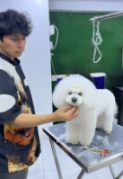

# **Capítulo I: Introducción**

## 1.1. Startup Profile

### 1.1.1. Descripción de la Startup

“Pawfect Care” es una plataforma integral destinada a la gestión veterinaria y a la visualización de historiales clínicos. La idea fundamental detrás de esta plataforma es simplificar y optimizar la administración de diversos aspectos relacionados con el cuidado de las mascotas. Esto incluye la gestión de usuarios, clientes, productos y servicios, así como la organización de historiales clínicos. El objetivo es proporcionar una herramienta que facilite tanto a los propietarios de mascotas como a los veterinarios en el manejo de la información y las tareas diarias.

- **Misión:** Nuestra misión es mejorar la calidad de vida de las mascotas y sus dueños, ofreciendo una plataforma que simplifique la gestión veterinaria y el acceso a la información de salud de las mascotas

- **Visión:** Ser la plataforma líder en la gestión veterinaria, reconocida por su eficiencia, confiabilidad y facilidad de uso.

### 1.1.2. Perfiles de integrantes del equipo

|                    Photo                        |                                                                                                                                                                                                                                                                                                    Description                                                                                                                                                                                                                                                                                                    |
| :------------------------------------------------: | :---------------------------------------------------------------------------------------------------------------------------------------------------------------------------------------------------------------------------------------------------------------------------------------------------------------------------------------------------------------------------------------------------------------------------------------------------------------------------------------------------------------------------------------------------------------------------------------------------------------: |
|  |                                                                         Soy estudiante del 6to ciclo de la carrera de Ingeniería de Software. Decidí estudiar esta carrera porque desde pequeño me llamaba la atención el funcionamiento de una computadora y los procesos que conlleva. Me gusta practicar deportes de contacto, salir a pasear y sobre todo me encanta ser Groomer canino y trabajar con mascotas.                                                                                                                         |

|   | Soy estudiante de la carrera de Ingeniería de Software. Tengo interés en aprender sobre nuevas tecnologías, el desarrollo web y de aplicaciones. Me considero una persona que le gusta apoyar en proyectos innovadores que me permitan crecer como persona.                                                                        |
|   | Mi nombre es Jose Gutierrez, tengo 20 años, actualmente me encuentro cruzando mi 5to ciclo de la carrera de ingeniería de software en la UPC. Me gusta jugar videojuegos y practicar natación, soy un gran aficionado de la tecnología y del ensamblaje de computadoras. Me considero una persona dispuesta siempre a aprender tecnologías nuevas, creativa y responsable. |
|    |                                                                                                                              Mi nombre es David Alexander, un entusiasta de la tecnología. Actualmente me encuentro en el 6to ciclo de la Ingeniería de software en la UPC. Fuera de las aulas, me divierto explorando los límites del desarrollo frontend. La programación me permite crear soluciones innovadoras. Soy un autodidacta nato, siempre ávido de aprender nuevas herramientas y lenguajes de programación.                                                                                                                              |
|        |  Mi nombre es Gabriel Zuniga, estudiante de la carrera de Ingeniería de Software cursando el 6to ciclo. Tengo interés en lo relacionado con el desarrollo funcional multiplataforma, enfocándome en la parte del backend. La mayoría de mi tiempo es invertido en enriquecer mis conocimientos en todo lo relacionado a mi perfil profesional.   |

## 1.2. Solution Profile

Pawfect Care es una aplicación diseñada específicamente para el uso en clínicas veterinarias, enfocada en la gestión interna de todas sus operaciones y en facilitar el acceso a la información clínica para los dueños de las mascotas. Esta aplicación no solo permite a los veterinarios manejar de manera más eficiente y organizada los historiales clínicos de sus pacientes, sino que también ofrece herramientas para gestionar recordatorios, controlar el inventario de productos y realizar otras tareas esenciales para el funcionamiento de la veterinaria.
La interfaz de Pawfect Care ha sido diseñada para ser intuitiva y amigable, lo que permite a los veterinarios llevar un control detallado y preciso de cada aspecto de su práctica sin complicaciones. Además, la aplicación proporciona una funcionalidad adicional: la posibilidad de publicar las historias clínicas para que los dueños de las mascotas puedan acceder a ellas cuando lo necesiten. Esto garantiza que los propietarios estén siempre informados sobre el estado de salud de sus mascotas y puedan consultar los detalles médicos en cualquier momento, mejorando así la comunicación y la transparencia entre la clínica y sus clientes.

### 1.2.1. Antecedentes y problemática

Con la finalidad de poder conocer y comprender con mayor precisión las necesidades de nuestros usuarios, en este caso universitarios, hemos hecho un estudio por medio de la técnica 5w’s & 2H’s. Según el sitio web Rockcontent (2019) 5w’s & 2H’s es una de las metodologías de gestión empresarial más utilizadas. Puede aplicarse en muchos momentos, empresas y proyectos, ayuda a responder una serie de preguntas decisivas para hacer que las acciones de un negocio sean más estratégicas y precisas. Sin más preámbulos, por siguiente mostraremos la información que hemos logrado recopilar por medio de esta técnica:

#### Uso de la técnica The 5'W's w Y 2'H's

| LAS 5W y 2H | Pregunta                                                | Descripción                                                                                                                                                                                                                                                                                                                                                                                                                                                                                                          |
| ----------- | ------------------------------------------------------- | -------------------------------------------------------------------------------------------------------------------------------------------------------------------------------------------------------------------------------------------------------------------------------------------------------------------------------------------------------------------------------------------------------------------------------------------------------------------------------------------------------------------- |
| What?        | ¿Cuál es el problema?                                     | El problema radica en la ausencia de una aplicación que sea tanto intuitiva como fácil de usar en el entorno veterinario, y que, además, permita integrar y gestionar eficazmente los múltiples aspectos que involucra esta práctica                                                                                                                   |
| When?       | ¿Cuándo sucede el problema?                                   | El problema surge cuando las clínicas veterinarias carecen de una aplicación que sea intuitiva y sencilla de usar, lo que dificulta la integración y gestión eficiente de los diversos aspectos necesarios para su funcionamiento diario.                                                                                                                                                                                                            |
| Where?       | ¿Dónde sucede el problema?                             | El problema ocurre en las clínicas veterinarias, donde la falta de una aplicación complica la integración y gestión de las múltiples áreas necesarias para su funcionamiento. Esto no solo afecta a los veterinarios en su labor diaria, sino que también impacta a los dueños de mascotas, quienes necesitan una forma sencilla de acceder a la información y los servicios relacionados con la salud de sus animales.                                                                                                                                            |
| Why?      | ¿Por qué sucede el problema?                               | El problema se debe al desconocimiento de aplicaciones que estén específicamente diseñadas para atender las necesidades complejas y diversas de una clínica veterinaria. Existen muchas aplicaciones pero no son lo suficientemente flexibles o integrales para abarcar todos los campos necesarios, como la gestión de historiales clínicos, el control de inventario, y la comunicación con los dueños de las mascotas. Esto crea dificultades tanto para los veterinarios, que se ven obligados a utilizar múltiples herramientas o procesos manuales, como para los dueños de mascotas, que enfrentan limitaciones en el acceso a la información relevante.                                                                                                                                                                                        |
| Who?        | ¿Qué llevara a las personas a usar nuestro producto?                         | Las personas optarán por Pawfect Care debido a la facilidad con la que podrán completar los campos necesarios, la amplia difusión que la aplicación tendrá en redes sociales, y especialmente por lo sencillo que resulta rellenar las historias clínicas sin la complicación de tener que llenar campos obligatorios. |
| How?        | ¿En qué condiciones los clientes usaran nuestro producto?               | Los clientes utilizarán nuestro producto en condiciones donde necesiten una solución eficiente y fácil de usar para gestionar las operaciones de su clínica veterinaria. Esto incluye situaciones en las que buscan una herramienta que simplifique el manejo de historiales clínicos, controle el inventario, y facilite la comunicación con los dueños de las mascotas. Además, lo usarán cuando requieran una aplicación que les permita acceder y compartir información médica de manera rápida y sin complicaciones, especialmente en un entorno donde el tiempo y la precisión son esenciales.                                                                                                                                                                                  |
| How Much?   | ¿Con qué frecuencia o en qué cantidad se utilizará nuestro producto? |  Nuestro producto está diseñado para ser utilizado diariamente por las clínicas veterinarias. El sistema de gestión clínica se utilizará en la mayoría de las interacciones clínicas, desde la admisión de pacientes hasta el seguimiento post-tratamiento. Dado que el acceso a la información clínica y la gestión de citas es una necesidad recurrente, esperamos que el personal utilice la plataforma constantemente a lo largo del día. Además, los dueños de mascotas podrán acceder a la información relevante de sus mascotas, lo que también incentivará un uso frecuente por parte de ellos, especialmente para verificar el historial clínico y programar citas.                                                                                             |

## 1.2.2. Lean UX Process.

#### 1.2.2.1. Lean UX Problem Statements.

La aplicación Pawfect Care busca resolver la necesidad de una herramienta integral que facilite la gestión diaria de las clínicas veterinarias. Al ofrecer una interfaz intuitiva y fácil de usar, la aplicación trata de eliminar las complejidades y dificultades asociadas con la administración de múltiples aspectos de la práctica veterinaria en un solo lugar, permitiendo que tanto veterinarios como propietarios de mascotas tengan acceso rápido y sencillo a la información relevante.

#### 1.2.2.2. Lean UX Assumptions.

Para desarrollar la aplicación Pawfect Care, partimos de varias suposiciones clave que guiarán nuestro proceso de diseño y desarrollo. Estas suposiciones están basadas en una comprensión inicial de las necesidades y problemas de nuestros usuarios objetivo, así como en los resultados esperados para el negocio. A medida que avanzamos en el desarrollo, estas suposiciones se validarán mediante pruebas y retroalimentación continua para asegurar que la solución propuesta cumpla con las expectativas y resuelva eficazmente los desafíos identificados.

**Features:**

- Sistema de gestión de citas para facilitar la organización del tiempo en las clínicas.
- Almacenamiento y visualización de historiales clínicos de las mascotas de forma rápida y segura.
- Notificaciones automáticas para recordatorios de vacunas, tratamientos o revisiones.
- Sección para la venta de productos veterinarios, integrando un catálogo accesible para los clientes.
- Sistema de reportes de ingresos, control de inventario, y análisis de datos para mejorar la eficiencia administrativa.
- Interfaz intuitiva y adaptable para ser utilizada tanto en dispositivos móviles como en computadoras.

**Business Outcomes:**

- Aumento de la eficiencia operativa de las clínicas, reduciendo el tiempo en tareas administrativas.
- Mejora en la satisfacción del cliente, permitiendo un acceso rápido a la información médica de sus mascotas y facilitando la interacción con la clínica.
- Generación de ingresos adicionales a través de suscripciones premium que ofrezcan funciones avanzadas y comisiones por la venta de productos veterinarios.
- Reducción de errores y tiempos de espera en la gestión clínica, lo que aumentará la retención de clientes y atraerá nuevos usuarios.

**Users:**
- **Segmento 1 – Médicos Veterinarios:** Clínicas veterinarias de diversos tamaños, desde consultorios pequeños hasta grandes centros con múltiples especialistas. Este segmento busca mejorar la gestión diaria de sus clínicas, optimizando la administración de información médica, inventarios y citas, para aumentar su productividad y ofrecer un mejor servicio a sus clientes.

- **Segmento 2 – Dueños de Mascotas:** Propietarios que necesitan gestionar de manera eficiente la salud de sus mascotas, incluyendo jóvenes acostumbrados a usar aplicaciones móviles y también aquellos menos familiarizados con la tecnología pero que desean una forma más accesible de organizar la información médica de sus animales.

**User Outcomes & Benefits:**

- Reducción de tiempo en la gestión de citas y actualización de historiales médicos.
- Mejor organización en el manejo de inventarios y productos.
- Mejora en la relación con los clientes, ofreciendo un acceso directo a la información de salud de sus mascotas.
- Simplificación en la administración de las clínicas veterinarias, reduciendo errores y tiempos de espera.

**User Assumptions:**

- **¿Quién es el usuario?**
  os usuarios principales son las clínicas veterinarias y los dueños de mascotas. 

- **¿Dónde encaja la aplicación en su vida?**
  La aplicación se integra en la rutina diaria de las clínicas veterinarias y en la vida cotidiana de las mascotas, facilitando su tratamiento y cuidado. 

- **¿Qué problemas tienen nuestros usuarios y como se puede resolver?**
  Los usuarios enfrentan la falta de una aplicación especializado para la gestión integral de clínicas veterinarias y la ausencia de un portal donde se pueda acceder fácilmente a la historia clínica de una mascota. Nuestra aplicación resuelve estos problemas proporcionando una plataforma única para administrar todos los aspectos de la clínica y facilitar el acceso a la información médica. 

- **¿Dónde y cuándo es usada nuestra aplicación?**
  La aplicación se utiliza principalmente en clínicas veterinarias. Los momentos clave para su uso son durante las consultas veterinarias y cuando los dueños deciden cambiar de veterinario y necesitan trasladar el historial clínico o el registro de vacunas a otro establecimiento. 

- **¿Qué características son importantes?**
  Las características esenciales incluyen una interfaz fácil de usar en dispositivos móviles, computadoras y laptops. Además, es crucial la eliminación de campos innecesarios u obligatorios que puedan complicar el proceso de registro. 

- **¿Cómo debe verse nuestra aplicación y como debe comportarse?**
 Nuestra aplicación debe tener un diseño funcional y amigable, tanto para veterinarios como para dueños de mascotas. Debe permitir un registro rápido y sencillo de nuevos pacientes y la actualización de historiales clínicos, evitando campos obligatorios que no aporten valor al proceso de registro y atención. 

**Business Assumptions**

- Los veterinarios y asistentes están dispuestos a adoptar herramientas digitales si mejoran la eficiencia en sus clínicas.
- Los dueños de mascotas valorarán una aplicación que les permita acceder a la información de salud de sus animales en cualquier momento.
- Las clínicas veterinarias estarán dispuestas a pagar por suscripciones premium o herramientas avanzadas de gestión si aumentan la productividad.
- El mercado de clínicas veterinarias aún utiliza métodos manuales o desactualizados, lo que genera ineficiencias que la aplicación puede resolver.
- Habrá una aceptación de la aplicación tanto por usuarios jóvenes familiarizados con la tecnología como por aquellos menos habituados al uso de herramientas digitales.

#### 1.2.2.3. Lean UX Hypothesis Statements.

Para asegurar que nuestra solución esté alineada con las necesidades y expectativas de nuestros usuarios, hemos formulado las siguientes hipótesis utilizando el enfoque Lean UX. Este enfoque nos permitirá validar nuestras suposiciones a través de iteraciones constantes y ajustes basados en el feedback de los usuarios

**Creemos que** si diseñamos una aplicación intuitiva que permita a los veterinarios gestionar historiales clínicos y recordatorios de manera eficiente.
**Sabremos** que hemos tenido éxito cuando observemos un aumento en la eficiencia operativa y una reducción en el tiempo dedicado a tareas administrativas en las clínicas veterinarias
**cuando** las clínicas adopten nuestra aplicación y reporten mejoras en su flujo de trabajo diario, habremos validado nuestra hipótesis.

**Creemos que** lal ofrecer una plataforma que facilite el acceso a la historia clínica de las mascotas para los dueños
**Sabremos** que nuestra solución es efectiva cuando recibamos comentarios positivos de los usuarios sobre la facilidad de acceso y la utilidad de la información médica compartida
**cuando** los dueños de mascotas utilicen la aplicación para consultar y manejar la salud de sus animales sin problemas, habremos confirmado que estamos resolviendo una necesidad real.

**Creemos que** que si eliminamos los campos obligatorios innecesarios y simplificamos el proceso de registro en la aplicación.
**Sabremos** que hemos logrado nuestro objetivo cuando los usuarios experimenten una mayor satisfacción y una reducción en los errores de entrada de datos.
**cuando** tanto veterinarios como propietarios de mascotas reporten una experiencia de usuario fluida y sin frustraciones, habremos validado que nuestra aplicación cumple con las expectativas de simplicidad y funcionalidad.

#### 1.2.2.4. Lean UX Canvas

<table border="1" cellpadding="10" cellspacing="0">
    <tr>
        <td><strong>Lean UX Canvas</strong></td>
        <td><strong>Fecha:</strong> 31/08/2024</td>
        <td><strong>Primera Iteración</strong></td>
    </tr>
    <tr>
        <td>
            <strong>Business Problem</strong> 
            La gestión de clínicas veterinarias enfrenta desafíos significativos debido al uso de métodos manuales o sistemas desactualizados, lo que resulta en ineficiencias operativas, errores en la documentación y una experiencia insatisfactoria tanto para los veterinarios como para los propietarios de mascotas. La falta de una herramienta integral complica la administración de citas, historiales clínicos y la venta de productos veterinarios.
        </td>
        <td>
            <strong>Solutions</strong> 
            - Gestión de citas. 
            - Almacenamiento y visualización de historiales clínicos. 
            - Notificaciones automáticas para recordatorios de vacunas y tratamientos. 
            - Venta de productos veterinarios. 
            - Reportes de ingresos y control de inventario.
        </td>
        <td>
            <strong>Business Outcomes</strong> 
            - Incremento de la eficiencia operativa en las clínicas veterinarias. 
            - Mejora en la satisfacción del cliente con acceso rápido a la información médica. 
            - Generación de ingresos adicionales a través de suscripciones premium y ventas de productos. 
            - Reducción de errores y tiempos de espera en la gestión clínica.
        </td>
    </tr>
    <tr>
        <td>
            <strong>Users</strong> 
            - <strong>Segmento 1 – Médicos Veterinarios:</strong> Clínicas de diferentes tamaños que necesitan mejorar la gestión de información médica, citas e inventarios. 
            - <strong>Segmento 2 – Dueños de Mascotas:</strong> Propietarios que buscan una forma eficiente de gestionar la salud de sus mascotas y acceder a la información médica de manera digital.
        </td>
        <td>
            <strong>Hypotheses</strong> 
            - Creemos que diseñar una aplicación intuitiva para veterinarios mejorará la eficiencia en la gestión clínica. 
            - Sabemos que hemos tenido éxito cuando observamos una mejora en la eficiencia operativa y una reducción en el tiempo dedicado a tareas administrativas. 
            - Creemos que una plataforma que facilite el acceso a la historia clínica para los dueños será bien recibida. 
            - Sabemos que nuestra solución es efectiva cuando recibimos comentarios positivos sobre la facilidad de acceso a la información médica. 
            - Creemos que simplificar el proceso de registro eliminará campos innecesarios y mejorará la experiencia del usuario. 
            - Sabemos que hemos logrado nuestro objetivo cuando reportan una experiencia de usuario fluida y sin frustraciones.
        </td>
        <td>
            <strong>User Outcomes & Benefits</strong> 
            - Reducción del tiempo en la gestión de citas y actualización de historiales. 
            - Mejor organización en inventarios y productos. 
            - Mejora en la relación con los clientes mediante acceso directo a la información médica. 
            - Simplificación en la administración de las clínicas, reduciendo errores y tiempos de espera.
        </td>
    </tr>
    <tr>
        <td>
            <strong>What's the most important thing we need to learn first?</strong> 
            Validar si la aplicación realmente mejora la eficiencia operativa de las clínicas veterinarias y facilita el acceso a la información médica para los dueños de mascotas.
        </td>
        <td colspan="2">
            <strong>What's the least amount of work we need to do to learn the next most important?</strong> 
            Desarrollar un prototipo funcional que permita a un grupo selecto de usuarios (veterinarios y propietarios de mascotas) probar las características clave de la aplicación y proporcionar retroalimentación sobre su efectividad en la mejora de la eficiencia y la satisfacción del usuario.
        </td>
    </tr>
</table>

## 1.3. Segmentos objetivo.

Para asegurar el éxito de Pawfect Care, hemos identificado dos segmentos clave que serán el foco principal de nuestras estrategias de desarrollo y marketing. Estos segmentos representan a nuestros usuarios ideales y nos permitirán adaptar nuestras funcionalidades y servicios a sus necesidades específicas, maximizando así el impacto de la plataforma.

**Segmento Objetivo 1 - Clínicas Veterinarias**

El primer segmento objetivo incluye a las clínicas veterinarias de diversos tamaños, desde pequeñas clínicas independientes hasta grandes centros especializados con múltiples profesionales. Pawfect Care les ofrece una plataforma que simplifica la gestión interna de sus operaciones, permitiendo una mayor eficiencia en la programación de citas, gestión de historiales médicos y la comunicación con los dueños de las mascotas. Estas clínicas buscan una herramienta que facilite el acceso a información clínica y mejore la administración de sus recursos, todo bajo una interfaz intuitiva y accesible. El valor de Pawfect Care radica en su capacidad para optimizar procesos, lo que se traduce en un mejor servicio y atención para los animales.

**Segmento Objetivo 2 - Dueño de Mascotas:**

El segundo segmento está compuesto por los dueños de mascotas, quienes son responsables del bienestar y la salud de sus animales. Este grupo de usuarios busca soluciones prácticas que les permitan manejar de manera eficiente la salud de sus mascotas, incluyendo la programación de citas, acceso a historiales médicos y recordatorios de vacunación. Pawfect Care les proporciona una plataforma que centraliza toda esta información y facilita el acceso desde cualquier dispositivo, brindándoles tranquilidad y control sobre el cuidado de sus animales. La conveniencia y facilidad de uso son elementos clave para este segmento, que espera una experiencia fluida y personalizada.

---
