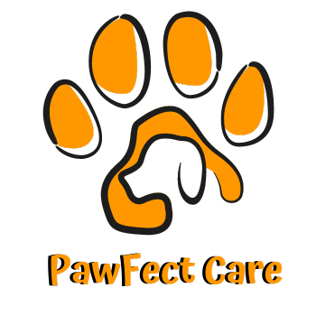
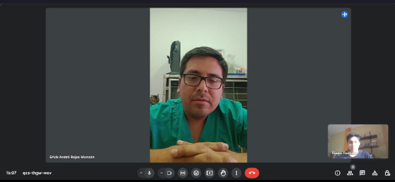

# **Capítulo II: Requirements Elicitation & Analysis**

## 2.1. Competidores.

<table>
    <thead>
        <tr>
            <th>Nombre</th>
            <th>Descripción</th>
        </tr>
    </thead>
    <tbody>
        <tr>
            <td rowspan align="center">VetPraxis
            <td>Es una solución de gestión para clínicas veterinarias, diseñada para optimizar la administración de operaciones diarias. Ofrece funcionalidades que incluyen la gestión de citas, historias clínicas electrónicas, administración de inventario, y facturación. También proporciona herramientas para la comunicación con los clientes y el seguimiento de tratamientos. 
            Página web:<a href="https://vetpraxis.net/"> https://vetpraxis.net/</a>
        </tr>
        <tr>
            <td align="center">VetApp
            <td> Es una plataforma desarrollada para la gestión de clínicas veterinarias. Proporciona características como la programación de citas, el manejo de historias clínicas electrónicas, y la administración de inventario. 
            Página web:<a href="https://vetapp.app/en"> https://vetapp.app/en</a>
        </tr>
        <tr>
           <td rowspan align="center">PetClinic  
           <td>Es una aplicación diseñada para gestionar clínicas veterinarias y consultas de mascotas. Incluye funciones para la gestión de citas, el manejo de historias clínicas electrónicas, y la administración de inventario y facturación. La plataforma está orientada a mejorar la organización y eficiencia dentro de las clínicas, ofreciendo herramientas para el seguimiento de tratamientos y la comunicación con los clientes. PetClinic está adaptada a las necesidades específicas del sector veterinario en Perú. 
           Página web:<a href="https://petclinic.es/"> https://petclinic.es/</a>
    </tbody>
</table>

### 2.1.1. Análisis competitivo.
<table style="width: 100%;">
  <tr>
    <th colspan="6" style="padding: 8px; text-align: center;"> Competitive Analysis Landscape</th>
  </tr>
  <tr>
    <td>¿Por qué llevar a cabo este análisis?</td>
    <td colspan="5">Para comparar las características tanto internas como externas de los productos que compiten con nosotros.</td>
  </tr>
  <tr>
    <td colspan="2"></td>
    <td align="center">Pawfect Care </td>
    <td align="center">VetPraxis </td>
    <td align="center">VetApp </td>
    <td align="center">PetClinic </td> 
  </tr>
  <tr>
    <td rowspan="2" align="center">Perfil</td>
    <td align="center">Overview</td>
    <td>
    Plataforma para clínicas veterinarias que simplifica la gestión de historiales clínicos, recordatorios e inventarios con una interfaz fácil de usar.</td>
    <td>Software de gestión veterinaria que optimiza citas, historiales clínicos y facturación con una interfaz amigable.</td>
    <td>Aplicación móvil para gestionar citas, recordatorios, historiales médicos de mascotas, facilitando la comunicación entre veterinarios y propietarios.</td>
    <td>Plataforma que integra administración de historiales clínicos, citas e inventario para mejorar la eficiencia en clínicas veterinarias.</td>
  </tr>
  <tr>
    <td>Ventaja competitiva ¿Qué valor ofrece a los clientes?</td>
    <td>Interfaz intuitiva que facilita la gestión de historiales, recordatorios e inventario.</td>
    <td>Gestión integral de citas, historiales y facturación con una interfaz amigable.</td>
    <td>Gestión móvil de citas e historiales médicos que mejora la comunicación entre veterinarios y propietarios.</td>
    <td>Plataforma única para administrar historiales, citas e inventario en clínicas veterinarias.</td>
  </tr>
  <tr>
    <td rowspan="2" align="center">Perfil de Marketing</td>
    <td>Mercado objetivo</td>
    <td>
    Clínicas veterinarias y dueños de mascotas.</td>
    <td>Clínicas veterinarias medianas y grandes.</td>
    <td>Propietarios de mascotas y veterinarios móviles.</td>
    <td>Clínicas veterinarias pequeñas y medianas.</td>
  </tr>
  <tr>
    <td>Estrategias de marketing</td>
    <td>Redes sociales y colaboraciones con clínicas.</td>
    <td>Marketing de contenido y webinars.</td>
    <td>Redes sociales.</td>
    <td>Publicidad dirigida y promociones.</td>
  </tr>
  <tr>
    <td rowspan="3" align="center">Perfil del Producto</td>
    <td>Productos & Servicios</td>
    <td>Gestión de historiales clínicos, recordatorios e inventarios.</td>
    <td>Gestión de citas, historiales clínicos y facturación.</td>
    <td>Aplicación móvil para gestionar citas e historiales médicos.</td>
    <td>Plataforma de administración de historiales, citas e inventario.</td>
  </tr>
  <tr>
    <td>Precios & Costos</td>
    <td>Suscripción mensual con diferentes niveles.</td>
    <td>Licencia de software con tarifas anuales.</td>
    <td>Descarga gratuita con compras dentro de la app.</td>
    <td>Suscripción con tarifas basadas en el tamaño de la clínica.</td>
  </tr>
  <tr>
    <td>Canales de distribución (Web y/o Móvil)</td>
    <td>Web y móvil.</td>
    <td>Web.</td>
    <td>Móvil (App stores)</td>
    <td>Web.</td>
  </tr>
  <tr>
    <td rowspan="4" align="center">Análisis SWOT</td>
    <td>Fortalezas</td>
    <td>Interfaz intuitiva y fácil de usar; integración de múltiples funciones.</td>
    <td>Gestión integral y amigable; adaptado para clínicas medianas y grandes.</td>
    <td>Acceso móvil conveniente; mejora la comunicación con propietarios de mascotas.</td>
    <td>Plataforma integral para clínicas pequeñas y medianas; fácil de usa.</td>
  </tr>
  <tr>
    <td>Debilidades</td>
    <td>Dependencia de la adopción por parte de clínicas veterinarias.</td>
    <td>Costos potencialmente altos para pequeñas clínicas.</td>
    <td>Funcionalidades limitadas comparadas con plataformas completas.</td>
    <td>Limitado a clínicas de menor tamaño; menos atractivo para grandes clínicas.</td>
  </tr>
  <tr>
    <td>Oportunidades</td>
    <td>
    Expansión en el mercado de clínicas veterinarias pequeñas y medianas.</td>
    <td>Crecimiento en el segmento de clínicas grandes y asociaciones veterinarias.</td>
    <td>Expansión en el mercado de usuarios móviles y propietarios de mascotas.</td>
    <td>Penetración en el mercado de clínicas veterinarias pequeñas</td>
  </tr>
  <tr>
    <td>Amenazas</td>
    <td>Competencia de otras plataformas con características similares.</td>
    <td>Competencia con soluciones de bajo costo o gratuitas.</td>
    <td>Alta competencia en aplicaciones móviles para la salud de mascotas.</td>
    <td>Competencia de soluciones más avanzadas para clínicas grandes.</td>
  </tr>
<table>

### 2.1.2. Estrategias y tácticas frente a competidores.
<strong> Estrategias:</strong> 
- <strong>Interfaz Intuitiva y Fácil de Usar:</strong> Pawfect Care se diferenciará por su interfaz amigable y fácil de usar, lo que simplifica la gestión diaria para los veterinarios y dueños de mascotas. Esto contrasta con muchas soluciones existentes que pueden ser complicadas o difíciles de navegar.
- <strong>Características Exclusivas:</strong> La aplicación ofrecerá características únicas como la personalización de historiales clínicos y recordatorios adaptados a las necesidades específicas de cada clínica y propietario de mascotas, lo cual no está comúnmente disponible en otras plataformas.
- <strong>Valor Agregado:</strong> Se enfocará en agregar valor a través de un sistema integral que combina gestión de citas, control de inventarios, notificaciones automáticas y una sección para la venta de productos veterinarios, abordando múltiples necesidades en una sola plataforma.
- <strong>Adaptabilidad: </strong>Pawfect Care se adaptará a diferentes tamaños de clínicas y será accesible tanto en dispositivos móviles como en computadoras, lo que la convierte en una solución flexible para diversas necesidades.

<strong>Tácticas: </strong> 
- <strong>Demostraciones Personalizadas:</strong> Se organizarán demostraciones en vivo en clínicas veterinarias para mostrar de manera práctica cómo la plataforma mejora la eficiencia y facilita la gestión clínica. Estas demostraciones permitirán a los clientes potenciales experimentar la funcionalidad de Pawfect Care en su entorno de trabajo.
- <strong>Períodos de Prueba Gratuita:</strong> Se ofrecerán períodos de prueba gratuita para que las clínicas puedan experimentar los beneficios de la aplicación sin compromiso. Esto permitirá a los usuarios evaluar la utilidad y el impacto de la plataforma en su operación diaria.
- <strong>Testimonios y Casos de Éxito:</strong> Se recopilarán y publicarán testimonios y casos de éxito de usuarios satisfechos que hayan experimentado mejoras significativas en su gestión veterinaria. Estos testimonios se utilizarán en campañas de marketing, en el sitio web de la aplicación y en materiales promocionales para construir credibilidad y atraer nuevos clientes.
-<strong> Soporte Proactivo y Capacitación:</strong> Se proporcionará soporte proactivo y capacitación personalizada para ayudar a las clínicas a integrar la plataforma de manera eficiente. Esto asegurará que los usuarios obtengan el máximo provecho de las características avanzadas y reduzcan el tiempo de adaptación.
- <strong>Optimización Continua:</strong> Se implementará un proceso de retroalimentación continua para identificar áreas de mejora y responder rápidamente a las necesidades cambiantes del mercado. Esto permitirá a Pawfect Care mantenerse a la vanguardia y adaptarse a nuevas tendencias y demandas.
- <strong>Partnerships Estratégicos:</strong> Se explorarán asociaciones estratégicas con proveedores de productos veterinarios y organizaciones de salud animal para ampliar la red de distribución y aumentar la visibilidad de la plataforma.

## 2.2. Entrevistas.

El objetivo de las entrevistas es obtener una comprensión profunda de las experiencias, perspectivas y opiniones de los segmentos de mercado seleccionados. Nuestra meta es recopilar información valiosa que nos permita entender mejor a nuestro público objetivo y mejorar nuestra comprensión de los usuarios. Estas conversaciones nos proporcionarán una visión más clara de las necesidades y deseos de nuestros usuarios, lo que nos ayudará a adaptar nuestros productos o servicios de manera más efectiva a sus requisitos.

### 2.2.1. Diseño de entrevistas.

En esta parte, se han formulado varias preguntas destinadas a nuestros segmentos de interés con el fin de obtener información cualitativa, como opiniones o descripciones. Esta información será crucial para el desarrollo de nuestra solución.

**Preguntas Generales:**

- ¿Cuál es tu nombre?
- ¿Cuántos años tienes?
- ¿Donde resides?
- ¿Cuál es tu ocupación?

**Preguntas para el Segmento Objetivo 1 - Médicos Veterinarios:**

- ¿Conoces alguna aplicación de gestión veterinaria? ¿Cuál es?
- ¿Lo escogieron por alguna razón es especial?
- ¿Fue la primera aplicación que usaron?
- ¿Qué es lo que te gusta de esa aplicación?
- ¿Qué te disgusta de esa aplicación?
- ¿Qué sería una de las cosas que si o si cambiarias?

**Preguntas para el Segmento Objetivo 2 - Dueños de Mascotas:**

- ¿Con que frecuencia vas al veterinario?
- ¿Qué método usas para llevar el control de tu mascota?
- ¿Alguna vez perdiste los documentos?
- ¿En medio de algún tratamiento cambiaste de veterinario?
- ¿Qué opinas de tener la historia clínica en una aplicación?
- ¿Usarías una aplicación como la descrita?

### 2.2.2. Registro de entrevistas.

**Entrevista para el Segmento Objetivo 1 - Médicos Veterinarios:**

---

Entrevista N°1:

**Entrevistada:** Jasmin Flores  
**Sexo:** Femenino  
**Edad:** 26 años 
**Domicilio:** San Miguel 
**Inicio de la Entrevista:** 0:03 
**Duración de la Entrevista:** 4:49 

**Enlace:** <a href="https://upcedupe-my.sharepoint.com/:v:/g/personal/u20221a301_upc_edu_pe/EQ-ZYy2RvYpNgt1Qfy9tHTUByB1wTz3kGVrQscVWHWam9A?nav=eyJyZWZlcnJhbEluZm8iOnsicmVmZXJyYWxBcHAiOiJPbmVEcml2ZUZvckJ1c2luZXNzIiwicmVmZXJyYWxBcHBQbGF0Zm9ybSI6IldlYiIsInJlZmVycmFsTW9kZSI6InZpZXciLCJyZWZlcnJhbFZpZXciOiJNeUZpbGVzTGlua0NvcHkifX0&e=j1mdQ7"> https://upcedupe-my.sharepoint.com/:v:/g/personal/u20221a301_upc_edu_pe/EQ-ZYy2RvYpNgt1Qfy9tHTUByB1wTz3kGVrQscVWHWam9A?nav=eyJyZWZlcnJhbEluZm8iOnsicmVmZXJyYWxBcHAiOiJPbmVEcml2ZUZvckJ1c2luZXNzIiwicmVmZXJyYWxBcHBQbGF0Zm9ybSI6IldlYiIsInJlZmVycmFsTW9kZSI6InZpZXciLCJyZWZlcnJhbFZpZXciOiJNeUZpbGVzTGlua0NvcHkifX0&e=j1mdQ7</a>

**Resumen de la Entrevista**: La doctora Jasmín nos comenta que en la veterinaria donde trabaja, solo tienen un usuario que se puede abrir en varios dispositivos para completar las historias clínicas. Lo que le agrada de esta aplicación es que está diseñada específicamente para el trabajo en veterinarias, con campos adaptados a cada especie o raza. Sin embargo, lo que no le gusta es que, aunque algunos campos no son obligatorios, tener que pasarlos para completar la historia clínica toma más tiempo del que desearía.

---

Entrevista N°2:

**Entrevistado:** Erick Monzón 
**Sexo:** Masculino  
**Edad:** 30 años  
**Domicilio:** Magdalena del Mar 
**Inicio de la Entrevista:** 0:00 
**Duración de la Entrevista:** 6:22 

 

**Enlace:** <a href="https://upcedupe-my.sharepoint.com/:v:/g/personal/u20221a301_upc_edu_pe/EbCW9J6OzTFKoDAHzGbfWzEBpDcpUG7M16WiUuDkC7iPMA"> https://upcedupe-my.sharepoint.com/:v:/g/personal/u20221a301_upc_edu_pe/EbCW9J6OzTFKoDAHzGbfWzEBpDcpUG7M16WiUuDkC7iPMA</a>

**Resumen de la Entrevista:** 	El Doctor Erick nos comenta que en su trabajo utilizan VetPraxis, principalmente porque es una aplicación muy reconocida y muchas veterinarias la emplean. Sin embargo, señala que tiene ciertas deficiencias, especialmente en lo que respecta a la eficiencia. Una de las principales críticas que hace es la inclusión de numerosos campos obligatorios que considera innecesarios, como el teléfono de trabajo, RUC, enlaces a redes sociales como Facebook e Instagram, y otros detalles que realmente no son relevantes para la atención al cliente. Esto se traduce en un proceso de creación de historias clínicas que puede tomar entre 7 y 10 minutos, un tiempo excesivo, especialmente en situaciones de emergencia donde la rapidez es crucial. Erick enfatiza que uno de los cambios que realizaría de manera prioritaria sería la eliminación de estos campos superfluos, para agilizar el proceso y hacer la aplicación más eficiente.

---

Entrevista N°3:

**Entrevistado:** Vanesa Gómez  
**Sexo:** Femenino  
**Edad:** 25 años 
**Domicilio:** Lince  
**Inicio de la Entrevista:** 0:00 
**Duración de la Entrevista:** 6:58 

 

**Enlace:** <a href="https://upcedupe-my.sharepoint.com/:v:/g/personal/u20221a301_upc_edu_pe/EYY7QpIHFxlDh0ksAmySO-kB1yHNDLGTJPHi61WTR0jlWg?nav=eyJyZWZlcnJhbEluZm8iOnsicmVmZXJyYWxBcHAiOiJPbmVEcml2ZUZvckJ1c2luZXNzIiwicmVmZXJyYWxBcHBQbGF0Zm9ybSI6IldlYiIsInJlZmVycmFsTW9kZSI6InZpZXciLCJyZWZlcnJhbFZpZXciOiJNeUZpbGVzTGlua0NvcHkifX0&e=JeOE4m"> https://upcedupe-my.sharepoint.com/:v:/g/personal/u20221a301_upc_edu_pe/EYY7QpIHFxlDh0ksAmySO-kB1yHNDLGTJPHi61WTR0jlWg?nav=eyJyZWZlcnJhbEluZm8iOnsicmVmZXJyYWxBcHAiOiJPbmVEcml2ZUZvckJ1c2luZXNzIiwicmVmZXJyYWxBcHBQbGF0Zm9ybSI6IldlYiIsInJlZmVycmFsTW9kZSI6InZpZXciLCJyZWZlcnJhbFZpZXciOiJNeUZpbGVzTGlua0NvcHkifX0&e=JeOE4m</a>

**Resumen de la Entrevista:** La doctora Vanesa comenta que en su trabajo actual utilizan VetPraxis, principalmente porque es la aplicación más conocida entre las veterinarias. Sin embargo, en su trabajo anterior, usaban fichas en papel, que luego archivaban en un Excel donde guardaban el número de historia clínica y el nombre de la mascota para facilitar la búsqueda posterior. Al igual que el doctor Erick, Vanesa no está satisfecha con los campos innecesarios que VetPraxis requiere, ya que le toma entre 10 y 15 minutos crear una historia clínica, lo cual considera excesivo. En su anterior trabajo, también encontraba ineficiente el método físico, ya que la letra a veces no era legible o las historias se traspapelaban, lo que causaba molestias a los clientes. Vanesa cambiaría estos campos innecesarios que ralentizan el proceso de creación de historias clínicas en VetPraxis.

**Entrevista para el Segmento Objetivo 2 - Dueños de Mascotas:**

---
Entrevista N°1:

**Entrevistado:** Sebastián Silva 
**Sexo:** Masculino 
**Edad:** 20 años 
**Domicilio:** San Luis  
**Inicio de la Entrevista:** 0:00 
**Duración de la Entrevista:** 6:58 

 

**Enlace:** <a href="https://upcedupe-my.sharepoint.com/:v:/g/personal/u20221a301_upc_edu_pe/Ec1XInM48xNOvR2jbzHkwuABf9CG5aosdZClZOwqh0nyYw"> https://upcedupe-my.sharepoint.com/:v:/g/personal/u20221a301_upc_edu_pe/Ec1XInM48xNOvR2jbzHkwuABf9CG5aosdZClZOwqh0nyYw</a>

**Resumen de la Entrevista:** Sebastián nos comenta que lleva a su mascota al veterinario entre una y dos veces al año, aunque si su gato presentara algún malestar, lo llevaría con mayor frecuencia. Con su perro, solía ir una vez a la semana debido a una infección en el oído. Sebastián mencionó que no recuerda dónde dejó la carpeta con toda la documentación médica de su mascota y que le gustaría tener una aplicación donde pudiera almacenar todo el historial médico de sus mascotas. De esta manera, podría actuar más rápidamente en caso de una emergencia, ya que tendría la información disponible en su celular. A pesar de esto, seguiría utilizando el formato físico como respaldo para no perder ningún registro de las atenciones a sus mascotas.

---

Entrevista N°2:

**Entrevistada:** Lucerito Guzmán 
**Sexo:** Femenino 
**Edad:** 22 años 
**Domicilio:** Callao  
**Inicio de la Entrevista:** 0:00 
**Duración de la Entrevista:** 7:10 

 

<a href="https://upcedupe-my.sharepoint.com/:v:/g/personal/u20221a301_upc_edu_pe/EQxyGm-xOy9Gixk9iwdU5-4B7_sjaOllyMTn6QX3f6py1Q?nav=eyJyZWZlcnJhbEluZm8iOnsicmVmZXJyYWxBcHAiOiJPbmVEcml2ZUZvckJ1c2luZXNzIiwicmVmZXJyYWxBcHBQbGF0Zm9ybSI6IldlYiIsInJlZmVycmFsTW9kZSI6InZpZXciLCJyZWZlcnJhbFZpZXciOiJNeUZpbGVzTGlua0NvcHkifX0&e=aOWtoD"> https://upcedupe-my.sharepoint.com/:v:/g/personal/u20221a301_upc_edu_pe/EQxyGm-xOy9Gixk9iwdU5-4B7_sjaOllyMTn6QX3f6py1Q?nav=eyJyZWZlcnJhbEluZm8iOnsicmVmZXJyYWxBcHAiOiJPbmVEcml2ZUZvckJ1c2luZXNzIiwicmVmZXJyYWxBcHBQbGF0Zm9ybSI6IldlYiIsInJlZmVycmFsTW9kZSI6InZpZXciLCJyZWZlcnJhbFZpZXciOiJNeUZpbGVzTGlua0NvcHkifX0&e=aOWtoD</a>

**Resumen de la Entrevista**: Lucerito nos comenta que visita al veterinario con bastante regularidad: una vez cada tres meses por su gata pequeña y una vez al mes para bañar a su perra. Ha tenido problemas con la pérdida de cartillas de vacunación, exámenes y otros documentos relacionados con sus gatas adultas. Además, ha cambiado de veterinaria en dos o tres ocasiones por diferentes razones, lo que le ha generado confusión sobre los productos utilizados en el baño de su perra y la marca de las vacunas administradas. Por estos motivos, está totalmente a favor de utilizar una aplicación como ez.vet, ya que le facilitaría acceder a la historia clínica de sus mascotas.

---

Entrevista N°3:

**Entrevistada:** Estrella Ticona 
**Sexo:** Femenino 
**Edad:** 19 años 
**Domicilio:** Chorrillos  
**Inicio de la Entrevista:** 0:00 
**Duración de la Entrevista:** 7:10 

 

<a href="https://upcedupe-my.sharepoint.com/:v:/g/personal/u20221a301_upc_edu_pe/EZguwL4OXjdNkBzBDBzk7_IBxOR3aJXNCJtxhTOVihRx2w?nav=eyJyZWZlcnJhbEluZm8iOnsicmVmZXJyYWxBcHAiOiJPbmVEcml2ZUZvckJ1c2luZXNzIiwicmVmZXJyYWxBcHBQbGF0Zm9ybSI6IldlYiIsInJlZmVycmFsTW9kZSI6InZpZXciLCJyZWZlcnJhbFZpZXciOiJNeUZpbGVzTGlua0NvcHkifX0&e=YgjxMN"> https://upcedupe-my.sharepoint.com/:v:/g/personal/u20221a301_upc_edu_pe/EZguwL4OXjdNkBzBDBzk7_IBxOR3aJXNCJtxhTOVihRx2w?nav=eyJyZWZlcnJhbEluZm8iOnsicmVmZXJyYWxBcHAiOiJPbmVEcml2ZUZvckJ1c2luZXNzIiwicmVmZXJyYWxBcHBQbGF0Zm9ybSI6IldlYiIsInJlZmVycmFsTW9kZSI6InZpZXciLCJyZWZlcnJhbFZpZXciOiJNeUZpbGVzTGlua0NvcHkifX0&e=YgjxMN</a>

**Resumen de la Entrevista:** Estrella nos comenta que solía visitar al veterinario con frecuencia porque su mascota anterior estaba enferma, y actualmente sigue yendo regularmente. Ella lleva un control manual en papel de su mascota, lo que le ha hecho perder en algunas ocasiones la cartilla de vacunación y los registros de controles. Con su mascota anterior, cambió varias veces de veterinario, ya que no siempre estaba convencida de los diagnósticos, y aunque realizaba los exámenes, solo recibía la interpretación de los resultados, sin los informes, lo que la obligaba a repetir los exámenes al cambiar de veterinario.

Le parece excelente la idea de tener una función como la mencionada en el proyecto, ya que esto le evitaría ciertos inconvenientes al llevar a sus mascotas al veterinario. Está completamente segura de que usaría la aplicación descrita en el proyecto.

---
### 2.2.3. Análisis de entrevistas.

***Segmento 1: Médicos Veterinarios***

- El 100% de los entrevistados utilizan software de gestión en sus clínicas veterinarias. Dos de ellos (66.7%) emplean VetPraxis debido a su reconocimiento en el mercado, mientras que uno (33.3%) utiliza otro software específico para veterinarias.
- El 100% de los veterinarios expresaron preocupaciones sobre el tiempo que toma completar las historias clínicas. El 66.7% de ellos reportaron que el proceso puede tomar entre 7 y 15 minutos, lo cual consideran excesivo. Esto destaca la necesidad de soluciones más eficientes.
- El 100% de los entrevistados mencionaron insatisfacción con la eficiencia del software que utilizan. Todos ellos señalaron la presencia de campos innecesarios que complican el proceso de creación de historias clínicas.
- El 33.3% de los entrevistados aprecian que el software esté adaptado a las necesidades específicas de las veterinarias, con campos diseñados para cada especie o raza. Sin embargo, incluso en estos casos, la eficiencia sigue siendo una preocupación.

***Segmento 2: Dueños de Mascotas***

- El 50% de los entrevistados lleva a sus mascotas al veterinario entre una y dos veces al año, generalmente por chequeos rutinarios o situaciones de salud menores. El otro 50% visita al veterinario con mayor regularidad, cada tres meses para una gata y una vez al mes para bañar a su perra. Esto sugiere que el uso de servicios veterinarios puede variar considerablemente según las necesidades específicas de la mascota. 
- Todos los entrevistados tienen dificultades para mantener organizados los documentos médicos de sus mascotas. Uno de los participantes no recuerda dónde guardó la carpeta con la documentación médica, mientras que otro ha perdido documentos importantes como cartillas de vacunación y exámenes. 
- El 66.7% de los entrevistados ha cambiado de veterinario alguna vez, lo que ha generado confusión sobre los productos o medicamentos utilizados en sus mascotas.

## 2.3. Needfinding.

El Needfinding es una metodología cualitativa centrada en captar las opiniones y sentimientos de los usuarios. Su propósito, como su nombre sugiere, es identificar, explorar, analizar, descubrir, y valorar de manera sencilla las necesidades que pueden dirigir y orientar el desarrollo y diseño de cualquier proyecto.

En este proyecto, hemos optado por interactuar con posibles usuarios a través de entrevistas y cuestionarios. A continuación, se presentan diversos análisis derivados de estas entrevistas en los siguientes artefactos.

### 2.3.1. User Personas.

- **Segmento Objetivo 1 - Médicos Veterinarios**

 

- **Segmento Objetivo 2 - Dueños de Mascotas**

 

### 2.3.2. User Task Matrix.

***Segmento 1: Médicos Veterinarios***

|**Vanesa Gómez Suarez**|||
| :-: | :- | :- |
|**Actividades**|**Frecuencia**|**Importancia**|
|Elaborar y mantener actualizadas las historias clínicas de los pacientes.|Alta|Alta|
|Rellenar los campos requeridos en el software.|Alta|Alta|
|Acceder y buscar los registros médicos de las mascotas.|Alta|Alta|
|Programar y administrar citas veterinarias.|Media|Alta|
|Guardar y organizar los documentos médicos.|Media|Media|
|Solucionar problemas relacionados con la legibilidad y el extravío de documentos.|Media|Alta|
|Optimizar la eficiencia en el proceso de documentación.|Media|Alta|
|
Atender a los clientes de forma rápida y eficiente.

|Alta|Alta|

***Segmento 2: Dueños de Mascotas***

|**Lucerito Guzmán León**|||
| :-: | :- | :- |
|**Actividades**|**Frecuencia**|**Importancia**|
|Llevar a sus mascotas al veterinario.|Alta|Alta|
|Agendar y administrar citas veterinarias.|Alta|Alta|
|Mantener y ordenar la documentación médica de sus mascotas.|Alta|Alta|
|Consultar los historiales clínicos de sus mascotas.|Media|Alta|
|Cambiar de veterinario cuando sea necesario.|Baja|Media|
|Responder rápidamente ante emergencias médicas.|Media|Alta|
|Guardar y respaldar la información médica en formatos digital y físico.|Alta|Alta|
---

### 2.3.3. User Journey Mapping.

- **Primer segmento: Médicos Veterinarios**

  

- **Segundo segmento: Dueños de Mascotas**

  

### 2.3.4. Empathy Mapping.

- **Primer segmento: Médicos Veterinarios**
  

- **Segundo segmento: Dueños de Mascotas**
  

### 2.3.5. As-is Scenario Mapping.

- **Primer segmento: Médicos Veterinarios**
  

- **Segundo segmento: Dueños de Mascotas**
  

## 2.4. Ubiquitous Language.

En esta sección se presenta un glosario de términos y conceptos utilizados en el dominio veterinario, específicos al área de especialidad y sector en el que se encuentra el problema y la solución. El propósito de este glosario es asegurar una comunicación clara y efectiva entre todos los miembros del equipo y los stakeholders, evitando ambigüedades. Este glosario se mantendrá actualizado a lo largo del proyecto.

**Términos del Glosario**

- **Clinical History (Historia Clínica):**
  Registro detallado de la salud de un paciente veterinario, incluyendo diagnósticos, tratamientos, y observaciones previas.
- **Diagnosis (Diagnóstico):**
  Proceso de identificación de una enfermedad o condición en un paciente basado en la evaluación de los síntomas y pruebas.
- **Treatment Plan (Plan de Tratamiento):**
  Conjunto de acciones médicas recomendadas por el veterinario para tratar la enfermedad o condición del paciente.
- **Follow-up (Seguimiento):**
  Evaluación continua del paciente después de un tratamiento para asegurarse de que se esté recuperando adecuadamente.
- **Preventive Care (Cuidado Preventivo):**
  Medidas y prácticas aplicadas para prevenir enfermedades en los animales, como vacunaciones y desparasitaciones.
- **Consultation (Consulta):**
  Sesión en la que un veterinario examina al paciente, discute síntomas con el propietario, y proporciona un diagnóstico o plan de tratamiento.
- **Pet Owner (Propietario de Mascota):**
  Persona responsable del cuidado y bienestar de una mascota, y quien toma decisiones sobre su salud y tratamiento.
- **Surgical Procedure (Procedimiento Quirúrgico):**
  Intervención médica que requiere una operación para tratar o corregir un problema de salud en el paciente.
- **Emergency Care (Cuidado de Emergencia):**
  Atención veterinaria proporcionada en situaciones críticas donde la vida del paciente está en riesgo.
- **Veterinary Clinic (Clínica Veterinaria):**
  Establecimiento donde se brindan servicios de salud a los animales, incluyendo consultas, tratamientos y cirugías.

---
