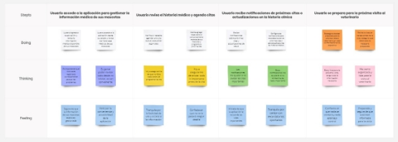
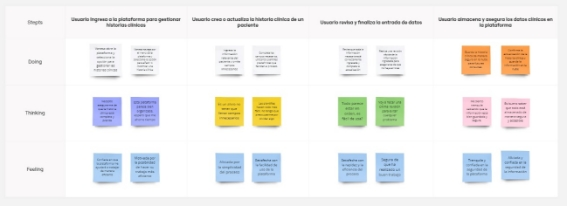
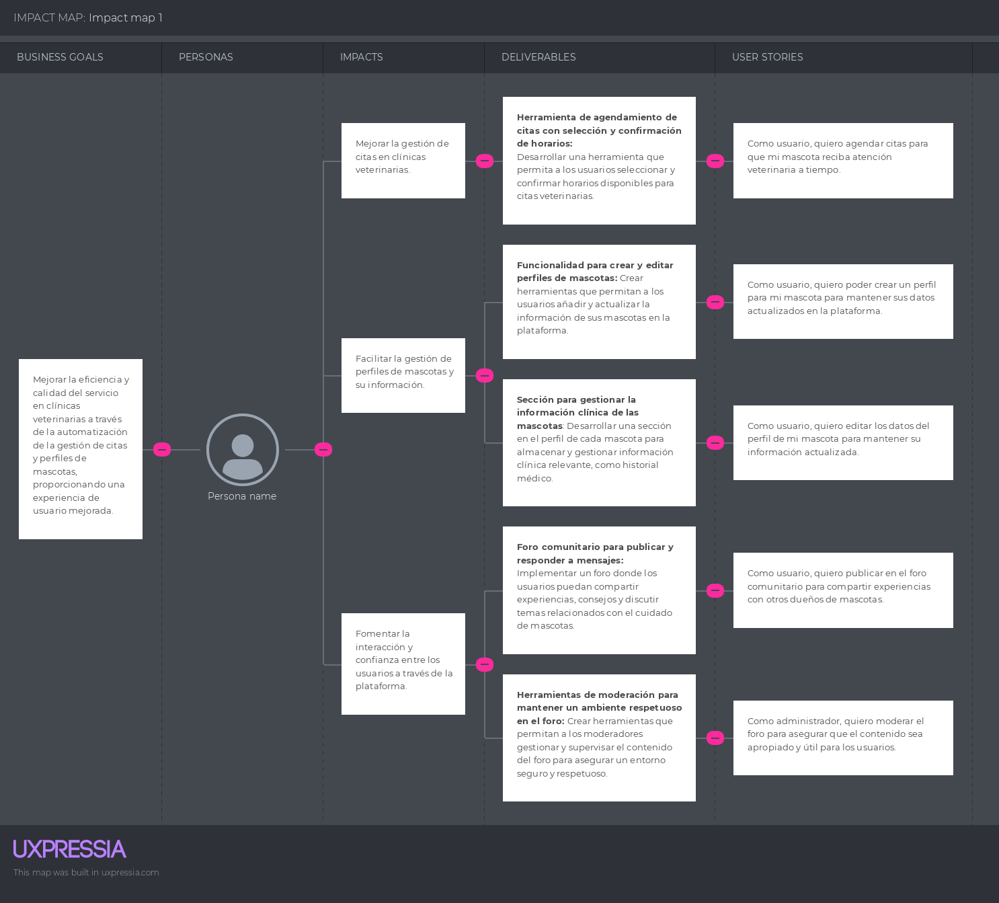

# Capítulo III: Requirements Specification

## 3.1. To-Be Scenario Mapping.

- **Primer segmento: Médicos Veterinarios**

  

- **Segundo segmento: Dueños de Mascotas**

  

## 3.2. User Stories
# Gestión de Usuarios
**EP01: Como administrador, deseo gestionar los usuarios para asegurar que solo personas autorizadas tengan acceso al sistema.**

| User Story ID | Título                     | Descripción                                                                                                                                                    |
|---------------|----------------------------|----------------------------------------------------------------------------------------------------------------------------------------------------------------|
| US01          | Registro de Usuario        | Como visitante, deseo registrarme en la plataforma para poder utilizar las funcionalidades del sistema                                                        |
| US02          | Recuperación de Contraseña | Como usuario, deseo recuperar mi contraseña en caso de olvidarla para no perder el acceso a mi cuenta                                                         |
| US03          | Gestión de Perfiles de Usuarios | Como administrador, deseo gestionar los perfiles de los usuarios para mantener la información y permisos actualizados.                                    |

---

# Gestión de Mascotas
**EP02: Como usuario, deseo gestionar la información de mis mascotas para mantener sus datos actualizados.**

| User Story ID | Título                     | Descripción                                                                                                                                                    |
|---------------|----------------------------|----------------------------------------------------------------------------------------------------------------------------------------------------------------|
| US04          | Creación de Perfil de Mascota | Como usuario, deseo crear un perfil de mi mascota para tener su información almacenada en la plataforma.                                                  |
| US05          | Edición de Perfil de Mascota | Como usuario, deseo editar el perfil de mi mascota para actualizar su información cuando sea necesario.                                                    |
| US06          | Visualización de Perfiles de Mascotas | Como usuario, deseo visualizar los perfiles de mis mascotas para revisar la información registrada.                                                    |
| US07          | Búsqueda de Mascotas por ID | Como administrador, deseo buscar mascotas por ID para acceder rápidamente a su información en el sistema.                                                   |
| US08          | Gestión de Perfiles de Mascotas | Como administrador, deseo gestionar los perfiles de mascotas para asegurarme de que la información esté correctamente registrada y actualizada.          |

---

# Gestión de Citas Veterinarias
**EP03: Como usuario, deseo gestionar las citas veterinarias de mis mascotas para asegurarme de que reciban atención médica a tiempo.**

| User Story ID | Título                     | Descripción                                                                                                                                                    |
|---------------|----------------------------|----------------------------------------------------------------------------------------------------------------------------------------------------------------|
| US09          | Agendamiento de Citas      | Como usuario, deseo agendar citas veterinarias para asegurar que mi mascota reciba atención médica en el momento adecuado.                                     |
| US10          | Cancelación de Citas       | Como usuario, deseo cancelar una cita si no puedo asistir, para evitar problemas de horario y reorganizar la atención.                                        |
| US11          | Gestión de Citas Veterinarias | Como administrador, deseo gestionar las citas veterinarias para coordinar correctamente la atención de las mascotas.                                     |
| US12          | Búsqueda de Citas por ID   | Como administrador, deseo buscar citas por ID para acceder rápidamente a la información de la cita.                                                           |
| US13          | Edición de Citas Veterinarias | Como administrador, deseo editar las citas para hacer cambios en la fecha o estado cuando sea necesario.                                                 |

---

# Gestión de Notificaciones
**EP04: Como usuario, deseo recibir notificaciones sobre eventos importantes relacionados con mis mascotas para estar siempre informado.**

| User Story ID | Título                     | Descripción                                                                                                                                                    |
|---------------|----------------------------|----------------------------------------------------------------------------------------------------------------------------------------------------------------|
| US14          | Notificación de Citas Veterinarias | Como usuario, deseo recibir notificaciones de citas veterinarias para recordarme cuándo debo llevar a mi mascota al veterinario.                      |
| US15          | Notificación de Historial Médico | Como usuario, deseo recibir notificaciones sobre actualizaciones en el historial médico de mi mascota para estar al tanto de su salud.                   |
| US16          | Gestión de Notificaciones   | Como administrador, deseo gestionar el envío de notificaciones para asegurarme de que los usuarios reciban información importante a tiempo.               |

---

# Navegación y Funcionalidades de la Landing Page
**EP05: Como visitante, deseo explorar la página principal de Pawfect Care para entender los servicios y características que ofrece la plataforma.**

| User Story ID | Título                                     | Descripción                                                                                                                                                     |
|---------------|-------------------------------------------|-----------------------------------------------------------------------------------------------------------------------------------------------------------------|
| US17          | Barra de Navegación en la Landing Page     | Como visitante, deseo usar la barra de navegación para acceder fácilmente a las diferentes secciones de la plataforma.                                        |
| US18          | Visualización de la Sección "Why Choose Us?" | Como visitante, deseo revisar la sección "Why Choose Us?" para entender los beneficios y servicios de la plataforma.                                     |
| US19          | Gestión de Suscripciones en la Landing Page | Como visitante, deseo revisar los planes de suscripción en la página principal para elegir el plan más adecuado para mí.                                  |
| US20          | Revisión de Reseñas de Clientes           | Como visitante, deseo revisar las reseñas de otros clientes para evaluar la experiencia de otros usuarios con la plataforma.                                 |
| US21          | Envío de Mensajes de Contacto             | Como visitante, deseo enviar un mensaje de contacto a través de la landing page para comunicarme con el equipo de Pawfect Care.                             |
| US22          | Visualización de Videos en la Sección de Características | Como visitante, deseo ver los videos informativos sobre los productos y servicios para conocer más sobre Pawfect Care.                                    |

---

# Gestión de Clientes
**EP06: Como administrador, deseo gestionar la información de los clientes para mantener los datos actualizados y organizados.**

| User Story ID | Título                     | Descripción                                                                                                                                                    |
|---------------|----------------------------|----------------------------------------------------------------------------------------------------------------------------------------------------------------|
| US24          | Creación de Perfiles de Clientes | Como administrador, deseo crear perfiles de clientes para registrar la información de contacto y sus mascotas.                                            |
| US25          | Edición de Perfiles de Clientes | Como administrador, deseo editar los perfiles de clientes para actualizar su información personal y de contacto.                                          |
| US26          | Búsqueda de Clientes por ID | Como administrador, deseo buscar clientes por su ID para acceder rápidamente a su información y gestionar sus mascotas.                                      |

---

# Gestión de Eventos Veterinarios
**EP07: Como administrador o doctor veterinario, deseo gestionar los eventos veterinarios para asegurarme de que las mascotas reciban la atención adecuada.**

| User Story ID | Título                     | Descripción                                                                                                                                                    |
|---------------|----------------------------|----------------------------------------------------------------------------------------------------------------------------------------------------------------|
| US27          | Creación de Eventos Veterinarios | Como administrador, deseo crear eventos veterinarios como desparasitaciones, vacunaciones, y chequeos para gestionar el historial médico de las mascotas.    |
| US28          | Edición de Eventos Veterinarios | Como administrador, deseo editar los eventos veterinarios para corregir fechas o agregar información adicional.                                            |
| US29          | Búsqueda de Eventos por ID | Como administrador, deseo buscar eventos veterinarios por ID para revisar o modificar la información rápidamente.                                            |
| US30          | Gestión del Estado de los Eventos | Como administrador, deseo cambiar el estado de los eventos (ej. completado, pendiente) para reflejar su estado actual.                                   |

---

# Gestión de Historial Médico de las Mascotas
**EP08: Como usuario o administrador, deseo gestionar el historial médico de las mascotas para llevar un registro de sus atenciones y tratamientos.**

| User Story ID | Título                     | Descripción                                                                                                                                                    |
|---------------|----------------------------|----------------------------------------------------------------------------------------------------------------------------------------------------------------|
| US31          | Visualización del Historial Médico | Como usuario, deseo visualizar el historial médico de mi mascota para revisar su estado de salud y tratamientos previos.                                  |
| US32          | Actualización del Historial Médico | Como administrador o doctor veterinario, deseo actualizar el historial médico de las mascotas para que los usuarios tengan la información más reciente sobre sus tratamientos. |

---

# Funcionalidades de Idioma en la App Web
**EP09: Como usuario, deseo cambiar el idioma de la plataforma para navegar entre las versiones en inglés y español de la app web.**

| User Story ID | Título                     | Descripción                                                                                                                                                    |
|---------------|----------------------------|----------------------------------------------------------------------------------------------------------------------------------------------------------------|
| US23          | Cambio de Idioma en la App Web | Como usuario, deseo cambiar el idioma de la app web para poder utilizarla en inglés o español según mi preferencia.                                        |

  
<table>
    <thead>
        <tr>
            <th class= "red">Epic/Story ID</th>
            <th class= "red">US01</th>
            <th class= "red">Relacionado con (Epic ID)</th>
            <th class= "red">EP1</th>
        </tr>
    </thead>
    <tbody>
        <tr>
            <td class= "red">Título</td>
            <th colspan=3 align= "justify">Registro de Usuario</th>
        </tr>
        <tr>
            <td class= "red">Descripción</td>
            <th colspan=3 align= "justify">Como administrador, quiero permitir que los usuarios se registren en el sistema para tener acceso autorizado.</th>
        </tr>
        <tr> 
            <td colspan=4><b class= "red">Criterios de Aceptación:</b>
             <b>Scenario 1:</b> El usuario necesita registrarse en el sistema.
             <b>Dado que</b> el usuario quiere acceder a la plataforma,
             <b>Cuando</b> ingrese sus datos de registro (nombre, correo, contraseña),
             <b>Entonces</b> su cuenta será creada y podrá iniciar sesión en el sistema.
             <b>Scenario 2:</b> El usuario necesita validación de su correo.
             <b>Dado que</b>el usuario completó el formulario de registro,
             <b>Cuando</b> reciba un correo de verificación,
             <b>Entonces</b> podrá verificar su cuenta para finalizar el registro.</td>
        </tr>
    </tbody>
</table>
<table>
    <thead>
        <tr>
            <th class= "red">Epic/Story ID</th>
            <th class= "red">US02</th>
            <th class= "red">Relacionado con (Epic ID)</th>
            <th class= "red">EP1</th>
        </tr>
    </thead>
    <tbody>
        <tr>
            <td class= "red">Título</td>
            <th colspan=3 align= "justify">Recuperación de Contraseña</th>
        </tr>
        <tr>
            <td class= "red">Descripción</td>
            <th colspan=3 align= "justify">Como administrador, quiero permitir que los usuarios recuperen su contraseña en caso de que la olviden.</th>
        </tr>
        <tr> 
            <td colspan=4><b class= "red">Criterios de Aceptación:</b>
             <b>Scenario 1:</b> El usuario necesita recuperar su contraseña.
             <b>Dado que</b> el usuario olvidó su contraseña,
             <b>Cuando</b> solicite la recuperación,
             <b>Entonces</b> Recibirá un enlace para restablecerla a través de su correo electrónico.
             <b>Scenario 2:</b> El usuario necesita restablecer su contraseña.
             <b>Dado que</b>el usuario ha recibido el correo de restablecimiento,
             <b>Cuando</b> haga clic en el enlace y establezca una nueva contraseña,
             <b>Entonces</b> su contraseña será actualizada exitosamente.
            </td>
        </tr>
    </tbody>
</table>

<table>
    <thead>
        <tr>
            <th class= "red">Epic/Story ID</th>
            <th class= "red">US03</th>
            <th class= "red">Relacionado con (Epic ID)</th>
            <th class= "red">EP1</th>
        </tr>
    </thead>
    <tbody>
        <tr>
            <td class= "red">Título</td>
            <th colspan=3 align= "justify">Gestión de Perfiles de Usuarios</th>
        </tr>
        <tr>
            <td class= "red">Descripción</td>
            <th colspan=3 align= "justify">Como administrador, quiero gestionar los perfiles de los usuarios para mantener los datos actualizados.</th>
        </tr>
        <tr> 
            <td colspan=4><b class= "red">Criterios de Aceptación:</b>
             <b>Scenario 1:</b> El usuario necesita actualizar su información personal.
             <b>Dado que</b> el usuario está dentro de su perfil,
             <b>Cuando</b> edite sus datos personales (nombre, correo, etc.),
             <b>Entonces</b> podrá guardar los cambios y actualizar su perfil
             <b>Scenario 2:</b> El usuario necesita visualizar su perfil.
             <b>Dado que</b>el usuario está en su cuenta,
             <b>Cuando</b> haga clic en "Perfil",
             <b>Entonces</b> verá su información actual almacenada.
            </td>
        </tr>
    </tbody>
</table>

<table>
    <thead>
        <tr>
            <th class= "red">Epic/Story ID</th>
            <th class= "red">US04</th>
            <th class= "red">Relacionado con (Epic ID)</th>
            <th class= "red">EP2</th>
        </tr>
    </thead>
    <tbody>
        <tr>
            <td class= "red">Título</td>
            <th colspan=3 align= "justify">Creación de Perfil de Mascota</th>
        </tr>
        <tr>
            <td class= "red">Descripción</td>
            <th colspan=3 align= "justify">Como usuario, quiero poder crear un perfil para mi mascota para mantener sus datos actualizados en la plataforma.</th>
        </tr>
        <tr> 
            <td colspan=4><b class= "red">Criterios de Aceptación:</b>
             <b>Scenario 1:</b>  El usuario necesita crear un perfil de su mascota.
             <b>Dado que</b> el usuario está registrado en la plataforma,
             <b>Cuando</b> acceda a la opción "Agregar Mascota" y complete los campos requeridos,
             <b>Entonces</b> podrá crear un perfil con los detalles de su mascota (nombre, raza, edad, etc.).</td>
        </tr>
    </tbody>
</table>

<table>
    <thead>
        <tr>
            <th class= "red">Epic/Story ID</th>
            <th class= "red">US05</th>
            <th class= "red">Relacionado con (Epic ID)</th>
            <th class= "red">EP2</th>
        </tr>
    </thead>
    <tbody>
        <tr>
            <td class= "red">Título</td>
            <th colspan=3 align= "justify">Edición de Perfil de Mascota</th>
        </tr>
        <tr>
            <td class= "red">Descripción</td>
            <th colspan=3 align= "justify">Como usuario, quiero editar los datos del perfil de mi mascota para mantener su información actualizada.</th>
        </tr>
        <tr> 
            <td colspan=4><b class= "red">Criterios de Aceptación:</b>
             <b>Scenario 1:</b> El usuario necesita modificar la información de su mascota.
             <b>Dado que</b> el usuario ha creado un perfil de mascota,
             <b>Cuando</b> seleccione la opción de editar,
             <b>Entonces</b> podrá modificar los campos necesarios y guardar los cambios.</td>
        </tr>
    </tbody>
</table>

<table>
    <thead>
        <tr>
            <th class= "red">Epic/Story ID</th>
            <th class= "red">US06</th>
            <th class= "red">Relacionado con (Epic ID)</th>
            <th class= "red">EP3</th>
        </tr>
    </thead>
    <tbody>
        <tr>
            <td class= "red">Título</td>
            <th colspan=3 align= "justify"> Agendamiento de Citas</th>
        </tr>
        <tr>
            <td class= "red">Descripción</td>
            <th colspan=3 align= "justify">Como usuario, quiero agendar citas para que mi mascota reciba atención veterinaria a tiempo.</th>
        </tr>
        <tr> 
            <td colspan=4><b class= "red">Criterios de Aceptación:</b>
             <b>Scenario 1:</b>  El usuario necesita agendar una cita.
             <b>Dado que</b> el usuario necesita una consulta veterinaria,
             <b>Cuando</b> acceda a la opción de "Agendar Cita" y seleccione la fecha, hora y tipo de servicio,
             <b>Entonces</b>  la cita será agendada correctamente y recibirá una confirmación.</td>
        </tr>
    </tbody>
</table>

<table>
    <thead>
        <tr>
            <th class= "red">Epic/Story ID</th>
            <th class= "red">US07</th>
            <th class= "red">Relacionado con (Epic ID)</th>
            <th class= "red">EP3</th>
        </tr>
    </thead>
    <tbody>
        <tr>
            <td class= "red">Título</td>
            <th colspan=3 align= "justify">Cancelación de Citas</th>
        </tr>
        <tr>
            <td class= "red">Descripción</td>
            <th colspan=3 align= "justify"> Como usuario, quiero cancelar citas agendadas en caso de que no pueda asistir.</th>
        </tr>
        <tr> 
            <td colspan=4><b class= "red">Criterios de Aceptación:</b>
             <b>Scenario 1:</b> El usuario necesita cancelar una cita previamente agendada.
             <b>Dado que</b> el usuario ha reservado una cita
             <b>Cuando</b>  haga clic en "Cancelar Cita" en su historial de citas,
             <b>Entonces</b> la cita será eliminada y se enviará una notificación de cancelación.</td>
        </tr>
    </tbody>
</table>
<table>
    <thead>
        <tr>
            <th class= "red">Epic/Story ID</th>
            <th class= "red">US08</th>
            <th class= "red">Relacionado con (Epic ID)</th>
            <th class= "red">EP4</th>
        </tr>
    </thead>
    <tbody>
        <tr>
            <td class= "red">Título</td>
            <th colspan=3 align= "justify">Notificaciones de Citas</th>
        </tr>
        <tr>
            <td class= "red">Descripción</td>
            <th colspan=3 align= "justify"><b>Como usuario, quiero recibir notificaciones de mis citas veterinarias para no olvidarlas.</th>
        </tr>
        <tr> 
            <td colspan=4><b class= "red">Criterios de Aceptación:</b>
             <b>Scenario 1:</b> El usuario necesita una notificación previa a la cita.
             <b>Dado que</b> el usuario tiene una cita programada,
             <b>Cuando</b> se acerque la fecha,
             <b>Entonces</b> recibirá una notificación recordatoria por correo o notificación en la app.</td>
        </tr>
    </tbody>
</table>

<table>
    <thead>
        <tr>
            <th class= "red">Epic/Story ID</th>
            <th class= "red">US09</th>
            <th class= "red">Relacionado con (Epic ID)</th>
            <th class= "red">EP4</th>
        </tr>
    </thead>
    <tbody>
        <tr>
            <td class= "red">Título</td>
            <th colspan=3 align= "justify"> Notificaciones de Historial Médico</th>
        </tr>
        <tr>
            <td class= "red">Descripción</td>
            <th colspan=3 align= "justify"><b>Como usuario, quiero recibir notificaciones sobre cambios en el historial médico de mis mascotas para estar informado de su estado de salud.</th>
        </tr>
        <tr>
            <td colspan=4><b class= "red">Criterios de Aceptación:</b>
             <b>Scenario 1:</b> El usuario necesita estar al tanto de cambios en el historial.
             <b>Dado que</b>  el veterinario actualiza el historial médico de la mascota,
             <b>Cuando</b> se haga una modificación, <b>Entonces</b>el usuario recibirá una notificación de la actualización.</td>
        </tr>
    </tbody>
</table>

<table>
    <thead>
        <tr>
            <th class= "red">Epic/Story ID</th>
            <th class= "red">US10</th>
            <th class= "red">Relacionado con (Epic ID)</th>
            <th class= "red">EP5</th>
        </tr>
    </thead>
    <tbody>
        <tr>
            <td class= "red">Título</td>
            <th colspan=3 align= "justify"> Publicación en el Foro</th>
        </tr>
        <tr>
            <td class= "red">Descripción</td>
            <th colspan=3 align= "justify"><b>Como usuario, quiero publicar en el foro comunitario para compartir experiencias con otros dueños de mascotas.</th>
        </tr>
        <tr> 
            <td colspan=4><b class= "red">Criterios de Aceptación:</b>
             <b>Scenario 1:</b> El usuario necesita compartir una experiencia en el foro.
             <b>Dado que</b> está registrado en el foro,
             <b>Cuando</b> escriba una publicación y la envíe,
             <b>Entonces</b> esta será visible para otros usuarios.</td>
        </tr>
    </tbody>
</table>

<table>
    <thead>
        <tr>
            <th class= "red">Epic/Story ID</th>
            <th class= "red">US11</th>
            <th class= "red">Relacionado con (Epic ID)</th>
            <th class= "red">EP5</th>
        </tr>
    </thead>
    <tbody>
        <tr>
            <td class= "red">Título</td>
            <th colspan=3 align= "justify">Moderación del Foro</th>
        </tr>
        <tr>
            <td class= "red">Descripción</td>
            <th colspan=3 align= "justify"><b>Como administrador, quiero moderar el foro para asegurar que el contenido sea apropiado y útil para los usuarios.</th>
        </tr>
        <tr> 
            <td colspan=4><b class= "red">Criterios de Aceptación:</b>
             <b>Scenario 1:</b> El administrador necesita moderar contenido.
             <b>Dado que</b> el foro está activo,
             <b>Cuando</b>  haya publicaciones inadecuadas,
             <b>Entonces</b> el administrador podrá eliminarlas o bloquear al usuario responsable.</td>
        </tr>
    </tbody>
</table>

<table>
    <thead>
        <tr>
            <th class= "red">Epic/Story ID</th>
            <th class= "red">US12</th>
            <th class= "red">Relacionado con (Epic ID)</th>
            <th class= "red">EP6</th>
        </tr>
    </thead>
    <tbody>
        <tr>
            <td class= "red">Título</td>
            <th colspan=3 align= "justify">Barra de navegación en la Landing Page</th>
        </tr>
        <tr>
            <td class= "red">Descripción</td>
            <th colspan=3 align= "justify"><b>Como usuario, quiero un menú para ver las secciones de la aplicación.</th>
        </tr>
        <tr> 
            <td colspan=4><b class= "red">Criterios de Aceptación:</b>
             <b>Scenario 1:</b> El usuario necesita el menú para visualizar las secciones de la Landing Page.
             <b>Dado que</b> el usuario se encuentra en la Landing Page,
             <b>Cuando</b> visualice la barra de navegación,
             <b>Entonces</b> podrá interactuar con las diferentes secciones y botones de la página.</td>
        </tr>
    </tbody>
</table>

<table>
    <thead>
        <tr>
            <th class= "red">Epic/Story ID</th>
            <th class= "red">US13</th>
            <th class= "red">Relacionado con (Epic ID)</th>
            <th class= "red">EP6</th>
        </tr>
    </thead>
    <tbody>
        <tr>
            <td class= "red">Título</td>
            <th colspan=3 align= "justify">Sección "Why Choose Us?"</th>
        </tr>
        <tr>
            <td class= "red">Descripción</td>
            <th colspan=3 align= "justify"><b>Como usuario, quiero una sección que explique por qué debo elegir Pawfect Care para entender los beneficios y características de la plataforma.</th>
        </tr>
        <tr> 
            <td colspan=4><b class= "red">Criterios de Aceptación:</b>
             <b>Scenario 1:</b> El usuario necesita visualizar la sección de beneficios.
             <b>Dado que</b> el usuario está explorando la Landing Page,
             <b>Cuando</b> desplace la página hacia la sección "Why Choose Us?"
             <b>Entonces</b> podrá ver una lista clara de las ventajas y razones para utilizar Pawfect Care.
             <b>Scenario 2:</b> El usuario necesita entender los beneficios de Pawfect Care
             <b>Dado que</b>el usuario lee la sección "Why Choose Us?",
             <b>Cuando</b>  revise cada beneficio descrito,
             <b>Entonces</b> podrá comprender cómo la plataforma se destaca frente a la competencia.
            </td>
        </tr>
    </tbody>
</table>

<table>
    <thead>
        <tr>
            <th class= "red">Epic/Story ID</th>
            <th class= "red">US14</th>
            <th class= "red">Relacionado con (Epic ID)</th>
            <th class= "red">EP6</th>
        </tr>
    </thead>
    <tbody>
        <tr>
            <td class= "red">Título</td>
            <th colspan=3 align= "justify">Sección de suscripciones</th>
        </tr>
        <tr>
            <td class= "red">Descripción</td>
            <th colspan=3 align= "justify"> Como usuario, quiero una sección de suscripciones para entender las opciones de pago y los beneficios asociados a cada nivel de suscripción.</th>
        </tr>
        <tr> 
            <td colspan=4><b class= "red">Criterios de Aceptación:</b>
             <b>Scenario 1:</b> El usuario necesita conocer los diferentes planes de suscripción.
             <b>Dado que</b> el usuario está en la Landing Page,
             <b>Cuando</b> navegue a la sección de suscripciones,
             <b>Entonces</b> verá una comparación de los diferentes planes disponibles, junto con los beneficios de cada uno.
             <b>Scenario 2:</b> El usuario necesita seleccionar un plan de suscripción.
             <b>Dado que</b> el usuario está en la sección de suscripciones,
             <b>Cuando</b>  haga clic en el botón de selección de plan,
             <b>Entonces</b> será redirigido a la página de pago o suscripción correspondiente.</td>
        </tr>
    </tbody>
</table>

<table>
    <thead>
        <tr>
            <th class= "red">Epic/Story ID</th>
            <th class= "red">US15</th>
            <th class= "red">Relacionado con (Epic ID)</th>
            <th class= "red">EP6</th>
        </tr>
    </thead>
    <tbody>
        <tr>
            <td class= "red">Título</td>
            <th colspan=3 align= "justify">Reseñas de clientes</th>
        </tr>
        <tr>
            <td class= "red">Descripción</td>
            <th colspan=3 align= "justify">Como usuario, quiero leer reseñas de otros clientes para evaluar la confiabilidad y calidad del servicio antes de usar la plataforma.</th>
        </tr>
        <tr> 
            <td colspan=4><b class= "red">Criterios de Aceptación:</b>
             <b>Scenario 1:</b> El usuario necesita ver las reseñas de clientes.
             <b>Dado que</b> el usuario está en la Landing Page,
             <b>Cuando</b> llegue a la sección de reseñas,
             <b>Entonces</b> podrá visualizar las opiniones y valoraciones de otros usuarios que han utilizado Pawfect Care.
             <b>Scenario 2:</b> El usuario necesita conocer la experiencia de otros usuarios.
             <b>Dado que</b>El usuario necesita conocer la experiencia de otros usuarios.
             <b>Cuando</b>   lea las experiencias de otros clientes,
             <b>Entonces</b> podrá tomar una decisión informada sobre si utilizar o no la plataforma.</td>
        </tr>
    </tbody>
</table>

## 3.3. Impact Mapping.

Este Impact Map muestra cómo Pawfect Care alinea sus objetivos de negocio con los impactos deseados. Detalla los entregables específicos y las user stories que abordan estos impactos, asegurando que cada aspecto del desarrollo de la plataforma mejore la eficiencia y la experiencia del usuario.

  

## 3.4. Product Backlog.

Con el fin de simplificar la complejidad de las tareas, hemos utilizado la escala de Fibonacci (1/2/3/5/8) para crear nuestro product backlog.
Historia de usuario base:
Tomamos como referencia US06: Como usuario, quiero agendar citas para que mi mascota reciba atención veterinaria a tiempo. (Posee 3 puntos de historia).
Asimismo, utilizamos la herramienta “Planning Poker Online” para poder votar en grupo y decidir la dificultad de cada historia de usuario, tomando como punto intermedio el User Story 06

<table>
  <thead>
    <tr>
      <th># Orden</th>
      <th>User Story ID</th>
      <th>Título</th>
      <th>Descripción</th>
      <th>Story Points (1/2/3/5/8)</th>
    </tr>
  </thead>
  <tbody>
    <tr>
      <td>1</td>
      <td>US01</td>
      <td>Registro de Usuario</td>
      <td>Como administrador, deseo permitir a los usuarios registrarse para que puedan acceder al sistema.</td>
      <td>3</td>
    </tr>
    <tr>
      <td>2</td>
      <td>US06</td>
      <td>Agendamiento de Citas</td>
      <td>Como usuario, deseo gestionar las citas veterinarias de mis mascotas para asegurarme de que reciban atención médica a tiempo.</td>
      <td>3</td>
    </tr>
    <tr>
      <td>3</td>
      <td>US12</td>
      <td>Barra de navegación en la Landing Page</td>
      <td>Como usuario, quiero un menú para ver las secciones de la aplicación.</td>
      <td>2</td>
    </tr>
    <tr>
      <td>4</td>
      <td>US13</td>
      <td>Sección "Why Choose Us?"</td>
      <td>Como usuario, quiero una sección que explique por qué debo elegir Pawfect Care para entender los beneficios y características de la plataforma.</td>
      <td>2</td>
    </tr>
    <tr>
      <td>5</td>
      <td>US02</td>
      <td>Recuperación de Contraseña</td>
      <td>Como administrador, deseo que los usuarios puedan recuperar sus contraseñas en caso de olvido </td>
      <td>2</td>
    </tr>
    <tr>
      <td>6</td>
      <td>US05</td>
      <td>Edición de Perfil de Mascota</td>
      <td>Como usuario, deseo gestionar la información de mis mascotas para mantener sus datos actualizados.</td>
      <td>3</td>
    </tr>
    <tr>
      <td>7</td>
      <td>US03</td>
      <td>Gestión de Perfiles de Usuarios</td>
      <td>Como administrador, deseo gestionar los perfiles de los usuarios para asegurar que solo personas autorizadas tengan acceso.</td>
      <td>5</td>
    </tr>
    <tr>
      <td>8</td>
      <td>US04</td>
      <td>Creación de Perfil de Mascota</td>
      <td>Como usuario, deseo crear un perfil de mascota para mantener sus datos organizados.</td>
      <td>3</td>
    </tr>
    <tr>
      <td>9</td>
      <td>US07</td>
      <td>Cancelación de Citas</td>
      <td>Como usuario, deseo cancelar las citas veterinarias de mis mascotas cuando sea necesario.</td>
      <td>2</td>
    </tr>
    <tr>
      <td>10</td>
      <td>US08</td>
      <td>Notificaciones de Citas</td>
      <td>Como usuario, deseo recibir notificaciones sobre eventos importantes relacionados con las citas de mis mascotas.</td>
      <td>2</td>
    </tr>
    <tr>
      <td>11</td>
      <td>US14</td>
      <td>	Sección de suscripciones</td>
      <td>Como usuario, quiero una sección de suscripciones para entender las opciones de pago y los beneficios asociados.</td>
      <td>2</td>
    </tr>
    <tr>
      <td>12</td>
      <td>US15</td>
      <td>Reseñas de clientes</td>
      <td>Como usuario, quiero leer reseñas de otros clientes para evaluar la calidad del servicio antes de usar la plataforma.</td>
      <td>2</td>
    </tr>
    <tr>
      <td>13</td>
      <td>US099</td>
      <td>Notificaciones de Historial Médico</td>
      <td>Como usuario, deseo recibir notificaciones sobre actualizaciones en el historial médico de mis mascotas.</td>
      <td>3</td>
    </tr>
    <tr>
      <td>14</td>
      <td>US10</td>
      <td>	Publicación en el Foro</td>
      <td>Como usuario, deseo publicar en un foro comunitario para intercambiar experiencias y consejos con otros dueños de mascotas.</td>
      <td>5</td>
    </tr>
    <tr>
      <td>15</td>
      <td>US11</td>
      <td>Moderación del Foro</td>
      <td>Como usuario, deseo moderar el foro para asegurar que las discusiones sean respetuosas y relevantes.</td>
      <td>8</td>
    </tr>
      </tbody>
</table>

---
