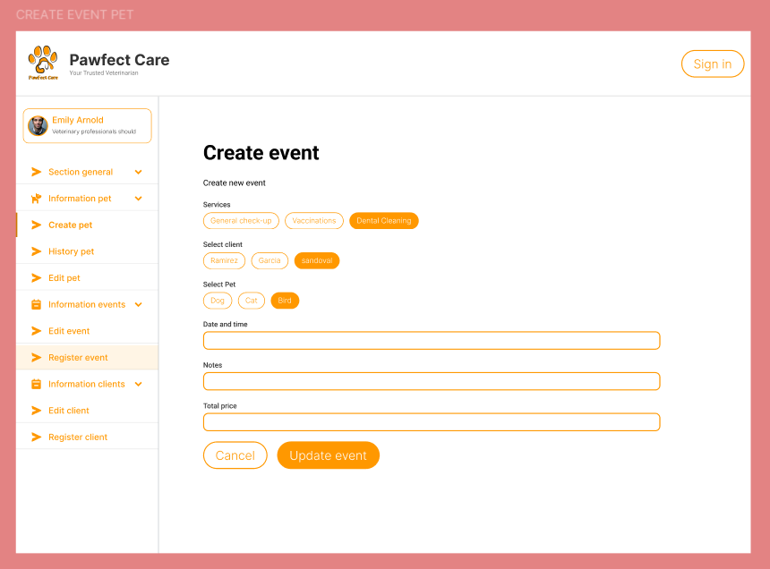
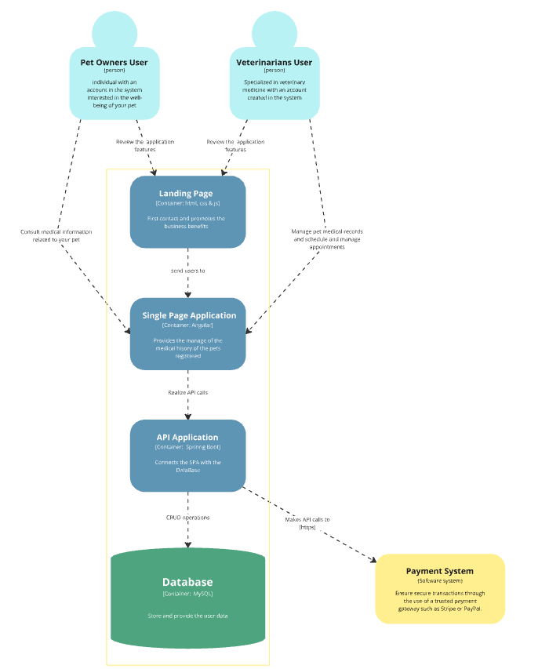

## Capítulo IV: Product Design

El diseño de producto es una fase fundamental en el desarrollo de cualquier software, ya que define cómo los usuarios interactuarán con la plataforma y garantiza que la experiencia de usuario sea intuitiva, fluida y estéticamente atractiva. En este capítulo, detallamos el proceso de diseño que seguimos para Pawfect Care, desde las directrices generales de estilo hasta la arquitectura de software y la base de datos. Cada sección refleja nuestro enfoque en la creación de una experiencia de usuario óptima y un diseño de interfaz que facilite la navegación y el uso de la plataforma, tanto en la landing page como en las aplicaciones web.

### 4.1. Style Guidelines.

Son un conjunto de reglas y estándares que definen la apariencia visual y la sensación de un producto. Son como un manual de estilo que garantiza que todos los elementos del diseño, desde los colores y las tipografías hasta los iconos y las imágenes, se mantienen coherentes y alineados con la marca y la identidad visual del producto.A continuación, se detallará las directrices de estilo de nuestro proyecto.

#### 4.1.1. General Style Guidelines.

Propondremos pautas de estilo fundamentales que establecen una base sólida para un diseño versátil y eficiente, asegurando una experiencia de usuario óptima y coherente con los valores y objetivos de nuestra marca.
- *Coherencia:* Aseguran que todos los elementos del diseño se comuniquen de manera consistente, creando una experiencia de usuario unificada.
- *Identidad de marca:* Refuerzan la identidad visual de la marca, haciendo que el producto sea fácilmente reconocible.
- *Eficiencia:* Agilizan el proceso de diseño, ya que los diseñadores tienen un punto de referencia claro para tomar decisiones estéticas.
- *Escalabilidad:* Facilitan la expansión del producto, ya que las guías pueden adaptarse a nuevos elementos o plataformas.
- *Tipografía:* Para reflejar la identidad visual de la marca y optimizar la experiencia del usuario, seleccionamos cuidadosamente tipografías que fusionan estilo y claridad. Optamos por las variantes ‘Gill Sans', 'Gill Sans MT', Calibri, 'Trebuchet MS', sans-serif para garantizar coherencia en todo el sitio web. En el diseño de Pawfect Care, hemos jerarquizado la tipografía en cuatro niveles: encabezados, texto principal, botones y enlaces, asegurando una armonía visual que facilita tanto la lectura como la navegación.
- *Colores:* Nuestra paleta de colores está diseñada para transmitir la esencia de nuestra marca y crear una conexión clara y atractiva con nuestros usuarios. Hemos elegido un anarjando (#FF9800) como color principal y un limpio blanco (#FFFFFF) como secundario, ambos proporcionando una base tranquila y profesional. Estos se complementan con tonos de acento como el anaranjado claro rgb(255 152 0 30%), que destacan elementos importantes y mejoran la interacción con retroalimentación visual. Los fondos claros (#f5f5f5), se usan para lograr una estética uniforme y agradable en toda la aplicación.
 
- *Espaciado:* En nuestro diseño, implementaremos un espaciado dinámico entre en rango de 1rem a 8 rem entre los elementos, asegurando una disposición consistente a lo largo de la interfaz. Estos espaciados permitirán una separación adecuada entre los componentes, mejorando tanto la legibilidad como la experiencia de uso, mientras se mantiene un estilo limpio, ordenado y visualmente armonioso en toda la aplicación.

#### 4.1.2. Web Style Guidelines.

*Responsive Web Interface*

- *Diseño Responsivo:* La aplicación utiliza flexbox y CSS grid para garantizar que el diseño sea adaptable y funcione perfectamente en diferentes tamaños de pantalla y dispositivos.
- *Interfaz Intuitiva:* Hemos implementado elementos de diseño como botones y enlaces para facilitar la interacción y mejorar la experiencia del usuario.
- **Compatibilidad con Navegadores: **La aplicación es compatible con los principales navegadores, como Chrome, Firefox y Safari, garantizando consistencia y funcionalidad en todos ellos.
- *Velocidad de Carga Optimizada:* Las imágenes han sido optimizadas para reducir su peso, asegurando una rápida carga, incluso para usuarios con conexiones a internet lentas.

### 4.2. Information Architecture.

La arquitectura de la información juega un papel clave en la estructuración y organización del contenido, permitiendo que los usuarios accedan a él de manera intuitiva y clara. En esta sección, exploraremos los sistemas de categorización, etiquetado, optimización SEO y metaetiquetas, así como los mecanismos de búsqueda y navegación que dan forma a la arquitectura de nuestro producto.

#### 4.2.1. Organization Systems.

El propósito del sistema de organización de la página es establecer la estructura visual del contenido y la navegación en la misma. En el caso de pawfectcare, el esquema de organización de contenido se divide en módulos y se enfoca en los siguientes temas:

*Homepage:*
La página se divide en distintas secciones que incluyen: Home , Why Choose Us?, Contact, Service Features, Sign In y Sign Up.

Los sistemas de organización son cruciales para estructurar el contenido de manera clara y lógica, mejorando la navegación y comprensión. Se utilizan varios enfoques para lograrlo:
- *Jerarquía de información:* El contenido se organiza en niveles, dividiendo los temas principales en categorías y subcategorías, lo que permite a los usuarios explorar de manera secuencial y ordenada.
- *Categorización temática:* El contenido se agrupa por temas relacionados, facilitando la búsqueda de información dentro de categorías específicas.
- *Orden de prioridad:* Se destaca el contenido más relevante o importante para que esté fácilmente accesible, ayudando a los usuarios a encontrar lo esencial de inmediato.
- *Etiquetado:* Se añaden palabras clave descriptivas, permitiendo que los usuarios encuentren información relacionada rápidamente a través de búsquedas o navegación por etiquetas.

#### 4.2.2. Labeling Systems.

Los sistemas de etiquetado son cruciales para mejorar la navegación y la búsqueda de información en un producto. Aquí se presentan varios métodos para etiquetar el contenido, adaptados a las necesidades específicas de los usuarios:

- *Etiquetado Descriptivo:* Utiliza términos o frases que detallan el contenido de manera clara, facilitando a los usuarios la comprensión rápida del tema y la localización de información relevante a través de búsquedas.
- *Etiquetado por Audiencia:* Personaliza las etiquetas según el perfil o segmento de usuario, ofreciendo contenido relevante y ajustado a sus necesidades particulares.
- *Etiquetado por Popularidad o Relevancia:* Asigna etiquetas basadas en la popularidad o importancia del contenido, lo que puede incluir etiquetas generadas por análisis de datos o mediante la participación de los usuarios a través de votaciones e interacciones.

#### 4.2.3. SEO Tags and Meta Tags

Las etiquetas SEO y metaetiquetas son cruciales para optimizar la visibilidad y el posicionamiento en los motores de búsqueda. Los tipos más relevantes son:
 
- *Etiqueta de Título (Title Tag):* Define el título que aparece en los resultados de búsqueda, debe ser claro, relevante y contener palabras clave.
- *Metaetiqueta de Descripción (Meta Description Tag):* Ofrece una breve descripción del contenido de la página, lo que puede aumentar la tasa de clics (CTR), aunque no afecta directamente al ranking.
- *Etiqueta de Encabezado (Header Tags):* Utiliza etiquetas como H1, H2, H3 para organizar el contenido, ayudando a los motores de búsqueda a entender la estructura y relevancia.
- *Etiqueta de Idioma (Language Tag):* Indica el idioma principal del contenido, facilitando la clasificación en búsquedas locales y ayudando a los motores de búsqueda a identificar el idioma.
- *Metaetiqueta de Robots (Meta Robots Tag):* Instruye a los motores de búsqueda sobre cómo indexar y rastrear la página, especificando si debe ser indexada o si deben seguirse los enlaces.

#### 4.2.4. Searching Systems.

Los sistemas de búsqueda son fundamentales para que los usuarios encuentren la información rápidamente. A continuación, se describen los tipos de búsqueda:

- *Búsqueda por Palabras Clave:* Permite a los usuarios ingresar términos específicos para encontrar coincidencias en el contenido del producto, devolviendo resultados relevantes basados en esos términos.
- *Búsqueda por Filtros:* Ofrece opciones para refinar los resultados mediante criterios como categoría, fecha o tipo de archivo, mejorando la precisión de la búsqueda.
- *Búsqueda por Facetas:* Permite a los usuarios refinar los resultados según diferentes dimensiones o características del contenido, como ubicación o clasificación, facilitando la búsqueda dentro de grandes volúmenes de datos.
- *Búsqueda por Relevancia:* Clasifica los resultados según su pertinencia al término de búsqueda, utilizando algoritmos para mostrar los resultados más útiles y relevantes para el usuario.

#### 4.2.5. Navigation Systems.

Los sistemas de navegación son cruciales para que los usuarios exploren y accedan al contenido de un producto de manera eficiente. Aquí se presentan algunos de los métodos de navegación más comunes:

- *Menús de Navegación:* Organizan y presentan secciones y páginas del producto mediante menús desplegables, en la parte superior o lateral, y enlaces en el pie de página.
- *Navegación por Pestañas:* Utiliza pestañas para dividir el contenido en secciones o categorías, permitiendo a los usuarios cambiar entre ellas sin recargar la página.
- *Navegación por Íconos:* Emplea íconos visuales para representar diferentes secciones o funciones, permitiendo a los usuarios acceder al contenido o realizar acciones específicas con un clic.
- *Navegación por Scroll Infinito:* Permite a los usuarios desplazarse hacia abajo en una sola página para cargar contenido adicional conforme avanzan, ideal para sitios con grandes volúmenes de contenido.

### 4.3. Landing Page UI Design.

La Landing Page es utilizada para captar la atención de los usuarios y guiarlos hacia acciones específicas, como registrarse, comprar un producto o conocer un servicio. En esta sección, se abordará el diseño de la interfaz de usuario de la Landing page, destacando los elementos clave que mejoran la experiencia del usuario y crean una página dinámica e intuitiva.

#### 4.3.1. Landing Page Wireframe.

El wireframe de landing page es como un boceto o esqueleto básico de una página de aterrizaje antes de que se diseñe visualmente. Es una representación simplificada de la estructura y la distribución de los elementos de la página, como el encabezado, el cuerpo, los formularios y los llamados a la acción. Sirve para visualizar cómo se organizará la información y cómo interactuará el usuario con la página, permitiendo hacer ajustes y mejoras antes de pasar al diseño final.
El wireframe de la página de destino incluirá:

- *Encabezado:* Presentará el logotipo de la marca y, posiblemente, un eslogan impactante para captar la atención inmediata de los usuarios.
- *Sección de Características:* Destacará los principales beneficios del producto o servicio, utilizando una combinación de imágenes y texto breve para transmitir el mensaje de manera efectiva.
- *Llamada a la Acción (CTA):* Incluirá un botón destacado que animará a los usuarios a realizar una acción específica, como registrarse, comprar o aprender más.
- *Testimonios o Reseñas:* Mostrará opiniones de clientes satisfechos para aumentar la confianza y la credibilidad del producto o servicio.
- *Sección de Contacto o Formulario:* Ofrecerá una forma sencilla para que los usuarios contacten a la empresa o envíen consultas, facilitando la interacción directa.

Este wireframe servirá como base para el diseño final y la implementación, asegurando una experiencia de usuario fluida y efectiva.

Enlace del Wireframe de la Landing Page: https://www.figma.com/design/JnmdjjCQT13eu57Cy7hdXU/LANDING-PAGE-OPEN-SOURCE?node-id=0-1&t=NwDvcfY3AJxE2oRp-1

#### 4.3.2. Landing Page Mock-up.

En esta sección, presentamos el mock-up de la página de destino para nuestra aplicación web.

*Hero de la Aplicación:* El hero de Pawfect Care destaca con dos imágenes de fondo que muestran diversas interfaces del sistema veterinario. Incluye botones de llamada a la acción "¡Get started!" y “Contact now” para animar a los usuarios a interactuar. Con un título impactante y una breve descripción, el hero refleja la esencia de nuestra empresa y, junto con una barra de navegación, facilita el acceso rápido a las distintas secciones de la página web, asegurando una experiencia de navegación fluida y envolvente.

*Imagen y Motivos de la aplicación:* En esta sección de la landing page, lo que destaca son los beneficios clave que ofrece el servicio a sus usuarios, específicamente a los dueños de mascotas. Estos beneficios están presentados de forma clara y concisa, apoyados por iconos llamativos para facilitar su comprensión.

*Alcance de la aplicación:* En esta sección de suscripción se encarga de presentar los diferentes planes de manera clara y concisa. Al destacar los beneficios de cada plan y ofrecer una variedad de opciones, se facilita la toma de decisiones para el usuario. Con algunas pequeñas mejoras, esta sección podría ser aún más efectiva.

*Testimonios de la aplicación:*
En la sección de testimonios, presentamos las experiencias genuinas de nuestros clientes satisfechos. Cada testimonio incluye una foto del cliente y una breve descripción que resalta cómo nuestra empresa transformó sus espacios y superó sus expectativas. Estos testimonios sirven como prueba concreta de la calidad y el impacto positivo de nuestro trabajo, fomentando la confianza y credibilidad entre los potenciales clientes.

*Acerca de la aplicación:* En esta seccion se enfatiza que cada clínica veterinaria tiene necesidades únicas, y que la plataforma Pawfect Care se adapta a estas particularidades, permitiendo personalizar el proceso de reserva en línea,Asimismo la plataforma busca disminuir la cantidad de llamadas que recibe la clínica, al permitir que los clientes reserven sus citas directamente en línea.

*Contáctanos de la Aplicación:* En nuestra sección "Contáctanos", ofrecemos una forma fácil y directa de ponerte en contacto con nosotros. Disponemos de un formulario donde puedes proporcionar tu nombre completo, numero teléfono y un mensaje detallando cómo podemos asistirte. Esta herramienta nos ayuda a comprender tus necesidades de manera precisa y a responder de forma efectiva, garantizando un servicio personalizado y atento en cada etapa.

*Footer de la Aplicación:* En el footer, facilitamos el acceso rápido a nuestras redes sociales y opciones de contacto adicionales. Incluimos nuestro logo distintivo y enlaces para seguirnos en Twitter, Facebook e Instagram. Además, proporcionamos un número de teléfono y una dirección de correo electrónico, ofreciendo múltiples vías de comunicación.

Enlace de los Mock-up: https://www.figma.com/design/JnmdjjCQT13eu57Cy7hdXU/LANDING-PAGE-OPEN-SOURCE?node-id=0-1&t=NwDvcfY3AJxE2oRp-1

### 4.4. Web Applications UX/UI Design.

Diseñar la experiencia de usuario para las aplicaciones web implica pensar en cada paso que los usuarios darán. Esta sección presenta los wireframes, flujos de usuario, y mockups que garantizan una experiencia intuitiva.

#### 4.4.1. Web Applications Wireframes.

En esta sección se muestran los wireframes realizados para nuestra app.

*Login de la aplicación*

*Registro de la aplicacion*

*Listado de mascotas*

*Registro de mascotas*

*Edición del perfil de la mascota*

*Historial de la mascota*

*Listado de eventos de la veterinaria*

*Creacion de eventos de la  veterianaria*

*Edición de un evento realizado por la veterinaria*

*Listado de clientes de la veterinaria*

*Registro de clientes de la veterinaria*

*Edicion de clientes y listado de mascotas asociadas al cliente*

Enlace del web application wireframes: https://www.figma.com/design/JnmdjjCQT13eu57Cy7hdXU/LANDING-PAGE-OPEN-SOURCE?node-id=0-1&t=NwDvcfY3AJxE2oRp-1

#### 4.4.2. Web Applications Wireflow Diagrams.

Los Wireflows se utilizan principalmente para aplicaciones que involucran flujos de trabajo.

Enlace de los Mireflow: https://www.figma.com/design/JnmdjjCQT13eu57Cy7hdXU/LANDING-PAGE-OPEN-SOURCE?node-id=0-1&t=NwDvcfY3AJxE2oRp-1

#### 4.4.2. Web Applications Mock-ups.

*Login de la aplicación*

*Registrarse*

*Sección listado de mascotas*

*Sección edición de mascotas*

*Sección edición de perfil*

*Sección historial de  la mascota*

*Sección Listado de eventos*

*Sección Creación de eventos*

*Sección edición de eventos*

*Sección listado de clientes*

*Registro de clientes*

*Edicion de clientes*

*Sección Información de la mascota*

Enlace de los web applications Mock-ups: https://www.figma.com/design/JnmdjjCQT13eu57Cy7hdXU/LANDING-PAGE-OPEN-SOURCE?node-id=0-1&t=NwDvcfY3AJxE2oRp-1

#### 4.4.3. Web Applications User Flow Diagrams.

*Segmento Administracion veterinaria*

*Gestión de mascotas*

*Gestión de eventos*

*Gestion de Clientes*

*Segmento Clientes*
Visualización del historial de la mascota

### 4.5. Web Applications Prototyping.

En esta sección se realizó la navegación para mostrar los user flows de nuestra aplicación web

Video del prototipo: https://upcedupe-my.sharepoint.com/:v:/g/personal/u202222942_upc_edu_pe/EQvCW-J5AvNMp7V0LnzxwWgB1LRddvYi7j22x7tsRPO17g?nav=eyJyZWZlcnJhbEluZm8iOnsicmVmZXJyYWxBcHAiOiJTdHJlYW1XZWJBcHAiLCJyZWZlcnJhbFZpZXciOiJTaGFyZURpYWxvZy1MaW5rIiwicmVmZXJyYWxBcHBQbGF0Zm9ybSI6IldlYiIsInJlZmVycmFsTW9kZSI6InZpZXcifX0%3D&e=hd15Xj 

Enlace del prototipo: https://www.figma.com/design/JnmdjjCQT13eu57Cy7hdXU/LANDING-PAGE-OPEN-SOURCE?node-id=0-1&t=NwDvcfY3AJxE2oRp-1
## 4.6. Domain-Driven Software Architecture. 

Este enfoque enfatiza la importancia de entender a fondo el negocio para el que se está desarrollando el software, con el objetivo de crear soluciones que satisfagan sus requerimientos de manera precisa.

### 4.6.1. Software Architecture Context Diagram.

El esquema de contexto es una herramienta de análisis que permite comprender las relaciones entre Pawfect Care y su entorno, facilitando así la identificación de posibles puntos de integración y mejora.

  

### 4.6.2. Software Architecture Container Diagrams

El diagrama de contenedores es una herramienta esencial para comprender la arquitectura de Pawfect Care y detectar posibles cuellos de botella o dependencias innecesarias.

  

### 4.6.3. Software Architecture Components Diagrams.

Los diagramas de componentes ofrecen una vista detallada de la arquitectura del software, ilustrando cómo se descompone en módulos y cómo estos se relacionan entre sí para formar un sistema cohesivo.

*Veterinarians Bounded Context*

  

*Pet Owners Bounded Context*

  

## 4.7. Software Object-Oriented Design.

En esta parte, exploramos la arquitectura interna del sistema, mostrando cómo los patrones de diseño se han aplicado para organizar y optimizar los componentes del software.

### 4.7.1. Class Diagrams.

  

### 4.7.2. Class Dictionary.

A continuación se presenta el código en formato markdown con las clases, atributos y métodos correspondientes:

### User
#### Representa a los usuarios del sistema, que pueden ser veterinarios o clientes.

| Campo        | Tipo      | Descripción                                    |
|--------------|-----------|------------------------------------------------|
| id           | long int  | Identificador único del usuario.               |
| firstname    | string    | Nombre del usuario.                            |
| lastname     | string    | Apellido del usuario.                          |
| email        | string    | Correo electrónico del usuario.                |
| password     | string    | Contraseña del usuario.                        |

### Client
#### Representa a los clientes del sistema que poseen mascotas.

| Campo        | Tipo      | Descripción                                    |
|--------------|-----------|------------------------------------------------|
| phone        | string    | Número de teléfono del cliente.                |
| address      | string    | Dirección del cliente.                         |
| pets         | list<Pet> | Lista de mascotas que posee el cliente.        |

### Veterinarian
#### Representa a los veterinarios en el sistema.

| Campo        | Tipo              | Descripción                                  |
|--------------|-------------------|----------------------------------------------|
| specialty    | string            | Especialidad del veterinario.                |
| appointments | list<Appointment> | Lista de citas que tiene el veterinario.     |

### Pet
#### Representa a las mascotas registradas por los clientes.

| Campo         | Tipo               | Descripción                                      |
|---------------|--------------------|--------------------------------------------------|
| id            | long int           | Identificador único de la mascota.               |
| name          | string             | Nombre de la mascota.                            |
| age           | short int          | Edad de la mascota.                              |
| breed         | string             | Raza de la mascota.                              |
| client        | Client             | Propietario de la mascota.                       |
| medicalHistory| list<MedicalHistory>| Lista de historiales médicos.                     |
| currentStatus | PetStatus          | Estado actual de salud de la mascota.            |

### PetStatus
#### Define los posibles estados de salud de una mascota.

| Campo         | Tipo        | Descripción                                            |
|---------------|-------------|--------------------------------------------------------|
| currentStatus | enum_status | Estado de salud de la mascota (saludable, enfermo, etc.).|
| updateDate    | localDate   | Fecha de la última actualización del estado.            |
| pet           | Pet         | Mascota a la que pertenece este estado.                 |

### Appointment
#### Representa las citas entre un veterinario y una mascota.

| Campo        | Tipo             | Descripción                                      |
|--------------|------------------|--------------------------------------------------|
| id           | long int         | Identificador único de la cita.                  |
| date         | LocalDateTime    | Fecha y hora de la cita.                         |
| pet          | Pet              | Mascota que asiste a la cita.                    |
| veterinarian | Veterinarian     | Veterinario que atiende la cita.                 |
| description  | string           | Descripción o motivo de la cita.                 |

### MedicalHistory
#### Representa el historial médico de una mascota.

| Campo        | Tipo              | Descripción                                        |
|--------------|-------------------|----------------------------------------------------|
| id           | long int          | Identificador único del historial.                 |
| date         | localDate         | Fecha del historial médico.                        |
| description  | string            | Descripción del historial médico.                  |
| treatments   | list<Treatment>   | Lista de tratamientos aplicados.                   |
| veterinarian | Veterinarian      | Veterinario a cargo del historial.                 |
| pet          | Pet               | Mascota a la que pertenece este historial.          |

### Treatment
#### Representa los tratamientos realizados a una mascota.

| Campo           | Tipo            | Descripción                                          |
|-----------------|-----------------|------------------------------------------------------|
| id              | long int        | Identificador único del tratamiento.                 |
| name            | string          | Nombre del tratamiento.                              |
| description     | string          | Descripción del tratamiento.                         |
| duration        | int             | Duración del tratamiento (en días, horas, etc.).     |
| medicalHistory  | MedicalHistory  | Historial médico al que pertenece este tratamiento.  |

### ClientRepository
#### Se encarga de gestionar las operaciones de base de datos relacionadas con los clientes.

| Método               | Tipo de Retorno  | Descripción                                  |
|----------------------|------------------|----------------------------------------------|
| save(Client)         | void             | Guarda un nuevo cliente.                     |
| findById(long id)    | Client           | Busca un cliente por su ID.                  |
| delete(Client)       | void             | Elimina un cliente.                          |
| findAll()            | List<Client>     | Encuentra todos los clientes registrados.    |

### PetRepository
#### Gestiona las operaciones de base de datos relacionadas con las mascotas.

| Método               | Tipo de Retorno  | Descripción                                  |
|----------------------|------------------|----------------------------------------------|
| save(Pet)            | void             | Guarda una nueva mascota.                    |
| findById(long id)    | Pet              | Busca una mascota por su ID.                 |
| delete(Pet)          | void             | Elimina una mascota.                         |
| findAll()            | List<Pet>        | Encuentra todas las mascotas registradas.    |

### AppointmentRepository
#### Gestiona las operaciones de base de datos relacionadas con las citas.

| Método               | Tipo de Retorno  | Descripción                                  |
|----------------------|------------------|----------------------------------------------|
| save(Appointment)     | void             | Guarda una nueva cita.                       |
| findById(long id)     | Appointment      | Busca una cita por su ID.                    |
| delete(Appointment)   | void             | Elimina una cita.                            |
| findAll()             | List<Appointment>| Encuentra todas las citas registradas.       |

### ClientService
#### Proporciona la lógica de negocio relacionada con los clientes.

| Método               | Tipo de Retorno  | Descripción                                  |
|----------------------|------------------|----------------------------------------------|
| register(Client)      | void             | Registra un nuevo cliente.                   |
| getClientById(long id)| Client           | Obtiene un cliente por su ID.                |
| getAllClients()       | List<Client>     | Obtiene todos los clientes registrados.      |

### PetService
#### Gestiona la lógica de negocio relacionada con las mascotas.

| Método                   | Tipo de Retorno  | Descripción                                    |
|--------------------------|------------------|------------------------------------------------|
| register(Pet)             | void             | Registra una nueva mascota.                    |
| getPetById(long id)       | Pet              | Obtiene una mascota por su ID.                 |
| updatePetStatus(PetStatus)| void             | Actualiza el estado de salud de una mascota.   |

### AppointmentService
#### Gestiona la lógica de negocio relacionada con las citas.

| Método                        | Tipo de Retorno  | Descripción                                  |
|-------------------------------|------------------|----------------------------------------------|
| scheduleAppointment(Appointment) | void          | Programa una nueva cita.                     |
| getAppointmentById(long id)    | Appointment      | Obtiene una cita por su ID.                  |
| getAllAppointments()           | List<Appointment>| Obtiene todas las citas registradas.         |

## 4.8. Database Design.

Decidimos emplear MySQL como sistema gestor de bases de datos, administrado a través de MySQL Workbench. Esta decisión se fundamenta en la familiaridad del equipo con el lenguaje SQL y en la capacidad de la herramienta para satisfacer las demandas de nuestro proyecto.

  

---
