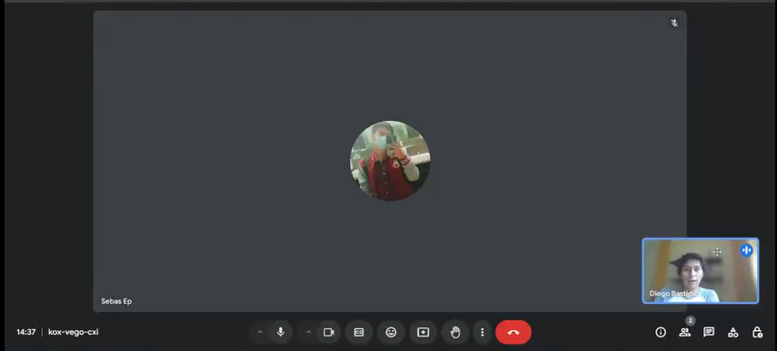

# Capítulo V: Product Implementation, Validation & Deployment
### 5.1. Software Configuration Management.
#### 5.1.1. Software Development Environment Configuration.
En esta sección, detallaremos las herramientas y plataformas que hemos utilizado como equipo para la realización de nuestro startup. Estas herramientas son esenciales para el desarrollo, la colaboración y la gestión del proyecto. A continuación, se presenta un resumen de cada una de las herramientas utilizadas:

- **GitHub**

    **Descripción:** GitHub es una plataforma de alojamiento de código fuente y colaboración basada en Git. Nos permite gestionar el código del proyecto, realizar revisiones de código, y colaborar de manera eficiente con nuestro equipo. 
    **Uso:** Se utilizó para el versionado del código, gestión de ramas y pull requests, así como para la documentación del proyecto.

- **Git**

    **Descripción:** Git es un sistema de control de versiones distribuido que facilita la gestión de cambios en el código fuente.  **Uso:** Se empleó para realizar commits, push y pull de cambios, así como para la gestión de ramas, permitiendo una colaboración fluida y eficiente en el desarrollo del proyecto.

- **Canva**

    **Descripción:** Canva es una herramienta de diseño gráfico en línea que permite crear gráficos y elementos visuales de manera intuitiva.  **Uso:** Se utilizó para diseñar gráficos y elementos visuales para la landing page del proyecto, incluyendo banners, íconos y otros elementos de diseño que mejoran la presentación visual de la aplicación.

- **Visual Studio Code**

    **Descripción:** Visual Studio Code (VS Code) es un editor de código fuente ligero y extensible que soporta una amplia variedad de lenguajes de programación.  **Uso:** Se utilizó como el principal editor de código para escribir y editar el código del proyecto, aprovechando sus extensiones para mejorar la productividad y facilitar el desarrollo.

- **WhatsApp**

    **Descripción:** WhatsApp es una aplicación de mensajería instantánea que facilita la comunicación rápida y efectiva.  **Uso:** Se empleó para la comunicación diaria entre los miembros del equipo, coordinando tareas, resolviendo problemas y organizando reuniones informales.

- **Google Meet**

    **Descripción:** Google Meet es una herramienta de videoconferencia que permite realizar reuniones virtuales con facilidad.  **Uso:** Se utilizó para llevar a cabo reuniones virtuales de equipo, facilitando discusiones en tiempo real y presentaciones de avances del proyecto a los stakeholders y al equipo.

- **Figma**

    **Descripción:** Figma es una herramienta de diseño colaborativo en línea que permite crear y prototipar interfaces de usuario.  **Uso:** Se empleó para el diseño de interfaces y prototipos del proyecto, permitiendo la colaboración en tiempo real entre diseñadores y desarrolladores para ajustar y revisar el diseño de la aplicación.

  

#### 5.1.2. Source Code Management.

**Gestión del Código Fuente:**

En esta sección, se detalla cómo gestionamos y supervisamos el desarrollo del código para el proyecto PawFect Care. Utilizamos GitHub como nuestra plataforma principal para la gestión del código fuente, complementada por Git como sistema de control de versiones. Además, seguimos el flujo de trabajo GitFlow para estructurar el desarrollo de manera eficiente.

- Repositorio GitHub para nuestra Landing Page:
<b>https://upc-pre-si729-2402-wx51-g4-aceitunitas.github.io/-PawfectCareLanding-Page.github.io/</b>

**Ramas Principales:**
- **main:** Esta rama, a menudo llamada "master", contiene la versión más estable y final del proyecto, lista para ser desplegada en producción. Los cambios integrados en esta rama han pasado todas las pruebas y revisiones necesarias, y se consideran completamente preparados para su lanzamiento.

- **develop:** La rama develop es el punto central de integración para las nuevas funcionalidades y mejoras en desarrollo. Las características y correcciones se fusionan en esta rama, donde se realizan pruebas adicionales antes de su eventual integración en la rama main.

**Ramas Auxiliares:**

- **releases:** Las ramas de tipo releases se crean para preparar nuevas versiones del proyecto. En estas ramas se llevan a cabo las pruebas finales y se corrigen errores menores antes del lanzamiento oficial. Una vez que una versión ha sido validada, los cambios se integran en la rama develop para futuros desarrollos y luego se fusionan en la rama main para su despliegue.

**Uso de GitFlow:**

- **Feature Branches:** Se utilizan ramas de características para desarrollar nuevas funcionalidades. Estas ramas se crean a partir de la rama develop y, una vez que se completa el desarrollo y se aprueban las revisiones, se fusionan nuevamente en la rama develop.

- **Bugfix Branches:** Para solucionar errores que necesitan ser corregidos antes de la siguiente versión, se utilizan ramas de corrección de errores. Estas ramas se crean a partir de la rama develop o, en casos críticos, desde la rama main.

- **Hotfix Branches:** Se emplean para abordar errores críticos que requieren una solución urgente en producción. Estas ramas se crean a partir de la rama main, y una vez que el problema se resuelve, los cambios se fusionan tanto en la rama main como en la rama develop.

Este enfoque estructurado con GitFlow nos permite gestionar el desarrollo del código de manera eficiente, facilitando la integración de nuevas características, la corrección de errores y la preparación de versiones estables para producción.

**Commits Conventions:**

En PawFect Care, los commits se nombran de acuerdo con el avance y el contenido específico del trabajo realizado. No seguimos una convención rígida para los nombres de los commits; en su lugar, los desarrolladores utilizan descripciones claras y concisas para reflejar las modificaciones implementadas. Esto nos permite una mayor flexibilidad a la hora de registrar el progreso, asegurando que cada commit tenga un nombre que represente con precisión el trabajo efectuado.

#### 5.1.3. Source Code Style Guide & Conventions.
En PawFect hemos implementado varias convenciones de estilo para asegurar un desarrollo de código claro y consistente en distintos lenguajes y tecnologías:

<b>HTML y CSS:</b>  

1. El tipo de documento se declara al inicio del archivo con `<!DOCTYPE html>`.

2. Se añaden los meta tags necesarios.

3. La etiqueta `<title>` se incluye dentro del bloque `<head>`.

4. Usamos una indentación de dos espacios.

5. Se escriben en minúsculas los nombres de los elementos HTML, atributos, propiedades, valores y selectores CSS.

6. Los atributos de los elementos HTML siempre están entre comillas.

7. Cada elemento HTML debe contar con su etiqueta de cierre.

8. Se evita escribir líneas de código demasiado largas.

9. Para las imágenes, se especifican tanto el ancho y alto como el texto alternativo.

<b>JavaScript</b>

1. Cada línea de código termina con un punto y coma.

2. Las variables y funciones siguen la convención de CamelCase.

3. Las cadenas de texto (strings) se colocan entre comillas simples.

4. La indentación es de 2 espacios.

5. Se utiliza preferentemente let y const en lugar de var para declarar variables.

6. Gherkin (Convenciones de Gherkin para Especificaciones Legibles)

7. Se utilizan los términos "Given", "When", "Then" y "And" para definir los pasos del escenario.

8. Los pasos que comienzan con "And" se indentan.

9. Se deja una línea en blanco entre los pasos.

10. Los parámetros se colocan entre comillas simples.

11. Se separan los escenarios con un comentario y dos líneas en blanco.

Estas convenciones nos ayudan a mantener el código organizado, legible y coherente a lo largo del proyecto.

- US01:

- US02:

- US03:

- US04:

- US05:

- US06:

- US07:

- US08:

- US09:

- US010:

- US11:

- US12:

- US13:

- US014:

- US15:

### 5.1.4. Configuración de la implementación del software
En este apartado, abordaremos el despliegue de la Landing Page de Pawfect Care utilizando GitHub. A continuación, se describen los pasos para habilitar el acceso a la página de destino de Pawfect Care y se incluirán capturas de pantalla para ilustrar el proceso.

1. Nos aseguramos que la configuración de GitHub Pages esté habilitada para el repositorio de la Landing Page de Pawfect Care. Para ello, accedemos a la configuración del repositorio en GitHub.  

2. Accdemos a Github Pages:  

3. Tras seleccionar la configuracion adecuada, GitHub Pages nos proporcionará la URL de la Landing Page de Pawfect Care, la cual podremos compartir y acceder públicamente.  

Enlace a la Landing Page de Pawfect Care: 
https://upc-pre-si729-2402-wx51-g4-aceitunitas.github.io/-PawfectCareLanding-Page.github.io/ 

## 5.2. Landing Page, Services & Applications Implementation

### 5.2.1. Sprint 1

#### 5.2.1.1. Sprint Planning 1

<table>
  <tr>
    <th> Sprint # </th>
    <th> Sprint 1 </th>
  </tr>
  <tr>
    <td style="font-weight: bold;" colspan="2"> Sprint Planning Background </td>
  </tr>
  <tr>
    <td style="font-weight: bold;"> Date </td>
    <td> 09/07/2024 </td>
  </tr>
  <tr>
    <td style="font-weight: bold;"> Time </td>
    <td> 19:00 horas (GMT-5) </td>
  </tr>
  <tr>
    <td style="font-weight: bold;"> Location </td>
    <td> Virtual (Google Meet) </td>
  </tr>
  <tr>
    <td style="font-weight: bold;"> Prepared By </td>
    <td> Gutierrez Garcia, Jose Eduardo </td>
  </tr>
  <tr>
    <td style="font-weight: bold;"> Attendees (to planning meeting) </td>
    <td>
      Bastidas Bastidas, Diego Martin 
      Chavez Uribe, Ario Joel 
      Gutierrez Garcia, Jose Eduardo 
      Perez Garcia, David Alexander 
      Zuniga Calle, Sebastian Gabriel
    </td>
  </tr>
  <tr>
    <td style="font-weight: bold;"> Sprint 1 Review Summary </td>
    <td> Al este ser nuestro primer sprint de desarrollo no existe un review summary del sprint </td>
  </tr>
  <tr>
    <td style="font-weight: bold;"> Sprint 1 Retrospective Summary </td>
    <td> Ya que es nuestro primer sprint aún no identificamos ningun plane de mejora. </td>
  </tr>
  <tr>
    <td style="font-weight: bold;" colspan="2"> Sprint Goal & User Stories </td>
  </tr>
  <tr>
    <td style="font-weight: bold;"> Sprint 1 Goal </td>
    <td> Desarrollar e implementar las secciones clave de la Landing Page para que los usuarios puedan explorar las características principales de Pawfect Care y entender los beneficios del servicio. </td>
  </tr>
  <tr>
    <td style="font-weight: bold;"> Sprint 1 Velocity </td>
    <td> <strong>8 </strong>  El equipo ha establecido una capacidad de 8 Story Points para este Sprint, basada en la experiencia y la carga de trabajo estimada. </td>
  </tr>
  <tr>
    <td style="font-weight: bold;"> Sum of Story Points </td>
    <td> 8 </td>
  </tr>
</table>

#### 5.2.1.2. Sprint Backlog 1

| id   | Title                  | Id  | Title                                                    | Description                                                                                                   | Estimations(Hours) | Assigned To   | Status(To-do /InProcess/ToReview/Done) |
| ---- | ---------------------- | --- | -------------------------------------------------------- | ------------------------------------------------------------------------------------------------------------- | ------------------ | ------------- | -------------------------------------- |
| US12 | Barra de navegación en la Landing Page     | TS01 |Barra de navegación en la Landing Page (Desarrollado en HTML, CSS y JS).| Implementación del header y la barra de navegación, desarrollados en HTML, CSS y JS con diseño responsive. | 8                  | Diego | Done                                   |
| US13 | Sección "Why Choose Us?"    | TS02 | Sección "Why Choose Us?" (Desarrollado en HTML, CSS y JS).|Implementación de la sección "Why Choose Us", con diseño responsive y optimización en HTML, CSS y JS. | 6                | David | Done                                   |
| US03 | Sección de suscripciones           | TS03 | Sección de suscripciones (Desarrollado en HTML, CSS y JS).| Desarrollo de la sección de suscripciones, con integración de opciones de pago, en HTML, CSS y JS.           | 4                 | Jose   | Done                                   |
| US04 | Reseñas de clientes | TS04 | Reseñas de clientes (Desarrollado en HTML, CSS y JS).| Implementación de la sección de reseñas de clientes, con diseño responsive en HTML, CSS y JS.| 4 | Ario & Gabriel | Done

Este enfoque asegura que el equipo se concentre en las partes esenciales de la Landing Page, permitiendo que los usuarios exploren la plataforma de manera efectiva.

#### 5.2.1.3. Development Evidence for Sprint Review

| Repository | Branch | Commit Id | Commit  Message | Commit  Message Body | Commited  on (Date) |
|:-------------:|:---------------:|:-------------:|:-------------:|:---------------:|:-------------:|
| [PawFect Care  Landing Page](https://github.com/UPC-PRE-SI729-2402-WX51-G4-Aceitunitas/Pawfect-Care-Report) | main | b342095| Create index.html |  | 09/07/2024 |
| Landing | feat/section-home | e352819| feat: added/section-home |  | 09/07/2024 |
| Landing | feat/section-subscription | 5e84a90 | feat: added Section subscription |  | 09/07/2024 |
| Landing | feat/section-subscription | faf615f | feat: complete Section subscription |  | 09/07/2024|
| Landing | feat/section-review | 2b26403 | Add: feat: added contact, review and footer |  | 09/07/2024 |
| Landing | feat/section-typography | a1fe77e | feat: typography changed |  | 09/07/2024 |
| Landing | main| 2f9452b | feat: landing page deployment|  | 09/07/2024 |

#### 5.2.1.4. Testing Suite Evidence for Sprint Review
Durante este sprint, hemos llevado a cabo las pruebas de aceptación utilizando la herramienta Gherkin. Puedes encontrar los escenarios de estas pruebas dando click aqui: https://github.com/UPC-PRE-SI729-2402-WX51-G4-Aceitunitas/PawFect-care-Acceptance-Tests

| Repository | Branch | Commit Id | Commit  Message | Commit  Message Body | Commited  on (Date) |
|:-------------:|:---------------:|:-------------:|:-------------:|:---------------:|:-------------:|
| PawFect Care   Acceptance Tests | main | 4bbda94 | Initial commit |  | 09/07/2024 |
|   | main | 66c33e5 | feat: added acceptance tests |  | 09/07/2024 |
|   | main | 91e4297 | feat: added images |  | 09/07/2024 |

#### 5.2.1.5. Execution Evidence for Sprint Review
En esta entrega, el equipo PawFect Care ha logrado completar con éxito la creación y el deployment de la Landing Page.

Enlace del deployment de la Landing Page: [https://upc-pre-si729-2402-wx51-g4-aceitunitas.github.io/-PawfectCareLanding-Page.github.io/](https://upc-pre-si729-2402-wx51-g4-aceitunitas.github.io/-PawfectCareLanding-Page.github.io/)

Sección de header donde se encuentra el menu de navegación principal y el Banner donde se muestra un mensaje con una imagen acerca de PawFect Care:

Sección para saber que ofrecemos en nuestra plataforma:

Seccion de ventajas

Sección de ventajas 2

Sección para ver las subscripciones que ofrecemos:

Sección de reseñas de clientes:

Sección de contacto:

Sección de footer:

#### 5.2.1.6. Services Documentation Evidence for Sprint Review

En esta entrega, nos enfocamos en Landing page, por lo que no fue necesario ningún servicio adicional.

#### 5.2.1.7. Software Deployment Evidence for Sprint Review

En este caso se uso GitHub Pages, para desplegar la Landing page, el cual nos sirvio para, a partir de un código en un repositorio poder desplegar la página. Enlace de la landing page: https://upc-pre-si729-2402-wx51-g4-aceitunitas.github.io/-PawfectCareLanding-Page.github.io/

#### 5.2.1.8. Team Collaboration Insights during Sprint
Para llevar a cabo este proyecto se usaron distintas herramientas como Visual Studio Code; junto con manejo de versiones en Git. En este caso se dividio la landing page mostrada anteriormente en sectores, a partir de esto cada uno presentó su parte y luego un miembro juntó las partes para finalmente tener el resultado deseado.

### 5.2.2. Sprint 2

#### 5.2.2.1. Sprint Planning 1

<table>
  <tr>
    <th> Sprint # </th>
    <th> Sprint 2 </th>
  </tr>
  <tr>
    <td style="font-weight: bold;" colspan="2"> Sprint Planning Background </td>
  </tr>
  <tr>
    <td style="font-weight: bold;"> Date </td>
    <td> 26/09/2024 </td>
  </tr>
  <tr>
    <td style="font-weight: bold;"> Time </td>
    <td> 23:00 horas (GMT-5) </td>
  </tr>
  <tr>
    <td style="font-weight: bold;"> Location </td>
    <td> Virtual (Google Meet) </td>
  </tr>
  <tr>
    <td style="font-weight: bold;"> Prepared By </td>
    <td> Gutierrez Garcia, Jose Eduardo </td>
  </tr>
  <tr>
    <td style="font-weight: bold;"> Attendees (to planning meeting) </td>
    <td>
      Bastidas Bastidas, Diego Martin 
      Chavez Uribe, Ario Joel 
      Gutierrez Garcia, Jose Eduardo 
      Perez Garcia, David Alexander 
      Zuniga Calle, Sebastian Gabriel
    </td>
  </tr>
  <tr>
    <td style="font-weight: bold;"> Sprint 2 Review Summary </td>
    <td> Este sprint estuvo enfocado en el desarrollo del front-end y la implementación básica de la web app de Pawfect Care. Las funcionalidades claves de la landing page fueron completadas, permitiendo que los usuarios exploren el servicio. Las secciones desarrolladas incluyen el diseño de la barra de navegación, el área de suscripciones y las reseñas de clientes. El equipo cumplió con la entrega planificada y avanzó en la estructuración de la interfaz gráfica. </td>
  </tr>
  <tr>
    <td style="font-weight: bold;"> Sprint 2 Retrospective Summary </td>
    <td> Aunque fue un sprint de desarrollo, el equipo identificó algunas áreas de mejora en la comunicación durante el proceso de implementación. La retroalimentación se centró en ajustar los tiempos de reunión y mejorar la distribución de tareas en el equipo. Se propuso mayor enfoque en la planificación de tareas individuales para evitar cuellos de botella. </td>
  </tr>
  <tr>
    <td style="font-weight: bold;" colspan="2"> Sprint Goal & User Stories </td>
  </tr>
  <tr>
    <td style="font-weight: bold;"> Sprint 2 Goal </td>
    <td> El objetivo de este sprint es desarrollar e implementar el front-end de la aplicación web, permitiendo a los usuarios navegar de manera intuitiva y explorar las principales características de Pawfect Care. Se busca tener una Landing Page completamente funcional que muestre los beneficios del servicio. </td>
  </tr>
  <tr>
    <td style="font-weight: bold;"> Sprint 2 Velocity </td>
    <td> <strong>8 </strong>  El equipo ha establecido una capacidad de 8 Story Points para este Sprint, tomando en cuenta el alcance del desarrollo del front-end y la carga estimada de trabajo. </td>
  </tr>
  <tr>
    <td style="font-weight: bold;"> Sum of Story Points </td>
    <td> 8 </td>
  </tr>
</table>

#### 5.2.2.2. Sprint Backlog 2

| id   | Title                  | Id  | Title                                                    | Description                                                                                                   | Estimations(Hours) | Assigned To   | Status(To-do /InProcess/ToReview/Done) |
| ---- | ---------------------- | --- | -------------------------------------------------------- | ------------------------------------------------------------------------------------------------------------- | ------------------ | ------------- | -------------------------------------- |
| US04 | 	Creación de Perfil de Mascota   | TS05 | 	Creación de Componente para Perfil de Mascota | Desarrollo de la funcionalidad para la creación de un perfil de mascota, con datos básicos e imagen de perfil. | 12   | Diego | Done                                   |
| US05 | Edición de Perfil de Mascota   | TS06 | Componente de Edición de Perfil de Mascota	 |Implementación de la funcionalidad para editar el perfil de la mascota. | 10 | David | Done                                   |
| US03 | Registro de Usuario   | TS07 | Implementación de la Lista de Clientes  	 | Creación de la lista de clientes, permitiendo la visualización y gestión de los perfiles de los clientes. | 8               | Jose   | Done                          |
| US04 | 	Gestión de Perfiles de Usuarios | TS08 | Módulo de Gestión de Perfiles de Usuarios	|Funcionalidad para gestionar perfiles de usuarios, permitiendo la edición y eliminación de cuentas. | 8 | Ario  | Done

En este sprint se implementaron funcionalidades clave como la creación y edición de perfiles de mascotas, el registro de usuarios, y la gestión de perfiles. Todas las tareas fueron desarrolladas con Angular y TypeScript, asegurando una integración eficiente y una experiencia de usuario fluida. Se añadieron características como la subida de imágenes y validaciones básicas de seguridad, completando con éxito las funcionalidades necesarias para gestionar perfiles de usuarios y mascotas.

#### 5.2.2.3. Development Evidence for Sprint Review

| Repository | Branch | Commit Id | Commit  Message | Commit  Message Body | Commited  on (Date) |
|:-------------:|:---------------:|:-------------:|:-------------:|:---------------:|:-------------:|
| [PawFect Care   FrontEnd](https://github.com/UPC-PRE-SI729-2402-WX51-G4-Aceitunitas/Pawfect-Care-App-Web) | main | a06a0ea| initial commit |  | 26/09/2024 |
| FrontEnd | feat/mascotas | 8d5679e| feat: added/pets-component |  | 27/09/2024 |
| FrontEnd | feat/login | 3a26b2c | feat: added/login section |  | 27/09/2024 |
| FrontEnd | feat/internationalization | 1d397be |feat: added/internationalization component |  | 09/07/2024|
| FrontEnd | feat/clientes | 127a580 | Afeat: added/clients-component |  | 27/09/2024 |
| FrontEnd | feat/API-Service | d4234f5 | feat: added/Fake API Services |  | 27/09/2024 |
| FrontEnd | develop| 520dfde | feat: FrontEnd deployment|  | 27/09/2024 |
| FrontEnd | main| b0aa017 | feat: FrontEnd deployment   |  | 27/09/2024 |

| Repository | Branch | Commit Id | Commit  Message | Commit  Message Body | Commited  on (Date) |
|:-------------:|:---------------:|:-------------:|:-------------:|:---------------:|:-------------:|
| [PawFect Care   Fake API](https://github.com/UPC-PRE-SI729-2402-WX51-G4-Aceitunitas/Pawfect-Care-FakeAPI) | develop | 2d1f417| feat: added api fake |  | 27/09/2024 |
| Fake API | main | 2d1f417 | feat: added api fake  |  | 27/09/2024 |

#### 5.2.2.4. Testing Suite Evidence for Sprint Review
Durante este sprint, hemos llevado a cabo las pruebas de aceptación utilizando la herramienta Gherkin. Puedes encontrar los escenarios de estas pruebas dando click aqui: [https://github.com/UPC-PRE-SI729-2402-WX51-G4-Aceitunitas/PawFect-care-Acceptance-Tests](https://github.com/UPC-PRE-SI729-2402-WX51-G4-Aceitunitas/PawFect-care-Acceptance-Tests)

| Repository | Branch | Commit Id | Commit  Message | Commit  Message Body | Commited  on (Date) |
|:-------------:|:---------------:|:-------------:|:-------------:|:---------------:|:-------------:|
| PawFect Care   Acceptance Tests | main | 4bbda94 | Initial commit |  | 09/07/2024 |
|   | main | 66c33e5 | feat: added acceptance tests |  | 09/07/2024 |
|   | main | 91e4297 | feat: added images |  | 09/07/2024 |

#### 5.2.2.5. Execution Evidence for Sprint Review
En esta entrega, el equipo PawFect Care ha logrado completar con éxito la creación y el deployment de el FrontEnd de la Aplicación Web.

Enlace del deployment de la Landing Page: [https://pawfect-care-app-web.web.app](https://pawfect-care-app-web.web.app/home)

Además, también hemos desplegado una Fake API para simular las interacciones del backend con los datos, permitiendo realizar pruebas y asegurar el correcto funcionamiento de las funcionalidades de la aplicación.

Enlace de la Fake API: [https://my-json-server.typicode.com/UPC-PRE-SI729-2402-WX51-G4-Aceitunitas/Pawfect-Care-FakeAPI](https://my-json-server.typicode.com/UPC-PRE-SI729-2402-WX51-G4-Aceitunitas/Pawfect-Care-FakeAPI)

**Sección de Home para saber quienes somos**

Seccion Lista de Mascotas

Seccion Lista de Clientes

Seccion Lista de Eventos

#### 5.2.2.6. Services Documentation Evidence for Sprint Review

En el alcance del sprint 2, se ha dado prioridad al desarrollo del frontend de la aplicación web, lo que significa que en este sprint no se observa la utilización de servicios web.

#### 5.2.2.7. Software Deployment Evidence for Sprint Review

Durante este sprint, se ha completado el desarrollo del frontend de la aplicación web. Para el despliegue, se utilizaron las siguientes herramientas y servicios:

  <li>Git: Sistema de control de versiones que utilizamos para trabajar de forma colaborativa y monitorear las versiones de la aplicación web en un repositorio remoto.</li>
  <li>Gitflow: Este flujo de trabajo colaborativo nos ha permitido dividir el trabajo en ramas dentro de nuestro repositorio, lo que facilita la colaboración en el desarrollo.</li>
  <li>GitHub: La plataforma que nos proporcionó la herramienta para crear nuestro repositorio y almacenar las versiones de nuestro proyecto.</li>
  <li>my-json-server.typicode: Utilizado para crear y desplegar una Fake API que simula las interacciones del backend, permitiendo realizar pruebas del frontend con datos estructurados.</li>
  <li>Firebase: Una plataforma que automatiza la implementación de aplicaciones web, lo que nos permitió alojar y desplegar nuestra aplicación web.</li>

#### 5.2.2.8. Team Collaboration Insights during Sprint

El equipo organizó el desarrollo del frontend de la aplicación web en ramas para abordar cada sección de forma independiente, optimizando así el mantenimiento y la colaboración durante el sprint. Se siguieron las convenciones estándar de GitFlow, por lo que se crearon ramas de desarrollo y de funcionalidad (bounded-context) según la necesidad. A continuación, se detallan las tareas asignadas a cada miembro del equipo, así como los comentarios del equipo a través de la plataforma GitHub:

| Alumno                         | Actividad                                                                                                                                                                                        |
| ------------------------------ | ------------------------------------------------------------------------------------------------------------------------------------------------------------------------------------------------ |
| Bastidas Bastidas, Diego Martin  | Se encargó de la creación del componente para el perfil de mascota, implementando la funcionalidad para la creación de un perfil con datos e imagen.              |
| Perez Garcia, David Alexander | Se encargó del desarrollo del componente de edición del perfil de mascota, permitiendo la modificación de los datos del perfil de la mascota. |
| Gutierrez Garcia, Jose Eduardo   |Se encargó de la implementación de la lista de clientes, permitiendo la visualización y gestión de los perfiles de los clientes en la plataforma.                                                  |
| Chavez Uribe, Ario Joel   |Se encargó de la implementación del módulo de gestión de perfiles de usuarios, permitiendo la edición y eliminación de cuentas en la plataforma              |
| Zuniga Calle, Sebastian Gabriel | Apoyó en la revisión general del código y contribuyó en la integración final del sprint para asegurar la funcionalidad entre los diferentes módulos.                          |

A continuación, se mostrará la tabla de colaboradores en el repositorio de GitHub, con el objetivo de identificar a cada miembro del equipo.

Tabla de integrantes:

| Username (GitHub) | Nombre                         |
| ----------------- | ------------------------------ |
| ghostnotfound404  | Bastidas Bastidas, Diego Martin  |
| feg06             | Chavez Uribe, Ario Joel  |
| elcrackje         | Gutierrez Garcia, Jose Eduardo  |
| davidalexd        | Perez Garcia, David Alexander   |
| SeZuu             | Zuniga Calle, Sebastian Gabriel   |

A continuación se mostrarán los gráficos de insights durante el sprint:

Anexo: Flujo de trabajo entre las ramas.

Anexo: Tablas de commits en el periodo de 1 mes.

### 5.3. Validation Interviews
#### 5.3.1. Diseño de Entrevistas
  ***Segmento 1: Médicos Veterinarios***
1. ¿Cual es tu nombre?
1. ¿Cuantos años tienes?
1. ¿Tiempo de experiencia?
1. ¿Que Aplicativo usas?
1. ¿Que te parecio la interacción con Pawfect Care?
1. ¿Que es lo que modificarias o añadirias?

***Segmento 2: Dueños de Mascotas***

1. ¿Que te parecio la interacción con Pawfect Care?
1. ¿Que es lo que modificarias o añadirias?
1. ¿Que tan sencillo te parecio el uso de Pawfect Care?
#### 5.3.2. Registro de Entrevistas

   ***Segmento 1: Médicos Veterinarios***

   **Entrevistado N°1: Valentino Tirado**

- **Sexo: Masculino** 
- **Edad: 32 años**
- **Domicilio: Los Olivos** 

**Entrevista:** 

- **Link: https://upcedupe-my.sharepoint.com/:v:/g/personal/u20221a301_upc_edu_pe/EUx7FkGdfXlFub7BA-ppHLwBZgLQV6tDt1LyUZzG-bGDOw?nav=eyJyZWZlcnJhbEluZm8iOnsicmVmZXJyYWxBcHAiOiJPbmVEcml2ZUZvckJ1c2luZXNzIiwicmVmZXJyYWxBcHBQbGF0Zm9ybSI6IldlYiIsInJlZmVycmFsTW9kZSI6InZpZXciLCJyZWZlcnJhbFZpZXciOiJNeUZpbGVzTGlua0NvcHkifX0&e=WX6I6x** 
- **Momento en el que Inicia: 0:00 min**
- **Duración: 7:10 min**

**Resumen:**

`	`El doctor Valentino nos explica que esta aplicación representa una innovación significativa en su práctica, ya que permite optimizar notablemente el tiempo durante las consultas. Uno de los aspectos que destaca es la facilidad y rapidez para crear historias clínicas, una tarea que actualmente le resulta tediosa y que consume mucho tiempo cuando utiliza VetPraxis. Esta plataforma, sin embargo, le ofrece una solución más eficiente y ágil. Además, sugiere la incorporación de una sección específica para el "Servicio de Baños", que permitiría registrar los baños realizados cada día, facilitando un control más organizado y detallado de estos servicios en beneficio de sus pacientes y de su equipo de trabajo.

**Entrevistado N°2: Anamaria Linares**

- **Sexo: Femenino** 
- **Edad: 28 años**
- **Domicilio: San Miguel** 

**Entrevista:** 

- **Link: https://upcedupe-my.sharepoint.com/:v:/g/personal/u20221a301_upc_edu_pe/EX3RCizXhMRJutn6EsuAy9IBckxpeIO2bu3eQ5yNuSqRvw?nav=eyJyZWZlcnJhbEluZm8iOnsicmVmZXJyYWxBcHAiOiJPbmVEcml2ZUZvckJ1c2luZXNzIiwicmVmZXJyYWxBcHBQbGF0Zm9ybSI6IldlYiIsInJlZmVycmFsTW9kZSI6InZpZXciLCJyZWZlcnJhbFZpZXciOiJNeUZpbGVzTGlua0NvcHkifX0&e=xspNht** 
- **Momento en el que Inicia: 0:00 min**
- **Duración: 5:19 min**

**Resumen:**

` ` La doctora Anamaria actualmente utiliza VetPraxis, pero ha expresado su descontento debido a la gran cantidad de campos que, aunque no son obligatorios, resultan innecesarios y terminan ralentizando la creación de historias clínicas. Esto le hace perder tiempo en sus tareas diarias. Sin embargo, la doctora encuentra interesante la propuesta de la nueva aplicación, especialmente por su simplicidad y facilidad de uso, que considera una mejora significativa. Además, sugiere añadir una sección dedicada al "grooming", ya que en la clínica veterinaria donde trabaja se ofrece este servicio, y le parece importante tener un apartado específico para llevar un control adecuado de estos procedimientos. Esta función, según comenta, facilitaría la gestión y registro de los servicios de grooming, mejorando la organización y seguimiento dentro de la clínica.

**Entrevistado N°3: ** 

- **Sexo: **
- **Edad: **
- **Domicilio: ** 

**Entrevista:** 

- **Link:  ** 
- **Momento en el que Inicia: **
- **Duración: **

**Resumen:**

` ` 

***Segmento 2: Dueños de Mascotas***

**Entrevistado N°1: Sebastián Silva**

- **Sexo: Masculino**
- **Edad: 20**
- **Domicilio: San Luis** 

**Entrevista:** 

- **Link: https://upcedupe-my.sharepoint.com/:v:/g/personal/u20221a301_upc_edu_pe/EWO04koXWcVAs4nPzrfvTFcB8sZNHkuyGgmyve2v9Y3bCA?nav=eyJyZWZlcnJhbEluZm8iOnsicmVmZXJyYWxBcHAiOiJPbmVEcml2ZUZvckJ1c2luZXNzIiwicmVmZXJyYWxBcHBQbGF0Zm9ybSI6IldlYiIsInJlZmVycmFsTW9kZSI6InZpZXciLCJyZWZlcnJhbFZpZXciOiJNeUZpbGVzTGlua0NvcHkifX0&e=5zSnLn** 
- **Momento en el que Inicia: 0:00 min**
- **Duración: 7:33 min**

**Resumen:**

` `Sebastián Silva expresa que está muy satisfecho con el aplicativo y considera excelente la idea de tener acceso a la historia clínica de su mascota en cualquier lugar. Esto le resulta especialmente útil, ya que le permite brindar una explicación más completa y precisa si en algún momento necesita cambiar de médico o de veterinaria. Además, sugiere agregar un apartado específico para "Enfermedades", donde se pueda incluir una breve descripción de cada una. Esta funcionalidad ayudaría a ofrecer una visión más detallada y clara sobre el diagnóstico de su mascota, facilitando tanto el seguimiento de su salud como la comprensión de las condiciones médicas en caso de consultas con otros profesionales.

**Entrevistado N°2: Sebastian Escobar**

- **Sexo: Masculino** 
- **Edad: 20 años**
- **Domicilio: Santa Anita**

**Entrevista:** 

- **Link: https://upcedupe-my.sharepoint.com/:v:/g/personal/u20221a301_upc_edu_pe/Edj5SJ4zT29EjTLgcsUoObkBt5xJVe5eXwZ1aGQfNuB44w?nav=eyJyZWZlcnJhbEluZm8iOnsicmVmZXJyYWxBcHAiOiJPbmVEcml2ZUZvckJ1c2luZXNzIiwicmVmZXJyYWxBcHBQbGF0Zm9ybSI6IldlYiIsInJlZmVycmFsTW9kZSI6InZpZXciLCJyZWZlcnJhbFZpZXciOiJNeUZpbGVzTGlua0NvcHkifX0&e=nZAvtC** 
- **Momento en el que Inicia: 0:00 min**
- **Duración: 6:56 min**	

**Resumen:**

` `Sebastián Escobar considera muy útil la posibilidad de tener acceso a la historia clínica de su mascota en cualquier momento y destaca lo valioso que es que sea el propio doctor quien pueda detallar esta información. Esto le genera mayor confianza en la precisión y claridad de los registros médicos. Como sugerencia, Sebastián propuso un cambio en la paleta de colores del aplicativo, recomendando el uso de tonos pastel para darle un aspecto más suave y profesional, acorde a la apariencia de una aplicación médica. Este ajuste en el diseño visual contribuiría a una experiencia de uso más agradable y coherente con el propósito médico de la herramienta.

**Entrevistado N°3: Shantal Quezada**

- **Sexo: Femenino**
- **Edad: 25 años**
- **Domicilio: Surco** 

**Entrevista:** 

- **Link: https://upcedupe-my.sharepoint.com/:v:/g/personal/u20221a301_upc_edu_pe/ETg4urEPd_9BjxrgUNwage8Bsi9znPbJLLwyQ1sFmCcGmg?nav=eyJyZWZlcnJhbEluZm8iOnsicmVmZXJyYWxBcHAiOiJPbmVEcml2ZUZvckJ1c2luZXNzIiwicmVmZXJyYWxBcHBQbGF0Zm9ybSI6IldlYiIsInJlZmVycmFsTW9kZSI6InZpZXciLCJyZWZlcnJhbFZpZXciOiJNeUZpbGVzTGlua0NvcHkifX0&e=lhFfmG**
- **Momento en el que Inicia: 0:00 min**
- **Duración: 4:43 min**

**Resumen:**

`	`Shantal encuentra muy atractiva la idea de contar con un aplicativo que le permita tener su historia clínica en un solo lugar, ya que de esta forma evitaría el riesgo de perderla. Sin embargo, sugiere una mejora importante en el proceso de registro de usuarios. Comenta que preferiría no depender de que la veterinaria le envíe un usuario y contraseña, ya que existe la posibilidad de que se olvide o se retrase. En su lugar, le gustaría tener la opción de crear su propia cuenta de manera autónoma, lo cual le brindaría más control y acceso inmediato a su información, haciéndole sentir que su historia clínica está segura y siempre disponible para ella.

#### 5.3.3. Evaluaciones según heurísticas

| **Site o App a Evaluar** | Pawfect-care |
| :- | :- |
| **Tareas a evaluar** | El alcance de esta evaluación incluye la revisión de la usabilidad de las siguientes tareas |
| **Desktop landing page** | - Información y descripción de la aplicación y sus funcionalidades    - Información y breve descripción sobre el equipo de trabajo    - Visualización de testimonios    - Header y footer funcionales |
| **Desktop Web Applications** | - Visualización de infromación registrada en el sistema   - Header y footer funcionales   - Pestañas de navegación dentro de la aplicación   - Botones interactivos y de uso intuitivo   - Visualización de ítems relacionados
| **No incluidas en esta versión de la evaluación** | - Desktop landing page   - Formulario para crear cuenta o cambiar contraseña   - Política de privacidad y condiciones de uso   - Desktop Web Applications   - Visualización de Perfil de usuario   - Descripción detallada de productos al seleccionar   - Política de privacidad y condiciones de uso

ESCALA DE SEVERIDAD:

Los errores serán puntuados tomando en cuenta la siguiente escala de severidad:

|Nivel|Descripción|
| :- | :- |
|1|Problema superficial: puede ser fácilmente superado por el usuario u ocurre con muy poca frecuencia. No necesita ser arreglado a no ser que exista disponibilidad de tiempo.|
|2|Problema menor: puede ocurrir un poco más frecuentemente o es un poco más difícil de superar para el usuario. Se le debería asignar una prioridad baja resolverlo de cara al siguiente release.|
|3|Problema mayor: ocurre frecuentemente o los usuarios no son capaces de resolverlos. Es importante que sean corregidos y se les debe asignar una prioridad alta.|
|4|Problema muy grave: un error de gran impacto que impide al usuario continuar con el uso de la herramienta. Es imperativo que sea corregido antes del lanzamiento.|

**TABLA RESUMEN AMBOS SEGMENTOS:**

**Web Application**

|#|Problema|Escala de severidad|Heurística/Principio violado|
| :- | :- | :- | :- |
|1||1|IA - Is it clear?|
|2||2|IA - Is it findable?|
|3||1|Usability - Consistency and standards|

**Landing Page**

|#|Problema|Escala de severidad|Heurística/Principio violado|
| :- | :- | :- | :- |
|1||1|IA - Is it clear?|
|2||1|IA - Is it usable?|
|3||1|IA - Is it usable?|

**DESCRIPCIÓN DE PROBLEMAS:**

**1. Web Application**

**PROBLEMA #1:**

| Severidad: 1 | Heurística violada: IA - Is it clear? |
| :- | :- |
| Problema: | La navegación dentro de la aplicación puede no ser clara, y los usuarios puedan tener dificultades para encontrar las secciones deseadas. |
| Recomendación: | Ampliar la estructura de la navegación y mejorar las etiquetas descriptivas a las pestañas. |

**PROBLEMA #2:** 

| Severidad: 2 | Heurística violada: IA - Is it findable? |
| :- | :- |
| Problema: | La información relevante está oculta o no es fácilmente accesible. |
| Recomendación: | Reorganizar la información para que sea más accesible y visible desde la pantalla principal. |

**2. Landing Page**

**PROBLEMA #1:**

| Severidad: 1| Heurística violada: Usability - Consistency and standards |
| :- | :- |
| Problema: | Hay inconsistencias en el diseño y los estándares utilizados en diferentes secciones de la aplicación. |
| Recomendación: | Establecer y seguir un conjunto claro de directrices de diseño para mantener la consistencia en toda la aplicación. |

**PROBLEMA #2:**

| *Severidad: 1 | Heurística violada: IA - Is it clear? |
| :- | :- |
| Problema: | La información sobre la aplicación y sus funcionalidades no es clara y puede confundir a los usuarios. |
| Recomendación: | Simplificar y clarificar la descripción de la aplicación y sus funcionalidades. |

**PROBLEMA #3:**

| Severidad: 1 | Heurística violada:IA - Is it usable? |
| :- | :- |
|Problema: | Los testimonios no son fáciles de visualizar y pueden pasar desapercibidos. |
| Recomendación: | Mejorar el apartado funcional respecto a solicitudes específicas.  |

### 5.4. Video About the Product

## Conclusiones

- La colaboración efectiva entre los miembros del equipo es crucial para el éxito del proyecto. Cada integrante debe tener claro su rol y responsabilidades, lo que permite avanzar de manera organizada y cubrir todos los aspectos necesarios, desde la planificación hasta la implementación.

- La creación de User Stories y Product Backlog ayuda a priorizar las funcionalidades clave. Esto garantiza que las necesidades más importantes de los usuarios sean abordadas primero, permitiendo desarrollar un producto más alineado con las expectativas y requisitos del mercado.

- La arquitectura de software y el diseño orientado a objetos facilitan la escalabilidad y el mantenimiento del producto. Es fundamental definir correctamente la estructura del sistema para permitir una implementación ágil y minimizar problemas durante el despliegue y la validación.

- Pruebas con APIs simuladas. El uso de la Fake API con my-json-server.typicode ha sido esencial para simular interacciones con el backend. Esto ha facilitado las pruebas del frontend sin necesidad de un backend completamente desarrollado, asegurando una experiencia de usuario más fluida y detectando posibles mejoras en la interacción entre las interfaces.

- Despliegue como hito clave. El deployment del frontend es un logro significativo, ya que representa la capacidad del equipo para trasladar el proyecto desde el entorno de desarrollo hasta un entorno accesible para los usuarios. Esto permite comenzar a probar la funcionalidad de la plataforma y recibir retroalimentación real de los usuarios

## Bibliografía

- Sedano, L. (2024). _Manual para la gestión eficaz de clínicas veterinarias: Estrategias administrativas y organizativas._ Recuperado de https://puntomedic.cl/blogs/manuales-y-guias/manual-para-la-gestion-eficaz-de-clinicas-veterinarias-estrategias-administrativas-y-organizativas 

- BioSystems S.A. (s.f.). _Guía de buenas prácticas en veterinaria._ Barcelona, España: ioSystems S.A. Recuperado de https://covetrioja.org/wp-content/uploads/2021/10/VET_GuiaBuenasPracticas_ESP.pdf 

## Anexos

**Anexo 1:**

Entrevistas Médicos Veterinarios: 
- [https://upcedupe-my.sharepoint.com/:v:/g/personal/u20221a301_upc_edu_pe/EQ-ZYy2RvYpNgt1Qfy9tHTUByB1wTz3kGVrQscVWHWam9A?nav=eyJyZWZlcnJhbEluZm8iOnsicmVmZXJyYWxBcHAiOiJPbmVEcml2ZUZvckJ1c2luZXNzIiwicmVmZXJyYWxBcHBQbGF0Zm9ybSI6IldlYiIsInJlZmVycmFsTW9kZSI6InZpZXciLCJyZWZlcnJhbFZpZXciOiJNeUZpbGVzTGlua0NvcHkifX0&e=j1mdQ7](https://upcedupe-my.sharepoint.com/:v:/g/personal/u20221a301_upc_edu_pe/EQ-ZYy2RvYpNgt1Qfy9tHTUByB1wTz3kGVrQscVWHWam9A?nav=eyJyZWZlcnJhbEluZm8iOnsicmVmZXJyYWxBcHAiOiJPbmVEcml2ZUZvckJ1c2luZXNzIiwicmVmZXJyYWxBcHBQbGF0Zm9ybSI6IldlYiIsInJlZmVycmFsTW9kZSI6InZpZXciLCJyZWZlcnJhbFZpZXciOiJNeUZpbGVzTGlua0NvcHkifX0&e=j1mdQ7)

- [https://upcedupe-my.sharepoint.com/:v:/g/personal/u20221a301_upc_edu_pe/EbCW9J6OzTFKoDAHzGbfWzEBpDcpUG7M16WiUuDkC7iPMA](https://upcedupe-my.sharepoint.com/:v:/g/personal/u20221a301_upc_edu_pe/EbCW9J6OzTFKoDAHzGbfWzEBpDcpUG7M16WiUuDkC7iPMA)

- [https://upcedupe-my.sharepoint.com/:v:/g/personal/u20221a301_upc_edu_pe/EYY7QpIHFxlDh0ksAmySO-kB1yHNDLGTJPHi61WTR0jlWg?nav=eyJyZWZlcnJhbEluZm8iOnsicmVmZXJyYWxBcHAiOiJPbmVEcml2ZUZvckJ1c2luZXNzIiwicmVmZXJyYWxBcHBQbGF0Zm9ybSI6IldlYiIsInJlZmVycmFsTW9kZSI6InZpZXciLCJyZWZlcnJhbFZpZXciOiJNeUZpbGVzTGlua0NvcHkifX0&e=JeOE4m](https://upcedupe-my.sharepoint.com/:v:/g/personal/u20221a301_upc_edu_pe/EYY7QpIHFxlDh0ksAmySO-kB1yHNDLGTJPHi61WTR0jlWg?nav=eyJyZWZlcnJhbEluZm8iOnsicmVmZXJyYWxBcHAiOiJPbmVEcml2ZUZvckJ1c2luZXNzIiwicmVmZXJyYWxBcHBQbGF0Zm9ybSI6IldlYiIsInJlZmVycmFsTW9kZSI6InZpZXciLCJyZWZlcnJhbFZpZXciOiJNeUZpbGVzTGlua0NvcHkifX0&e=JeOE4m)

Entrevistas Dueños de Mascotas: 

- [https://upcedupe-my.sharepoint.com/:v:/g/personal/u20221a301_upc_edu_pe/Ec1XInM48xNOvR2jbzHkwuABf9CG5aosdZClZOwqh0nyYw](https://upcedupe-my.sharepoint.com/:v:/g/personal/u20221a301_upc_edu_pe/Ec1XInM48xNOvR2jbzHkwuABf9CG5aosdZClZOwqh0nyYw)

- [https://upcedupe-my.sharepoint.com/:v:/g/personal/u20221a301_upc_edu_pe/EQxyGm-xOy9Gixk9iwdU5-4B7_sjaOllyMTn6QX3f6py1Q?nav=eyJyZWZlcnJhbEluZm8iOnsicmVmZXJyYWxBcHAiOiJPbmVEcml2ZUZvckJ1c2luZXNzIiwicmVmZXJyYWxBcHBQbGF0Zm9ybSI6IldlYiIsInJlZmVycmFsTW9kZSI6InZpZXciLCJyZWZlcnJhbFZpZXciOiJNeUZpbGVzTGlua0NvcHkifX0&e=aOWtoD](https://upcedupe-my.sharepoint.com/:v:/g/personal/u20221a301_upc_edu_pe/EQxyGm-xOy9Gixk9iwdU5-4B7_sjaOllyMTn6QX3f6py1Q?nav=eyJyZWZlcnJhbEluZm8iOnsicmVmZXJyYWxBcHAiOiJPbmVEcml2ZUZvckJ1c2luZXNzIiwicmVmZXJyYWxBcHBQbGF0Zm9ybSI6IldlYiIsInJlZmVycmFsTW9kZSI6InZpZXciLCJyZWZlcnJhbFZpZXciOiJNeUZpbGVzTGlua0NvcHkifX0&e=aOWtoD)

- [https://upcedupe-my.sharepoint.com/:v:/g/personal/u20221a301_upc_edu_pe/EZguwL4OXjdNkBzBDBzk7_IBxOR3aJXNCJtxhTOVihRx2w?nav=eyJyZWZlcnJhbEluZm8iOnsicmVmZXJyYWxBcHAiOiJPbmVEcml2ZUZvckJ1c2luZXNzIiwicmVmZXJyYWxBcHBQbGF0Zm9ybSI6IldlYiIsInJlZmVycmFsTW9kZSI6InZpZXciLCJyZWZlcnJhbFZpZXciOiJNeUZpbGVzTGlua0NvcHkifX0&e=YgjxMN](https://upcedupe-my.sharepoint.com/:v:/g/personal/u20221a301_upc_edu_pe/EZguwL4OXjdNkBzBDBzk7_IBxOR3aJXNCJtxhTOVihRx2w?nav=eyJyZWZlcnJhbEluZm8iOnsicmVmZXJyYWxBcHAiOiJPbmVEcml2ZUZvckJ1c2luZXNzIiwicmVmZXJyYWxBcHBQbGF0Zm9ybSI6IldlYiIsInJlZmVycmFsTW9kZSI6InZpZXciLCJyZWZlcnJhbFZpZXciOiJNeUZpbGVzTGlua0NvcHkifX0&e=YgjxMN)

Video de muestra del prototipo: 
- [https://upcedupe-my.sharepoint.com/:v:/g/personal/u202222942_upc_edu_pe/EQvCW-J5AvNMp7V0LnzxwWgB1LRddvYi7j22x7tsRPO17g?nav=eyJyZWZlcnJhbEluZm8iOnsicmVmZXJyYWxBcHAiOiJTdHJlYW1XZWJBcHAiLCJyZWZlcnJhbFZpZXciOiJTaGFyZURpYWxvZy1MaW5rIiwicmVmZXJyYWxBcHBQbGF0Zm9ybSI6IldlYiIsInJlZmVycmFsTW9kZSI6InZpZXcifX0%3D&e=hd15Xj](https://upcedupe-my.sharepoint.com/:v:/g/personal/u202222942_upc_edu_pe/EQvCW-J5AvNMp7V0LnzxwWgB1LRddvYi7j22x7tsRPO17g?nav=eyJyZWZlcnJhbEluZm8iOnsicmVmZXJyYWxBcHAiOiJTdHJlYW1XZWJBcHAiLCJyZWZlcnJhbFZpZXciOiJTaGFyZURpYWxvZy1MaW5rIiwicmVmZXJyYWxBcHBQbGF0Zm9ybSI6IldlYiIsInJlZmVycmFsTW9kZSI6InZpZXcifX0%3D&e=hd15Xj)

**Anexo 2:**

Landing Page Figma:  
[https://upc-pre-si729-2402-wx51-g4-aceitunitas.github.io/-PawfectCareLanding-Page.github.io/](https://upc-pre-si729-2402-wx51-g4-aceitunitas.github.io/-PawfectCareLanding-Page.github.io/)

**Anexo 3:**

Presentación del Proyecto tb1:  
[https://www.canva.com/design/DAGQLjUy_gQ/8tnT5faHRnI64wbnC4sIEQ/edit?utm_content=DAGQLjUy_gQ&utm_campaign=designshare&utm_medium=link2&utm_source=sharebutton](https://www.canva.com/design/DAGQLjUy_gQ/8tnT5faHRnI64wbnC4sIEQ/edit?utm_content=DAGQLjUy_gQ&utm_campaign=designshare&utm_medium=link2&utm_source=sharebutton)

Presentación del Proyecto tp: 
[https://www.canva.com/design/DAGSA0STNYI/ULixcO6N5Q5XX9MRRc3CLw/edit?utm_content=DAGSA0STNYI&utm_campaign=designshare&utm_medium=link2&utm_source=sharebutton](https://www.canva.com/design/DAGSA0STNYI/ULixcO6N5Q5XX9MRRc3CLw/edit?utm_content=DAGSA0STNYI&utm_campaign=designshare&utm_medium=link2&utm_source=sharebutton)

**Anexo 4:**

Landing Page:  
[https://upc-pre-si729-2402-wx51-g4-aceitunitas.github.io/-PawfectCareLanding-Page.github.io/](https://upc-pre-si729-2402-wx51-g4-aceitunitas.github.io/-PawfectCareLanding-Page.github.io/)

**Anexo 5:**

Class Diagram: 
[https://lucid.app/lucidchart/361ed048-d40a-428f-9fce-46ad6b63b2e7/edit?viewport_loc=-2407%2C-1834%2C6485%2C3775%2CHWEp-vi-RSFO&invitationId=inv_f2d5b444-083c-417b-8a60-c2bbc478d9d7](https://lucid.app/lucidchart/361ed048-d40a-428f-9fce-46ad6b63b2e7/edit?viewport_loc=-2407%2C-1834%2C6485%2C3775%2CHWEp-vi-RSFO&invitationId=inv_f2d5b444-083c-417b-8a60-c2bbc478d9d7)

**Anexo 6:**

Repositorio en GitHub para la Landing Page: 
[https://github.com/UPC-PRE-SI729-2402-WX51-G4-Aceitunitas/-PawfectCareLanding-Page.github.io](https://github.com/UPC-PRE-SI729-2402-WX51-G4-Aceitunitas/-PawfectCareLanding-Page.github.io)

**Anexo 7:**
Repositorio en Github para sprint review: 
[https://github.com/UPC-PRE-SI729-2402-WX51-G4-Aceitunitas/PawFect-care-Acceptance-Tests.git](https://github.com/UPC-PRE-SI729-2402-WX51-G4-Aceitunitas/PawFect-care-Acceptance-Tests.git)

**Anexo 8:**
Repositorio para el FrontEnd de la Aplicación Web: 
[https://github.com/UPC-PRE-SI729-2402-WX51-G4-Aceitunitas/Pawfect-Care-App-Web.git](https://github.com/UPC-PRE-SI729-2402-WX51-G4-Aceitunitas/Pawfect-Care-App-Web.git)

**Anexo 9:**
Repositorio para la Fake API: 
[https://github.com/UPC-PRE-SI729-2402-WX51-G4-Aceitunitas/Pawfect-Care-FakeAPI.git](https://github.com/UPC-PRE-SI729-2402-WX51-G4-Aceitunitas/Pawfect-Care-FakeAPI.git)

**Anexo 10:**
Enlace Video Expoción: 
- **TB1 :** [https://upcedupe-my.sharepoint.com/:v:/g/personal/u202221518_upc_edu_pe/EYmCGW8DnQxHnaPzTOF4P5wBTMIL-5vqQwPFfK5kziwssQ?nav=eyJyZWZlcnJhbEluZm8iOnsicmVmZXJyYWxBcHAiOiJTdHJlYW1XZWJBcHAiLCJyZWZlcnJhbFZpZXciOiJTaGFyZURpYWxvZy1MaW5rIiwicmVmZXJyYWxBcHBQbGF0Zm9ybSI6IldlYiIsInJlZmVycmFsTW9kZSI6InZpZXcifX0%3D&e=hj42p4](https://upcedupe-my.sharepoint.com/:v:/g/personal/u202221518_upc_edu_pe/EYmCGW8DnQxHnaPzTOF4P5wBTMIL-5vqQwPFfK5kziwssQ?nav=eyJyZWZlcnJhbEluZm8iOnsicmVmZXJyYWxBcHAiOiJTdHJlYW1XZWJBcHAiLCJyZWZlcnJhbFZpZXciOiJTaGFyZURpYWxvZy1MaW5rIiwicmVmZXJyYWxBcHBQbGF0Zm9ybSI6IldlYiIsInJlZmVycmFsTW9kZSI6InZpZXcifX0%3D&e=hj42p4)

---
