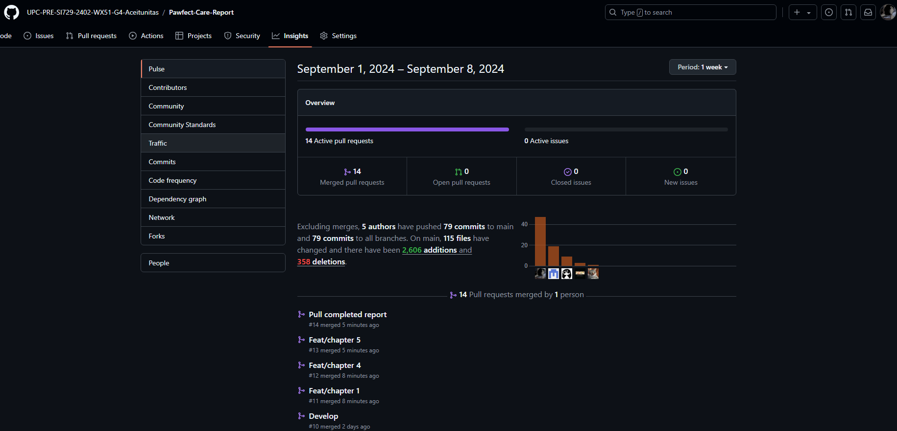
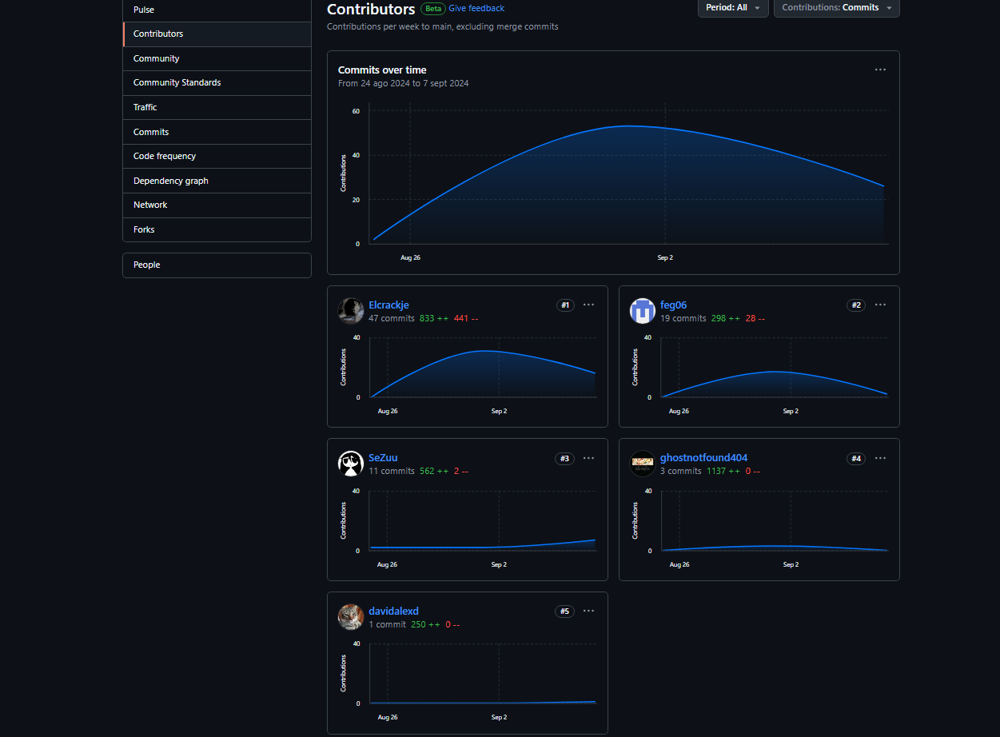
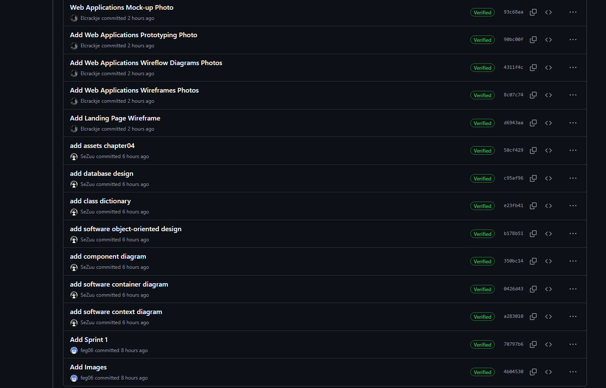
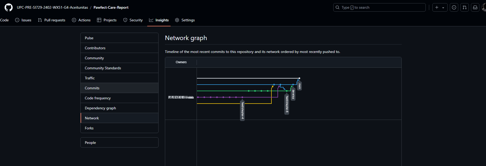
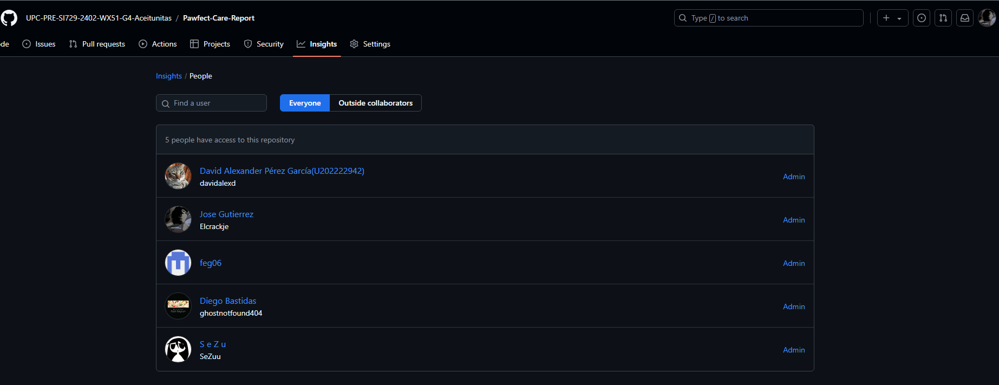
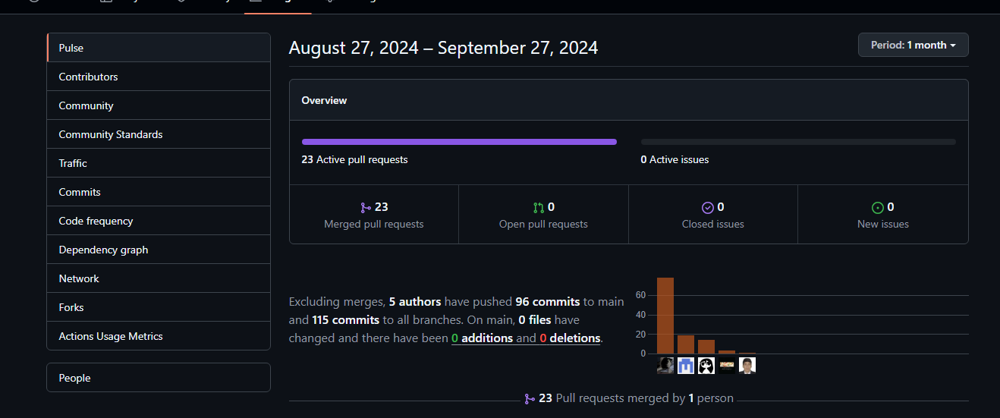
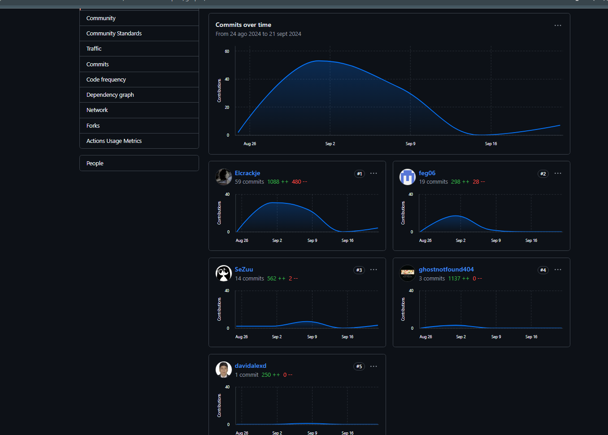
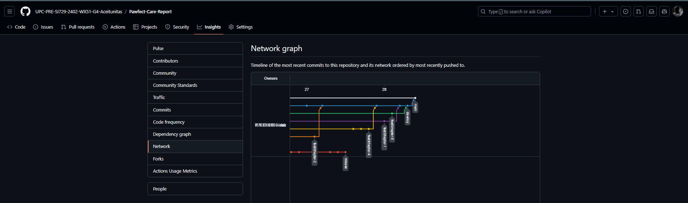
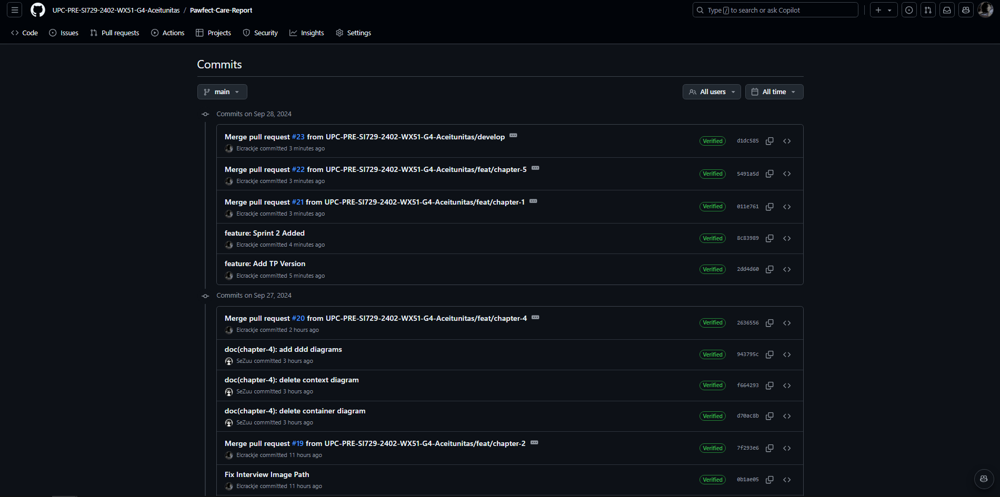

# Registro de Versiones del Informe

| Versión | Fecha | Autor | Descripción de la modificación |
|----|----|----|----|
| TB1 | 25/08/2024 | Aceitunitas | Redacción de los Capítulos I: Introduction, II: Requirements Elicitation & Analysis, III: Requirements Specification, IV: Product Design, V: Product Implementation, Validation & Deployment. |
| TP1 | 27/09/2024 | Aceitunitas | Adición del Capítulo V: 5.2.2., 5.2.2.1., 5.2.2.2., 5.2.2.3., 5.2.2.4., 5.2.2.5., 5.2.2.6., 5.2.2.7., 5.2.2.8. |

# Project Report Collaboration Insights

Las tareas correspondientes a la TB1 han sido completadas y están debidamente documentadas en el repositorio de GitHub para Pawfect Care-Report. Puedes acceder al repositorio a través del siguiente enlace: [https://github.com/UPC-PRE-SI729-2402-WX51-G4-Aceitunitas/Pawfect-Care-Report.git](https://github.com/UPC-PRE-SI729-2402-WX51-G4-Aceitunitas/Pawfect-Care-Report.git)

Durante la fase de elaboración del informe, se realizaron las siguientes actividades:

- Se crearon y redactaron los contenidos asignados a cada miembro utilizando formato Markdown, y se realizaron "Conventional Commits" para registrar el progreso en el repositorio.

-  Se generaron los recursos necesarios y agregaron las imagenes al repositorio en la carpeta "assets" en cada rama del informe.

- Se organizaron reuniones para coordinar el avance de los componentes del informe y para proporcionar actualizaciones sobre los progresos del Sprint 1, que se centró en el desarrollo de la Landing Page.

Las tareas asignadas para la entrega del TP1 han sido completadas y documentadas de manera exhaustiva en el repositorio de GitHub de la organización del equipo: [https://github.com/UPC-PRE-SI729-2402-WX51-G4-Aceitunitas/Pawfect-Care-Report.git](https://github.com/UPC-PRE-SI729-2402-WX51-G4-Aceitunitas/Pawfect-Care-Report.git)

Se redactaron y diagramaron los contenidos asignados a cada integrante en formato Markdown, con commits regulares para mantener un seguimiento preciso del progreso en el repositorio.

Además, se han generado los artefactos necesarios utilizando las herramientas recomendadas, y se llevaron a cabo reuniones periódicas para coordinar el avance de los elementos del informe y comunicar los progresos del Sprint 2, centrado en el desarrollo de la aplicación web.

# Contenido
## Tabla de contenidos
- [**Registro de Versiones del Informe**](#registro-de-versiones-del-informe)
- [**Project Report Collaboration Insights**](#project-report-collaboration-insights)
- [**Contenido**](#contenido)
    - [Tabla de contenidos](#tabla-de-contenidos)
- [**Student Outcome**](#student-outcome)
- ## [ **Capítulo I: Introducción** ](#-capítulo-i-introducción-)
  - [**1.1. Startup Profile**](#11-startup-profile)
    - [**1.1.1. Descripción de la Startup**](#111-descripción-de-la-startup)
    - [**1.1.2. Perfiles de integrantes del equipo**](#112-perfiles-de-integrantes-del-equipo)
  - [**1.2. Solution Profile**](#12-solution-profile)
    - [**1.2.1 Antecedentes y problemática**](#121-antecedentes-y-problemática)
    - [What (¿Qué?)](#what-qué)
    - [Who (¿Quién?)](#who-quién)
    - [Where (¿Dónde?)](#where-dónde)
    - [When (¿Cuándo?)](#when-cuándo)
    - [Why (¿Por qué?)](#why-por-qué)
    - [How (¿Cómo?)](#how-cómo)
    - [How much (¿Cuánto?)](#how-much-cuánto)
    - [**1.2.2 Lean UX Process**](#122-lean-ux-process)
    - [**1.2.2.1. Lean UX Problem Statements**](#1221-lean-ux-problem-statements)
    - [**1.2.2.2. Lean UX Assumptions**](#1222-lean-ux-assumptions)
    - [**1.2.2.3. Lean UX Hypothesis Statements**](#1223-lean-ux-hypothesis-statements)
    - [**1.2.2.4. Lean UX Canvas**](#1224-lean-ux-canvas)
  - [**1.3. Segmentos objetivo**](#13-segmentos-objetivo)
- ## [ **Capítulo II: Requirements Elicitation \& Analysis**](#-capítulo-ii-requirements-elicitation--analysis)
  - [**2.1. Competidores**](#21-competidores)
    - [**2.1.1. Análisis competitivo**](#211-análisis-competitivo)
    - [**2.1.2. Estrategias y tácticas frente a competidores**](#212-estrategias-y-tácticas-frente-a-competidores)
  - [**2.2. Entrevistas**](#22-entrevistas)
    - [**2.2.1. Diseño de entrevistas**](#221-diseño-de-entrevistas)
    - [**2.2.2. Registro de entrevistas**](#222-registro-de-entrevistas)
    - [**2.2.3. Análisis de entrevistas**](#223-análisis-de-entrevistas)
  - [**2.3. Needfinding**](#23-needfinding)
    - [**2.3.1. User Personas**](#231-user-personas)
    - [**2.3.2. User Task Matrix**](#232-user-task-matrix)
    - [**2.3.3. User Journey Mapping**](#233-user-journey-mapping)
    - [**2.3.4. Empathy Mapping**](#234-empathy-mapping)
    - [**2.3.5. As-is Scenario Mapping**](#235-as-is-scenario-mapping)
  - [**2.4. Ubiquitous Language**](#24-ubiquitous-language)
- ## [ **Capítulo III: Requirements Specification**](#-capítulo-iii-requirements-specification)
  - [**3.1. To-Be Scenario Mapping**](#31-to-be-scenario-mapping)
  - [**3.2. User Stories**](#32-user-stories)
  - [**3.3. Impact Mapping**](#33-impact-mapping)
  - [**3.4. Product Backlog**](#34-product-backlog)
- ## [**Capítulo IV: Product Design**](#capítulo-iv-product-design)
  - [**4.1. Style Guidelines**](#41-style-guidelines)
    - [**4.1.1. General Style Guidelines**](#411-general-style-guidelines)
    - [**4.1.2. Web Style Guidelines**](#412-web-style-guidelines)
  - [**4.2. Information Architecture**](#42-information-architecture)
    - [**4.2.1. Organization Systems**](#421-organization-systems)
    - [**4.2.2. Labeling Systems**](#422-labeling-systems)
    - [**4.2.3. SEO Tags and Meta Tags**](#423-seo-tags-and-meta-tags)
    - [**4.2.4. Searching Systems**](#424-searching-systems)
    - [**4.2.5. Navigation Systems**](#425-navigation-systems)
  - [**4.3. Landing Page UI Design**](#43-landing-page-ui-design)
    - [**4.3.1. Landing Page Wireframe**](#431-landing-page-wireframe)
    - [**4.3.2. Landing Page Mock-up**](#432-landing-page-mock-up)
  - [**4.4. Web Applications UX/UI Design**](#44-web-applications-uxui-design)
    - [**4.4.1. Web Applications Wireframes**](#441-web-applications-wireframes)
    - [**4.4.2. Web Applications Wireflow Diagrams**](#442-web-applications-wireflow-diagrams)
    - [**4.4.3. Web Applications Mock-ups**](#443-web-applications-mock-ups)
    - [**4.4.4. Web Applications User Flow Diagrams**](#444-web-applications-user-flow-diagrams)
  - [**4.5. Web Applications Prototyping**](#45-web-applications-prototyping)
  - [**4.6. Domain-Driven Software Architecture**](#46-domain-driven-software-architecture)
    - [**4.6.1. Software Architecture Context Diagram**](#461-software-architecture-context-diagram)
    - [**4.6.2. Software Architecture Container Diagrams**](#462-software-architecture-container-diagrams)
    - [**4.6.3. Software Architecture Components Diagrams**](#463-software-architecture-components-diagrams)
  - [**4.7. Software Object-Oriented Design**](#47-software-object-oriented-design)
    - [**4.7.1. Class Diagrams**](#471-class-diagrams)
    - [**4.7.2. Class Dictionary**](#472-class-dictionary)
  - [**4.8. Database Design**](#48-database-design)
    - [**4.8.1. Database Diagram**](#481-database-diagram)
- ## [**Capítulo V: Product Implementation, Validation \& Deployment**](#capítulo-v-product-implementation-validation--deployment)
  - [**5.1. Software Configuration Management**](#51-software-configuration-management)
    - [**5.1.1. Software Development Environment Configuration**](#511-software-development-environment-configuration)
    - [**5.1.2. Source Code Management**](#512-source-code-management)
    - [**5.1.3. Source Code Style Guide \& Conventions**](#513-source-code-style-guide--conventions)
    - [**5.1.4. Software Deployment Configuration**](#514-software-deployment-configuration)
  - [**5.2. Landing Page, Services \& Applications Implementation**](#52-landing-page-services--applications-implementation)
    - [**5.2.1. Sprint 1**](#521-sprint-1)
    - [**5.2.1.1. Sprint Planning 1**](#5211-sprint-planning-1)
    - [**5.2.1.2. Sprint Backlog 1**](#5212-sprint-backlog-1)
    - [**5.2.1.3. Development Evidence for Sprint Review**](#5213-development-evidence-for-sprint-review)
    - [**5.2.1.4. Testing Suite Evidence for Sprint Review**](#5214-testing-suite-evidence-for-sprint-review)
    - [**5.2.1.5. Execution Evidence for Sprint Review**](#5215-execution-evidence-for-sprint-review)
    - [**5.2.1.6. Services Documentation Evidence for Sprint Review**](#5216-services-documentation-evidence-for-sprint-review)
    - [**5.2.1.7. Software Deployment Evidence for Sprint Review**](#5217-software-deployment-evidence-for-sprint-review)
    - [**5.2.1.8. Team Collaboration Insights during Sprint**](#5218-team-collaboration-insights-during-sprint)
  - [**5.3. Validation Interviews**](#53-validation-interviews)
    - [**5.3.1. Diseño de Entrevistas**](#531-diseño-de-entrevistas)
    - [**5.3.2. Registro de Entrevistas**](#532-registro-de-entrevistas)
    - [**5.3.3. Evaluaciones según heurísticas**](#533-evaluaciones-según-heurísticas)
  - [**5.4. Video About-the-Product**](#54-video-about-the-product)
- [**Conclusiones**](#conclusiones)
- [**Conclusiones y recomendaciones**](#conclusiones-y-recomendaciones)
- [**Video About-the-Team**](#video-about-the-team)
- [**Bibliografía**](#bibliografía)
- [**Anexos**](#anexos)

# Student Outcome

| Criterio específico | Acciones realizadas | Conclusiones |
|----|----|----|
|Comunica oralmente con efectividad a diferentes rangos de audiencia.| **Bastidas Bastidas, Diego Martin** *TB1* Realicé los capítulos I y II, enfocándome en la introducción y el análisis de la problemática de la startup. Me encargué de describir el perfil de la startup, los perfiles de los integrantes del equipo y el proceso Lean UX. A través de mi presentación, logré explicar de manera clara los antecedentes y las soluciones propuestas, lo que permitió a la audiencia comprender el análisis competitivo y los resultados de las entrevistas.  *TP*   En el TP, me encargué del desarrollo del componente para la creación de perfiles de mascota (US04), que incluyó datos básicos e imagen de perfil. Durante mi presentación, logré explicar de manera clara y técnica cómo se implementó este componente y su impacto en la experiencia de los usuarios finales, adaptando el mensaje tanto para audiencias técnicas como no técnicas.  **Chavez Uribe, Ario Joel** *TB1* Me encargué del Capítulo V, donde desarrollé la implementación y validación del producto. Presenté la configuración del entorno de desarrollo y la gestión del código fuente, lo que incluyó las convenciones de estilo y la configuración de despliegue del software. Durante mi presentación, logré simplificar conceptos técnicos y asegurarme de que la audiencia entendiera el progreso de los sprints y el proceso de despliegue. *TP* Me ocupé del desarrollo del módulo de gestión de perfiles de usuarios (US04), permitiendo la edición y eliminación de cuentas. En mi presentación, logré transmitir de manera eficiente los retos y soluciones aplicadas en la gestión de datos de los usuarios, manteniendo la claridad técnica y haciendo comprensible el proceso para audiencias no técnicas.  **Gutierrez Garcia, Jose Eduardo** *TB1* Como líder del grupo, lideré el desarrollo del Capítulo III, que abarcó la especificación de requisitos. Me aseguré de que el equipo estuviera alineado y trabajara de manera efectiva. Al presentar el mapeo de impacto, las user stories y el backlog de productos, logré que la audiencia comprendiera cómo se estructuran las futuras mejoras de la plataforma. También gestioné la documentación en Markdown, asegurando que fuera clara y organizada. *TP* En este TP, trabajé en la implementación de la lista de clientes, gestionando la visualización y administración de los perfiles de clientes dentro de la plataforma. Durante la exposición, aseguré que la audiencia comprendiera el impacto de esta funcionalidad en el flujo general del sistema, utilizando ejemplos prácticos y lenguaje accesible tanto para el equipo como para oyentes externos.  **Perez Garcia, David Alexander** *TB1* Realicé el Capítulo IV, centrándome en el diseño de la landing page y el prototipo de la aplicación. Me encargué de desarrollar los wireframes, mockups y los sistemas de etiquetado, asegurando que el diseño fuera funcional y estético. En mi presentación, logré comunicar de manera clara cómo el diseño UI/UX mejora la experiencia del usuario y resuelve sus necesidades de manera efectiva. *TP* Me encargué del desarrollo del componente de edición de perfil de mascota (US05), lo que permitió que los usuarios finales pudieran modificar datos previamente ingresados. En mi presentación, destaqué la importancia de la usabilidad y la experiencia del usuario, explicando los elementos clave de diseño y cómo mejoraron la funcionalidad de la plataforma.  **Zuniga Calle, Sebastian Gabriel** *TB1* Trabajé en el Capítulo IV en la parte de la arquitectura de software y el diseño orientado a objetos. Desarrollé los diagramas de contexto, contenedores y componentes, además de los diagramas de clases y la base de datos. Durante mi presentación, logré que la audiencia comprendiera los detalles técnicos y cómo la arquitectura soporta la estructura general del software.  *TP* Trabajé en el desarrollo de la arquitectura de software y el diseño orientado a objetos en este TP. En mi presentación, me centré en explicar los detalles técnicos de los diagramas de contexto, contenedores y clases. Adapté la presentación para audiencias con conocimientos técnicos diversos, asegurando que los conceptos de arquitectura fueran fácilmente comprensibles.  | TB1: Como equipo, logramos comunicar de manera efectiva cada una de nuestras áreas de trabajo, adaptándonos a las diferentes audiencias y asegurando que tanto los aspectos técnicos como los estratégicos fueran claros. A lo largo del proyecto, trabajamos de forma coordinada y presentamos información comprensible para una amplia gama de oyentes, demostrando una excelente capacidad de trabajo en equipo y dominio de nuestras respectivas áreas. TP:  En el trabajo parcial, el equipo logró una comunicación efectiva al presentar sus avances y resultados. Cada miembro adaptó su mensaje a la audiencia, asegurando que tanto los aspectos técnicos como los estratégicos fueran comprendidos por todos los oyentes. Esta capacidad para simplificar y transmitir información técnica compleja es clave para el éxito de proyectos colaborativos, y nuestro equipo demostró una sólida habilidad para hacerlo. |

| Criterio específico | Acciones realizadas | Conclusiones |
|----|----|----|
|Comunica por escrito con efectividad a diferentes rangos de audiencia.| **Bastidas Bastidas, Diego Martin** *TB1* Realicé los capítulos I y II, donde me enfoqué en la introducción y el análisis de la problemática de la startup. Escribí de manera clara y precisa la descripción de la startup y los perfiles de los integrantes del equipo. Además, desarrollé el proceso Lean UX y el análisis competitivo, asegurándome de que mi escritura fuera comprensible tanto para audiencias técnicas como no técnicas. Logré transmitir la información de manera efectiva para diferentes niveles de comprensión. *TP* En el TP, me encargué de documentar el desarrollo del perfil de mascota (US04) y su integración al sistema. Utilicé un lenguaje claro para explicar tanto el flujo de datos como la funcionalidad, asegurándome de que fuera comprensible para desarrolladores y stakeholders no técnicos. Adapté el contenido para que la documentación pudiera ser útil para todos los lectores involucrados en el proyecto.   **Chavez Uribe, Ario Joel** *TB1* Me encargué del Capítulo V, que trataba sobre la implementación y validación del producto. Redacté la configuración del entorno de desarrollo y la gestión del código fuente, utilizando un lenguaje técnico pero comprensible para audiencias menos familiarizadas con estos temas. Mi objetivo fue presentar los detalles de los sprints y el despliegue del software de manera que fueran accesibles tanto para desarrolladores como para lectores menos técnicos. *TP*  Redacté la documentación sobre la implementación del módulo de gestión de usuarios (US04), detallando los flujos de trabajo y los elementos técnicos clave. Utilicé un lenguaje técnico claro pero accesible para audiencias no especializadas, permitiendo que la documentación fuera comprensible para desarrolladores y stakeholders que no tienen conocimientos avanzados en desarrollo.  **Gutierrez Garcia, Jose Eduardo** *TB1* Como líder del grupo, desarrollé el Capítulo III, centrándome en la especificación de requisitos. Me aseguré de que los documentos escritos, como el mapeo de impacto, las user stories y el backlog de productos, fueran claros y fáciles de seguir por cualquier lector. También gestioné la documentación en Markdown, estructurándola de manera lógica para que fuera accesible tanto para miembros técnicos del equipo como para otras partes interesadas. *TP* Como líder del grupo, redacté la documentación sobre la implementación de la lista de clientes en el sistema. Me aseguré de que la documentación fuera clara y coherente, utilizando Markdown para organizar la información y facilitar su lectura. Adapté la escritura a las diferentes necesidades del equipo y otros interesados, asegurando que la especificación de requisitos y el mapeo de impacto fueran entendidos por todos.   **Perez Garcia, David Alexander** *TB1* Realicé el Capítulo IV, donde escribí sobre el diseño de la landing page y el prototipo de la aplicación. Utilicé un lenguaje que facilitara la comprensión de los wireframes, mockups y sistemas de etiquetado para diferentes niveles de audiencia, asegurando que tanto diseñadores como usuarios finales pudieran entender la funcionalidad y el valor del diseño. Me enfoqué en presentar la información visual de manera clara y accesible en los documentos. *TP* Redacté la documentación correspondiente al componente de edición de perfil de mascota (US05). Mi enfoque fue describir de manera clara el diseño UI/UX, utilizando un lenguaje accesible para diseñadores y usuarios finales. Además, detallé cómo la experiencia del usuario sería optimizada, haciendo que los elementos técnicos fueran comprensibles para aquellos con menos experiencia en diseño o programación.   **Zuniga Calle, Sebastian Gabriel** *TB1* Trabajé en el Capítulo IV en la parte de la arquitectura de software y el diseño orientado a objetos. Redacté los diagramas de contexto, contenedores y componentes, así como los diagramas de clases y la base de datos. Utilicé un lenguaje técnico adecuado para los ingenieros, pero también me aseguré de que los conceptos complejos fueran comprensibles para una audiencia más amplia. Mi objetivo fue que la documentación escrita fuera clara y útil para cualquier lector. *TP*  Documenté los detalles técnicos de la arquitectura de software, incluyendo diagramas de clases y componentes. Utilicé un lenguaje técnico adecuado para los desarrolladores, pero también me aseguré de que los conceptos más complejos fueran explicados de forma comprensible para los miembros del equipo sin un fuerte trasfondo técnico. | TB1: Como equipo, logramos redactar la documentación del proyecto de manera efectiva, adaptando nuestro lenguaje escrito a las necesidades de diferentes audiencias. A lo largo del proyecto, trabajamos de forma coordinada para que tanto los aspectos técnicos como los conceptuales fueran accesibles y fáciles de entender para todos los involucrados, asegurando que nuestra escritura fuera clara, precisa y efectiva en todo momento.  TP:   En el trabajo Parcial, el equipo logró una comunicación escrita efectiva, adaptando el lenguaje a las necesidades de diferentes audiencias. Nos aseguramos de que la documentación técnica fuera clara y comprensible para desarrolladores, diseñadores, y stakeholders no técnicos, lo que facilitó el entendimiento de las funcionalidades y el progreso del proyecto. La precisión y claridad en nuestra redacción fueron claves para garantizar el éxito del proyecto y la colaboración entre todos los miembros del equipo.  |

----
